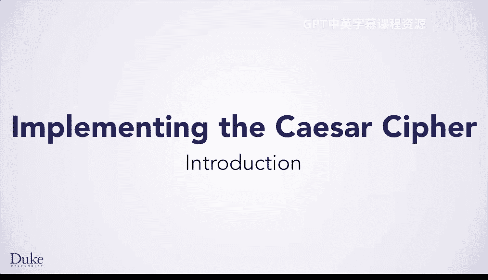
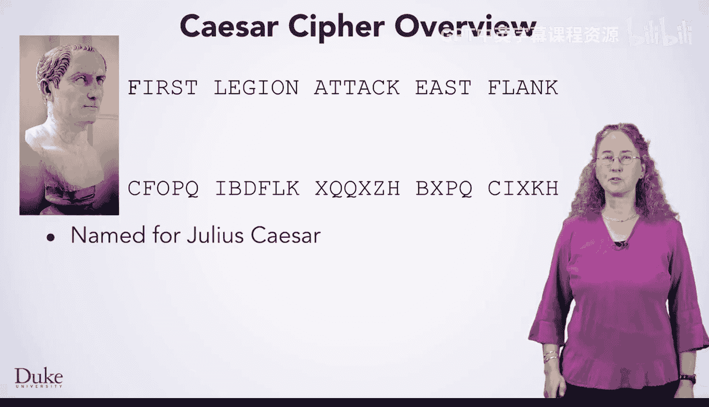
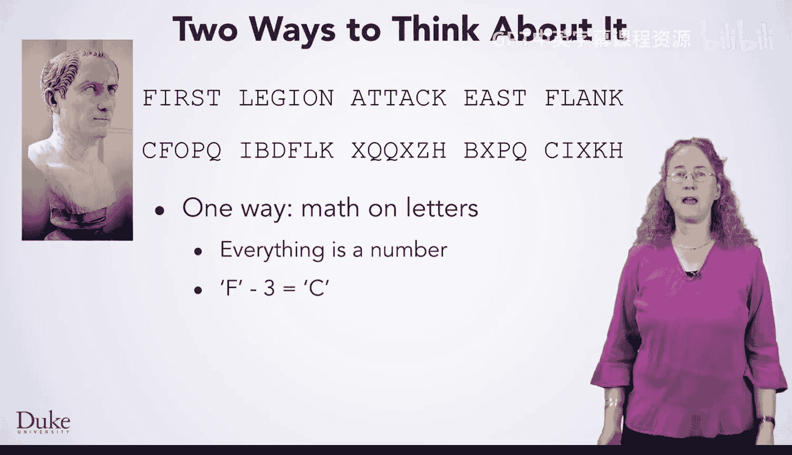
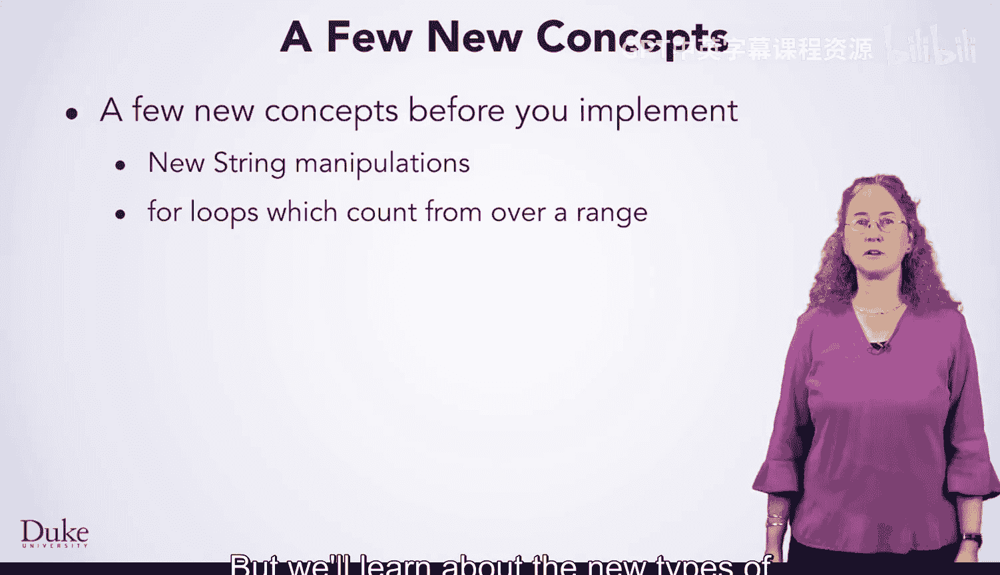

# 069：简介 🔐

在本节课中，我们将学习凯撒密码的基本概念，这是密码学中一个经典且简单的加密算法。我们将了解其工作原理，并探讨如何在后续课程中实现它。

---

欢迎回来。既然你已经了解了密码学的重要性，现在是你进一步学习凯撒密码概念的时候了，你将在本课中实现它。

假设你身处战场，想向你的副指挥官发送一条消息，命令第一军团攻击东翼。你不希望敌人知道你的计划，即使他们截获了这条消息。因此，你需要用你的密码加密它，如第二行所示。

凯撒密码算法以尤利乌斯·凯撒命名，这位著名的罗马皇帝曾使用过它。

## 算法核心思想 🧠

凯撒密码的基本思想是，将字母表中的每个字母替换为通过将字母表移动一个固定量（即字母表中特定数量的字母之后）所得到的字母。你移动字母表的这个量，就是该密码的**密钥**。

尤利乌斯·凯撒使用了向前移动三个字母的加密方式。如果你从向后移动字母的角度来思考这个算法，这等同于向后移动23个字母。

## 加密过程示例 📝

为了了解这个算法如何工作，我们将通过加密一条消息的例子来逐步说明。我们将使用字母表来展示字母是如何被加密的。

以下是加密“FIRST LEGION ATTACK EAST FLANK”消息的步骤，使用密钥3（即向后移动3个字母）：

1.  **第一个字母是 F**。在字母表中找到 F，然后向后移动三个字母：E, D, C。因此，你会在加密消息中写下 C 作为第一个字母。
2.  **下一个字母是 I**。在字母表中找到 I，然后向后移动三个字母：H, G, F。写下 F 作为下一个字母。
3.  **下一个字母是 R**。在字母表中找到 R，然后向后移动三个字母：Q, P, O。写下 O 作为下一个字母。
4.  继续以同样的方式处理第一个单词的其余部分。
5.  当你遇到**空格**时，最简单的方法是保持空格不变，在加密消息中写下空格。
6.  以同样的方式处理空格后的下一个单词。
7.  然而，当你遇到字母 **a** 时会发生什么？在字母表中找到 a，它是字母表的第一个字母。如何向后移动三个字母？你必须**回绕到字母表的末尾**。从那里，向后移动三个字母：Z, Y, X。写下 X 作为下一个字母。
8.  以同样的方式继续处理消息的其余部分，最终你会得到一个在粗略检查下无法理解的文本。

然而，如果你知道或能推断出密钥，你就可以解密消息。解密过程与使用 `26 - n` 作为密钥进行加密的过程相同。

## 在计算机中实现 💻

那么，实际上如何做到这一点呢？一种方法是对数字进行运算。如果你上过我们的 Coursera 课程《面向初学者的编程与网络》，你应该记得**一切都是数字**。如果你不熟悉这个概念，它在计算机科学中非常重要，因为计算机只能处理数字。在这种情况下，该原则意味着这些字母实际上被表示为数字，因此你可以对它们进行数学运算。

具体来说，你可以告诉 Java 从字母 F 中减去 3，它会计算出字母 C。但是，如果你从字母 A 中减去 3 呢？Java 不会知道你想要回绕并保持在字母表内，因此你必须包含更多的数学运算或条件语句来实现回绕并得到 X。

另一种实现方式，可以使回绕的情况更清晰，就是**预先移动整个字母表**。也就是说，在尝试加密消息中的任何内容之前，先计算每个字母的移位。例如，你可以获取字母表，并针对向左（向后）移动3位的情况，计算出一个像这样的字符串。

我们将在未来的视频中看到如何做到这一点的细节。然而，一旦你计算出了这些字符串，你就可以使用它们来查找每个字母的加密结果。

对于消息开头的 F，你需要在原始字母表中找到 F。回想一下你过去学过的关于字符串的知识，你可能会使用什么方法来找到 F？一旦你找到了 F，你就查看移位字母表中相同位置的字母，即 C。然后你在加密消息中写下那个字母。对于需要回绕的 a，你不需要任何特殊情况处理。同样，你只需在原始字母表中找到 a，查看移位字母表中相同位置的字母。在这个例子中，那个字母是 X。因此，你在加密消息中写下 X。

## 实现前的准备 🛠️

很好，现在你知道了凯撒密码背后的基本思想。然而，在实现这个算法之前，你需要学习一些新的 Java 概念。

你将学习一些操作字符串的新方法，以及用于在数字范围内计数的 **for 循环**。

在数字范围内计数的 for 循环尤其重要，因为你将使用你计数的数字来**索引数据**，从而操作序列中的特定位置。你已经熟悉了字符串（字符序列），但在本课程的其余部分，你将学习新类型的序列。因此，你会经常使用 for 循环。

---

在本节课中，我们一起学习了凯撒密码的基本原理，包括其加密、解密过程以及如何在计算机中实现的核心思想。我们还了解到，为了实现这个算法，我们需要掌握 Java 中的字符串操作和 for 循环等新概念。