# 071：循环计数 🔄

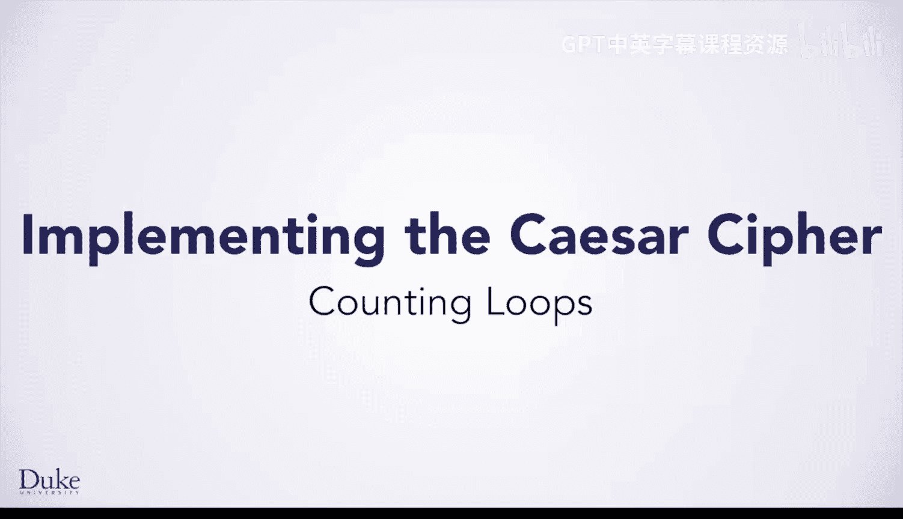

在本节课中，我们将要学习一种新的循环结构——计数循环（`for` 循环）。我们将通过实现一个字符串反转功能的例子，来理解这种循环的工作原理和语法结构。掌握计数循环将帮助你更高效地处理需要按索引访问元素的任务，例如处理字符串中的每个字符。

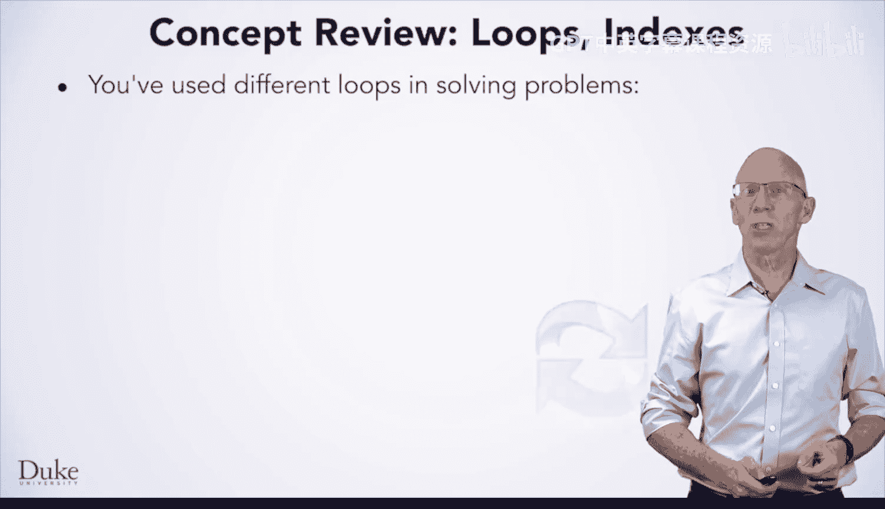

---

## 循环回顾 🔁

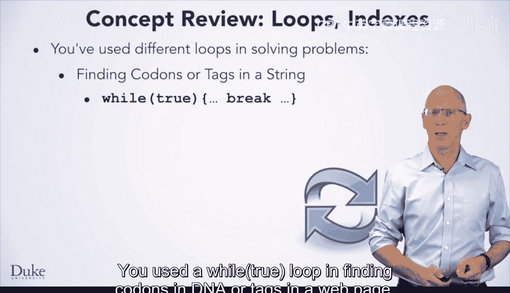

在解决更复杂的问题之前，我们先回顾一下你已经使用过的循环类型。

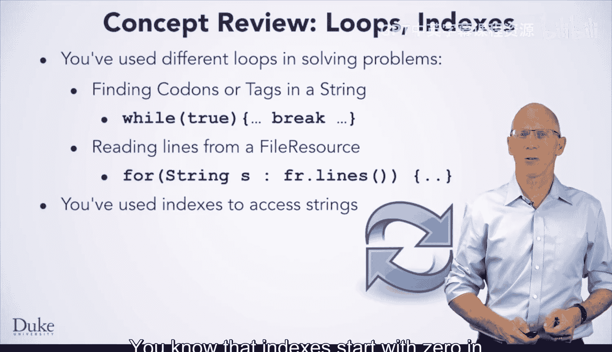

你之前已经使用过不同类型的循环来解决问题。

例如，在DNA中寻找密码子或在网页中寻找标签时，你使用了 `while` 循环。

你也多次使用了 `for-each` 循环来处理可迭代对象，例如读取文件中的行或处理图像中的像素。

此外，你还使用过索引来访问和引用字符串的各个部分。你知道在Java和许多其他语言中，索引从0开始。因此，当你使用 `indexOf` 方法时，你知道如果在字符串的第一个字符找到匹配项，它会返回0。

`indexOf` 和 `substr` 方法都使用索引来访问字符串的元素或字符。

---

## 字符串反转与回文 🔄

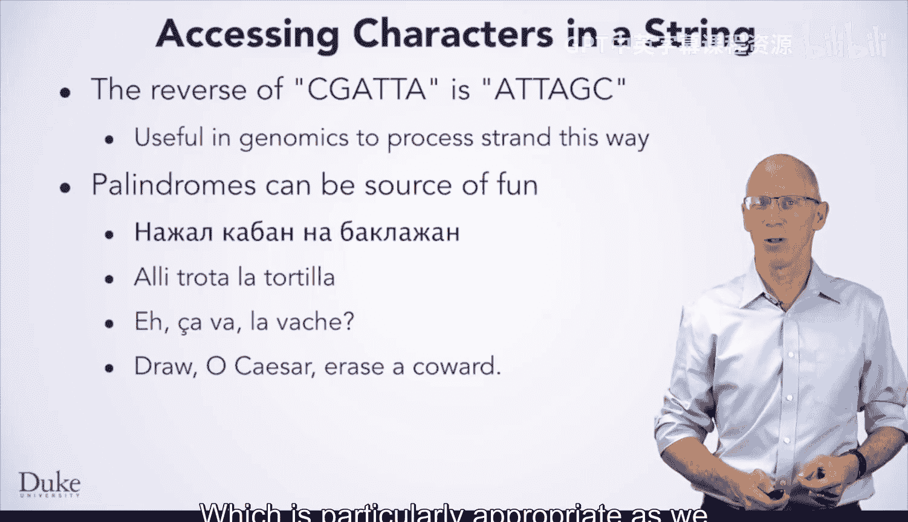

我们将通过查看字符串反转的代码来学习如何访问字符串中的单个字符。

字符串的反转是指将字符顺序颠倒。例如，“CGA TTA”的反转是“ATT AGC”，“TIP”的反转是“PIT”。

研究基因组的科学家经常需要反向查看字符串来分析DNA。查看回文（正读反读都一样的短语）也可以是一种乐趣或文字游戏。

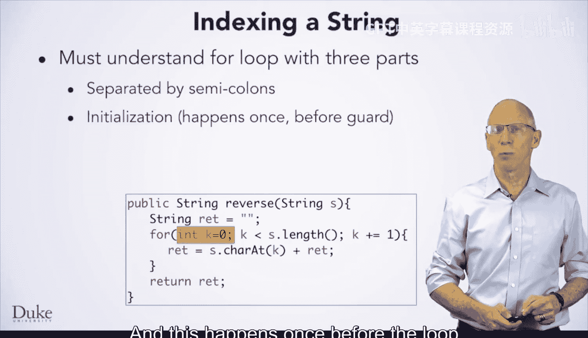

以下是一些不同语言中的回文例子：
*   俄语中有一个句子，如果你懂西里尔字母，会发现它正读反读都一样，意思是“野猪压扁了茄子”。
*   西班牙语中有一个回文句，意思是“他们慢跑做玉米饼”。
*   法语中，“A Saavlavash”这个句子意思是“奶牛怎么样了？”。
*   英语中，“Draw O Caesar erase a coward”这个句子特别适合，因为我们在本模块中要实现凯撒密码。

我们将使用一种新的循环——计数循环，来反转一个字符串。

---

## 理解 `for` 循环 🧠

在循环中索引字符串可以通过多种方式完成，但我们将看一种非常常见的方法。

我们必须理解一个由三部分组成的循环。每部分之间用分号分隔，正如你在幻灯片代码中看到的那样。

`for` 循环的第一部分称为**初始化**。在这里，变量 `k` 被赋值为0。这个操作只发生一次，在循环守卫和循环体执行之前。

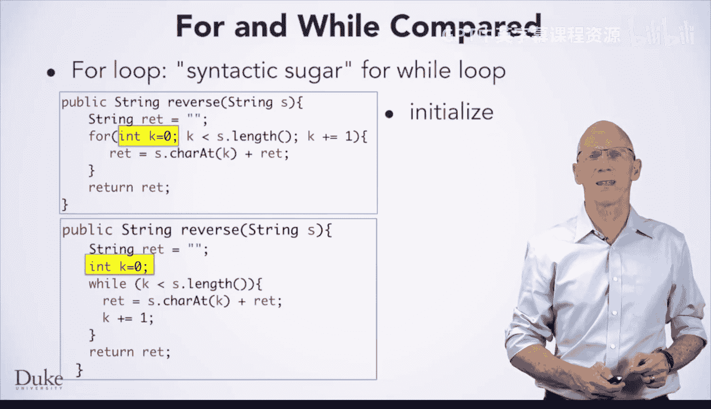

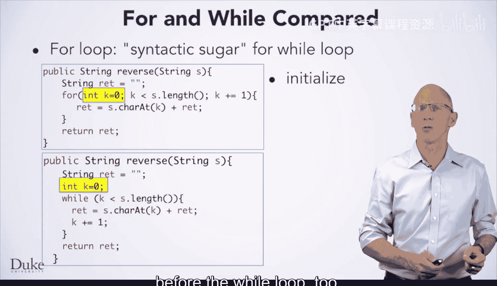

循环守卫在每次循环体可能执行之前被评估。当循环守卫为 `true` 时，循环体执行；当它为 `false` 时，循环结束。有时循环守卫也被称为循环测试。

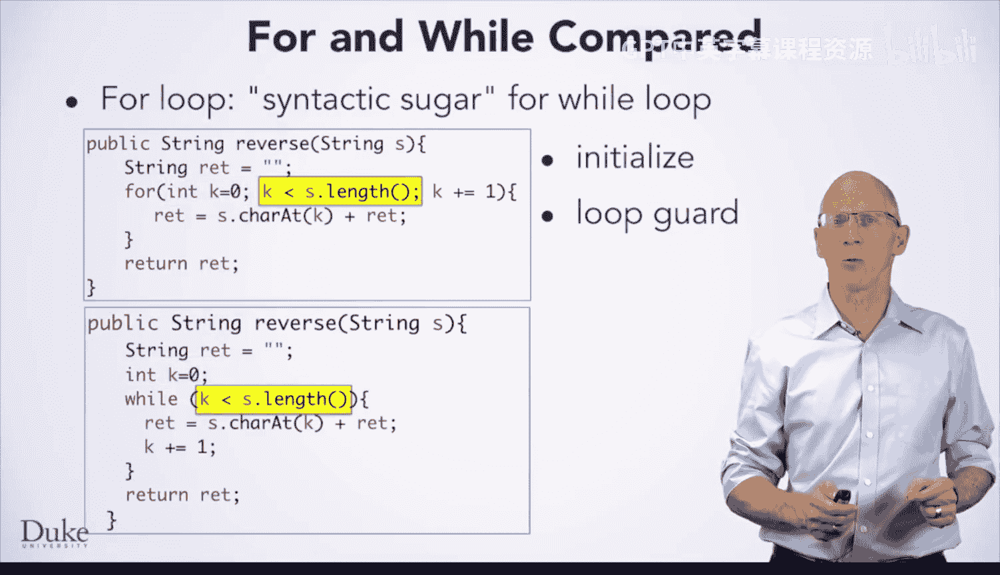

这里的**增量**操作发生在循环体中的所有语句执行完毕之后。增量操作完成后，再次评估循环守卫，以决定循环是继续还是退出。

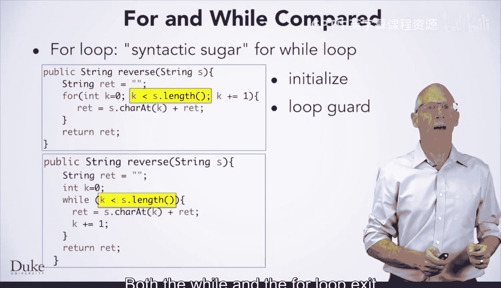

我们将更仔细地研究这个过程。为了理解 `for` 循环，我们会将其与你之前见过的 `while` 循环进行比较。

---

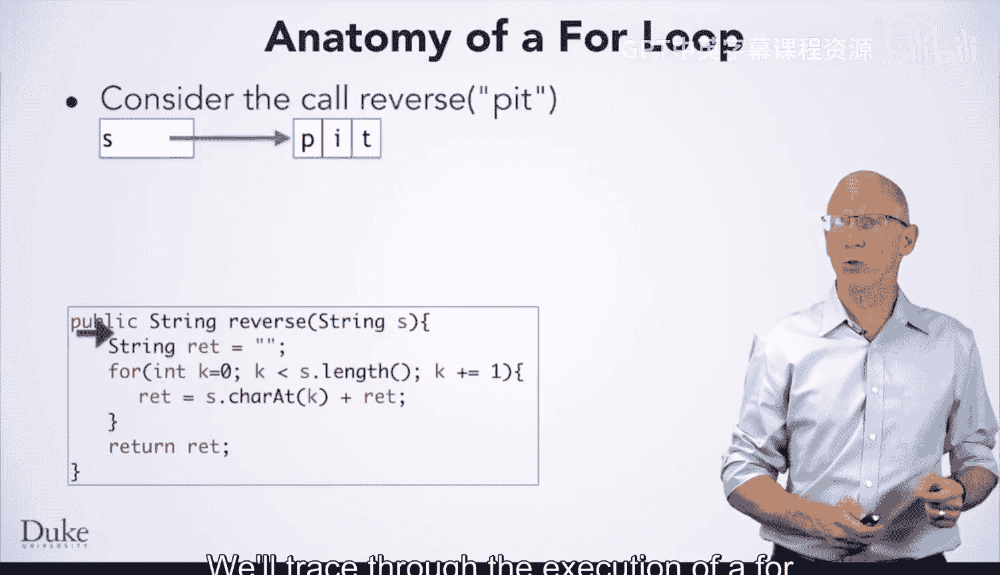

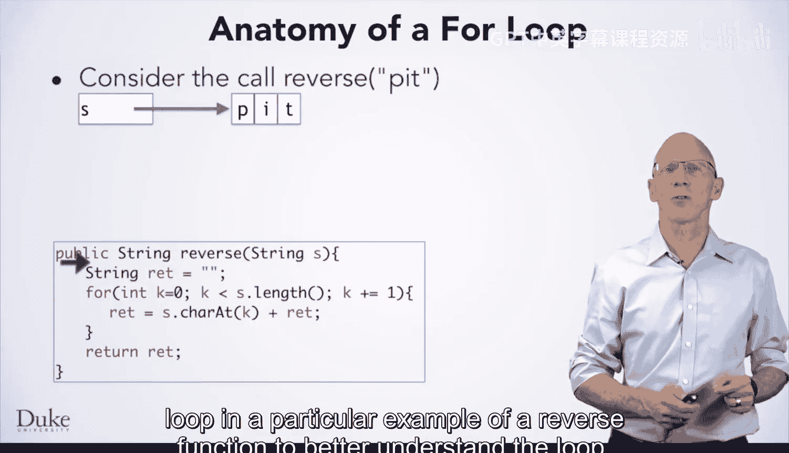

## `for` 循环与 `while` 循环 🔄

`for` 循环并不比 `while` 循环提供更多功能，也不能让你解决不同的问题。`for` 循环只是 `while` 循环的语法糖或美化形式。`for` 循环将所有部分放在一个地方，许多程序员认为这使得循环更容易编写和阅读。

正如我们讨论过的，初始化在循环守卫被测试之前只发生一次。你可以在下面的比较中看到，初始化在 `while` 循环之前也会发生。

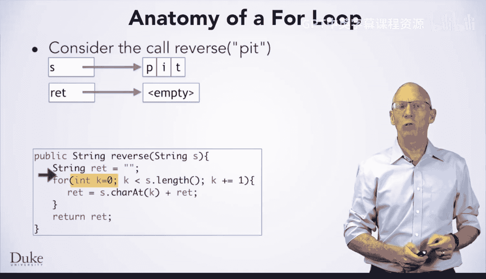

循环守卫被评估以决定循环体是否执行。当循环守卫为 `false` 时，循环结束。无论是 `while` 循环还是 `for` 循环，都会在这个循环守卫或测试为 `false` 时退出。

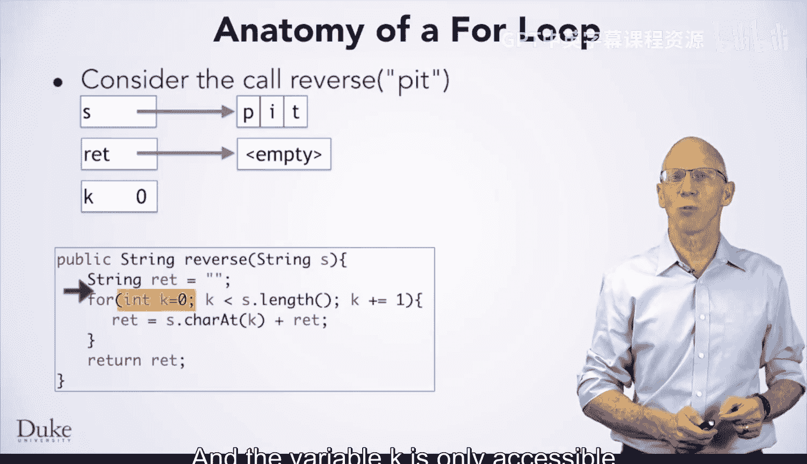

当守卫为 `true` 时，循环体执行。作为循环体中的最后一条语句，我们看到增量语句将会执行。

为了更好地理解循环，我们将通过一个反转函数的具体例子来跟踪 `for` 循环的执行过程。

---

## 跟踪 `for` 循环执行 🕵️

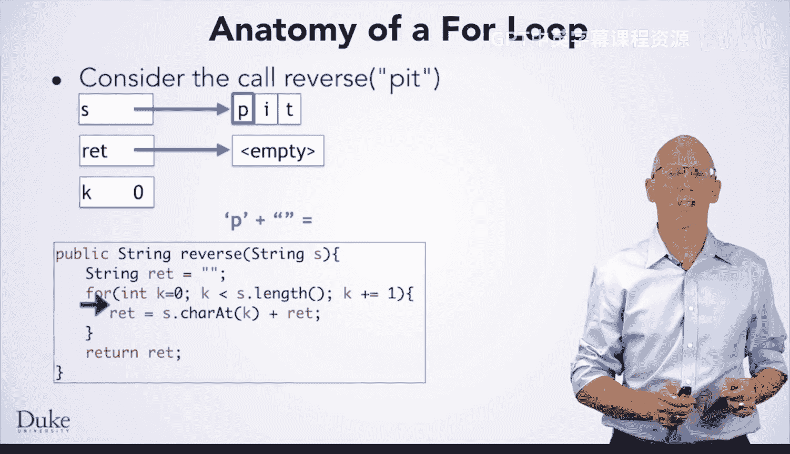

为了跟踪这个过程，我们来看调用 `reverse("pit")`。这意味着参数 `s` 的值是字符串 “PIT”。

局部变量 `r`（或 `rev`）将累积反转后的字符串。它在循环之前被初始化为空字符串。在跟踪代码时，绿色箭头指示接下来要执行的语句。

循环索引或控制变量 `k` 被初始化为0。请记住，循环初始化在 `for` 循环中只发生一次，并且变量 `k` 只能在循环内部访问，不能在循环之后访问——它的作用域是有限的。

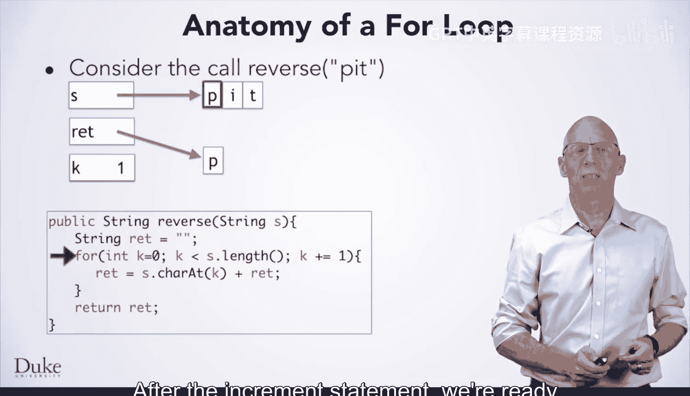

当检查循环守卫时，`k` 的值是0，它小于 `s.length()`（即3，因为 “pit” 有三个字符）。循环守卫评估为 `true`。循环守卫始终是布尔表达式。

现在循环体执行。字符串方法 `charAt` 用于访问特定索引处的字符。需要指出的是，有些人读作 “care-at”，有些人读作 “char-at”，两种都可以。由于 `k` 是0，表达式 `s.charAt(0)` 评估为 ‘P’。我们用单引号表示字符 ‘P’，这在Java中用于表示基本类型 `char`。

变量 `r` 的值显示为双引号中的空字符串，因为Java中的双引号表示字符串字面量。将字符 ‘P’ 连接到空字符串会产生一个新的字符串 “P”。变量 `rev` 将被赋值为 “P”，这个字符串变量改变了，它不再指向原来的空字符串。请记住，Java中的字符串是不可变的。我们可以创建新的字符串，但不能改变一个字符串。

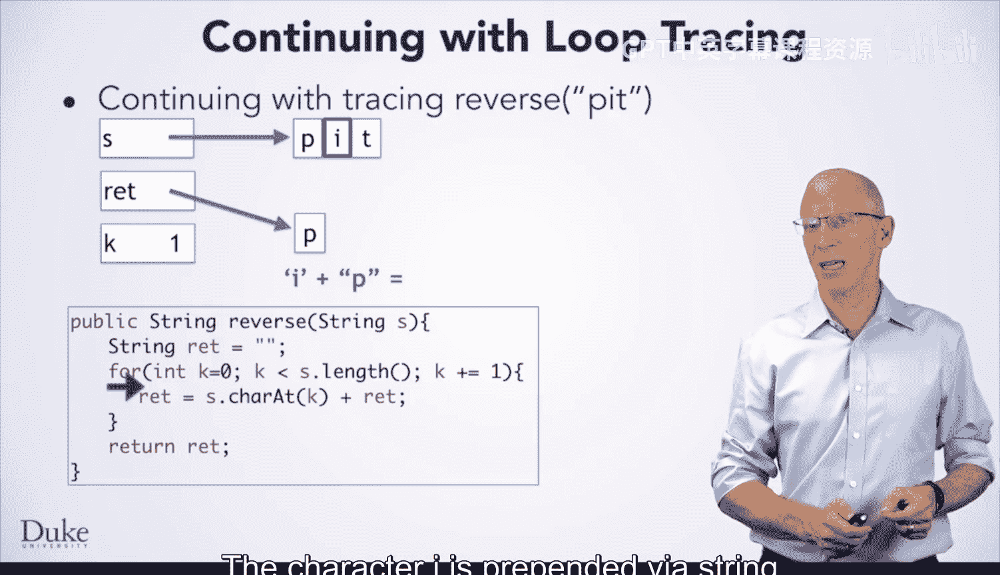

循环体执行后，增量操作执行。这将 `k` 的值改为1。增量语句之后，我们准备跟踪循环的下一次迭代。

局部变量 `rev` 的值为 “P”，循环控制变量 `k` 的值为1，我们准备继续跟踪。`k` 的值为1。字符串 “pit” 的长度 `s.length()` 是3，因此循环守卫评估为 `true`，循环体执行。

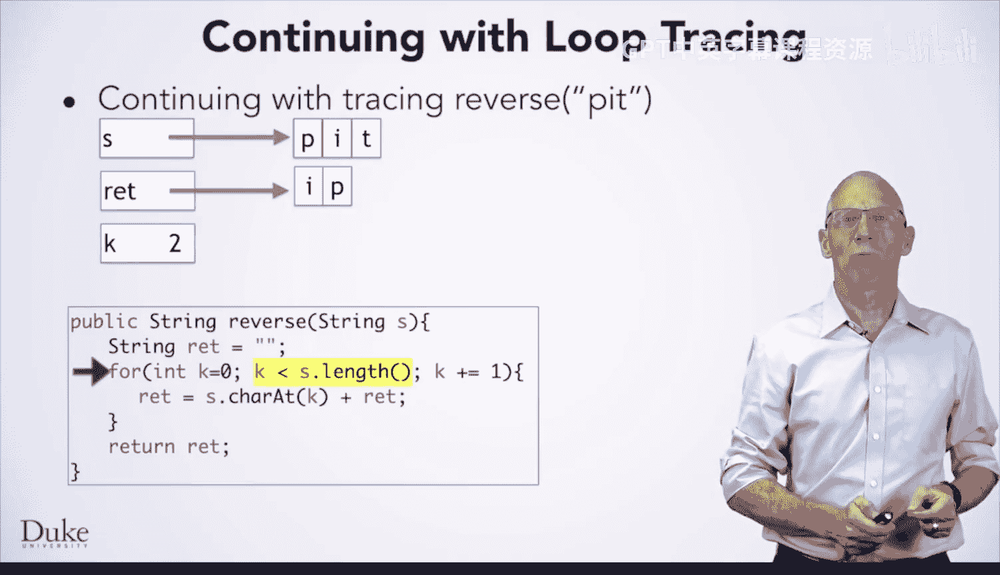

记住，`charAt` 方法访问指定索引处的字符。这里索引为1的字符是 ‘I’。字符 ‘I’ 通过字符串连接被前置到 `r`（即 “P”）前面，这创建了一个新的字符串 “IP”。赋值语句改变了 `rev`，使其引用这个新字符串。

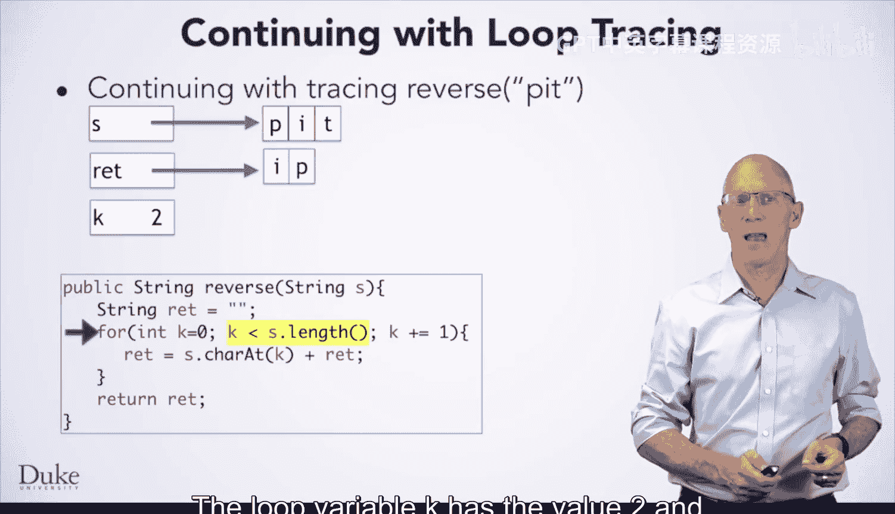

现在循环增量将执行。`k` 的值变为2，循环将继续执行。

我们现在将跟踪循环的最后一次迭代。局部变量 `rev` 的值为 “IP”，循环变量 `k` 的值为2。正如我们在这里看到的，循环守卫将被评估。

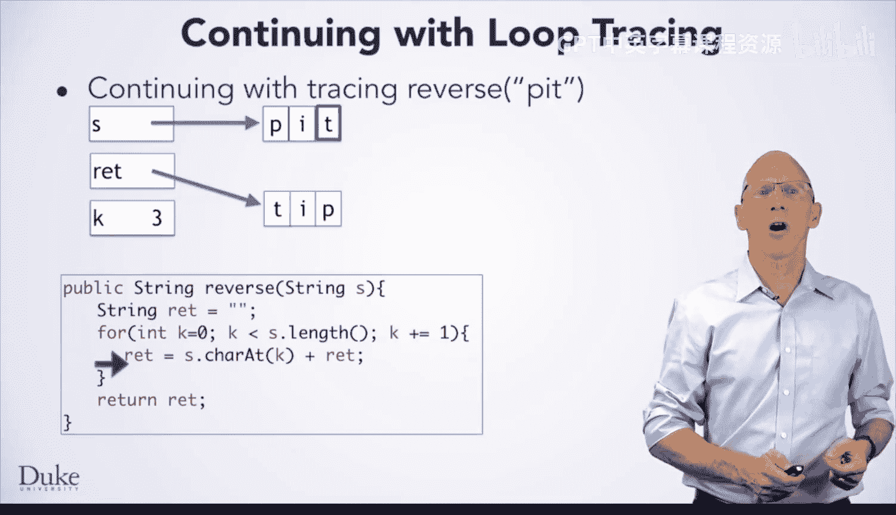

由于2小于3，守卫为 `true`，循环体执行。`s.charAt(2)` 评估为 ‘T’。字符 ‘T’ 被前置到字符串 “IP” 前面，形成字符串 “TIP”。变量 `r` 现在引用 “TIP”。循环继续。增量语句执行，将 `k` 的值改为3。

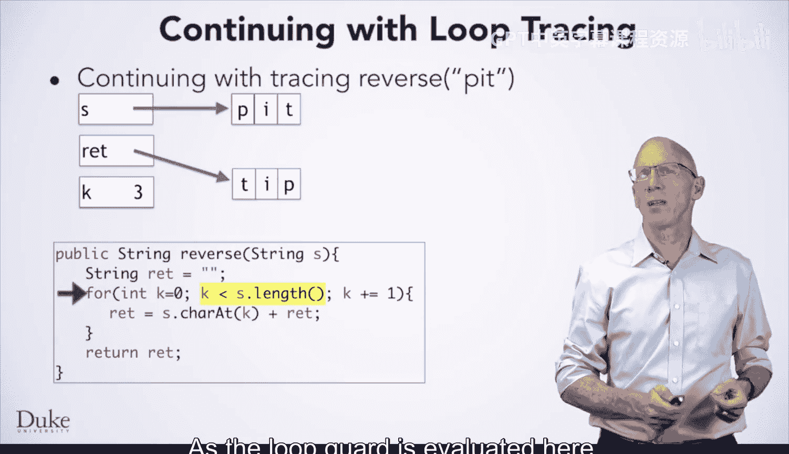

现在循环守卫将再次被评估。当在这里评估循环守卫时，你可以看到 `k` 的值是3，而 `s` 的长度也是3。由于3不小于3，循环守卫为 `false`。程序的控制流继续到循环之后的语句。`rev` 的值是 “TIP”，即字符串参数 `s` 的反转，因此将返回 “TIP”。

---

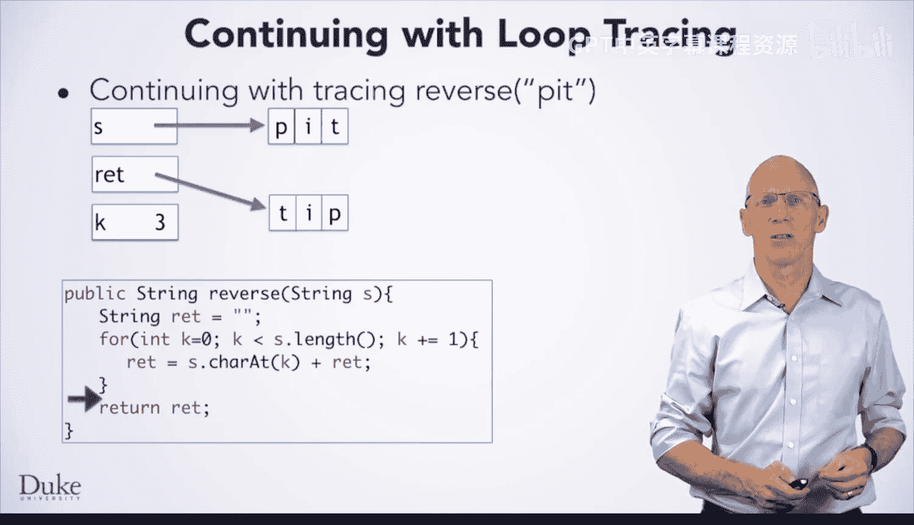

## 编程习惯与变体 📝

了解你将看到其他人编写的代码，并且你应该理解这些写法，这是很好的。

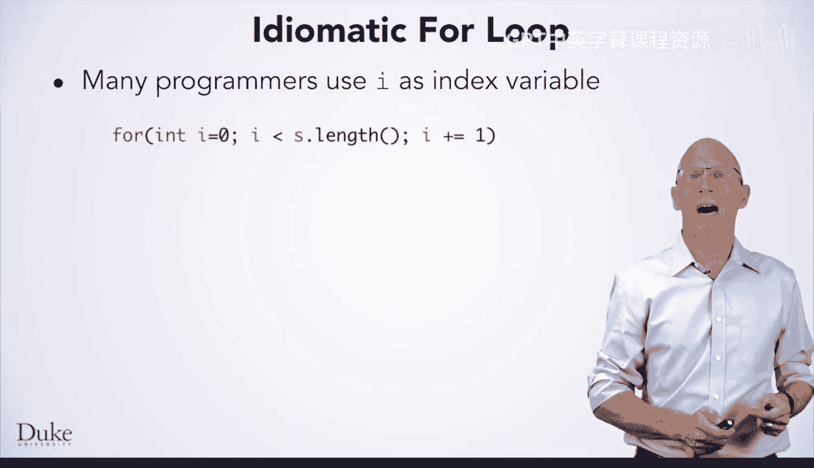

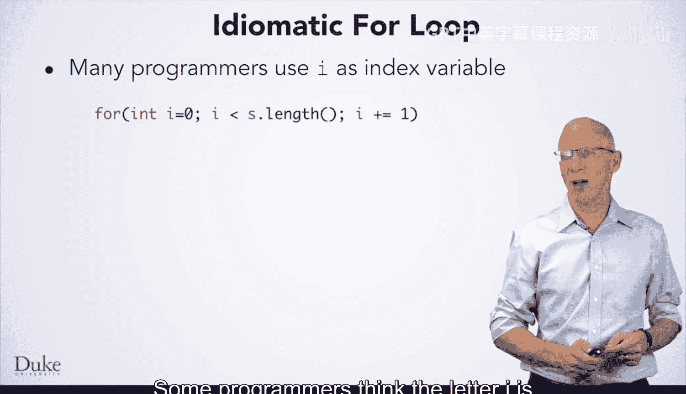

许多程序员使用 `i` 作为循环控制或索引变量。有些程序员认为字母 `i` 很难与数字 `1` 区分开，但 `i` 在阅读他人代码时比 `k` 更常见。

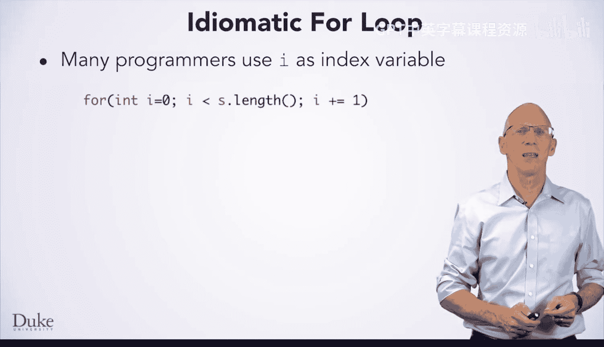

许多程序员使用后置增量运算符 `i++` 而不是 `i += 1`。我们不会在这里解释 `i++` 的细微差别，但它在使用循环时是一个非常常见的习惯用法，在循环增量中单独使用 `i++` 是可以的。

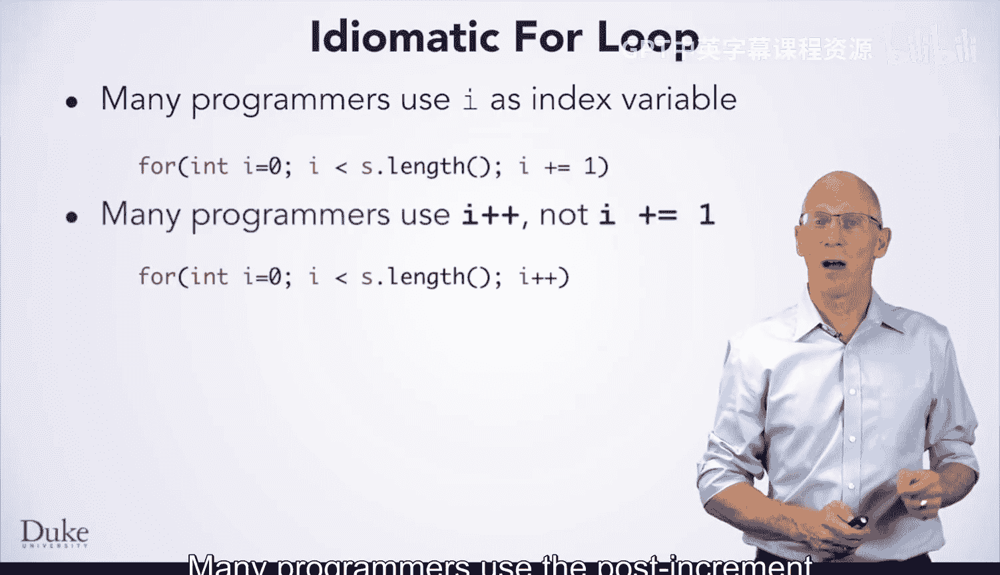

有时在循环之前定义循环索引变量，而不是在循环的括号内定义，是有用的。这允许在循环结束后引用或访问 `i` 的值。当变量在循环的括号内定义时，该循环控制变量只能在循环体内引用，而不能在循环之后引用。

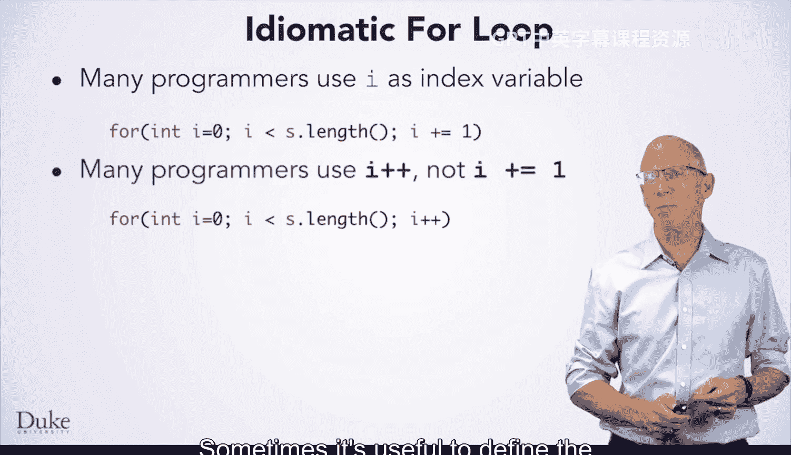

---

## 总结 📚

本节课中我们一起学习了计数循环（`for` 循环）。我们通过构建一个字符串反转函数的详细示例，深入理解了 `for` 循环的三个组成部分：初始化、循环守卫和增量操作。我们还将 `for` 循环与熟悉的 `while` 循环进行了比较，认识到 `for` 循环是一种更紧凑、更专注于计数的语法形式。最后，我们了解了一些常见的编程习惯，例如使用 `i` 作为索引变量和 `i++` 进行增量。掌握 `for` 循环是处理数组、字符串以及其他需要按顺序或按索引访问元素的数据结构的关键一步。