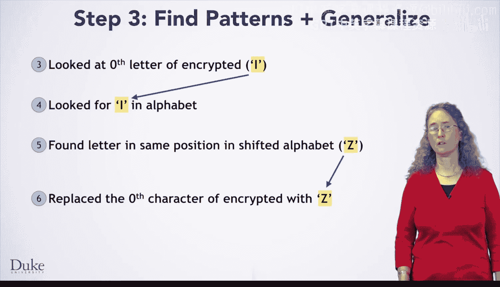

# Java编程和软件工程基础：2-5：算法开发 🧠

在本节课中，我们将学习如何为一个具体问题——凯撒密码——开发算法。我们将从手动解决一个实例开始，逐步抽象出通用步骤，并最终形成可转化为代码的算法。

---

欢迎回来。现在，你已经掌握了实现凯撒密码所需的所有概念。

让我们开始开发算法。和往常一样，你应该从第一步开始：自己动手解决一个问题的实例。尽管我们已经看过一些实例，但亲自解决一个小实例仍然有益，因为你可以写下所有步骤并仔细思考。

让我们用密钥17来加密消息“I am”（实际上是“I 空格 A M”），这意味着你将每个字母在字母表中向右移动17位。

你可以从写下字母表开始。
然后在它下面写下移动了17个字符的字母表。例如，a下面对应R，其中R是原字母表中a右边第17个字符。
接下来，你将遍历消息中的每个字符，并用移位字母表中对应的字母替换它。
完成后，你就得到了加密后的消息“Z 空格 R D”。
很好，你已经完成了第一步。

现在该进行第二步了：准确写下你刚才所做的操作。
你做的第一件事是写下字母表。然后你计算了移位后的字母表。
你做的第三件事是查看消息的第0个字母。别忘了，当你索引序列（如字符串和StringBuilder）时，第一个元素的索引是0。
那个字母是I。于是你在字母表中查找I。
然后你在移位字母表的相同位置找到了对应的字母，即Z。
因此你将消息的第0个字符替换为Z。
接下来，你查看了消息的第一个字母，它是一个空格。
如果你在字母表中查找空格，你将找不到它，因此你不会更改消息索引1处的字符。
接着，第二个字符是A，你对其执行了与第0个字符非常相似的过程，最终将其更改为R。
最后，你对第三个字符执行相同的操作，即M，你将其更改为D。

现在你已经仔细思考了整个过程，你得到了针对这条特定消息和这个特定密钥所执行的17个步骤的列表。然而，在继续之前，还有一点值得注意。
请注意，你的算法要求替换消息中的字符。如果你的消息是一个字符串，你无法做到这一点。正如你最近学到的，字符串是不可变的，意味着你无法更改它们。
如果你现在认识到这个问题，你可以调整你的算法，以反映你希望在这里使用StringBuilder的事实。我们在开头添加了一个步骤：从字符串消息创建一个StringBuilder。
然后我们更新了算法，使其在StringBuilder上工作。
如果你现在没有意识到需要这样做，你会在后面的步骤中发现。但越早弄清楚你需要做的一切，就越好。

观察这个算法，你可以看到前几个步骤是在开始对消息中的每个字母执行重复步骤之前的初始设置。
如果你专注于初始设置之后的步骤，你会发现你对消息中的每个字符所做的操作几乎相同，但又不完全一样。
一个显著的区别在于，你根据是否在字母表中找到该字母来决定做什么：如果找到就替换当前字符；如果没找到就什么也不做。
如果你观察针对一个特定字符（该字符在字母表中）的步骤，你会注意到：你在字母表中查找的字符是字符串中的当前字符；而你用来替换当前字符的字母，是你在移位字母表相同位置找到的字母。

现在你已经仔细思考了这一切，你可以写下一个更通用的算法。
请注意，这里的第2步需要一些思考和几个语句。但你已经知道如何做了。
当你寻找模式时，你应该检查任何常量，比如这里的0，并问自己是否总是使用这个常量，或者是否需要寻找一个更通用的模式。在这里，你总是想从0开始。
那么3呢？你是总是想数到3，还是总是想停止在3计数？不，你数到多高取决于消息的长度。这里我们写的是你想数到`encrypted`的长度，但要注意你想数到**小于**它，而不是小于或等于它。在我们的例子中，`encrypted`是4，而你只想数到3。

现在是测试这些步骤的时候了。请暂停视频，尝试用密钥19加密消息“a 空格 bat”。

你是否发现了这个算法中一个微妙的问题？尽管它计算出了你想要的一切，但我们从未说过最终答案是什么。你需要确保明确说明这一点，以便在将算法转化为代码时，知道从方法中返回什么。
你的答案是名为`encrypted`的StringBuilder内部的字符串。

现在你修正了算法中的这个细节，就可以准备将其转化为Java代码了。谢谢。

---

在本节课中，我们一起学习了凯撒密码算法的开发过程。我们从手动加密一个简单实例开始，逐步记录具体步骤，识别出使用不可变字符串的限制并引入StringBuilder，最终抽象并完善出一个清晰、通用、可转化为代码的算法框架。这个过程强调了从具体到抽象、从手动操作到形式化描述的算法思维。