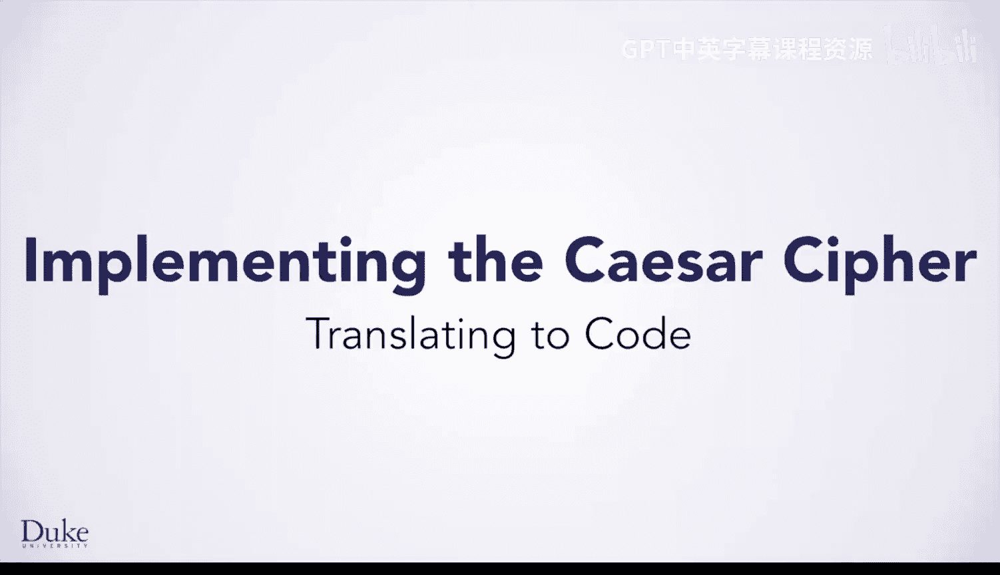
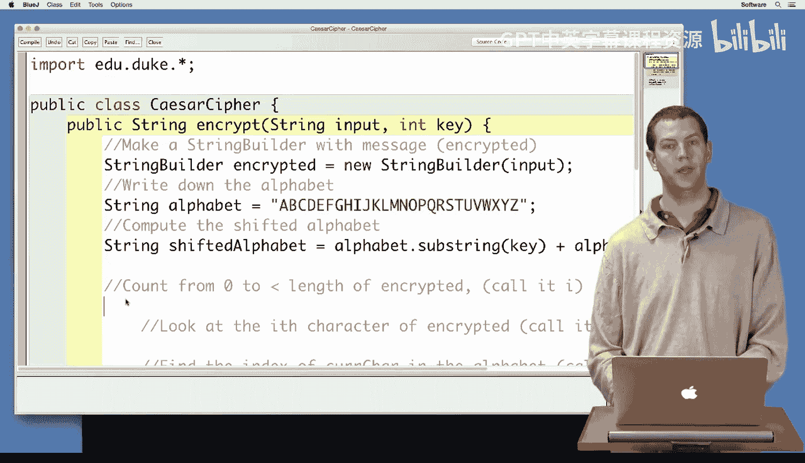
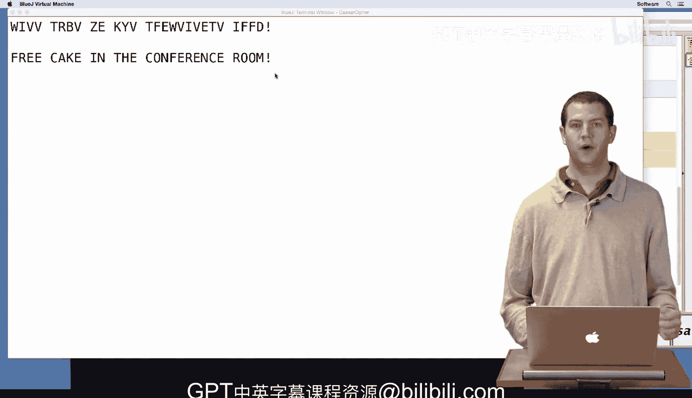

# 074：凯撒密码算法到代码的转换



在本节课中，我们将学习如何将之前设计的凯撒密码算法转化为实际的Java代码。我们将逐步构建一个`CaesarCipher`类，并实现其加密方法。

## 概述

上一节我们介绍了凯撒密码的算法设计。本节中，我们来看看如何用Java代码实现这个算法。我们将从一个包含`encrypt`方法的`CaesarCipher`类开始，该方法接收待加密的文本和用于加密的密钥整数。

## 代码实现步骤

以下是实现凯撒密码加密功能的具体步骤。

### 1. 初始化字符串构建器与字母表

首先，我们创建一个`StringBuilder`对象来构建加密后的字符串，并定义一个包含所有字母的字符串。

```java
StringBuilder encrypted = new StringBuilder(input);
String alphabet = "ABCDEFGHIJKLMNLMNOPQRSTUVWXYZ";
```



### 2. 计算移位后的字母表

接下来，我们需要根据密钥计算移位后的字母表。这可以通过字符串的`substring`方法实现。

```java
String shiftedAlphabet = alphabet.substring(key) + alphabet.substring(0, key);
```

### 3. 遍历输入字符

现在，我们需要遍历输入字符串中的每一个字符。为此，我们使用一个`for`循环。

```java
for (int i = 0; i < encrypted.length(); i++) {
    // 处理每个字符的代码将放在这里
}
```

### 4. 处理每个字符

在循环内部，我们按以下步骤处理每个字符：
*   获取当前字符。
*   在标准字母表中查找该字符的索引。
*   如果字符存在于字母表中（即索引不为-1），则从移位字母表中获取对应的新字符。
*   在`StringBuilder`中用新字符替换原字符。

```java
char currChar = encrypted.charAt(i);
int idx = alphabet.indexOf(currChar);
if (idx != -1) {
    char newChar = shiftedAlphabet.charAt(idx);
    encrypted.setCharAt(i, newChar);
}
```

### 5. 返回加密结果

循环结束后，我们将`StringBuilder`转换为字符串并返回，作为加密结果。

```java
return encrypted.toString();
```

## 测试加密方法

代码编写完成后，必须进行测试以验证其正确性。我们编写一个`testCaesar`方法，它能够：
1.  读取一个文件中的消息。
2.  使用我们的加密方法对其进行加密并打印结果。
3.  对加密结果进行解密（使用反向密钥）并打印，以验证是否能恢复原始消息。

看到加密后的乱码和成功解密回原文，能让我们对代码的正确性更有信心。当然，彻底验证还需要手动核对几个测试用例。

## 总结



本节课中我们一起学习了将凯撒密码算法转化为Java代码的完整过程。我们从初始化变量开始，逐步实现了字符遍历、查找、替换等核心逻辑，并最终完成了加密方法。通过编写测试代码进行验证，我们确保了加密和解密功能的正确性。这个过程清晰地展示了从算法设计到功能实现的关键步骤。