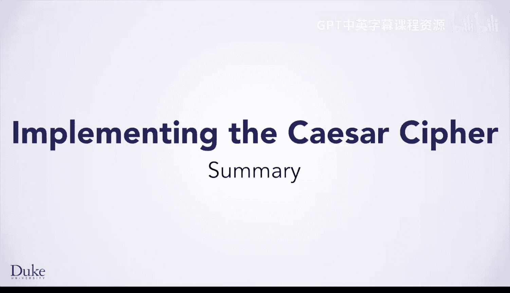

# 076：密码学入门与凯撒密码实现总结 🔐

在本节课中，我们学习了密码学的基础知识、字符串操作、循环计数，并最终实现了一个经典的凯撒密码。本节将对所学内容进行总结。

## 课程内容回顾

首先，我们了解了密码学的历史背景及其在现代社会中的重要性。

接着，我们学习了更多关于字符串的概念，以及如何使用 `StringBuilder` 来高效地构建字符串。

然后，我们学习了计数循环，为你的编程工具箱增添了另一个重要工具。

最后，我们实现了一个凯撒密码，这是一种可以追溯到数千年前的古典密码。

## 总结与展望

本节课中我们一起学习了密码学的基本概念、字符串的高效处理、循环控制结构，并动手实践了凯撒密码的编码与解码过程。

正如你将在下一课中学到的，按照现代标准，这种密码并不安全，但它是理解密码学思想的良好起点。