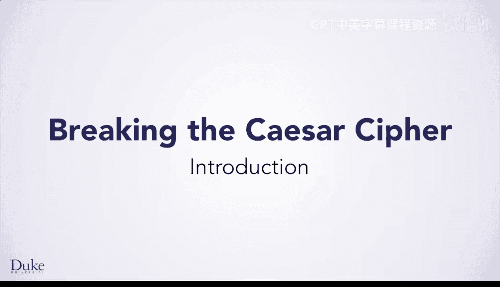
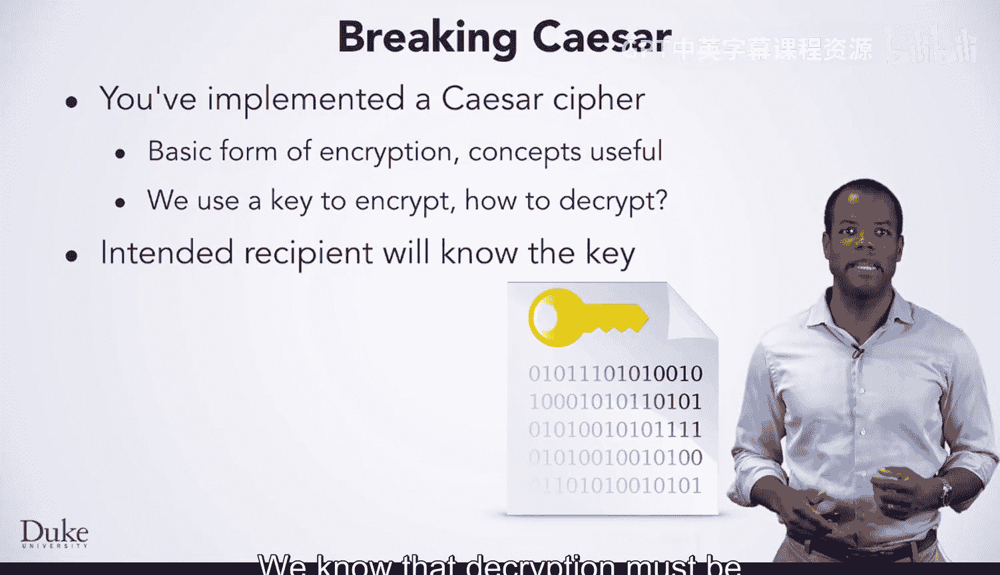
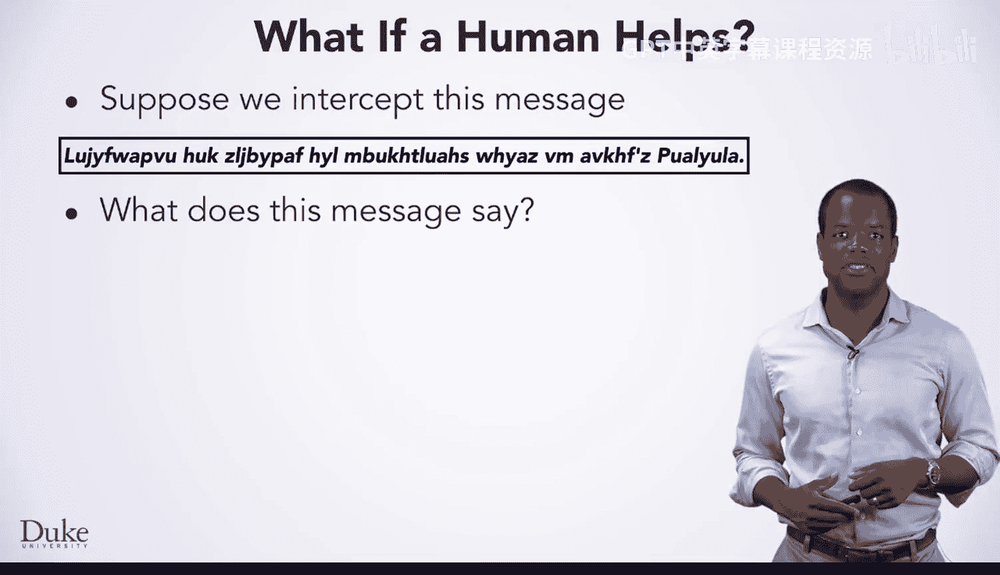
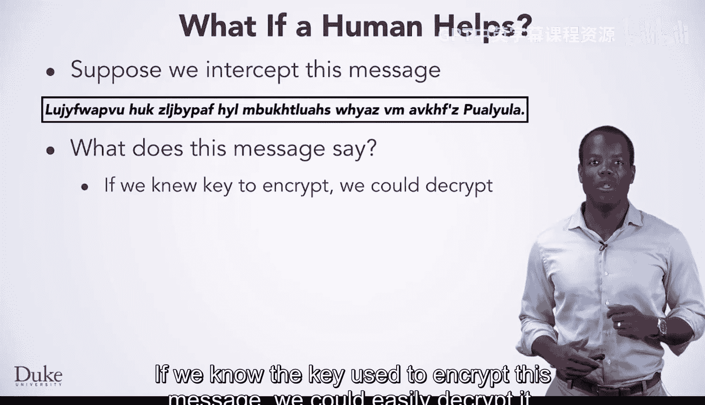
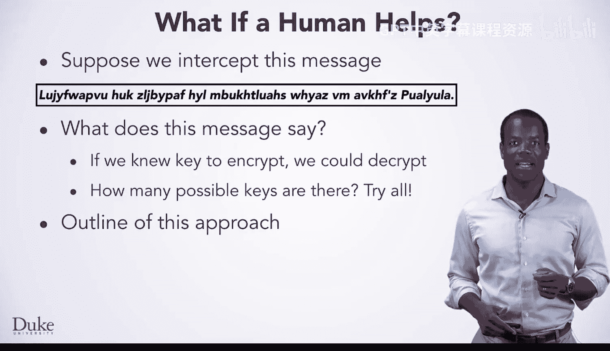
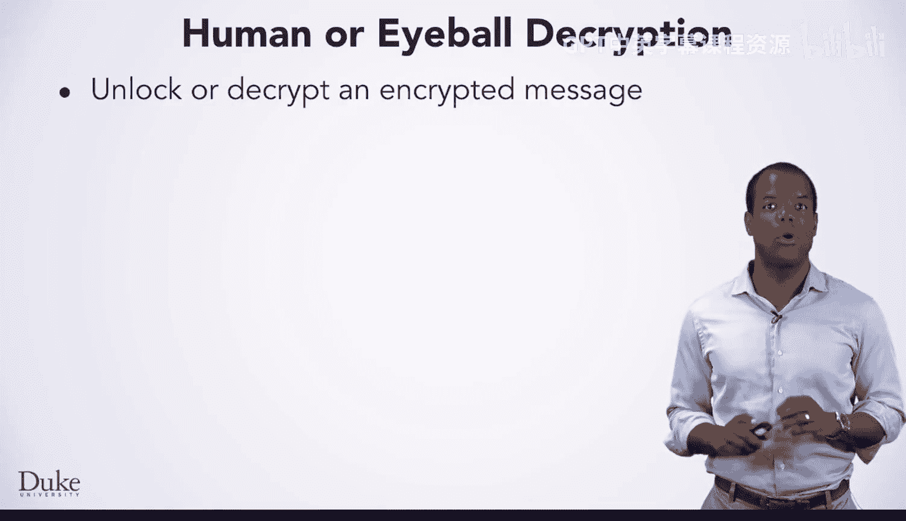
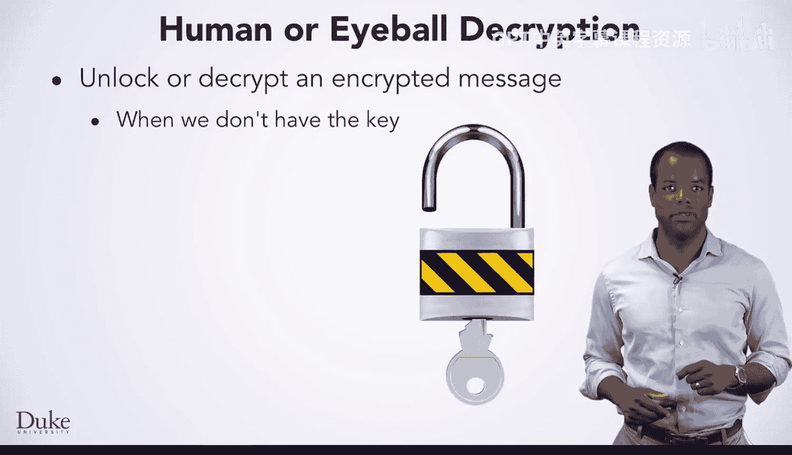
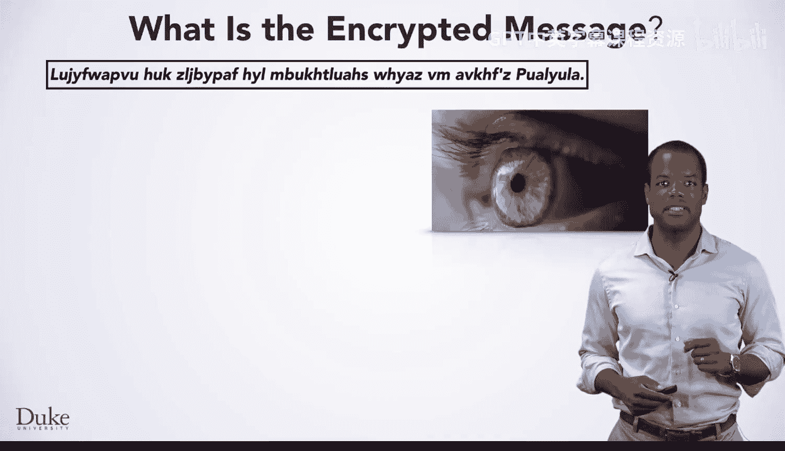

# 077：使用数组破解凯撒密码 🗝️

在本节课中，我们将学习如何使用“暴力破解”方法，通过尝试所有可能的密钥来解密一段由凯撒密码加密的文本。我们将理解凯撒密码的基本原理，并编写一个简单的程序来演示这一过程。

---

我是杰夫·福布斯，杜克大学的计算机科学教授，也是苏珊、欧文、罗伯特和德鲁的朋友。我的研究方向是计算机科学教育和学习分析，同时我也使用Java教授数据结构和算法课程。我很高兴能为大家带来一堂关于使用数组破解凯撒密码的客座讲座，我知道你们一直在学习这种加密方法。

你们或其他人可能已经实现过使用凯撒密码加密文本的程序。这是一种非常基础且具有历史意义的加密形式，但考虑到耐心、计算机的访问权限以及编程技能，它并不安全。破解这种密码所涉及的概念，对于解决其他问题也很有用。

加密时，会使用一个密钥来移位消息中的所有字母。那么，我们如何解密呢？我们知道解密必须是可行的，因为预期的接收者必须能够解密并阅读发送的加密消息。

---

因为移位26次等同于移位0次。用移位7进行加密，再用移位19进行解密，将得到原始消息，就像移位26次一样。了解这一点如何帮助我们破解密码呢？

窃贼或黑客可以找到密钥，密钥通常是一个数字。无论是在凯撒密码还是许多其他加密形式中，密钥通常都是数字。黑客只需从26中减去加密密钥，就能解密消息。

如果黑客没有密钥，是否有可能使用暴力破解或其他方法来破解密码呢？暴力破解意味着在人的帮助下尝试每一个可能的密钥。对于凯撒密码，使用暴力破解相对容易解密消息。

---

假设我们截获了这条消息，它很难发音。我们仅凭观察就能看出这条消息在说什么吗？这似乎不太可能。

如果我们知道用于加密这条消息的密钥，我们就可以轻松地解密它。

---

但是有多少个密钥呢？也许我们可以简单地尝试所有密钥，这就是暴力破解方法的基本思想：尝试每一个密钥。

我们已经有了加密消息的代码。我们将使用从1到26（或0到25）的每一个密钥来加密我们试图解密的消息。由于解密移位量就是26减去原始加密移位量，如果我们尝试所有26种移位，我们就会找到原始消息。我们可以使用这种暴力破解方法尝试每一个密钥，因为密钥数量很少，而且尝试每个密钥的速度很快。同样的方法不适用于其他形式的加密，因为可能的密钥数量可能太多，或者使用每个密钥加密可能需要很长时间。

在讨论比暴力破解更复杂的方法之前，我们先来理解一下我们称之为“肉眼解密”的暴力破解方法。我们的目标是解锁或解密一条加密消息。

---

我们没有用于解密的密钥，我们没那么幸运。

然而，我们确实有来自凯撒密码课程的加密密钥，利用它我们可以尝试所有26个密钥。为了使用人工或“肉眼”方法解密，我们将创建一个凯撒密码对象。我们将尝试从0到25的所有26个密钥。我们将使用名为`cipher`的凯撒密码对象来移位消息，对每个密钥都操作一次，然后打印移位的结果。正如我们将看到的，如果我们能识别出单词，我们就能解密消息。

当我们运行刚刚讨论的代码时，我们将能够查看或“肉眼观察”加密26次的结果。

---

我们将系统地扫描由26个不同密钥产生的26个字符串。当我们用肉眼观察每个字符串时，我们会仔细查看该字符串是否可以被识别为英语，因为我们在寻找一条英语消息。这一行无法识别。这一行看起来不像英语，但让我们仔细看看。不，它不是英语。我们看下一行。让我们仔细检查这一行。

这一行很容易被识别为英语文本，我们看到“加密和安全是当今互联网的基本组成部分”。