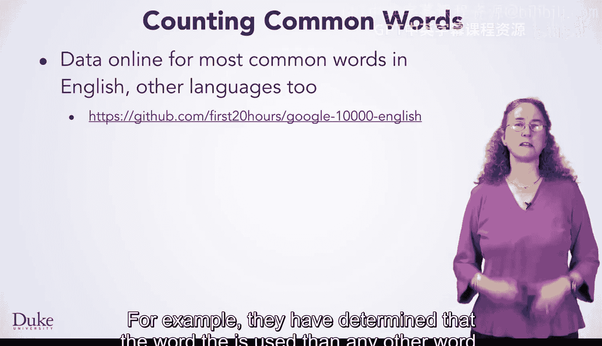
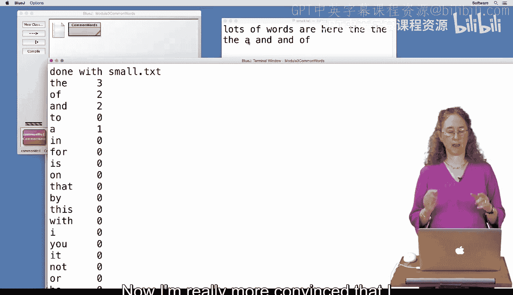
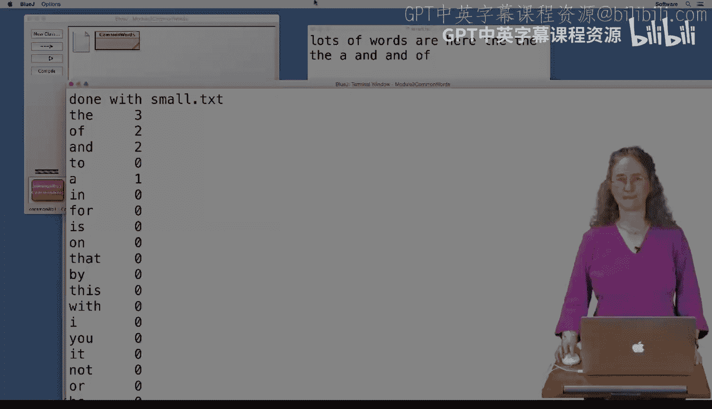

# 080：使用数组计数 📊

在本节课中，我们将学习如何使用数组来统计文本中特定单词的出现次数。我们将通过分析莎士比亚戏剧文本来实践这一概念，并编写代码来找出其中最常见单词的使用频率。



## 概述

英语中最常见的单词是什么？我们可以使用搜索工具或现成的数据来找到答案。例如，已有研究表明，“the”是英语中使用频率最高的单词。

那么，莎士比亚在他的戏剧中是否也大量使用了这些常见单词呢？我们可以利用杜克大学的课程资源、莎士比亚戏剧的公共领域版本以及一些简单的数组代码来回答这个问题。

在本示例中，我们将检查莎士比亚的几部戏剧，并统计他使用最常见单词的次数。

## 代码实现

以下是统计莎士比亚戏剧中最常见单词的初始代码。我们首先来看一下整体结构。

```java
public void countShakespeare() {
    // 初始化包含戏剧文件名的数组
    String[] plays = {"caesar.txt", "errors.txt", "hamlet.txt", "likeit.txt", "macbeth.txt", "romeo.txt"};

    // 获取常见单词列表
    String[] common = getCommon();

    // ... 后续统计逻辑
}
```

我们定义了一个方法 `countShakespeare`。这里展示了一种初始化数组的新方式：使用花括号 `{}` 直接列出数组中的元素。`plays` 数组包含了六个莎士比亚戏剧的文本文件名。此外，我们还有另一个字符串数组 `common`，它通过 `getCommon` 方法获取。

## 获取常见单词列表

接下来，我们看看 `getCommon` 方法是如何工作的。

```java
public String[] getCommon() {
    // 从文件 common.txt 中读取20个最常见单词
    String[] common = new String[20];
    // ... 读取文件并填充数组的循环逻辑
    return common;
}
```

`getCommon` 方法读取一个名为 `common.txt` 的数据文件，该文件包含了由他人确定的20个最常见的英语单词。因为我们事先知道文件中有20个单词，所以可以创建一个大小为20的字符串数组 `common`。然后，通过一个循环逐个读取单词并存入数组。

## 统计单词出现次数

回到 `countShakespeare` 方法。在获取了戏剧列表和常见单词列表后，我们使用一个循环来逐个处理每部戏剧。

```java
for (int i = 0; i < plays.length; i++) {
    String playName = "data/" + plays[i]; // 假设文件存储在data文件夹下
    countWords(playName, common, counts); // 统计该戏剧中的单词
    System.out.println("完成处理：" + plays[i]);
}
```

对于每部戏剧，我们调用 `countWords` 方法。该方法会检查戏剧中的每个单词，看它是否属于常见单词列表。如果是，则相应地在 `counts` 数组中增加该单词的计数。

处理完所有戏剧后，我们遍历常见单词列表，并打印每个单词在所有六部戏剧中的总出现次数。

## 实现关键方法：`indexOf`

然而，上述代码中缺少一个关键方法 `indexOf` 的实现。这个方法用于在一个单词列表中查找特定单词，并返回其位置（索引）。

以下是 `indexOf` 方法的实现步骤：

1.  遍历传入的单词列表（数组）。
2.  将列表中的每个单词与目标单词进行比较。
3.  如果找到匹配的单词，则返回其索引。
4.  如果遍历完整个列表仍未找到，则返回 `-1` 表示未找到。

```java
public int indexOf(String[] list, String word) {
    for (int k = 0; k < list.length; k++) {
        if (list[k].equals(word)) {
            return k; // 找到单词，返回其索引
        }
    }
    return -1; // 未找到单词
}
```

## `indexOf` 方法在统计中的应用

现在，让我们看看 `indexOf` 方法如何在 `countWords` 方法中被使用。

```java
public void countWords(String filename, String[] common, int[] counts) {
    // ... 读取文件，获取每个单词的逻辑
    for (每个从文件中读取的单词) {
        int index = indexOf(common, word); // 查找单词在常见列表中的位置
        if (index != -1) { // 如果找到了
            counts[index]++; // 在对应的计数数组位置加1
        }
    }
}
```

对于从文件中读取的每个单词，我们调用 `indexOf(common, word)` 来检查它是否在常见单词列表中。如果返回值不是 `-1`（即找到了），我们就使用这个索引值来更新 `counts` 数组中对应位置的计数器。例如，每次找到单词 “the”，我们就会增加 `counts` 数组中与 “the” 在 `common` 数组中位置相对应的那个计数器的值。

## 运行与验证

编译并运行完整的程序后，我们得到了类似以下的结果：

```
处理文件：caesar.txt
处理文件：errors.txt
...
常见单词统计结果：
the: 4237
of: 1071
and: 980
...
```

结果显示，在分析的六部戏剧中，单词 “the” 出现了4237次，“of” 出现了1071次，等等。这表明莎士比亚确实大量使用了常见单词。

为了验证我们统计的准确性，我们可以用一个内容已知的小文件进行测试。例如，创建一个 `small.txt` 文件，里面只包含几个单词。

```java
// 临时修改 countShakespeare 方法，只处理测试文件
String[] plays = {"small.txt"}; // 替换原来的plays数组
```

再次运行程序，将输出与 `small.txt` 文件中的实际单词进行手动比对。如果计数结果一致，就能增强我们对统计莎士比亚戏剧单词次数准确性的信心。

## 总结

本节课中，我们一起学习了如何使用数组来统计文本中单词的出现频率。我们通过一个具体的项目——分析莎士比亚戏剧中的常见单词——实践了以下核心技能：

*   **数组的初始化与使用**：学习了直接使用 `{}` 初始化数组元素。
*   **文件读取与处理**：通过循环读取多个文件内容。
*   **关键算法实现**：编写了 `indexOf` 方法在数组中线性查找元素。
*   **数据关联**：使用两个平行的数组（`common` 和 `counts`）来关联单词和其出现次数。
*   **程序测试与验证**：通过小规模测试用例来验证程序的正确性。





通过这个练习，你不仅掌握了数组的基本操作，也了解了如何将编程应用于实际的文本分析问题中。