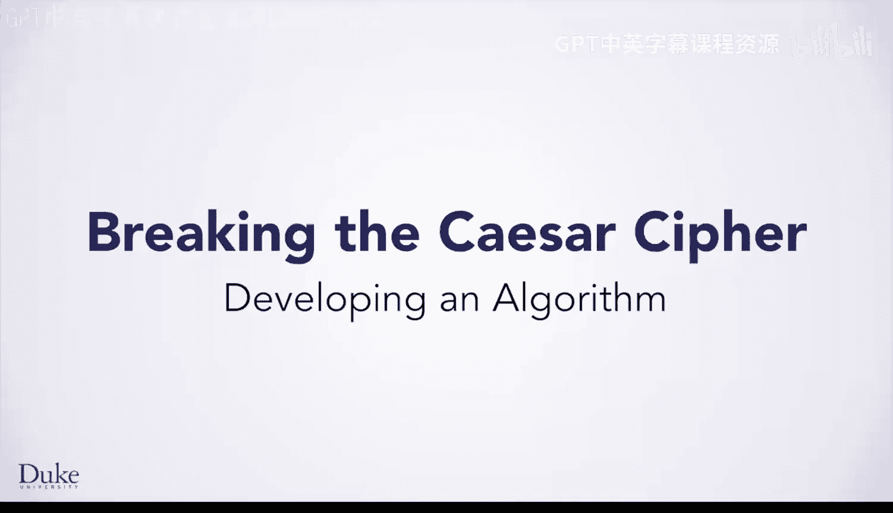
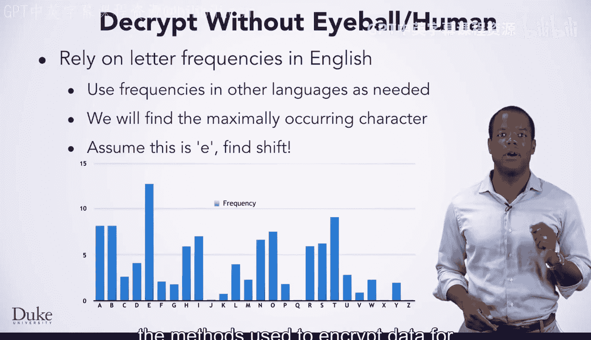
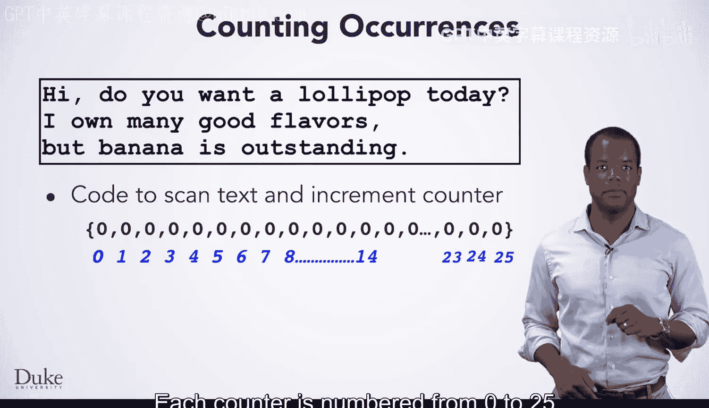
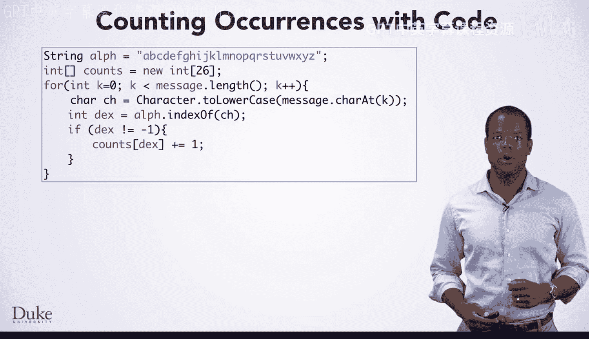
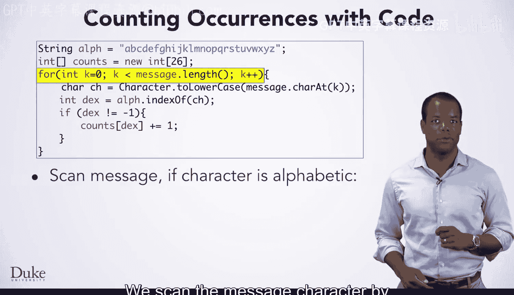
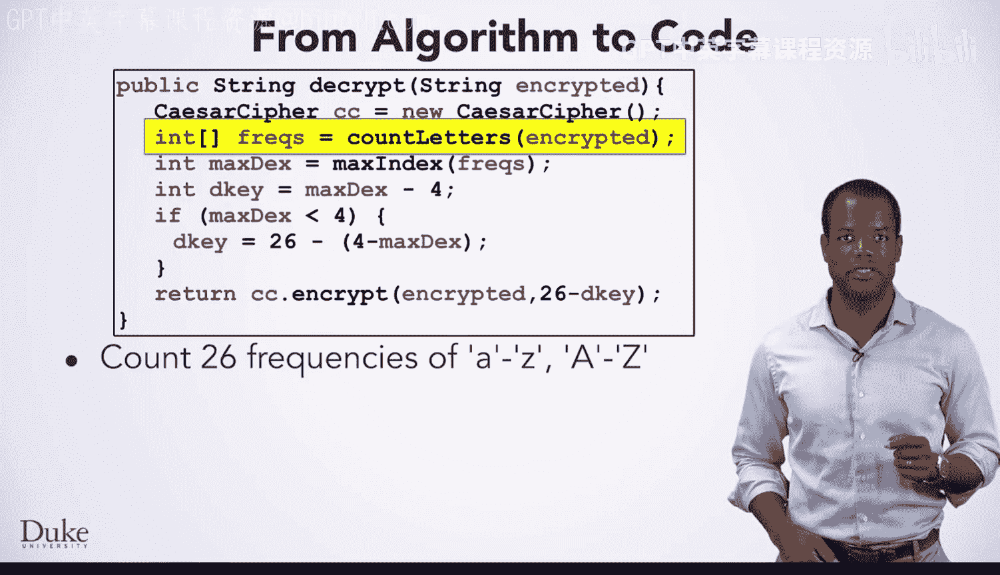
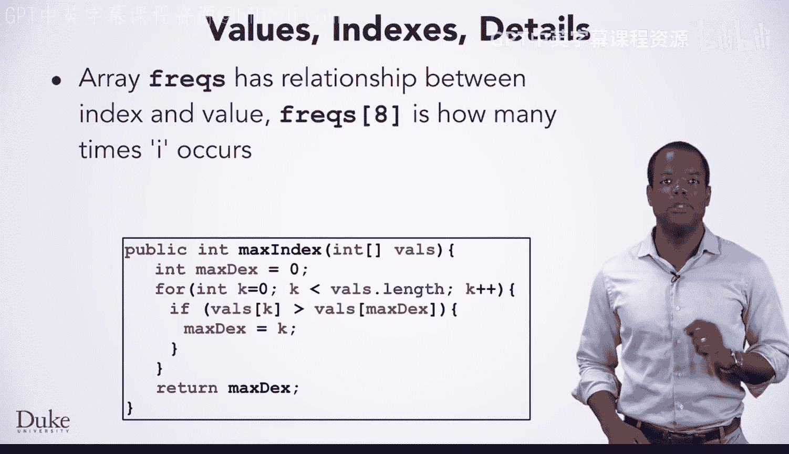

# 081：算法开发




在本节课中，我们将学习如何自动化破解凯撒密码。为了实现这一目标，我们将依赖英语文本中字母的出现频率。


如果你要加密另一种语言的消息，你需要使用该语言的字母频率，但方法相同。

我们将编写代码来寻找待解密消息中出现频率最高的字符。

我们假设这个字符是字母 **E**，因为在英语文本中，E 的出现频率高于任何其他字母。在俄语中，例如，字母 O 的出现频率高于 E。如果我们关于 E 的假设是错误的，我们将无法解密原始消息。

也可以不仅仅依赖 E，而是依赖所有字母的频率，并使用统计方法来破解凯撒密码。在某些情况下，这些方法也能破解其他加密方法，尽管不是用于在线购物和安全交易的数据加密方法。



让我们分两步来看解密代码。

我们需要统计待加密消息中每个字母 A 到 Z 的出现次数。


我们将编写代码来扫描文本的每个字母，并为 26 个不同的字母分别增加一个计数器。

最初，所有计数器的值都是零，因为我们还没有开始逐个字母地扫描文本。

每个计数器从 0 到 25 编号，因为计数器是数组元素。



一个包含 26 个字母的字符串将帮助我们找到正确的索引，随着我们扫描文本，相应的计数器会增加。


当我们扫描消息时，查看每个字符，例如遇到 H，我们将增加索引 7 处的计数器。

然后扫描到 I 时，我们将增加索引 8 处的计数器，这是 I 在我们字母表字符串中的索引。

遇到逗号或空格时，我们不会增加任何计数器。

接着，遇到 D 时，我们将增加索引 3 处的计数器。遇到 O 时，增加索引 14 处的计数器。

遇到空格时不会增加，因为空格不在字母表中。

遇到 y 时，我们将增加索引 24 处的计数器。

当扫描到消息中的第二个 O 时，我们将把索引 14 处的计数器值设为 2。

扫描完每个字符后，每个计数器将拥有这些值。

如果你仔细观察这些值，会发现我们的解密方法很可能会失败。索引 4 处的计数器值为 0，意味着消息中没有字母 E，但这是一种非常罕见的情况。

现在，我们来看看实现这个想法的代码。




我们使用一个标准的 `for` 循环逐个字符地扫描消息。



```java
for (int k = 0; k < message.length(); k++) {
    // 处理每个字符
}
```


我们查找字符在字母表字符串中出现的位置，例如 E 会在索引 4 处找到。注意，我们将待解密消息中的字符转换为了小写。

我们使用字母表中的索引来增加相应的计数器，作为解密消息的一部分。

如果字符不在字母表中，`indexOf` 方法会返回 -1，我们就不增加任何计数器。

```java
String alphabet = "abcdefghijklmnopqrstuvwxyz";
int index = alphabet.indexOf(Character.toLowerCase(ch));
if (index != -1) {
    counts[index]++;
}
```


基于 E 出现频率最高这一想法编写的代码，是从你刚才看到的思路、算法和代码中直接发展而来的。


正如你所见，代码并不长。我们创建了两个辅助方法，并依赖这个凯撒密码类来帮助解密。

我们调用了一个 `countLetters` 方法，这个方法我们刚刚讨论过。它会统计字符串中每个字符的出现次数，其中 A 的出现次数存储在数组的第一个位置（索引 0）。该方法返回的数组在这里由变量 `freqs` 引用。

```java
int[] freqs = countLetters(encrypted);
```




然后我们调用 `maxIndex` 方法，它将返回 `freqs` 数组中值最大的那个条目的索引。我们假设这个位置就是 E 被移位后的位置。

我们将计算从这个位置到 E 的距离。E 的索引是 4，因为我们从 A 为 0 开始计数，然后 B、C、D、E 分别是 1、2、3、4。

如果最大值的索引小于 4，我们需要从 26 开始回绕，以找到用于 E 的移位值。

如果加密时使用的密钥是 `dkey`，那么解密时使用的密钥就是 `26 - dkey`，然后我们返回解密后的字符串。

```java
int maxDex = maxIndex(freqs);
int dkey = maxDex - 4;
if (maxDex < 4) {
    dkey = 26 - (4 - maxDex);
}
return decrypt(encrypted, 26 - dkey);
```

你将准备好运用你的编程知识来完成解密任务，然后在迷你项目中将这些知识应用到另一种密码上。但有一些细节我们想强调一下。


我们刚才看到的代码中，数组 `freqs` 的索引和数组中的值存在对应关系。例如，`freqs[8]` 表示字母 I 出现的频率，因为 I 是第九个字母，索引为 8。记住，我们从索引 0 开始计数。




在寻找最大值时，就像我们调用的 `maxIndex` 方法（其实现如下所示），我们返回的是最大值的索引，而不是最大值本身。我们使用这个索引来计算到 E 的距离。

```java
public int maxIndex(int[] vals) {
    int maxDex = 0;
    for (int k = 0; k < vals.length; k++) {
        if (vals[k] > vals[maxDex]) {
            maxDex = k;
        }
    }
    return maxDex;
}
```

使用现有的凯撒密码类使得解密过程更加直接。总的来说，使用已经开发和测试过的代码，而不是重新发明轮子，是一个好主意。

---

**本节课总结**

在本节课中，我们一起学习了如何通过分析字母频率来自动化破解凯撒密码。我们了解了算法的核心思想：假设密文中出现频率最高的字母对应明文中出现频率最高的字母 E。我们分步实现了统计字母频率、寻找最高频字母索引以及计算解密密钥的代码。最后，我们强调了重用现有、经过测试的代码库的重要性。