# 082：数组总结 🧩


在本节课中，我们将要学习Java中数组的核心概念、基本操作以及如何利用数组解决实际问题，例如破解凯撒密码。数组是Java中一种强大的数据结构，允许我们通过一个变量名管理多个值。


## 数组简介 📦

上一节我们介绍了数组的基本概念，本节中我们来看看数组的具体定义和特性。

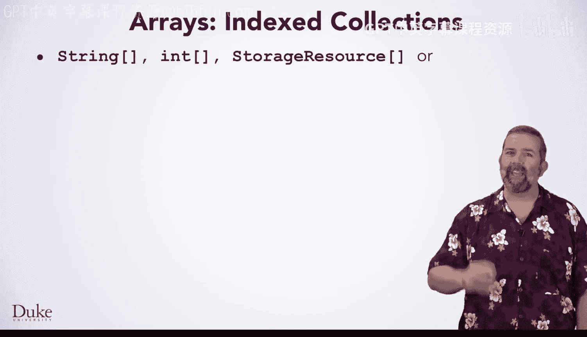

数组是Java中的索引集合。使用方括号来声明一个数组变量。数组可以存储字符串、整数，甚至其他资源。几乎任何类型的数据都可以存储在数组中。

数组的强大之处在于，一个变量名可以代表两个、十个甚至一百万个不同的值，并且每个值都可以被单独访问。

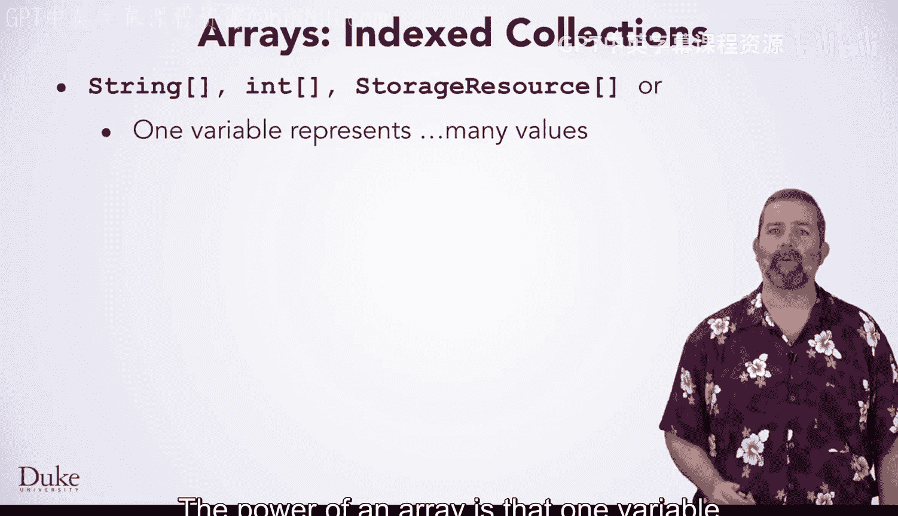

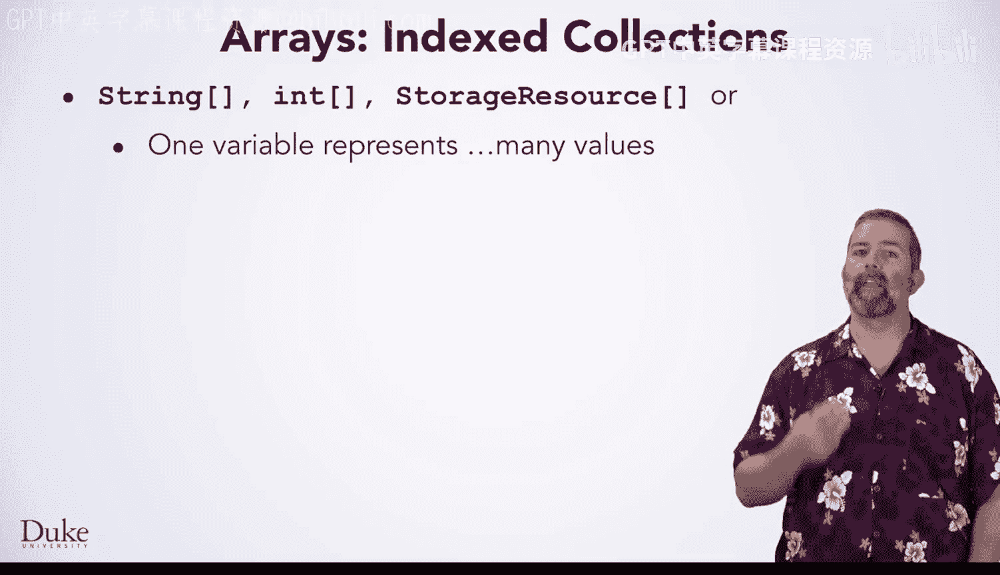

## 数组的访问与索引 🔢

这种访问是通过数字索引完成的。索引值从0开始，对应数组中的第一个元素，这与字符串的访问方式类似。就像通过编号可以快速找到一组邮箱一样，通过数字索引访问数组元素有助于高效地存储和访问值。

以下是Java中数组工作原理的快速概述：
*   在Java中，数组使用 `new` 关键字创建。
*   数组一旦创建，其大小就固定不变。
*   但是，存储在数组每个索引单元中的值是可以改变的。正是这一点使得数组既实用又强大。

数组使用 `new` 创建，方括号既用于指示变量（如 `names`）是一个字符串数组，也作为 `new` 语法的一部分来指定数组中的元素数量。

## 数组的类型与初始化 📝

在Java中，你可以定义整型数组，就像定义字符串数组一样。

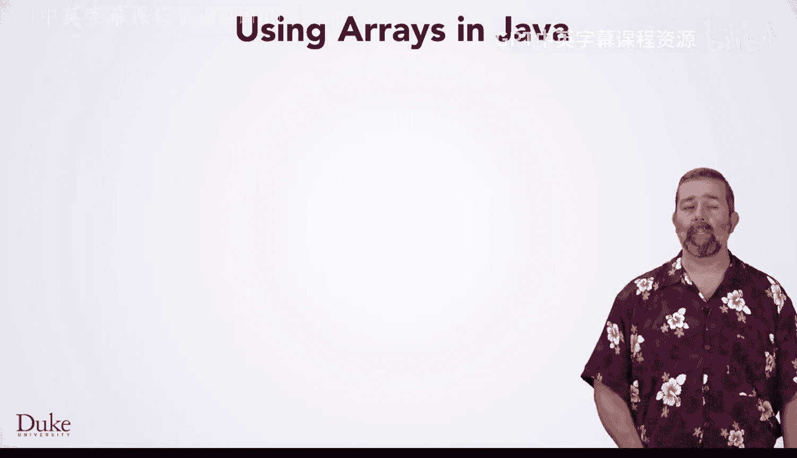

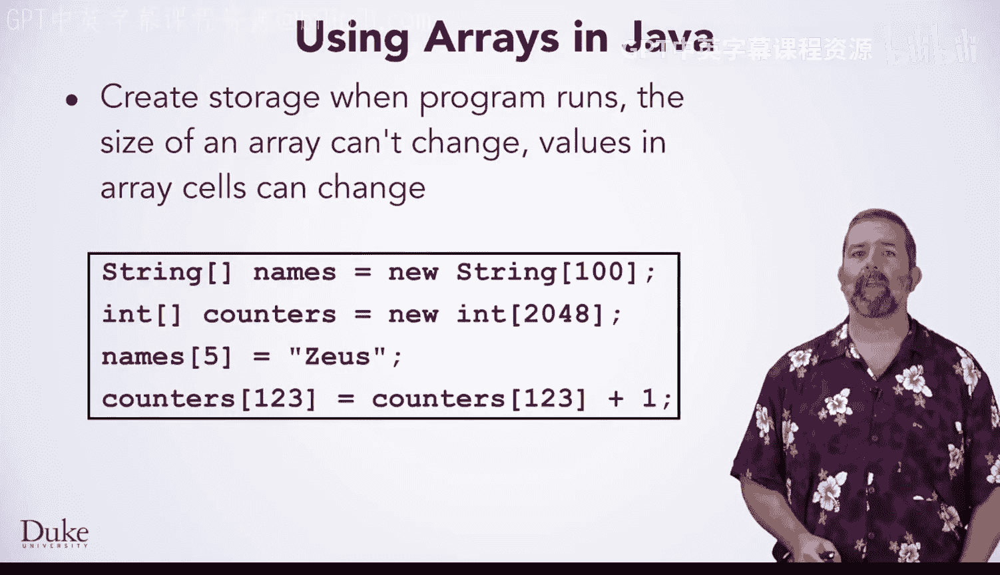

以下是不同类型数组的初始化规则：
*   整型数组中的值初始化为 `0`。
*   字符串和其他对象数组中的值初始化为 `null`。

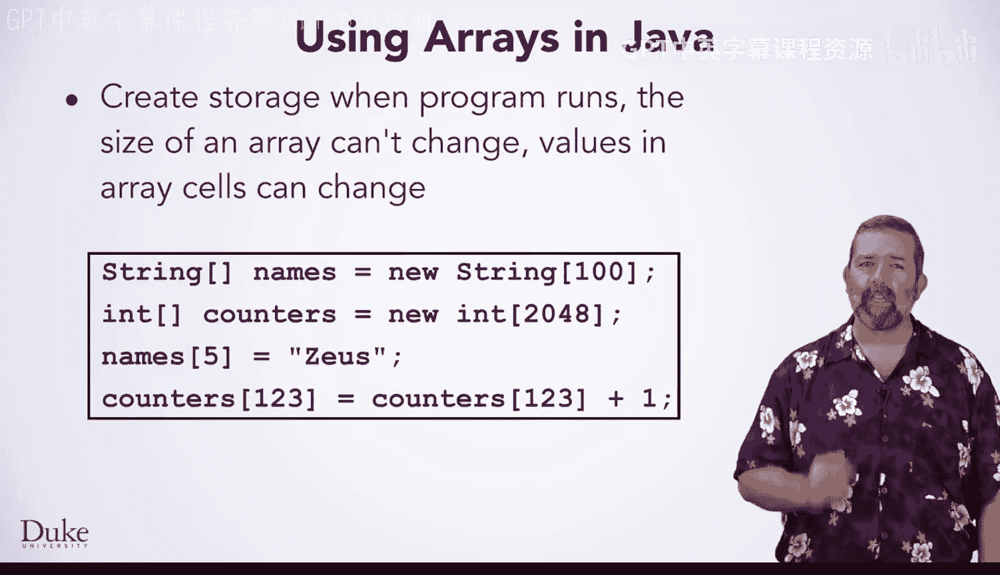

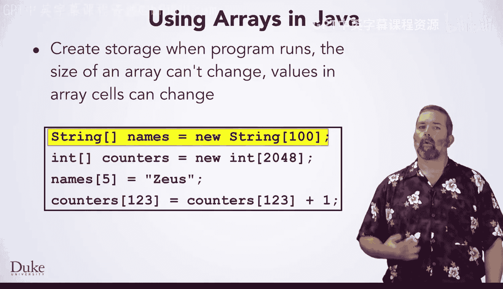

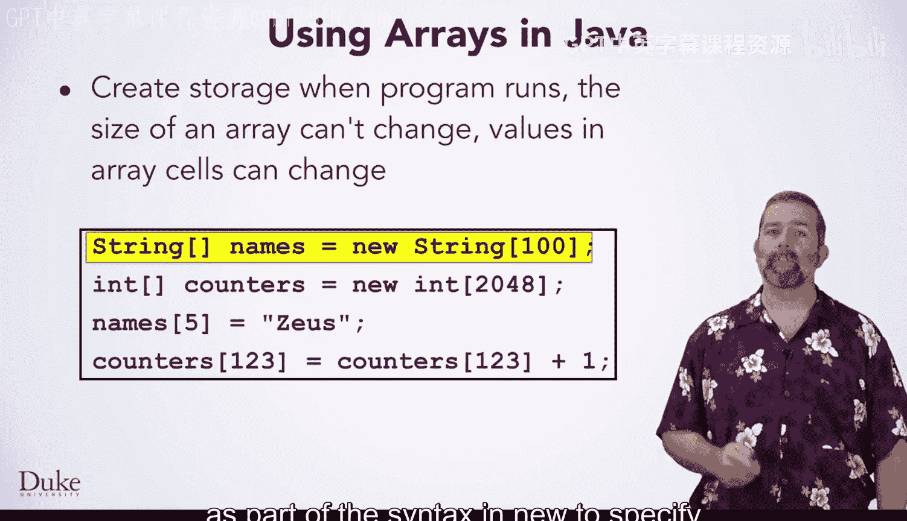

## 数组的赋值与访问 ✏️

你可以使用索引为数组赋值。同样，你也可以通过访问数组来更新其内容。

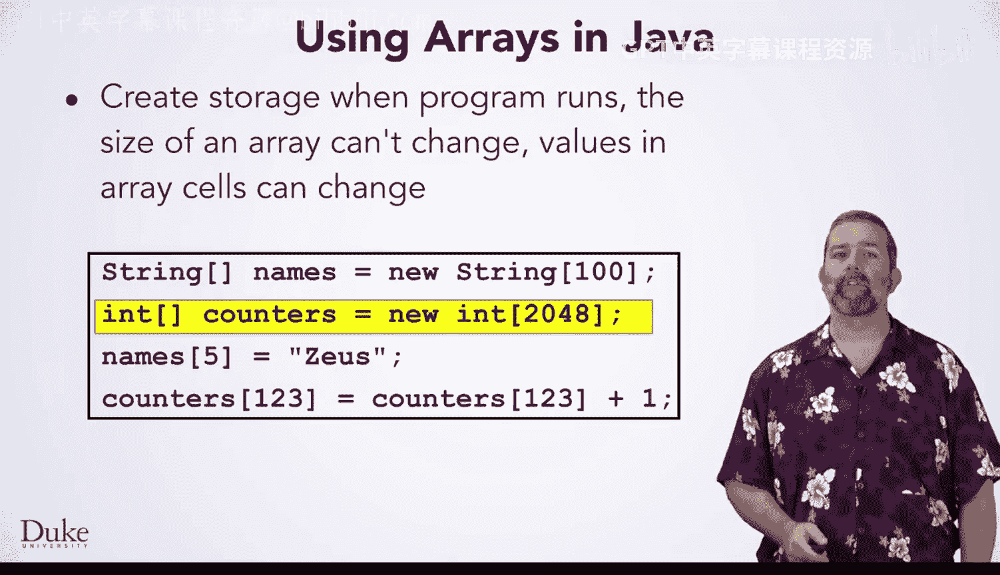

## 使用循环遍历数组 🔄

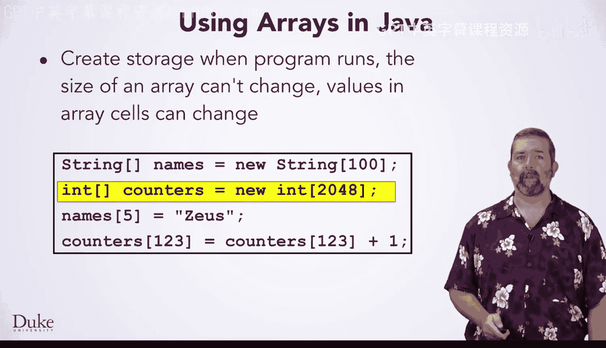

你已经使用索引来访问数组元素，而循环通常用于访问数组中的所有元素。

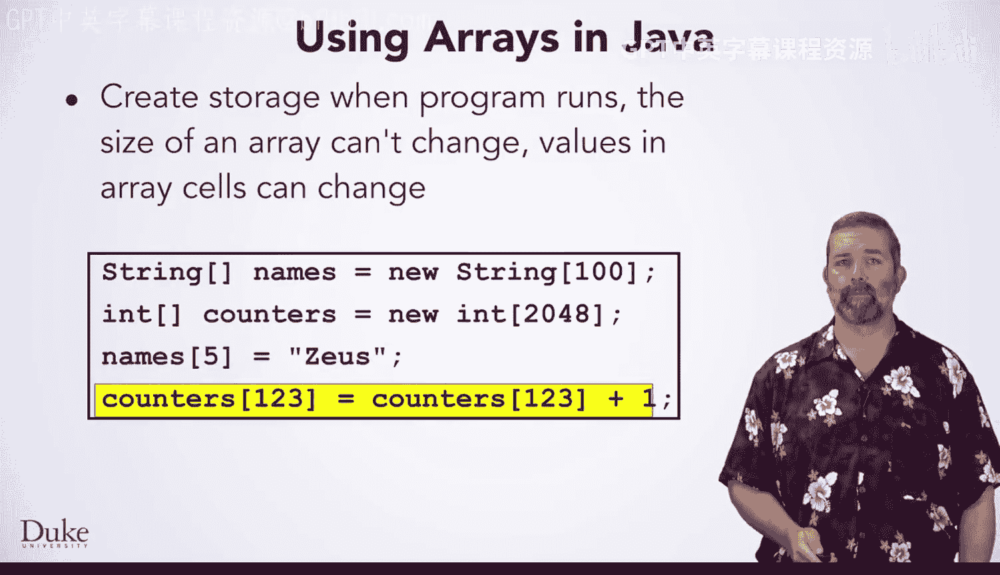

以下是一个典型的循环代码，它从第一个索引 `0` 开始，遍历到最后一个有效索引（即数组长度减一）。


```java
for (int k = 0; k < list.length; k++) {
    // 循环体
}
```

在循环体中，循环控制变量通常用于访问数组中的每个元素。

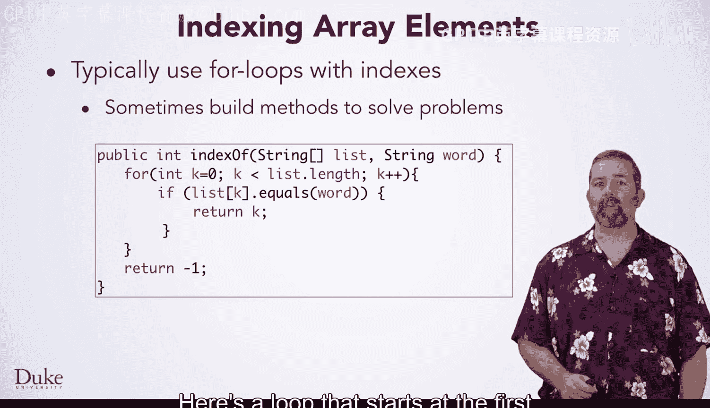


例如，在这个循环中，`k` 的值用于指示在数组参数 `list` 中找到某个单词的索引位置。

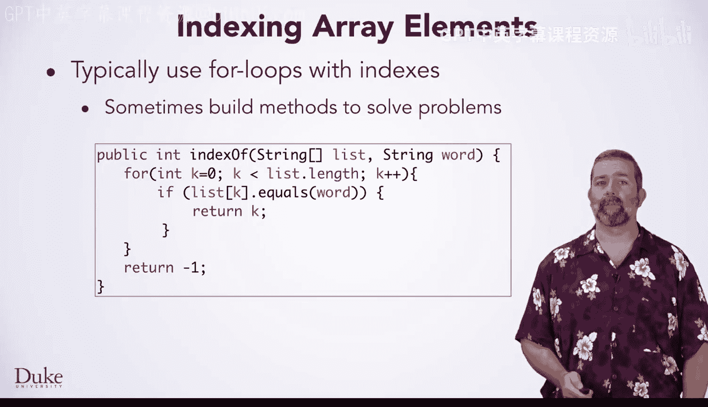

```java
for (int k = 0; k < list.length; k++) {
    if (list[k].equals(word)) {
        // 找到单词
    }
}
```

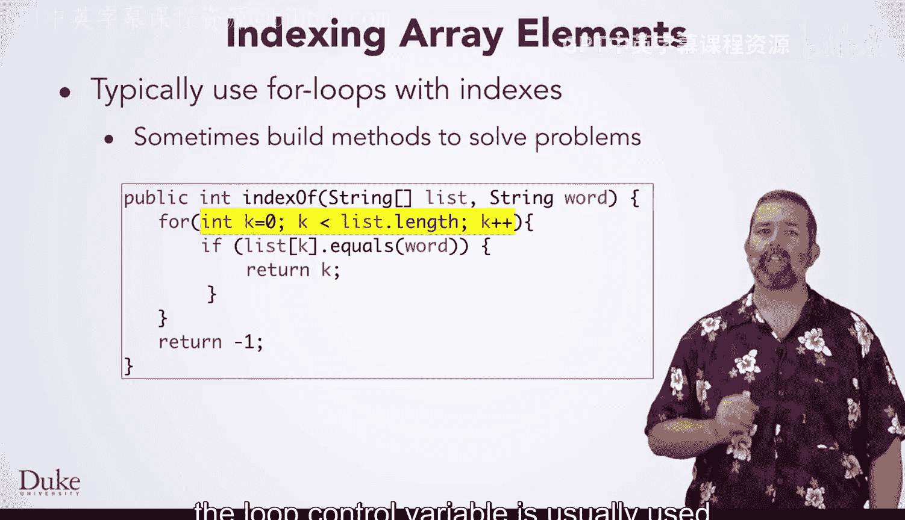

总的来说，这种使用索引遍历所有元素的模式在使用数组解决问题时非常常见。

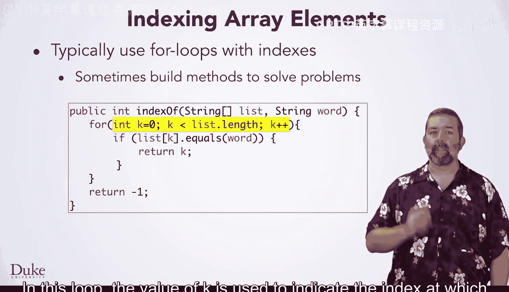

## 数组的应用实例：破解凯撒密码 🔐

我们使用数组解决了几个问题，包括破解密码。

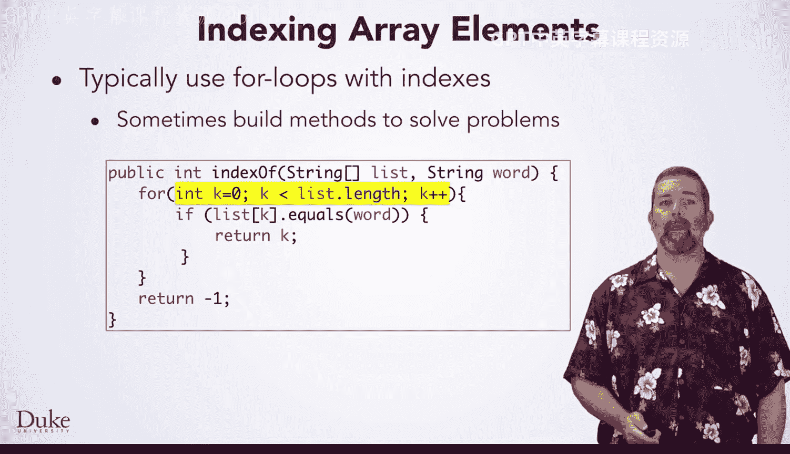

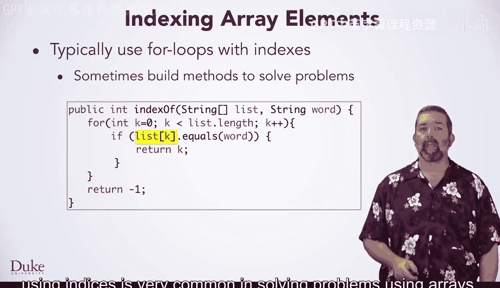

你看到了数组是如何被用于破解凯撒密码这种加密消息的方法的。


通过利用索引和数组从消息中获取频率，使得破解凯撒密码成为可能。


索引在加密、解密以及破解密码的过程中都被使用。

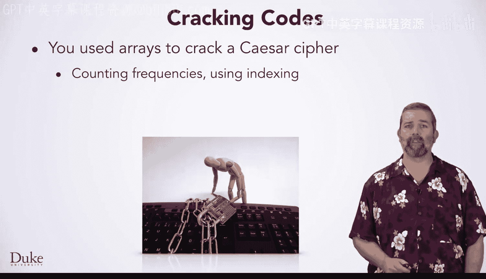

需要知道的是，如今互联网上用于保护你交易的加密方式远比凯撒密码安全得多。科学家和数学家们认为，当今的互联网加密无法通过暴力破解甚至智能算法被攻破。

尽管如此，在任何情况下，你都应该在网上谨慎处理你的个人信息。

## 总结 📚

本节课中我们一起学习了Java数组的核心知识。我们了解了数组是一种索引集合，可以存储多种类型的数据，并通过索引高效访问。我们掌握了数组的声明、初始化和遍历方法，特别是如何使用循环处理数组元素。最后，我们探讨了数组在解决实际问题（如密码分析）中的应用，并认识到现代加密技术的安全性。数组是编程中不可或缺的基础工具，希望你能够熟练运用它。