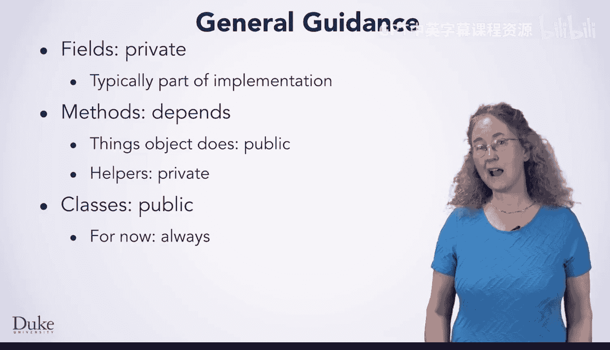
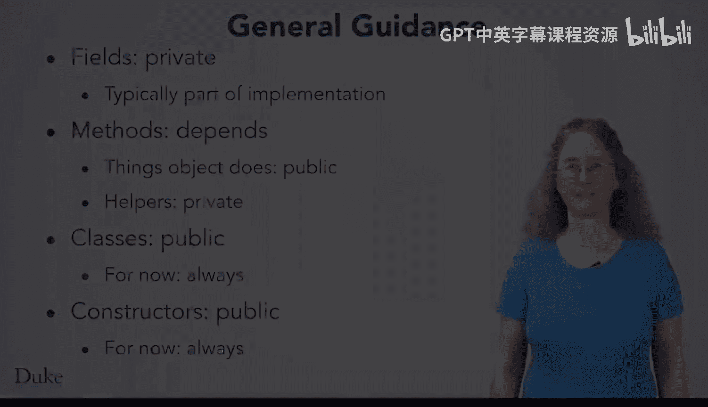

Java编程和软件工程基础：2-5：可见性修饰符详解 🔒

在本节课中，我们将要学习Java中的可见性修饰符，特别是`public`和`private`。我们将探讨它们的含义、用途，以及如何在设计类时应用它们来创建清晰、健壮的代码。

---

在面向对象版本的凯撒密码程序中，你已经见到了两种可见性修饰符。一种是`public`，另一种是`private`。实际上，Java中还有其他可见性修饰符，但解释它们需要更高级的概念，因此本节课我们只聚焦于这两种。

---

### 理解 `public` 修饰符

当你将一个类、字段、方法或构造函数声明为`public`时，意味着程序中的任何代码都可以访问它。任何类中的代码都可以调用一个`public`方法、读取或更新一个`public`字段、使用`public`构造函数创建对象，以及使用一个`public`类。

**代码示例：**
```java
public class MyClass {
    public int publicField;
    public void publicMethod() {
        // 任何代码都可以调用此方法
    }
}
```

---

### 理解 `private` 修饰符

与`public`相反，当你声明某个元素为`private`时，你是在告诉Java，只有这个特定类内部的代码才能看到它。例如，在凯撒密码类中，某些字段被声明为`private`，因此只有该类内部的代码可以读写它们，类外部的代码则完全不允许访问。

**代码示例：**
```java
public class CaesarCipher {
    private int shiftKey;
    private String alphabet;

    // 只有这个类内部的代码可以访问 shiftKey 和 alphabet
}
```

如果你尝试从类外部访问`private`字段或方法，Java编译器会报错，明确指出不允许这样做。这种错误通常意味着你错误地使用了一个类（尤其是来自现有库的类），或者你设计的类中，某个本应公开的元素被错误地设为了私有。

---

### 为何使用 `private`？

你可能会想，把所有东西都设为`public`不是更方便吗？这样就能在任何地方访问任何内容了。这涉及到**抽象**的概念。抽象的原则是将接口与实现分离。限制实现细节的可见性有助于强制执行你设计的抽象。

你可以将类中供其他类调用的所有方法（即接口）设为`public`，而将实现细节设为`private`。这样，其他类就不应直接了解实现细节，通过声明为`private`，你可以在代码中强制执行这一规则。

以凯撒密码为例，你希望其他类能够调用`encrypt`方法，但它们不应该知道具体的实现细节，比如你使用了一个名为`shiftAlphabet`的变量。将这些细节保持为私有，意味着你可以修改它们，并确保没有其他代码依赖于这些私有的实现细节。

---

### 如何选择 `public` 或 `private`？

当你开始设计自己的类时，以下是一些通用的指导原则，帮助你选择使用`public`还是`private`。

**以下是关于字段、方法和类的一些指导原则：**



*   **字段**：字段通常是对象实现的一部分，因此**通常应设为`private`**。
*   **方法**：这取决于方法的用途。
    *   如果方法是类接口的一部分（即你希望类为其他代码提供的行为），则应将其声明为`public`。
    *   另一方面，有些方法是辅助性的。你编写它们是为了抽象出特定的复杂任务，并不打算让其他类调用。它们只是帮助完成公共接口。这些方法应设为`private`，以便只有你类中的代码可以调用它们。
*   **类**：**目前，你应始终将类声明为`public`**。随着Java技能的提高，你会学到一些更高级的主题，那时可能会出现需要使用非公共类的情况，但现在请一律使用`public`。
*   **构造函数**：**目前，你也应始终将构造函数设为`public`**。通常，构造函数是类公共接口的一部分，它们指定了如何创建实例。虽然也存在适合非公共构造函数的情况，但这同样只在你学习了一些更高级的主题后才会遇到。

---

### 总结



本节课中，我们一起学习了`public`和`private`这两个可见性修饰符的含义和用途。我们了解到，使用`private`有助于封装实现细节，强制执行抽象，从而创建出更清晰、更易于维护的代码。记住，字段通常设为`private`，公共接口的方法设为`public`，辅助方法设为`private`，而目前类和构造函数通常都应设为`public`。