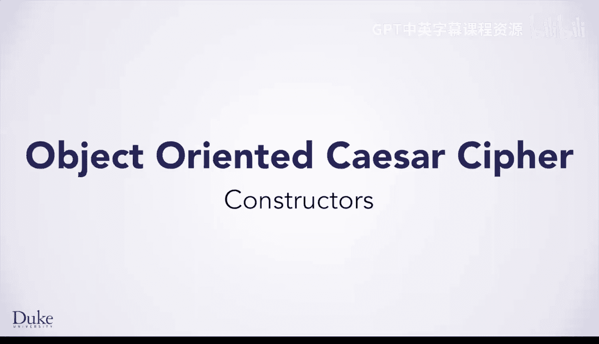
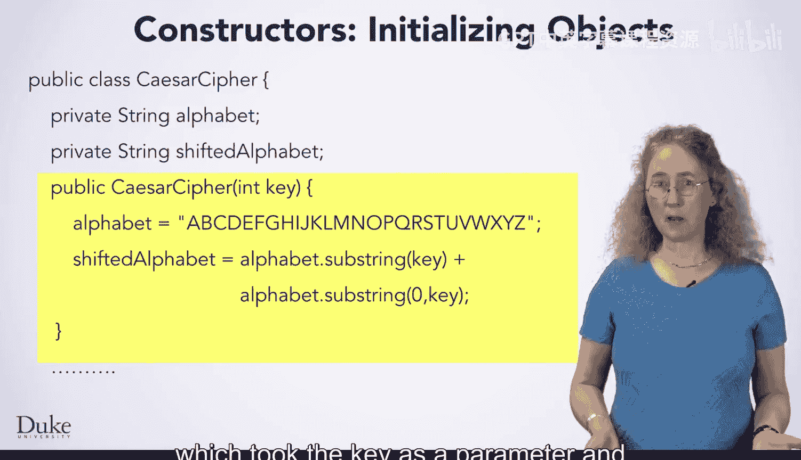
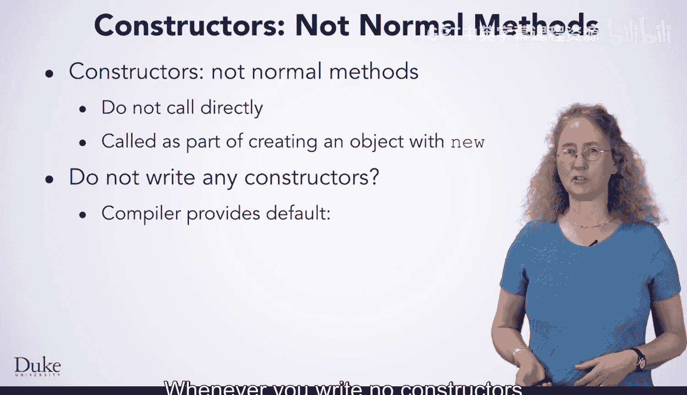

# Java编程和软件工程基础：2-5：构造函数 🏗️



在本节课中，我们将要学习面向对象编程中的一个核心概念：构造函数。我们将了解构造函数的定义规则、它的作用，以及它是如何被自动调用来初始化新创建的对象的。

---



## 构造函数简介

上一节我们介绍了面向对象编程的基本概念，本节中我们来看看如何初始化一个对象。构造函数是一种特殊的方法，用于在创建对象时初始化该对象。

构造函数在我们之前编写的面向对象的凯撒密码程序中已经出现过。它接收一个密钥作为参数，并用它来初始化对象的字段。

---

## 构造函数的声明规则

当你想要编写一个构造函数时，需要遵循特定的声明规则。

以下是构造函数的声明规则：

1.  **名称必须与类名完全相同**。例如，在名为 `CaesarCipher` 的类中，构造函数的名称必须是 `CaesarCipher`。
2.  **构造函数没有返回类型**，甚至没有 `void`。在普通方法中，你会在 `public` 和方法名之间写上返回类型，但对于构造函数，你不需要写任何东西。
3.  和普通方法一样，构造函数有自己的参数列表和括号。
4.  你可以根据需要定义任意数量和类型的构造函数参数。构造函数可以没有参数，也可以有多个参数。在我们的例子中，有一个类型为 `int` 的参数 `key`。
5.  构造函数有一个方法体，就像普通方法一样。你可以在构造函数体中编写任何代码，以指定如何初始化对象。

---

## 构造函数的调用方式

构造函数与普通方法不太一样。你不能直接调用它们。相反，它们会在创建对象时自动作为对象创建过程的一部分被调用。

当你创建一个新对象时，构造函数会在新对象创建后立即被调用来初始化该对象。这是构造函数的一大优点。它允许你指定对象应如何初始化，并且你可以确保这段代码会在每个对象被创建时立即运行。你无需担心因忘记调用某些初始化代码而导致的程序错误。



---

## 默认构造函数

如果你没有为你的类编写任何构造函数会发生什么？到目前为止，你编写的类都没有显式定义构造函数。

在这种情况下，Java编译器会为你提供一个默认构造函数。

编译器提供的默认构造函数看起来像这样：
```java
public ClassName() {}
```
它是 `public` 的，这意味着任何代码都可以使用它来初始化对象。它不接受任何参数，因此在创建新对象时不需要传递参数。它不执行任何操作，不会对对象进行特殊的初始化。

---

## 构造函数的工作流程

现在你已经了解了构造函数的规则，让我们看看构造函数是如何工作的。

假设你在程序的其他地方有这样一行代码：
```java
CaesarCipher cc = new CaesarCipher(22);
```
这行代码指示Java创建一个 `CaesarCipher` 类的新实例，并通过将 `22` 传递给构造函数来初始化它。

让我们看看执行这行代码时会发生什么：

1.  Java首先创建一个新的变量 `cc`。
2.  然后，它创建 `CaesarCipher` 类的一个新实例。这意味着你有了一个新对象，它拥有该类字段（`alphabet` 和 `shiftedAlphabet`）的独立副本。
3.  接着，它调用构造函数，并将 `22` 作为 `key` 参数传入。
4.  进入构造函数内部后，Java开始执行你编写的用于初始化对象的代码。这段代码会初始化 `alphabet`，然后初始化 `shiftedAlphabet`。
5.  构造函数执行完毕后，Java返回到创建对象的那行代码。`key` 只是构造函数的一个参数，因此它只在该次调用期间存在。然而，字段是对象的一部分，因此它们会继续存在于对象中。
6.  最后，Java通过将新创建的对象赋值给变量 `cc` 来完成赋值语句。

---

## 总结

本节课中我们一起学习了构造函数。我们了解了构造函数的声明规则，包括其名称必须与类名相同、没有返回类型等。我们探讨了构造函数在对象创建时被自动调用的特性，这确保了对象的正确初始化。我们还学习了当没有显式定义构造函数时，Java编译器会提供一个默认构造函数。最后，我们通过一个例子详细分析了构造函数从调用到执行完毕的完整工作流程。掌握构造函数是理解Java对象生命周期的重要一步。