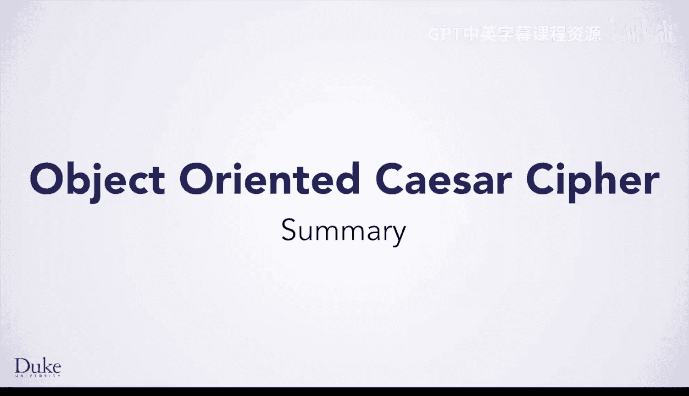
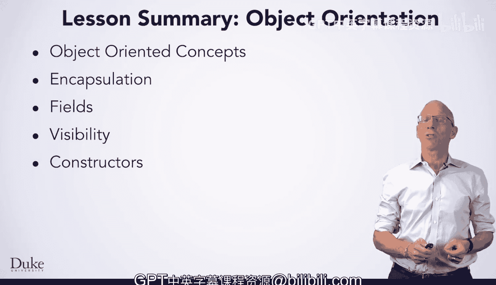

面向对象编程入门：2.5：核心概念总结



在本节课中，我们将学习面向对象编程的一些基本概念。

上一节我们介绍了面向对象编程的初步应用，本节中我们来总结其核心概念。

## 🧠 封装

你学习了**封装**的概念。其核心思想是将代码和数据组合在一个对象中。例如，对象的方法可以操作同一对象内部的数据。

## 📦 字段（实例变量）

你学习了**字段**，也称为**实例变量**。它们允许你声明应存在于对象内部的数据。

## 🔒 可见性修饰符

你学习了**可见性修饰符**：`private` 和 `public`。它们允许你公开或限制对字段和方法的访问，从而可以强制执行抽象并提供你想要的接口。

以下是主要修饰符的作用：
*   `public`：允许从任何其他类访问。
*   `private`：仅允许在定义它的类内部访问。

## 🏗️ 构造函数

最后，你学习了**构造函数**。它允许你编写代码来指定如何初始化所创建的对象。构造函数在创建对象时自动调用。

以下是一个简单的构造函数示例：
```java
public class MyClass {
    private int value;

    // 构造函数
    public MyClass(int initialValue) {
        value = initialValue; // 初始化字段
    }
}
```

## 🎯 总结



本节课中我们一起学习了面向对象编程的四个核心概念：**封装**、**字段（实例变量）**、**可见性修饰符**（`public`/`private`）以及**构造函数**。掌握这些概念是进行面向对象编程（OOP）的基础，它赋予你构建更模块化、更安全代码的能力。