# Java编程和软件工程基础：2-5：ArrayList


在本节课中，我们将要学习一个名为 `ArrayList` 的新类。它是Java中一个非常重要的部分，它结合了存储资源类（StorageResource）和数组（Array）的核心特性。事实上，`ArrayList` 是 `StorageResource` 类实现的基础。

## 问题引入

上一节我们介绍了如何使用数组和存储资源类进行计数。本节中我们来看看一个更复杂的问题：如何统计一个文件或网页中有多少个**不同**的单词？这个问题同样出现在统计一天内访问网站的不同IP地址数量中，这是在线广告计费的关键部分。


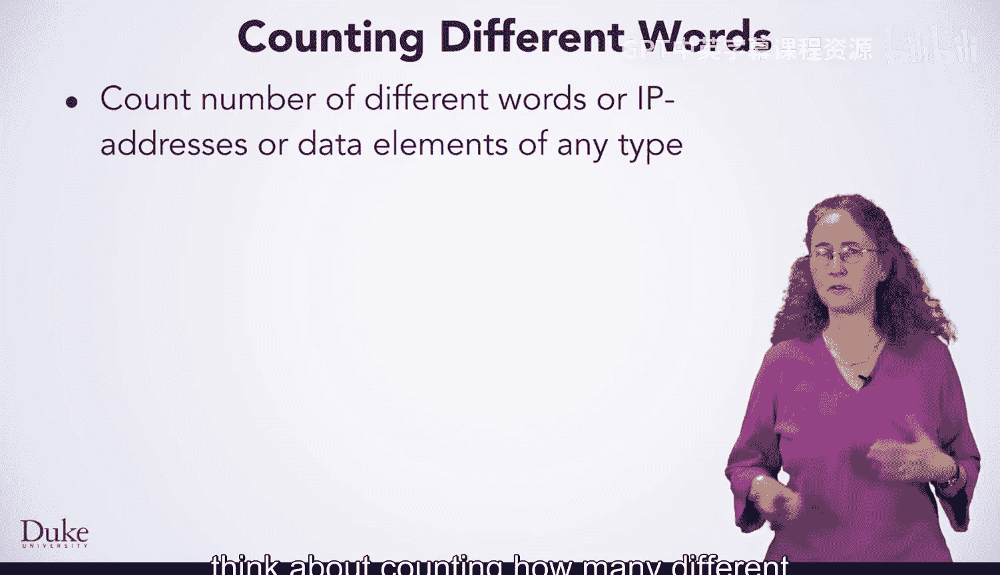

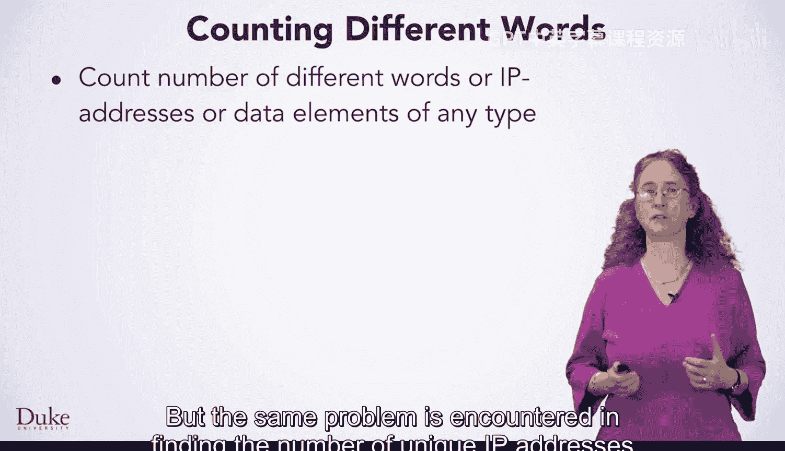

你已经见过如何统计数字化DNA中每种核苷酸的数量，也使用过数组来统计凯撒密码中每个字母字符的出现次数。这些都是统计文件中每个单词出现频率的第一步。解决该问题的一个重要部分是找出有多少个不同的单词，这样像“the”这样的单词只会被计为一个，而不是它在文档中出现的573次。

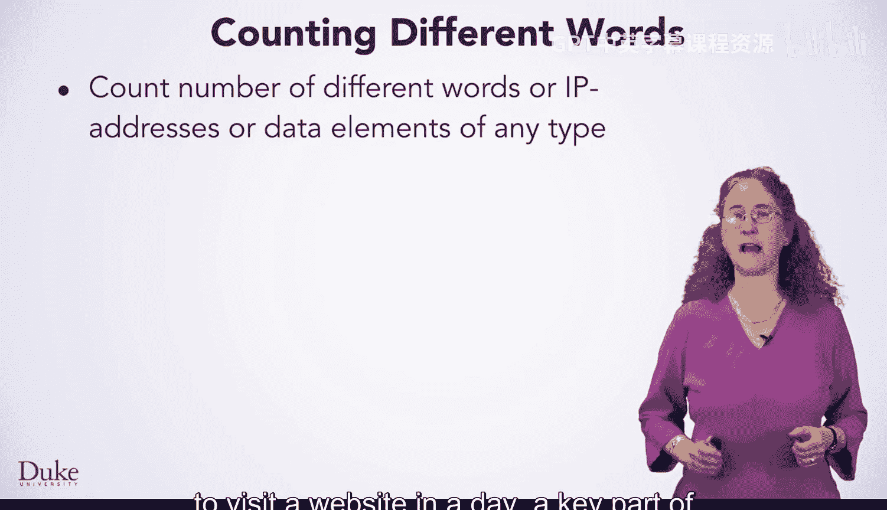

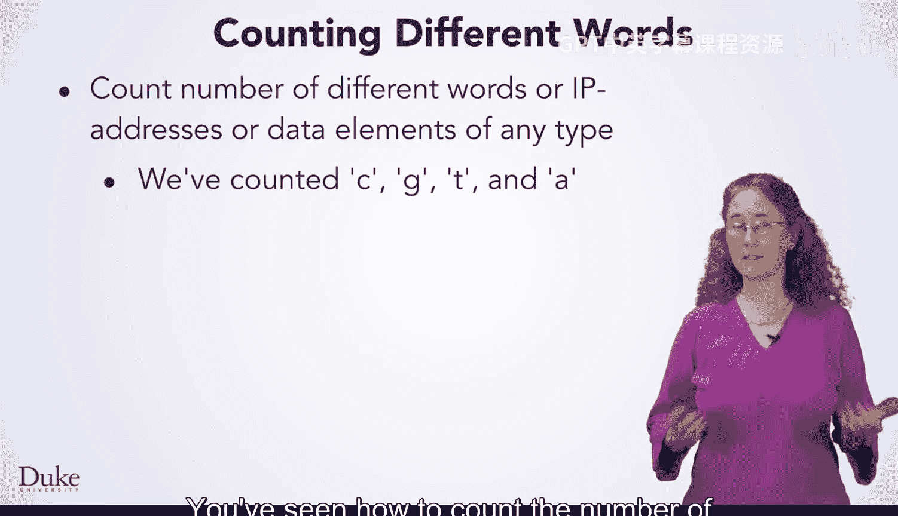

如下图所示，虽然显示了数百个数字，但只有三个不同的数字：4、6和7。我们将首先探讨如何使用存储资源类来解决这个问题。

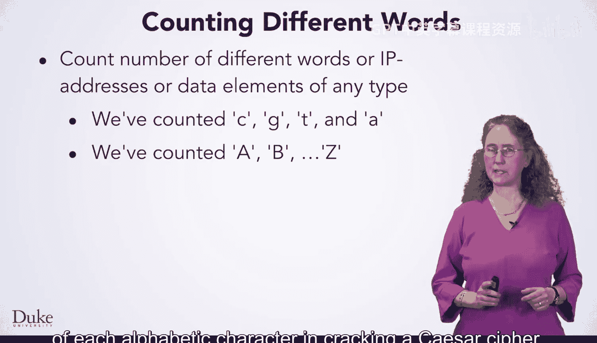

## 使用StorageResource统计单词总数

`StorageResource` 类使得统计文件或网页中的单词总数变得容易。以下是实现步骤：

以下是统计单词总数的基本代码框架：

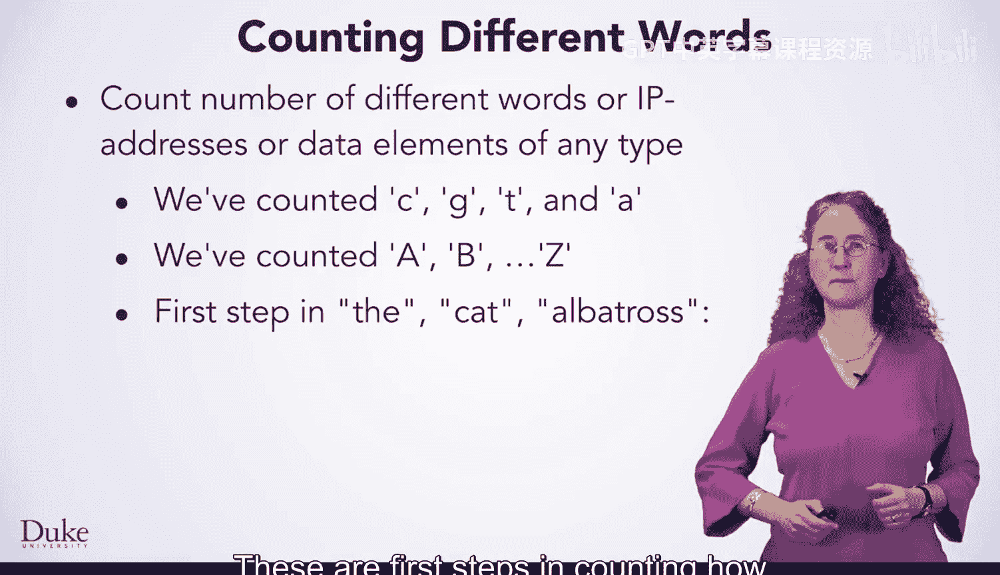

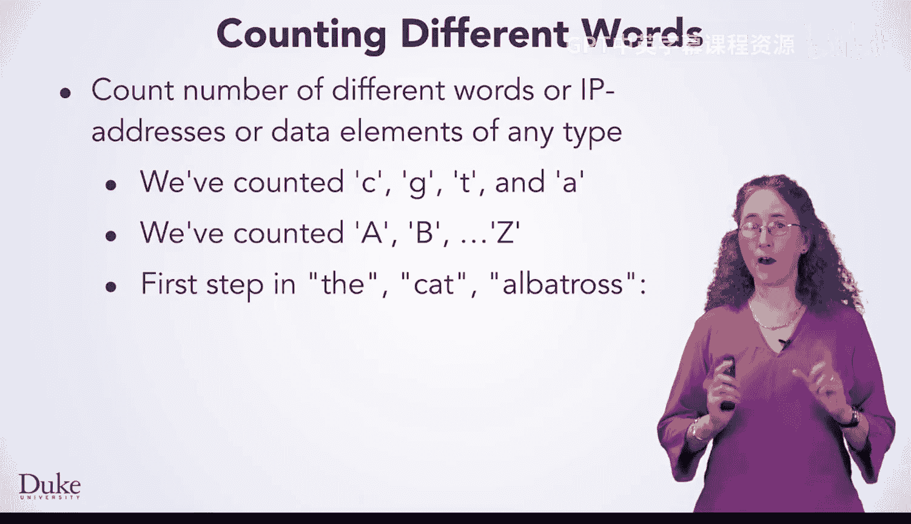

```java
// 初始化StorageResource对象
StorageResource myWords = new StorageResource();

// 遍历文件或URL资源
for (String word : resource.words()) {
    // 将每个单词添加到StorageResource中
    myWords.add(word);
}

// 获取单词总数
int totalWords = myWords.size();
```

如高亮代码所示，使用 `FileResource` 或 `URLResource` 进行迭代的代码几乎完全相同。调用 `.add()` 方法可以将每个单词添加到 `StorageResource` 的实例变量 `myWords` 中。完成后，`.size()` 方法将提供读取的单词总数。


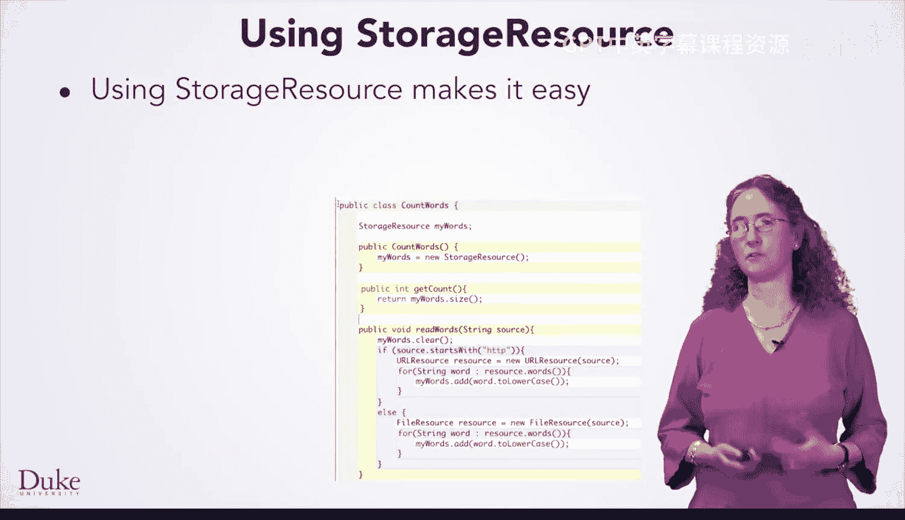

## 统计不同单词的数量

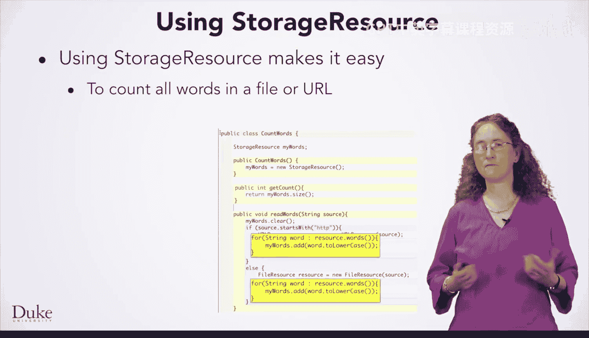

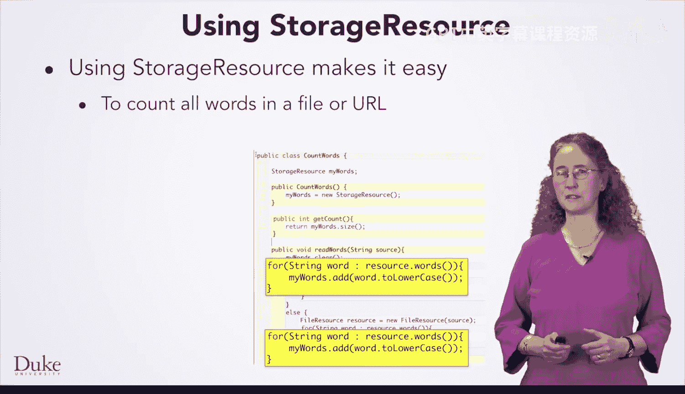

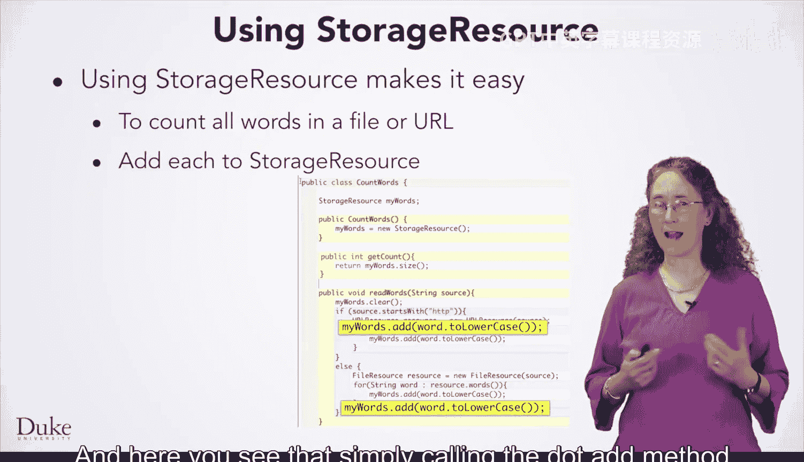

正如你将看到的，修改代码来统计不同（唯一）单词的数量，而不仅仅是单词总数，也很简单。

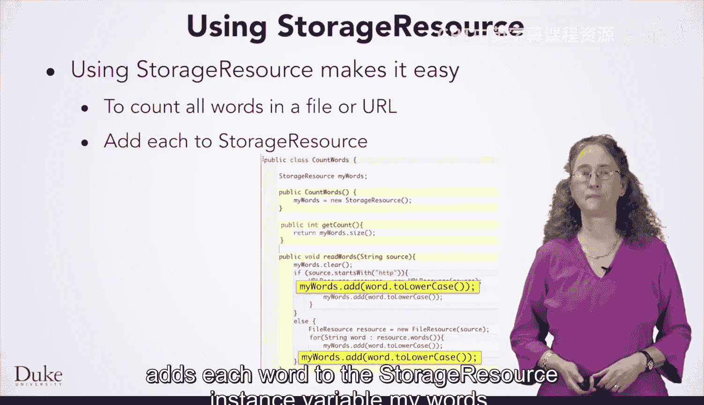

字段 `myWords` 的类型是 `StorageResource`，可以存储所有单词。`.add()` 方法会将读取的每个字符串添加到 `myWords` 中。但我们可以通过一个简单的守卫条件来确保只在单词第一次出现（即尚未存储在 `myWords` 中）时才调用 `.add()` 方法。

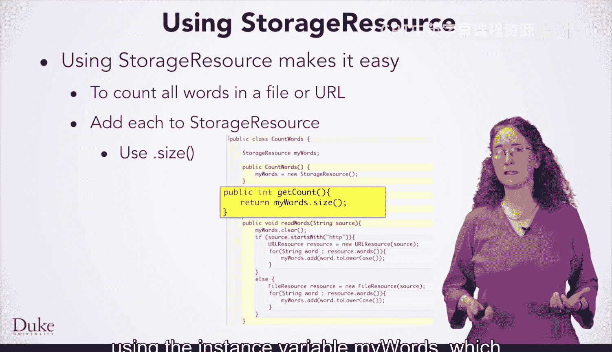

以下是修改后的代码逻辑：

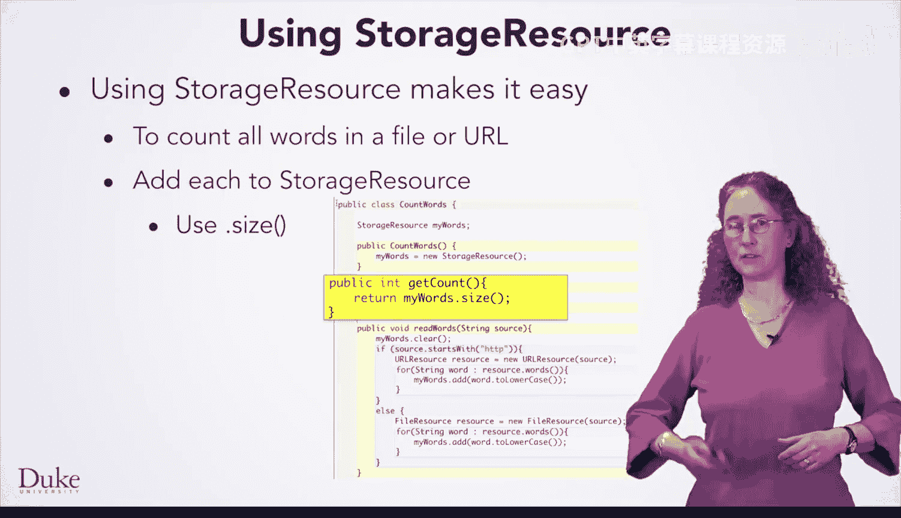

```java
if (!myWords.contains(word)) {
    myWords.add(word);
}
```


`.contains()` 方法返回一个布尔值。此处的代码利用该值确保仅当 `StorageResource` 对象 `myWords` 中不包含某个单词时，才调用 `.add()` 方法。

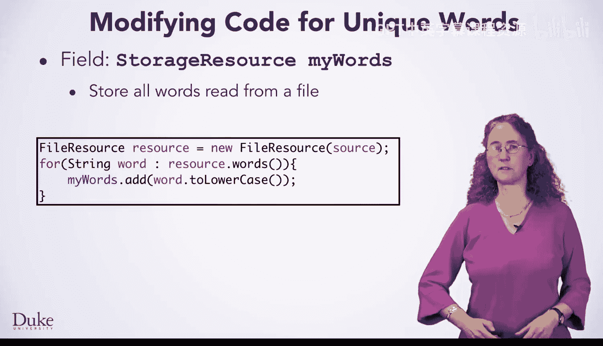

## StorageResource的局限性

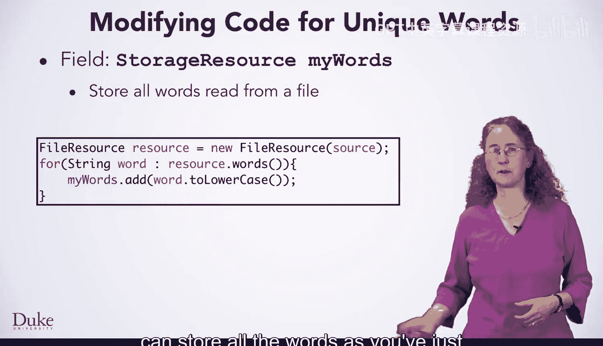

然而，`StorageResource` 类并不适合随机选择元素，而这正是我们编写故事生成代码（GladLibs）所需的关键部分。

为了随机选择一个元素，我们必须使用 `StorageResource` 提供的 `Iterable` 接口。这意味着我们需要使用循环来访问 `StorageResource` 对象 `myWords` 中的每个元素。在下面的循环中，我们实际上希望迭代次数等于变量 `choice` 中存储的值，因为我们想从 `StorageResource` 中随机选择一个元素。

以下是尝试随机选择的代码示例：

```java
int choice = random.nextInt(myWords.size());
int counter = choice;
for (String s : myWords) {
    if (counter == 0) {
        return s;
    }
    counter--;
}
// 编译器会提示此处需要返回语句
```

当 `counter` 的值达到0时，此处的代码会返回一个随机字符串。如代码所示，`choice` 必须能减到0，因为它初始值小于 `myWords` 的大小，并且每次循环递减1。然而，Java编译器分析带有if语句的循环时，并不知道if语句在某个时刻必然为真。编译器会指出循环后缺少返回语句是一个错误，即使该部分代码永远不会被执行。

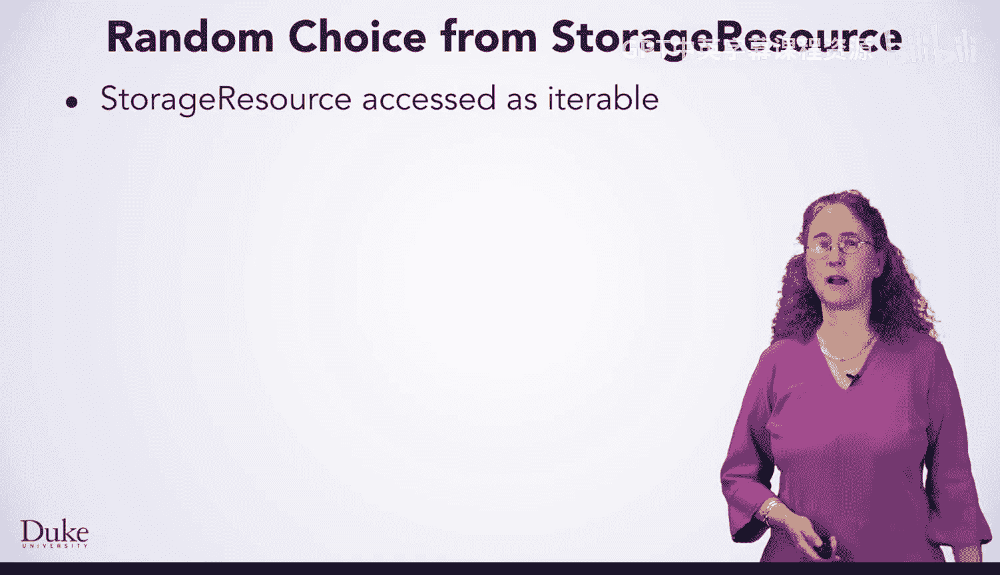

## 引入ArrayList

使用字符串数组来获取随机元素会更简单，速度也快得多，如下面的代码所示：

```java
String[] wordsArray = ...; // 假设数组已填充数据
int index = random.nextInt(wordsArray.length);
String randomWord = wordsArray[index];
```

我们只需生成一个随机整数，并将其用作数组的索引。但不幸的是，在声明数组时必须指定其容量。数组不能像 `StorageResource` 对象那样动态增长。

`ArrayList` 类提供了一个解决方案，它结合了 `StorageResource` 和数组的最佳特性。`ArrayList` 类来自 `java.util` 包，这个包也包含我们使用过的 `Random` 类。

`ArrayList` 在调用其 `.add()` 方法时，会根据需要自动扩展容量，就像 `StorageResource` 对象一样。同时，`ArrayList` 也支持通过索引访问，因此可以像数组一样，无需遍历所有元素就能直接访问第0个或第10个元素。

`StorageResource` 类在内部就是使用 `ArrayList` 实现的。事实上，它只是比 `ArrayList` 稍微容易使用一点。但随着你经验越来越丰富，现在可以直接使用 `ArrayList`，它可以存储任何类型的对象，而不仅仅是字符串。

## ArrayList基本语法


`ArrayList` 类的基本语法如下所示，在下一课中你将看到它在编码示例中的使用。


以下是声明和使用 `ArrayList` 的基本步骤：

1.  **声明**：声明 `ArrayList` 变量时，必须使用尖括号指定存储在列表中的对象类型。
    ```java
    ArrayList<String> words;
    ```


2.  **创建与初始化**：像任何对象一样，创建 `ArrayList` 需要调用 `new` 并使用类名作为构造函数。
    ```java
    words = new ArrayList<String>();
    ```

3.  **添加元素**：可以调用 `.add()` 方法向 `ArrayList` 对象添加字符串。
    ```java
    words.add("hello");
    ```

4.  **访问元素**：可以调用 `.get()` 方法通过索引访问特定元素，类似于数组中的方括号表示法。
    ```java
    String firstWord = words.get(0);
    ```

5.  **修改元素**：`.set()` 方法可以更改或设置 `ArrayList` 对象中特定索引处的元素。
    ```java
    words.set(0, "goodbye");
    ```

我们将通过一个使用 `ArrayList` 的编码示例看到更多例子。`ArrayList` 类比 `StorageResource` 更强大，可以对任何类型的对象进行排序。它将成为使用Java解决许多问题的重要工具。

## 总结

本节课中我们一起学习了 `ArrayList`。我们首先回顾了使用 `StorageResource` 统计单词总数和不同单词数量的方法，并指出了它在随机访问元素时的局限性。接着，我们引入了 `ArrayList` 类，它结合了数组的快速索引访问和 `StorageResource` 的动态增长能力。我们介绍了 `ArrayList` 的基本语法，包括声明、初始化、添加、访问和修改元素的方法。`ArrayList` 是一个功能强大的工具，将在你未来的Java编程中发挥重要作用。