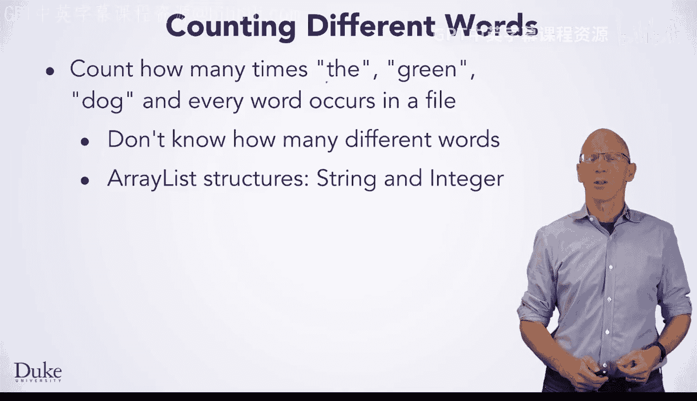
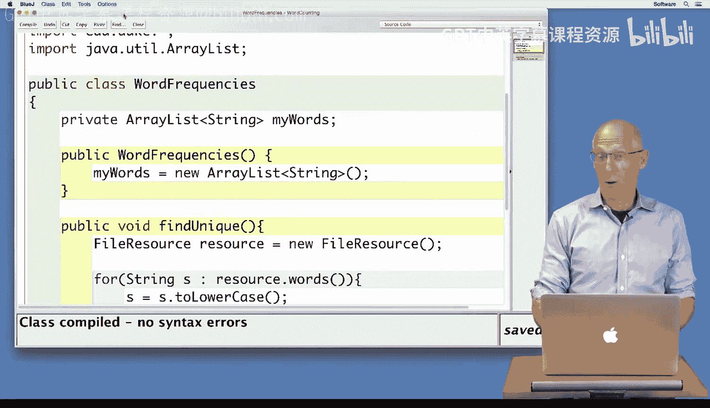
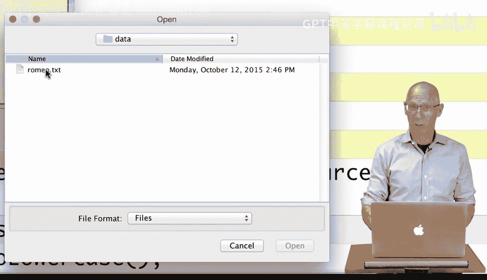
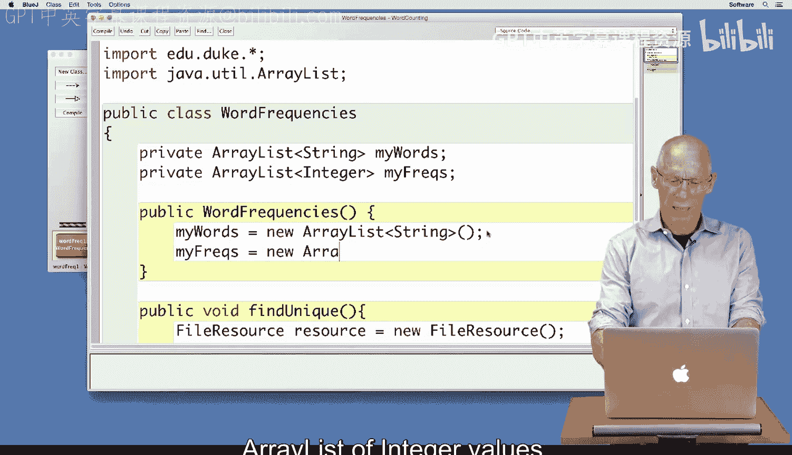
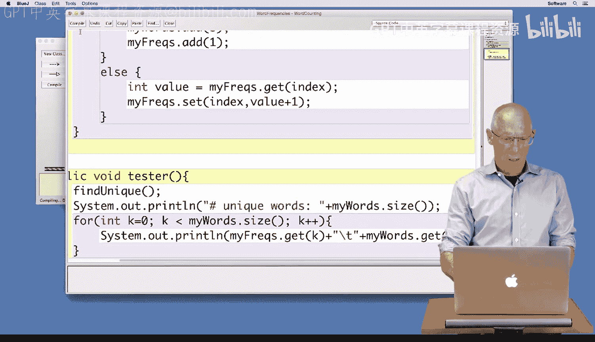
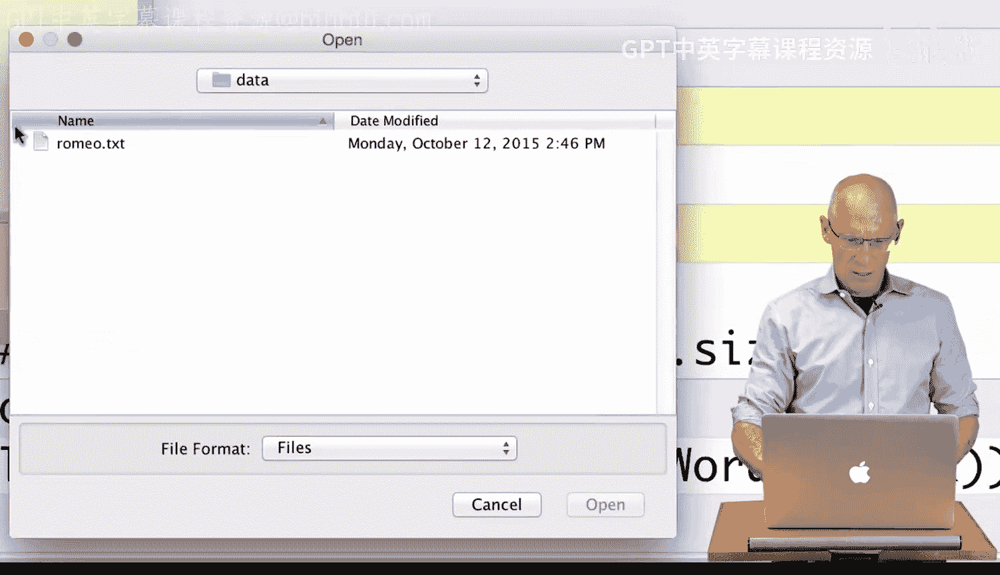
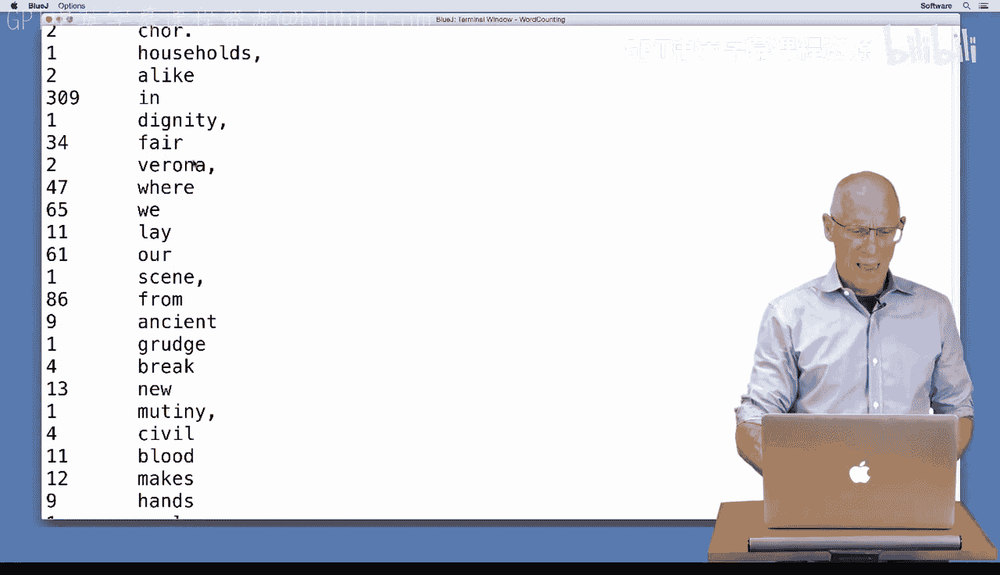
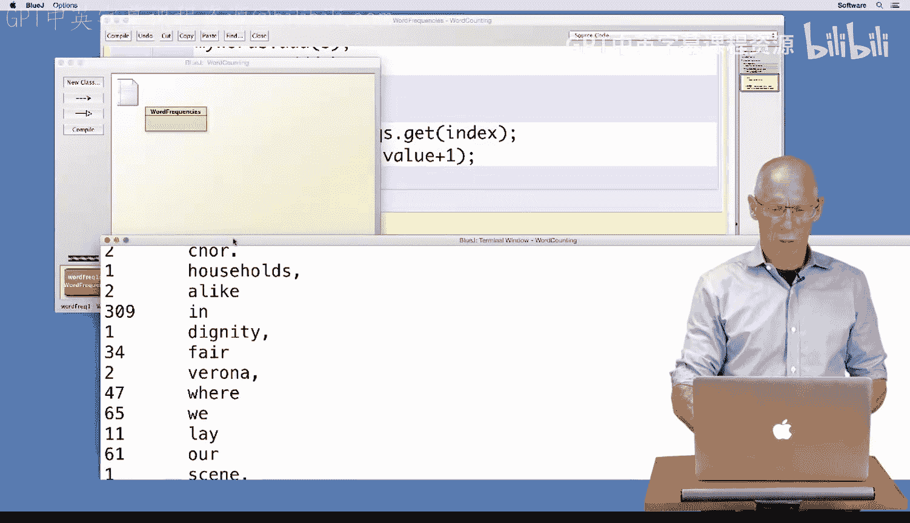

# Java编程和软件工程基础：2-5：使用ArrayList统计唯一单词 📊


在本节课中，我们将学习如何使用Java的`ArrayList`数据结构来统计一个文本文件中每个单词出现的次数。我们将通过一个具体的例子来理解如何动态地存储和更新数据，特别是当数据量未知时。

---



## 概述

我们将编写一个程序，用于读取一个文件（例如莎士比亚的《罗密欧与朱丽叶》全文），并统计其中每个单词出现的频率。由于我们无法预先知道文件中有多少个不同的单词，因此不能使用固定大小的数组。我们将使用两个`ArrayList`结构来解决这个问题：一个用于存储唯一的单词（字符串），另一个用于存储每个单词对应的出现次数（整数）。

---

## 核心概念与数据结构



我们将使用两个并行的`ArrayList`来建立单词与其频率之间的映射关系。



*   `myWords`：一个`ArrayList<String>`，用于存储所有遇到过的唯一单词。
*   `myFreqs`：一个`ArrayList<Integer>`，用于存储`myWords`中对应位置单词的出现次数。

**核心关系公式**：
对于任意索引 `i`，`myFreqs.get(i)` 的值等于单词 `myWords.get(i)` 在文件中出现的次数。


---

## 代码实现步骤解析

上一节我们介绍了使用两个并行`ArrayList`的核心思路，本节中我们来看看具体的代码实现步骤。

以下是实现单词频率统计的主要步骤：

1.  **初始化**：在类的构造函数中，初始化`myWords`和`myFreqs`两个`ArrayList`。
2.  **读取与处理单词**：遍历文件中的每一个单词，将其转换为小写以统一计数。
3.  **检查单词是否存在**：使用`myWords.indexOf(currentWord)`方法检查当前单词是否已经存在于列表中。该方法返回单词的索引位置，如果不存在则返回-1。
4.  **更新频率列表**：
    *   如果单词不存在（`index == -1`），则将其添加到`myWords`的末尾，并在`myFreqs`的对应位置添加初始值1。
    *   如果单词已存在（`index >= 0`），则在`myFreqs`中获取该索引位置的当前值，将其加1后，再设置回原位置。
5.  **输出结果**：循环遍历`myWords`，打印每个单词及其在`myFreqs`中对应的频率。

---



## 关键代码段说明

让我们仔细看看更新频率列表的核心代码逻辑。

```java
// 假设 word 是当前处理的单词（已转换为小写）
int index = myWords.indexOf(word);

if (index == -1) {
    // 单词第一次出现
    myWords.add(word);
    myFreqs.add(1); // 初始频率为1
} else {
    // 单词已存在，更新频率
    int value = myFreqs.get(index); // 获取当前频率
    myFreqs.set(index, value + 1); // 将频率加1后存回
}
```

**注意**：`ArrayList<Integer>`存储的是`Integer`对象，而不是基本类型`int`。因此，我们通过`get(index)`获取值，通过`set(index, newValue)`更新值。这与操作`int[]`数组直接使用`array[index]++`有所不同。

---

## 运行示例与结果

运行程序并处理《罗密欧与朱丽叶》文本文件后，程序会输出所有唯一单词及其出现次数。



例如，输出片段可能如下：

```
677    the
48     romeo
23     juliet
86     from
...
```



这表明单词“the”出现了677次，“romeo”出现了48次，以此类推。注意，此示例未处理标点符号，因此“juliet”和“juliet.”会被视为不同的单词。

---





## 总结

本节课中我们一起学习了如何利用`ArrayList`的动态特性来解决一个实际问题——统计文本中的单词频率。我们掌握了以下关键点：

1.  使用两个并行的`ArrayList`（一个存`String`，一个存`Integer`）来建立映射关系。
2.  使用`indexOf()`方法来判断元素是否已存在于列表中。
3.  使用`get()`和`set()`方法来操作`ArrayList<Integer>`中的整数值。
4.  理解了当数据规模未知时，`ArrayList`相比数组的优势。

通过这个例子，你应该对`ArrayList`的基本操作（如`add`, `get`, `set`, `indexOf`, `size`）有了更直观的认识，并能够将其应用于需要动态数据管理的场景中。