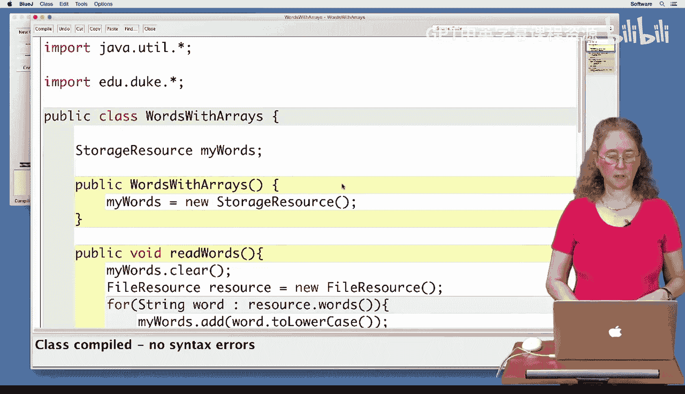
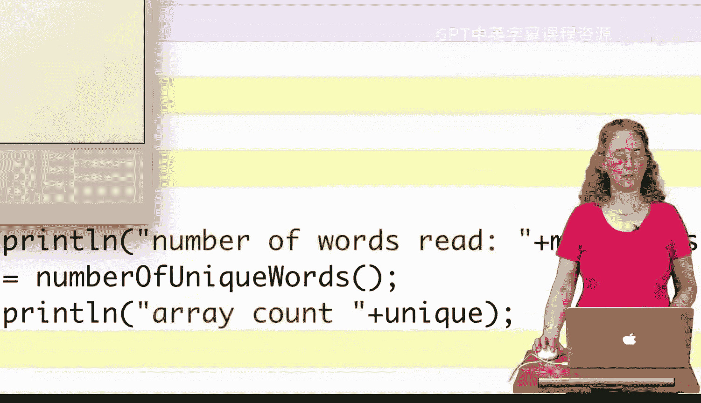
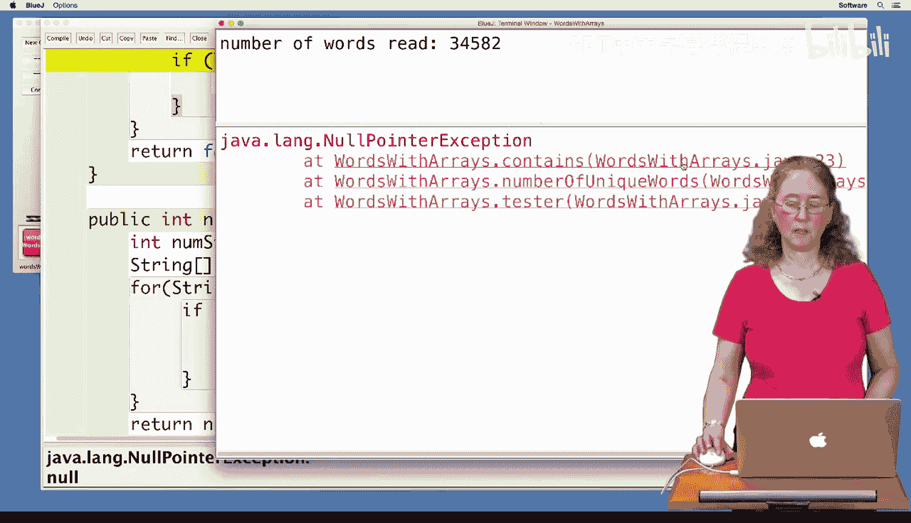
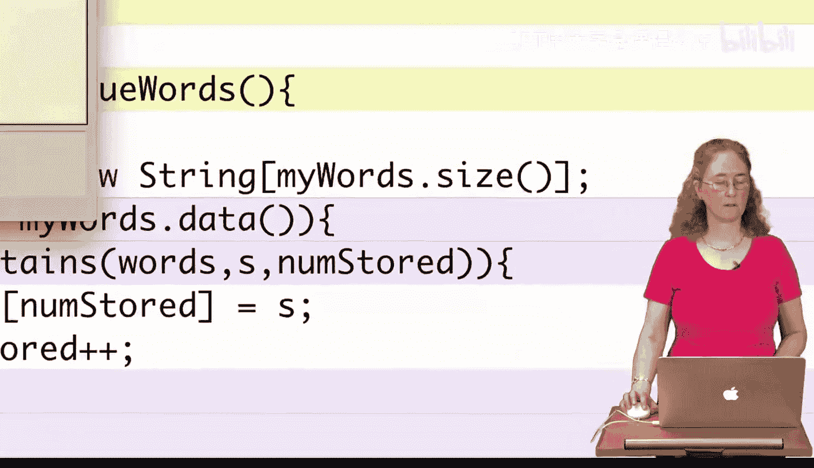
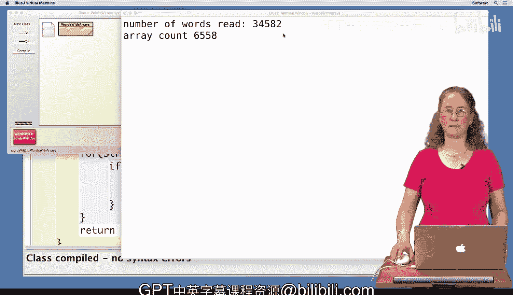

# 093：ArrayList的优势与问题

在本节课中，我们将通过一个具体的编程示例，对比数组和ArrayList的使用。我们将探讨数组在某些场景下的局限性，并理解为何ArrayList在处理动态数据时更具优势。

你已经见识过ArrayList的强大和实用性。数组同样也极其有用。接下来，我们将通过一段代码演示，来展示数组在哪些情况下表现不佳。

## 数组的语法优势 😊

从语法角度看，创建数组比创建ArrayList更简单。例如，需要输入的字符更少。访问数组中的值也更容易，因为 `a[k]` 既可以用于读取数组位置的值，也可以用于向该位置写入值，其中 `k` 是索引。相比之下，对于ArrayList，你需要分别使用 `.get()` 和 `.set()` 方法进行读取和写入。

对于 `int` 类型的值，数组在某些方面比ArrayList更有优势。尽管 `int` 和 `Integer` 之间的转换大多是自动进行的，但如果你不完全理解 `int` 和 `Integer` 的转换机制，偶尔这些转换可能会导致难以发现的错误。

给定索引，递增数组中的值很容易。然而，在ArrayList中，你必须调用 `.get()` 和 `.set()` 方法，因为简单地递增 `.get()` 返回结果的代码是无效的。

## 数组的致命缺陷：无法动态增长 😔

然而，数组无法动态增长，这是一个非常严重的问题。让我们编写一些代码来演示这一点。

现在，我们想要统计一个文件中不同单词的数量，但我们打算尝试使用数组来实现。这就是我们要在这里做的事情。

我已经开始编写这个程序，类名为 `WordsWithArrays`。我们遇到的第一个问题是：我们想从文件中读取所有单词，但我们不知道文件中有多少个单词，因此我们不知道应该将数组设置为多大。所以，我们无法真正为此使用数组。因此，我们将使用一个存储资源来完成程序的这一部分。

我已经在这里开始了，我们有一个名为 `myWords` 的存储资源。我们在构造函数中创建了这个存储资源。

然后，我们有一个 `readWords` 方法，它将从文件中读取所有单词并将其放入我们的存储资源 `myWords` 中。请注意，它还会将所有单词转换为小写。

我们有一个名为 `contains` 的方法，我们将传入一个 `String` 类型的数组和一个单词，我们想知道这个单词是否在我们的数组中。`contains` 方法将遍历数组，检查我们传入的单词是否与任何元素匹配。如果匹配，则返回 `true`。如果遍历完整个数组都没有找到，则返回 `false`。

现在，我们有一个 `numberOfUniqueWords` 方法。我们首先要做的是创建一个数组来存储所有唯一的单词。

你可以看到我在这里开始了，我声明了 `words` 作为一个 `String` 类型的数组。我必须创建一个新数组，所以我这样做了。然后我遇到了关于大小的问题，我不知道应该把它设为多大。我不知道会有多少个不同的单词。因此，我唯一能做的就是让它和我的存储资源一样大。所以我将大小设置为 `myWords.size()`。这是唯一安全的做法，因为所有单词都可能是唯一的。

现在，我们将遍历 `myWords`，并检查每一个单词是否已经在 `words` 数组中（`words` 数组只存储唯一的单词）。如果它不在里面，我们就找到了一个新的唯一单词，并将它放入数组中。你可以在这里看到，在这一行我们添加了它。同时，我们还在跟踪我们有多少个不同的单词，因为这个方法将返回不同单词的数量。所以每次我们找到一个新的唯一单词，我们都会给这个计数加一。

接下来，我们有一个测试方法，以便我们可以在这里测试它。所以我们将调用它并测试。让我们编译一下。编译看起来没问题。然后我们运行它。我们必须创建我们的对象，然后调用测试类。

我们必须选择一个文件，所以我选择 `confucius.txt`。哦，天哪。我们遇到了一个错误。

它在这里显示，我们得到了一个空指针异常。另外在这里，这是我们的输出。你可以看到它确实从文件中读取了所有单词。它说读入了34582个单词，但你也看到它得到了一个空指针异常，并且可以看到异常的位置。它说在 `WordsWithArrays` 的测试方法第45行，然后在 `numberOfUniqueWords` 方法中，接着是 `contains` 方法的第23行。最上面那个可能就是错误发生的地方。如果我们点击它，它会跳转到错误被高亮显示的位置。

你可以看到我们的错误在 `contains` 方法中。那么问题是什么？问题是，我们使用这个数组来存放所有唯一的单词，但里面还没有任何单词。然后我们实际上遍历了整个数组，而整个数组都是空的，它被初始化为 `null`。所以我们正在检查一个值为 `null` 的元素是否等于一个单词，这就是它崩溃的原因，因为你不能将 `null` 与一个 `String` 进行比较。

所以，我们需要修复这个问题。我们真正想做的是跟踪我们在数组中放入了多少个唯一的单词，因为我们只想检查那些我们已经实际放入数组的唯一单词。

为了修复这个问题，我们必须做的是：首先，我们必须添加另一个参数，这样我们就知道我们实际放入了多少个单词。所以我将在这里添加一个名为 `number` 的参数。我们必须给它一个类型，所以它是一个 `Integer`。然后当我们遍历时，我们只想遍历我们已经放入的那些单词。我们想用 `number` 替换 `list.length`，而不是查看整个庞大的数组，我们只想查看那些已经在里面的元素。`number` 告诉我们当前有多少个单词在里面。

现在我们还必须修复调用 `contains` 的地方，也就是下面这里。我们必须在这里放一个值。那个值，记住，我们正在跟踪我们放入了多少个唯一的单词，也就是变量 `numStored`。所以我们将在这里传入 `numStored`。

让我们编译一下，看看是否有效。我们没有语法错误。让我们试着运行它。

它成功了。所以你可以看到，我们尝试使用数组遇到了很多麻烦。这个问题真的应该使用ArrayList，因为这里发生的情况是：这个文件有34000个单词，其中只有6558个是唯一的单词。这意味着我们使用的数组大小是34000，但只有6500个唯一单词，所以我们有很多额外的空间。这是ArrayList更适合这个问题的另一个原因。

好了，编程愉快。

## 总结

本节课中，我们一起学习了数组和ArrayList的对比。我们通过一个统计文件中不同单词数量的例子，具体分析了数组的局限性：

1.  **数组无法动态增长**：在创建时必须指定固定大小，这在数据量未知时非常不便。
2.  **管理逻辑复杂**：需要手动跟踪数组中实际存储的元素数量，容易引入错误（如空指针异常）。
3.  **内存可能浪费**：为了确保容量，往往需要分配比实际需求更大的空间。

相比之下，ArrayList可以动态调整大小，自动管理容量，并且提供了更简洁的方法（如 `.add()`）来操作元素，使得代码更简洁、更健壮，更适合处理动态或大小未知的数据集合。