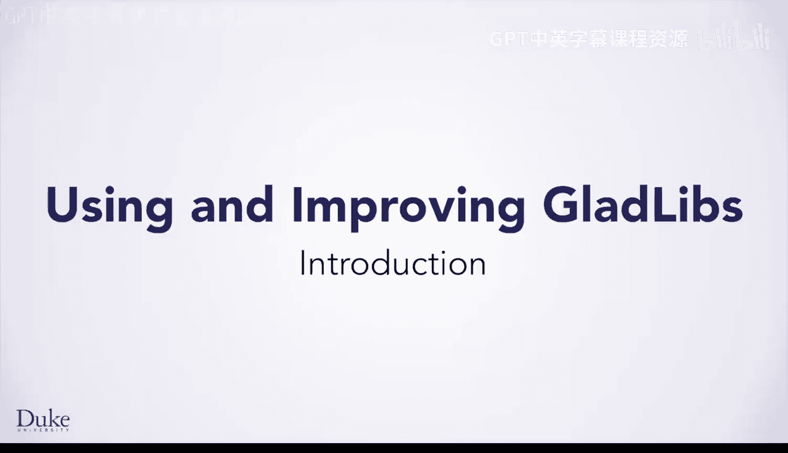
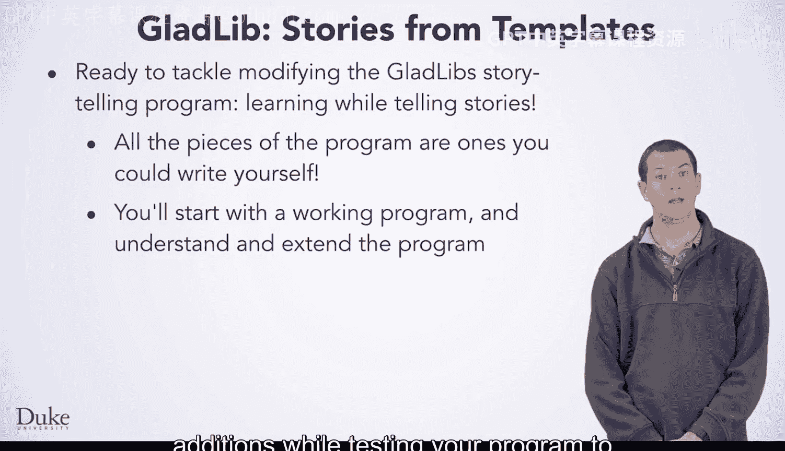
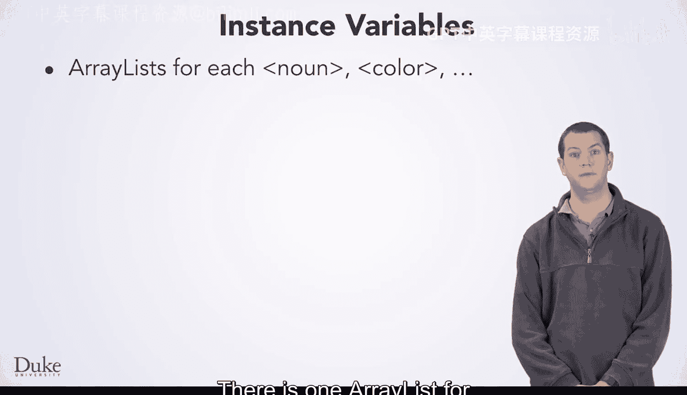
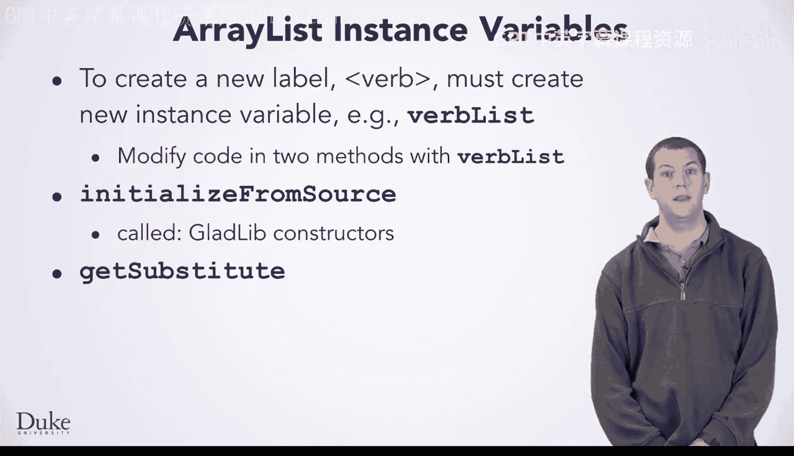

# 095：GladLib程序解析与修改指南 🧩

在本节课中，我们将学习如何理解、分析和修改一个名为GladLib的Java程序。我们将探索其内部结构，学习如何为其添加新的功能，例如支持新的故事标签。通过这个过程，你将掌握阅读现有代码、理解类与方法设计，并进行有效修改的软件工程技能。

## 程序概览与设计理念

上一节我们介绍了数组列表，本节中我们来看看如何将其应用于实际的GladLib程序中。

你已经学习了数组列表，现在是时候研究GladLib Java程序了。你将学习它的工作原理，以及如何修改它以使用新型数据创建故事。你需要理解这个程序，以便作为一名程序员或软件工程师来修改它。有时你需要从头创建程序，有时则需要修改程序、增强它们，使其更健壮。在这个程序中，有许多组件和方法，每一个你都可以自己编写。这意味着你将能够理解每个方法，并能以不同的方式修改程序。

由于你从一个可运行的程序开始，你将能够在测试程序的同时进行改进和添加，以确保它继续正确工作。你将能够理解类设计、方法设计以及初始GladLib Java程序的局限性，并在改进代码的过程中积累经验。

当你努力理解软件设计和工程的这些方面时，你可以讲述关于它的故事。在修改程序时，你将创建可重用的程序组件和可重用的想法，这些将在你积累软件经验和专业知识的过程中发挥作用。

## 程序结构与工作流程

在开始进行增强和改进之前，我们先来浏览一下这个程序。

与所有Java类一样，构造函数将初始化一个GladLib对象。构造函数将创建用于存放名词、颜色等替换词的数组列表实例变量。它还将创建用于随机选择替换词的`java.util.Random`对象。

初始化后，程序的一般控制流程是读取故事模板并处理每个单词。如果单词是一个标签（如`<country>`或`<timeframe>`，由尖括号表示），代码将随机找到一个替换词。故事创建完成后，程序会将其打印出来。

让我们更详细地看看这些部分。

## 核心方法：`makeStory`

首先，快速看一下如何从你刚才看到的模板创建故事。

该类中有一个公共方法`makeStory`。调用此方法将使用模板生成一个故事，正如我们在更仔细地查看代码时将看到的那样。

以下是调用`makeStory`方法生成的故事示例：
> 在肯尼亚，很久以前，大约245个十年前，住着一只粉红色、有趣的老虎。它非常喜欢唱歌和跳舞。但有一只名叫兰斯的愤怒、巨大的狮子，把它吓坏了。
> 在厄瓜多尔，很久以前，大约105个月前，住着一只快乐、黄色的北极熊。它非常喜欢唱歌和跳舞，但有一只名叫阿尔伯特的狂怒、愤怒的兔子，把它吓坏了。

从模板读取单词和打印故事的代码你可能不需要修改。调用`makeStory`将从文件或URL读取模板，并循环处理模板中的每个单词。如果单词是带有尖括号的标签，它将被替换。

## 标签处理与故事输出

在私有方法`processWord`中，查找标签是`indexOf`和`substring`方法的直接应用。我们使用这些方法来确保保留尖括号前后的标点符号或字母。

打印故事将在BlueJ或不同编程环境的控制台窗口中显示最终结果。私有方法`printOut`有一个参数用于指定行宽，因此你可以创建故事并使用80或40个字符或任何其他数字。你也可以修改`printOut`方法，使用`edu.duke.FileResource`类将故事写入文件。

## 实例变量与数据存储

修改GladLib Java程序需要理解数组列表实例变量的使用方式。对于故事模板中的每个可能标签（如名词或颜色），都有一个对应的数组列表。

这些实例变量应适当命名，以便程序员能够轻松理解它们在阅读和修改代码时的用途。与所有实例变量或字段一样，它们将在调用GladLib构造函数时（无论是使用`new`还是在BlueJ中创建对象时）被创建和初始化。

程序在替换单词作为讲故事的一部分时，可能会使用所有字段。字段`adjectiveList`将保存标签`adjective`的替换词，字段`nounList`用于名词，实例变量`colorList`将保存要随机选择的颜色。每个字段都保存其名称对应标签的替换词。这是程序中的一个约定，并非Java所要求，但遵循此约定将使创建新标签（如`verbList`）的新实例变量变得更简单。

## 替换逻辑：`getSubstitute`与`randomFrom`

我们将逐一查看这些字段的用途，其中之一是为像`color`这样的标签寻找替代词。

基于作为标签一部分的单词（如`color`或`noun`），私有方法`getSubstitute`将访问相应的实例变量以找到随机替换词。例如，如果标签是`color`，则将从字段`colorList`中选择替换词；如果标签是`noun`，则使用`nounList`。你可以在`getSubstitute`方法中看到，添加新标签将需要添加新的`if`语句来访问相应的数组列表。

使用私有方法`randomFrom`随机选择一个值。`randomFrom`和`getSubstitute`都是私有方法。它们作为调用公共`makeStory`方法的结果而被调用。当`getSubstitute`调用`randomFrom`时，`getSubstitute`总是传递你创建的实例变量之一（例如`adjectiveList`、`nounList`等）作为参数`source`的值。

## 数据初始化与读取

初始化数组列表很简单，但你需要理解它才能为新标签创建新字段。所有数组列表都必须在调用构造函数时创建和初始化。构造函数将调用一个私有辅助方法`initializeFromSource`。颜色、名词等数据的来源可以是URL或文件。调用`initializeFromSource`将导致读取文件或URL，以便将字符串存储在每个数组列表中。如果`initializeFromSource`的参数以“http”开头，那么最终将使用`URLResource`对象来读取数据。否则，将使用`FileResource`对象。你在这里的代码中看不到这一点，因为参数`source`只是简单地传递给辅助方法`readIt`。读取代码位于别处。

## 修改指南：添加新标签

让我们总结一下用于替换标签的实例变量是如何使用的。你需要理解这一点，以便通过添加新标签来增强程序。

例如，要创建一个像`verb`这样的标签，你需要一个新的实例变量。你需要适当地命名它，比如`verbList`。你需要在两个方法中修改代码：添加`verbList`后，你将修改构造函数调用的私有方法`initializeFromSource`中的代码；你还将修改方法`getSubstitute`中的代码（这也是一个私有方法，由公共`makeStory`方法通过私有方法`fromTemplate`和`processWord`调用）。

程序文档应包含类似这样的信息来帮助你，软件工程师，进行修改和增强。

## 总结

本节课中，我们一起学习了GladLib程序的核心结构。我们了解了其构造函数如何初始化实例变量，`makeStory`方法如何控制故事生成流程，以及私有方法如何处理标签替换和随机选择。最重要的是，我们掌握了为程序添加新功能（如新的故事标签）的具体步骤：需要创建新的实例变量，并在`initializeFromSource`和`getSubstitute`两个关键方法中添加相应的逻辑。通过理解和修改现有代码，你正在积累宝贵的软件工程实践经验。享受讲故事和编写代码的乐趣吧！