# Java编程和软件工程基础：2-5：HashMap数据结构详解 🗺️


在本节课中，我们将要学习一种新的数据结构——HashMap。我们将了解它如何帮助我们更高效地组织数据，并改进之前课程中提到的`GladLib`类的设计。HashMap不仅能让代码更简洁，还能在处理大量数据时显著提升性能。

## 回顾与引入

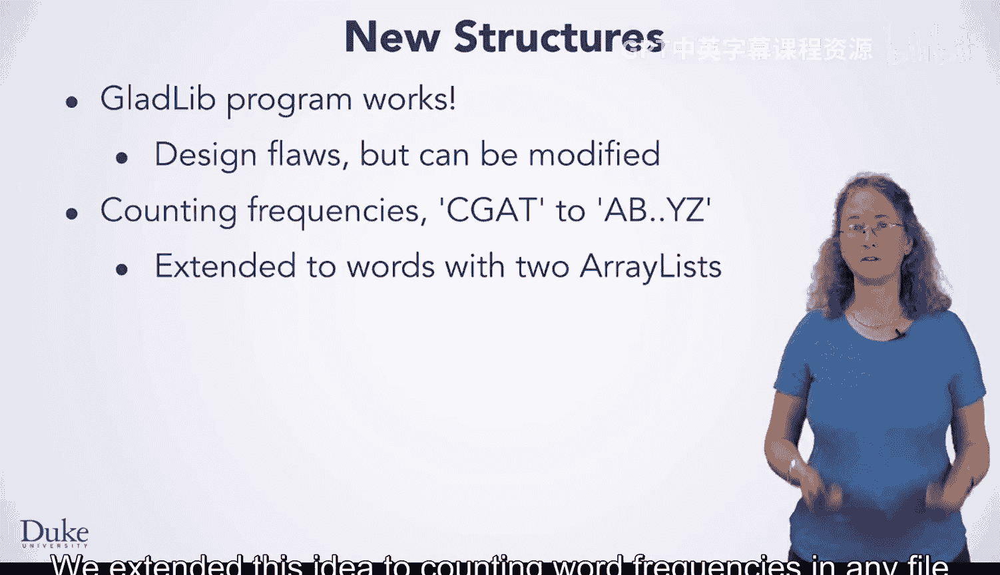

上一节我们介绍了使用并行数组列表来统计单词频率的方法。虽然这种方法可行，但存在设计上的缺陷，尤其是在程序规模扩大时，修改和维护会变得困难。

现在，我们来看看如何使用Java的`HashMap`类来替代并行数组列表，从而获得更优的解决方案。

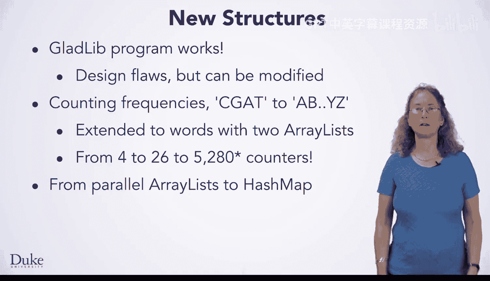

## 理解HashMap的核心概念

HashMap是一种将**键**与**值**关联起来的数据结构。在许多编程语言中，这被称为“映射”。


*   **键**： 可以看作是地图上的图例。通过查找图例，你能理解地图上颜色的含义。
*   **值**： 是与键相关联的具体数据。

在编程中，这个概念更偏向于数学中的“函数”或“映射”。一个键（定义域中的元素）被映射到一个值（值域中的元素）。

在统计单词频率的例子中：
*   **键**是单词本身（例如 `"rainbow"`）。
*   **值**是该单词出现的次数（例如 `41`）。

因此，调用 `map.get("rainbow")` 将返回整数值 `41`。


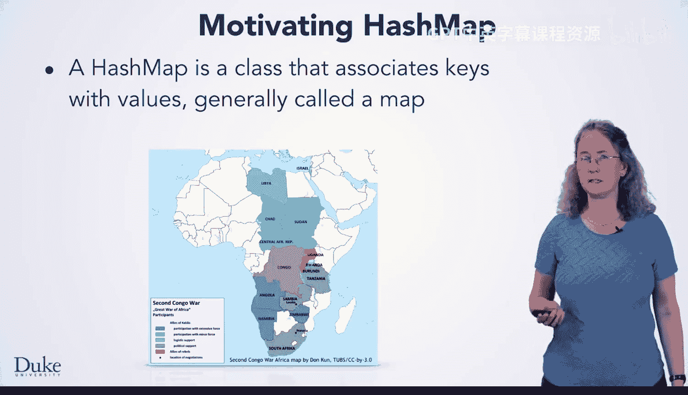

**核心公式/概念：**
`value = map.get(key)`
这表示通过键`key`，可以从映射`map`中获取其关联的值`value`。


## 从并行数组列表到HashMap

以下是使用两个`ArrayList`（一个存单词，一个存次数）来统计词频的关键代码逻辑：

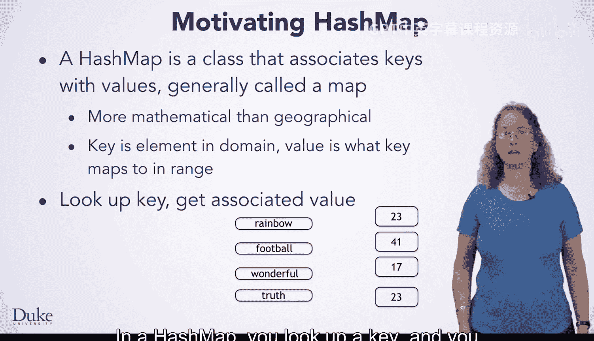

```java
int index = myWords.indexOf(currentWord);
if (index == -1) {
    // 新单词
    myWords.add(currentWord);
    myFreqs.add(1);
} else {
    // 已存在的单词
    int value = myFreqs.get(index);
    myFreqs.set(index, value + 1);
}
```

使用`HashMap`后，相同的逻辑可以这样实现：

```java
HashMap<String, Integer> map = new HashMap<String, Integer>();
// ...
if (!map.containsKey(currentWord)) {
    // 新单词
    map.put(currentWord, 1);
} else {
    // 已存在的单词
    int value = map.get(currentWord);
    map.put(currentWord, value + 1);
}
```

可以看到，`HashMap`用一个对象就替代了两个并行列表，代码意图更清晰。


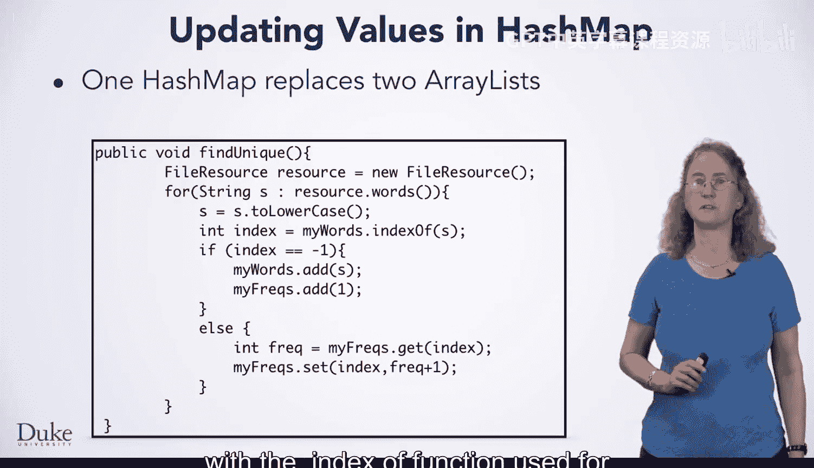

## HashMap的基本操作

要熟练使用HashMap，你需要掌握以下几个核心方法：

以下是HashMap的常用操作：
*   **`put(key, value)`**: 将指定的键值对存入映射。如果键已存在，则更新其对应的值。
*   **`get(key)`**: 返回指定键所映射的值。如果键不存在，则返回`null`。
*   **`containsKey(key)`**: 判断映射中是否包含指定的键，返回布尔值。
*   **`keySet()`**: 返回一个包含映射中所有键的`Set`集合。这是遍历HashMap的关键。

## 如何遍历HashMap

使用并行数组列表时，我们通过索引循环来打印所有单词和频率：

```java
for (int k=0; k < myWords.size(); k++) {
    System.out.println(myFreqs.get(k) + "\t" + myWords.get(k));
}
```


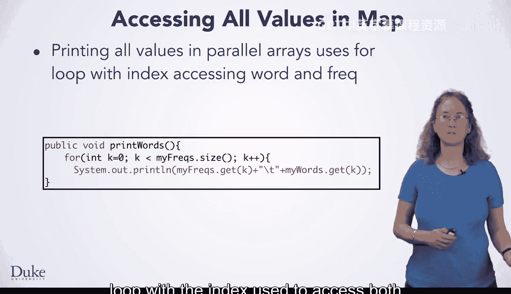

使用`HashMap`时，我们需要遍历其所有键，然后通过键获取对应的值：

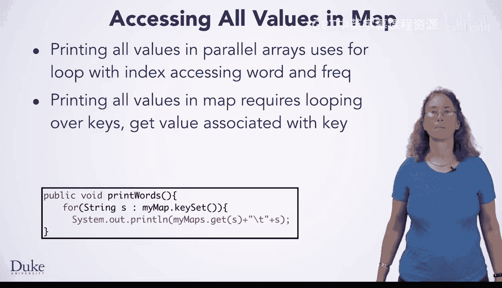

```java
for (String key : map.keySet()) {
    System.out.println(map.get(key) + "\t" + key);
}
```
这里，`map.keySet()`返回所有键的集合，`for-each`循环遍历每个键，然后通过`map.get(key)`获取对应的值。

## HashMap的效率优势


当处理的数据量很大时，效率变得至关重要。HashMap在查找速度上具有巨大优势。

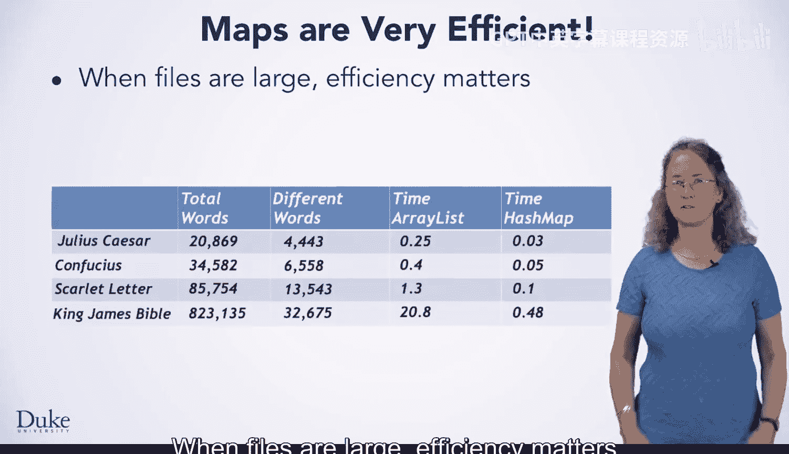

其原理是，通过键查找值所花费的时间，**大致上与映射中键的数量无关**。也就是说，在一个有100万个键的映射中查找，和在一个只有10个键的映射中查找，速度几乎一样快。

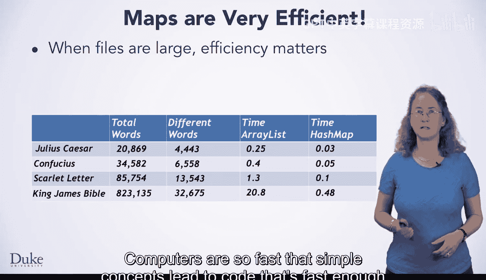

相比之下，使用`ArrayList`的`indexOf`方法，在最坏情况下可能需要遍历整个列表的所有元素。

让我们看一些实际数据对比（处理不同大小的文本文件）：
*   **莎士比亚戏剧《尤利乌斯·凯撒》**: 两种方法都很快。
*   **小说《红字》**: HashMap代码比ArrayList代码快大约10倍。
*   **《圣经》英王钦定版（超过80万单词）**: ArrayList代码耗时超过20秒，而HashMap代码仅需不到0.5秒，快了**40多倍**。

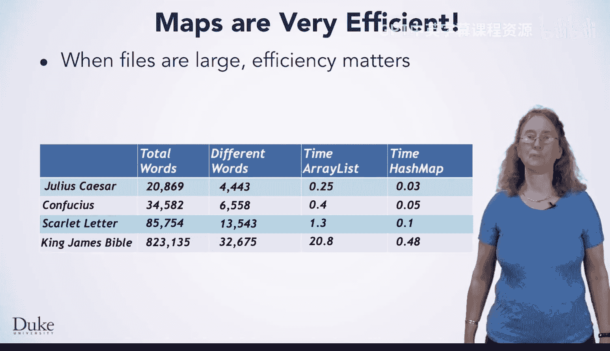

这种效率提升使得HashMap成为处理大型数据集的理想选择。

## 总结

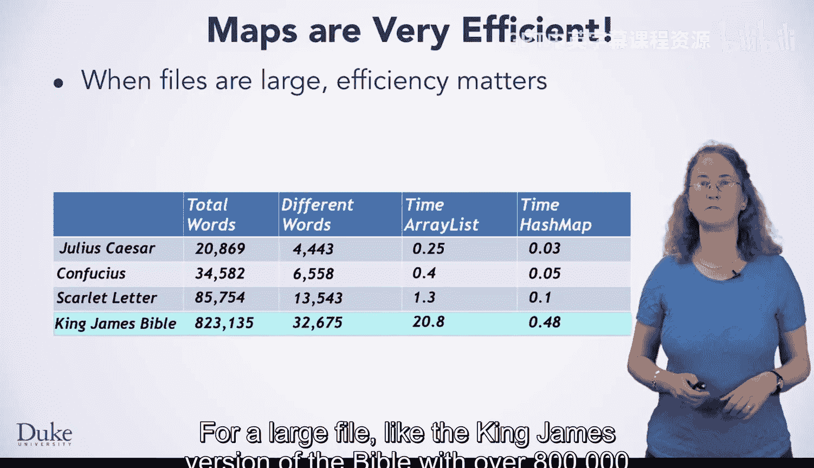

本节课中我们一起学习了Java的`HashMap`数据结构。

我们首先回顾了使用并行数组列表的局限性，然后引入了`HashMap`作为更优的替代方案。我们理解了`HashMap`**键值对**的核心概念，并学习了其基本操作`put`、`get`、`containsKey`和`keySet`。通过代码对比，我们看到了`HashMap`如何让统计词频的逻辑更简洁。最后，我们探讨了`HashMap`在处理大数据量时惊人的效率优势，其查找时间几乎不随数据量增长而增加。

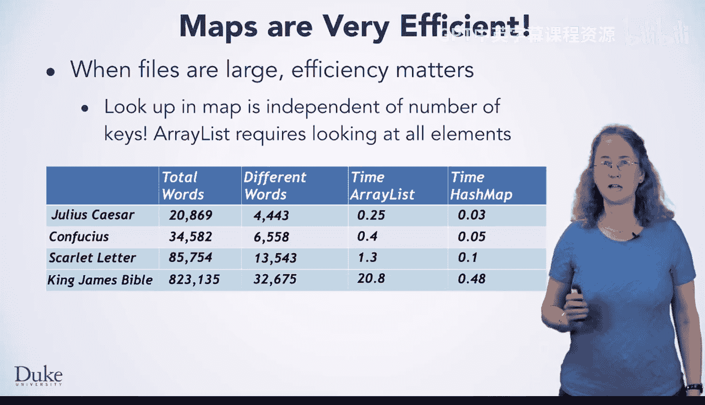

掌握`HashMap`将极大地提升你处理关联数据的能力，并帮助你写出更高效、更易维护的Java程序。在后续课程和项目中，你会经常用到它。