# 101：GladLib项目总结 🎯

在本节课中，我们将总结通过GladLib创意故事生成项目所学到的核心知识。我们将回顾`ArrayList`和`HashMap`这两个关键数据结构，并理解如何利用它们来构建灵活、可扩展的程序。

## 项目概述 📖

GladLib是一个Java程序，它从文件或URL读取模板，并根据用户选择的主题生成有趣的故事。这个项目不仅展示了编程的趣味性，更重要的是，它引出了对`ArrayList`和`HashMap`类的学习需求。

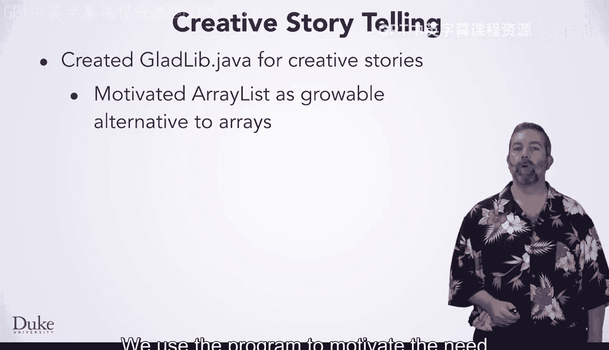

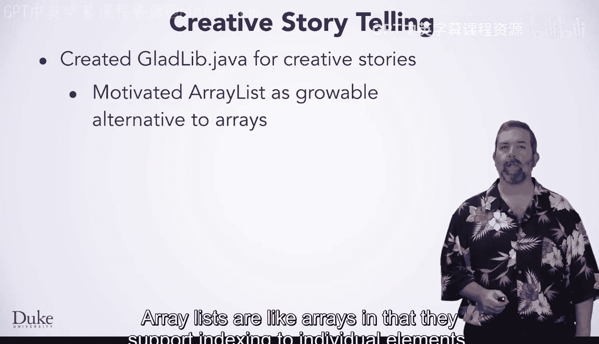

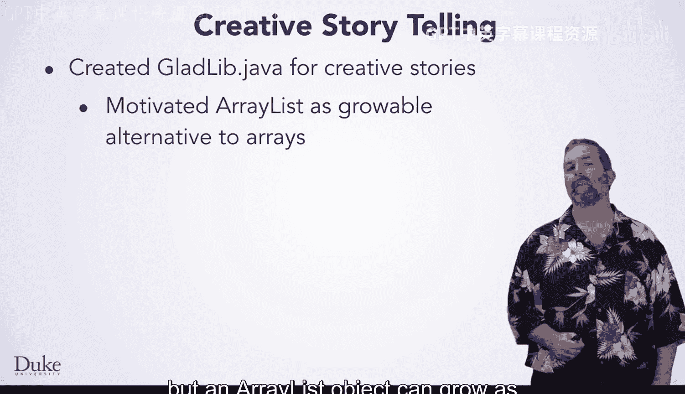

## 学习`ArrayList`类 📚

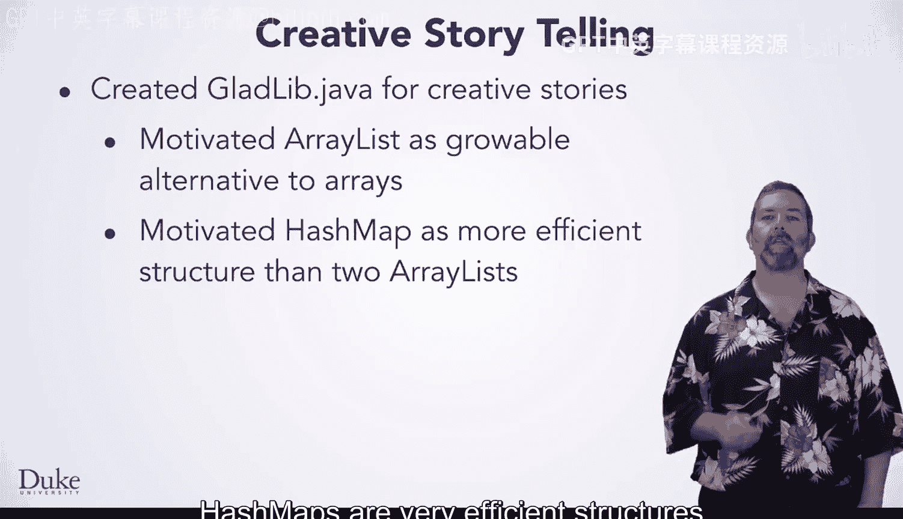

上一节我们介绍了GladLib项目，本节中我们来看看`ArrayList`类。我们使用GladLib项目来激发对`ArrayList`类的研究需求。

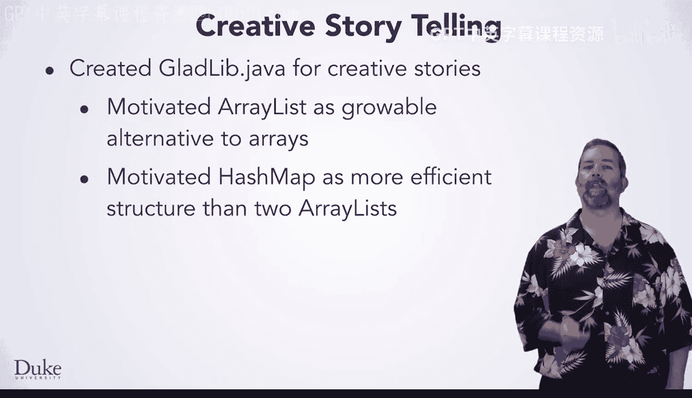

`ArrayList`类似于数组，它支持通过索引访问单个元素。但`ArrayList`对象可以根据需要动态增长，而不是固定大小。

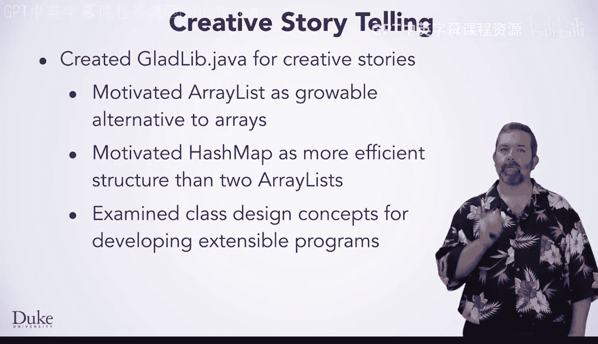

一个`ArrayList`对象是一个可索引的元素集合。`ArrayList`存储的是对象类型，因此你可以存储`Integer`对象，但不能直接存储`int`基本类型值。这意味着你通常需要分两步更新`ArrayList`中的整数值：首先获取并更新该值，然后将该值放回列表中。

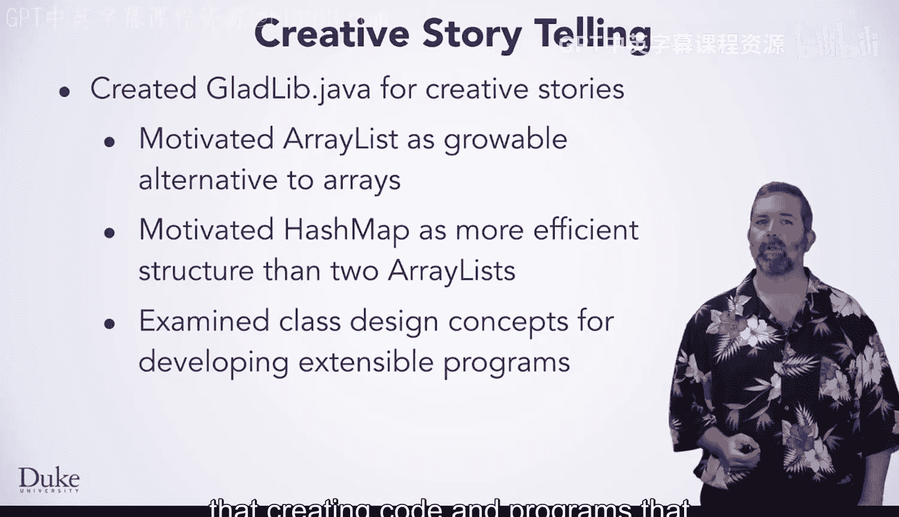

要使用`ArrayList`类，你必须从`java.util`包中导入它。相比之下，使用数组则不需要指定包。

以下是`ArrayList`的一些实用方法：
*   `add`：在`ArrayList`末尾添加一个新元素。
*   `size`：确定`ArrayList`中的元素数量。
*   `get`：通过索引访问元素。
*   `set`：使用索引更新元素。
*   `indexOf`：通过索引确定元素在`ArrayList`中的存储位置。

你可以编写代码来遍历`ArrayList`中的所有元素，方法有两种：一是将`ArrayList`对象作为可迭代对象使用，二是使用`int`类型的`for`循环，从0开始循环，直到但不包括`ArrayList`的大小，通过索引访问每个元素。

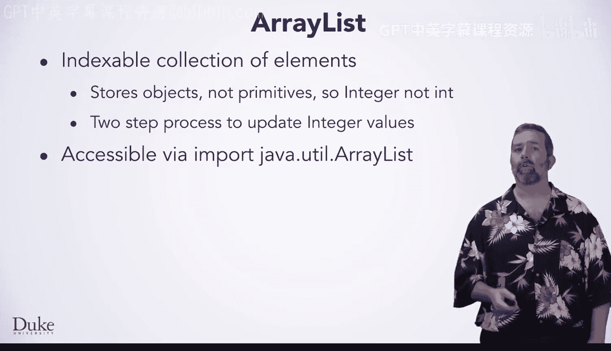

## 学习`HashMap`类 🗺️

在了解了`ArrayList`之后，我们再来研究`HashMap`类。我们同样使用GladLib项目来激发对`HashMap`类的研究。

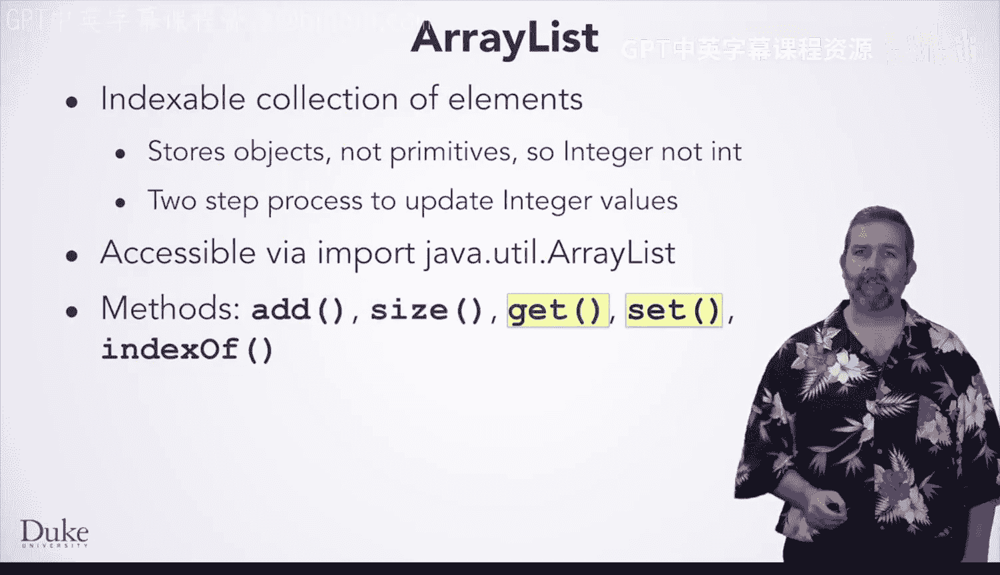

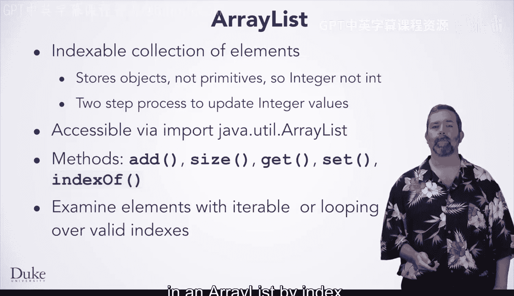

一个`HashMap`对象是键值对的集合。键作为访问值的映射，因此得名`HashMap`。键和值都是对象，因此你会使用`Integer`而不是`int`，就像在`ArrayList`中一样。

键最好是像`String`或`Integer`这样的不可变对象。键必须是唯一的。值可以是任何对象类型，包括你在示例中看到的`String`或`ArrayList`。

你需要从`java.util`导入`HashMap`，就像导入`ArrayList`类一样。

在示例中，你看到了以下方法：
*   `put`：向映射中添加一个键值对。
*   `size`：确定映射中键值对或键的数量。
*   `get`：通过键访问值。
*   `keySet`：用于遍历所有元素。
*   `containsKey`：确定一个键是否在映射中。

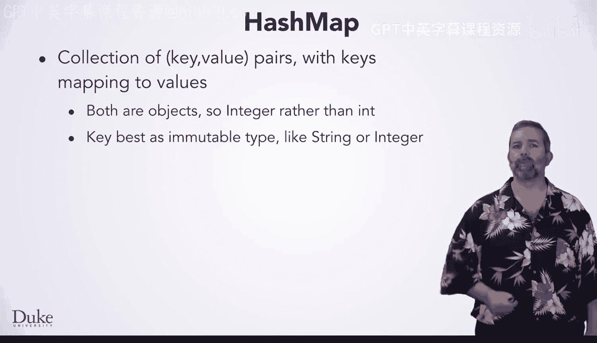

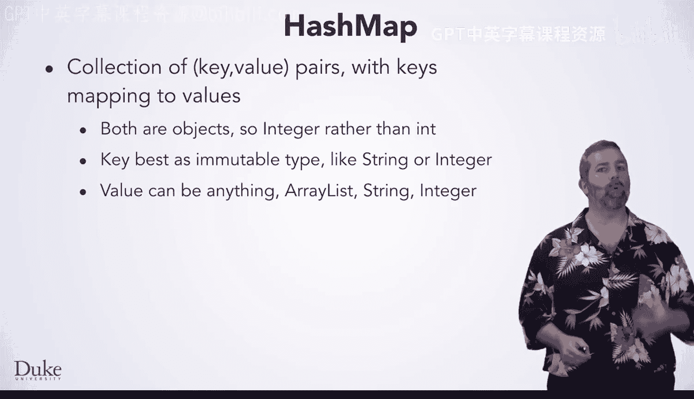

遍历所有元素需要对映射的键集合进行迭代。你不能像使用`ArrayList`那样通过索引逐个访问单个元素。这是两种具有不同优势的集合。

## 可扩展性设计 💡

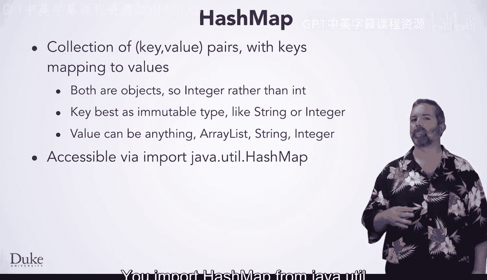

我们还使用GladLib类作为一个小的案例研究，来理解创建可扩展的代码和程序是一个好主意，但这需要思考、规划和经验。

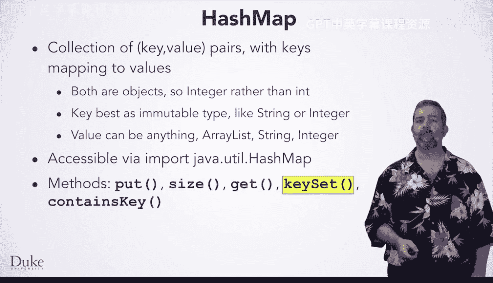

## 课程总结 🏁

本节课中我们一起学习了通过GladLib项目掌握的核心概念。我们深入探讨了`ArrayList`类，它是一种可动态增长、支持索引访问的集合。我们也研究了`HashMap`类，它是一种高效的键值对映射结构。两者都是Java集合框架中不可或缺的部分，各有其适用的场景和优势。希望你能享受使用它们构建程序的乐趣。