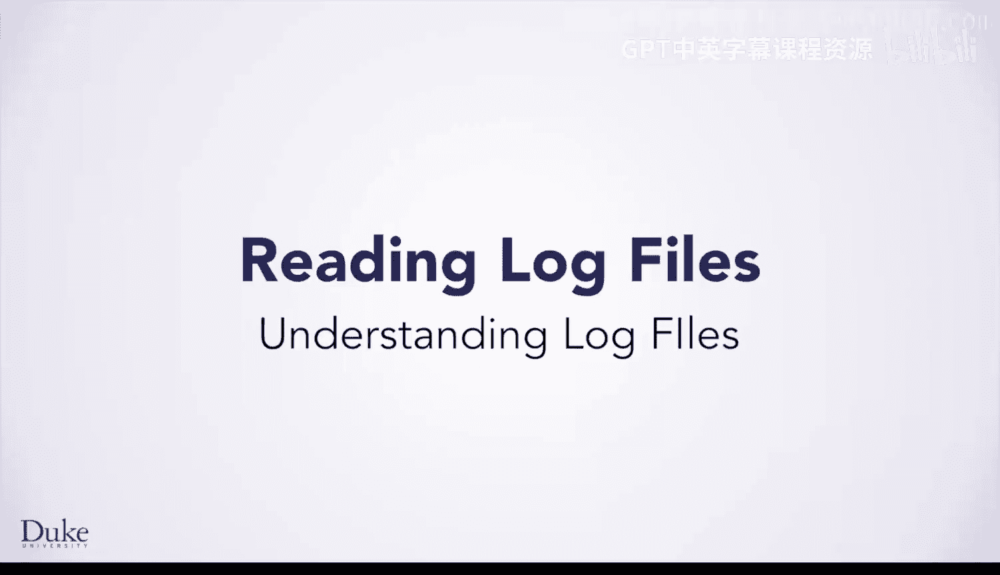
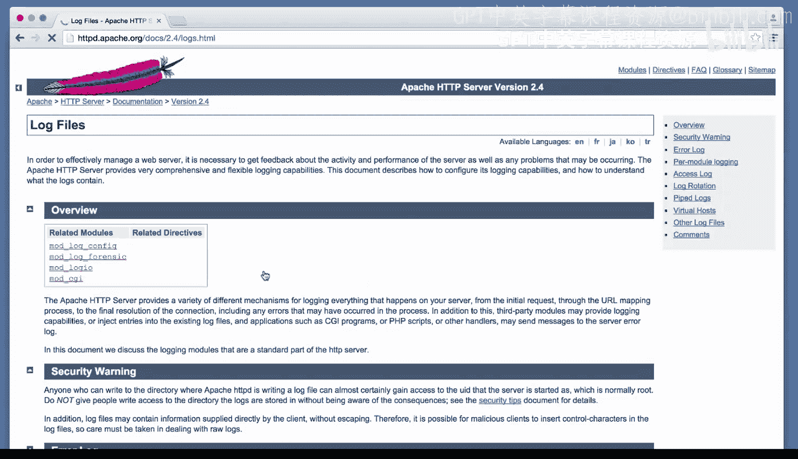
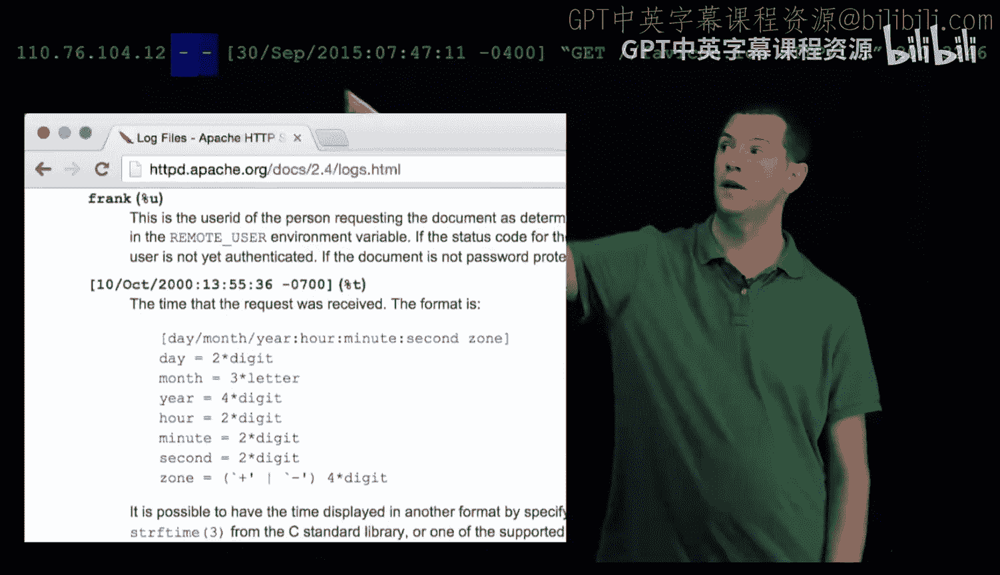
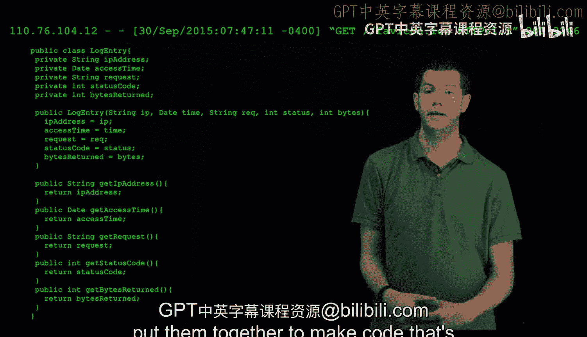
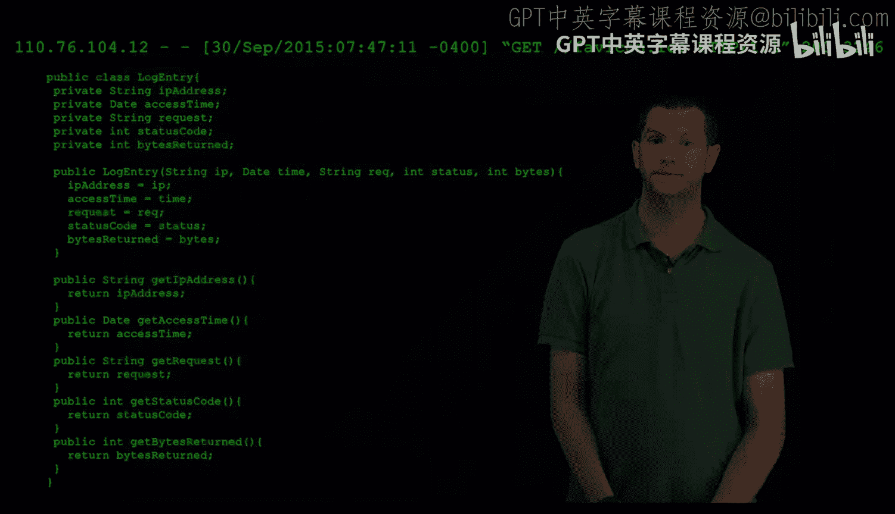

# 103：理解日志文件 📄

在本节课中，我们将学习如何处理Web服务器日志文件。我们将了解日志条目的含义，并学习如何在Java中创建类来表示这些信息，为后续编写处理日志的代码打下基础。

## 日志条目的含义

上一节我们介绍了Web服务器日志的重要性，本节中我们来看看如何理解日志文件中的具体条目。

下图展示了一条来自Web服务器日志的条目。它包含大量信息，但每部分的含义并不直观。

要理解其含义，你需要查阅相关Web服务器的文档。这些特定数据来自Apache 2.4 Web服务器的访问日志。因此，你可以通过谷歌搜索“Apache 2.4 web server log file format”来获取更多信息。

搜索结果会提供许多链接，第一个通常会指向Apache官方文档网站。向下滚动页面，你会找到关于访问日志的信息，即记录对Web服务器访问的日志，这正是我们正在处理的日志类型。文档会解释条目中每一部分的含义。

以下是日志条目各部分的解释：

*   **IP地址**：发出本次Web请求的设备在互联网上的地址。
*   **接下来的两个短横线**：表示缺失的信息。第一个短横线代表请求者身份信息（文档指出此信息不可靠，用户的计算机可能提供虚假信息）。第二个短横线代表用户名，如果用户通过HTTP身份验证（即在网站上输入了用户名和密码）登录的话。

*   **日期和时间**：请求发出的具体时间。
*   **请求内容**：包括请求类型（本例中是`GET`，表示请求获取一个特定网页）以及请求的页面路径。
*   **状态码**：本例中是`200`，表示成功。状态码有很多种，用于表示成功或失败。你可能熟悉`404`，这是一个广为人知的状态码，表示请求的页面未找到。
*   **字节数**：服务器为完成此请求而回复的数据量大小。

## 在Java类中表示日志条目

现在你已经阅读了文档并理解了每条信息的含义，是时候思考如何在Java类中表示它们了。

首先需要考虑的是每条信息的数据类型。

*   对于**IP地址**，可以使用`String`，因为我们只关心该字段的文本内容。Java本身有一个用于IP地址的内置类，如果我们想实际连接到该地址，它会提供更多功能。但目前我们不需要那些功能，也无需引入其复杂性。
*   我们不需要表示那两个没有有用信息的缺失字段。
*   对于**日期**，我们需要表示它。你可以使用`String`来存储其文本，也可以使用Java内置的`Date`类。`Date`类理解日期和时间的概念以及它们之间的关系，因此你可以检查一个时间是否在另一个时间之前或之后。
*   对于**请求内容**，可以直接使用`String`。
*   对于**状态码**和**字节数**，两者都是数字，因此可以使用`int`。

## 设计LogEntry类

思考完数据类型后，是时候将其转化为Java代码了。下图展示了`LogEntry`类的开始部分。我们声明了一个公共类`LogEntry`，并根据刚才讨论的类型编写了字段。

现在你应该思考：这些字段应该是`public`还是`private`？请记住，如果一个字段是`public`，任何代码都可以访问它；如果一个字段是`private`，则只有这个特定类内部的代码可以访问它。

在这个特定案例中，将每个字段设为`private`并设计类为**不可变**的是合理的。回想之前我们学习字符串时提到的，不可变意味着对象一旦创建就不能被修改。因此，你将编写这个类，使得每个字段在其构造函数中设置，但只能被读取。

为了让外部代码能够读取这些字段，你需要编写公共的**getter**或**访问器**方法，如下所示。这些方法只返回该字段的值，但一旦对象构造完成，就没有办法再设置字段的值。

说到构造，你需要为这个类编写一个构造函数。有两种方法可以实现：

1.  构造函数接收整个日志字符串，然后由构造函数将其拆分成各个独立的部分，并填充类的字段（或实例变量）。
2.  构造函数分别接收每一部分信息，并简单地初始化对象的字段。

我们将采用第二种方法，即创建一个如下所示的构造函数，根据分别传入的每一部分信息来填充字段。

为什么选择这种方式？这给了你更多的灵活性。如果你想从其他信息来源创建这样一个对象，也可以做到。实际上，将整行日志字符串拆分开来有点棘手，因此我们会提供相关代码。这段代码有点复杂，我们会将其打包成一个好用的方法供你使用，以便你只需用它来读取文件。

## 完整的LogEntry类

下图展示了完整的`LogEntry`类，包含了刚才讨论的所有内容。你将使用这个类来表示一条日志条目。

因此，你的下一个任务是使用这个类，以及我们提供的用于将日志行拆分成独立部分的代码，将它们组合起来，编写能够读取整个日志文件的程序。

## 总结

本节课中，我们一起学习了如何解读Web服务器日志条目的结构，并设计了一个Java类（`LogEntry`）来封装这些信息。我们确定了每个字段的合适数据类型，决定将类设计为不可变的，并通过私有字段和公共getter方法来实现数据封装。这为后续实际读取和处理日志文件中的数据奠定了基础。