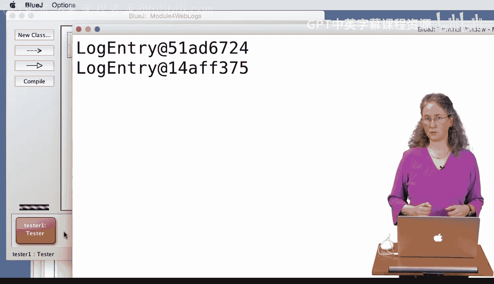
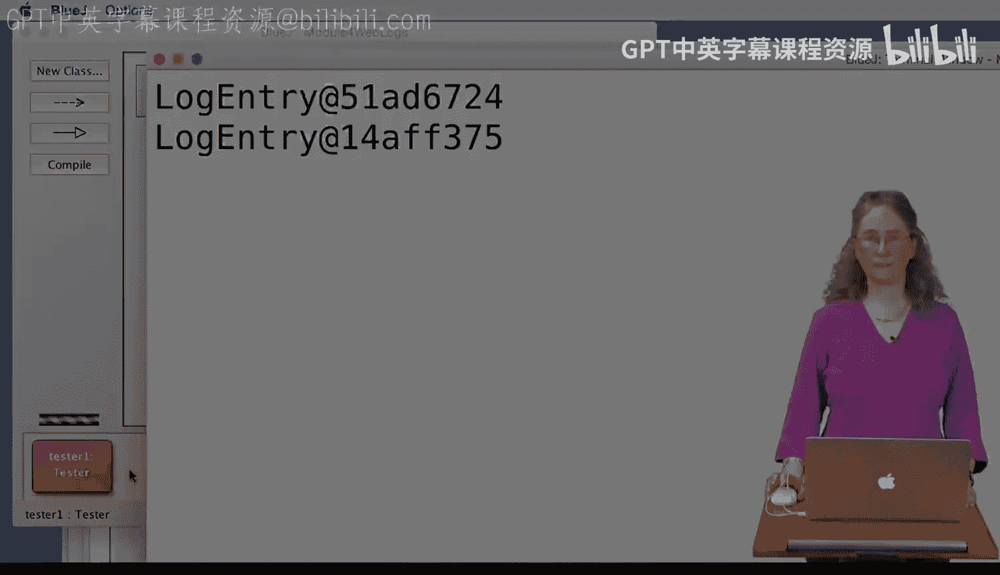

# 104：带toString的LogEntry类

在本节课中，我们将学习Java中一个非常重要的概念：`toString`方法。我们将通过一个`LogEntry`类的例子，了解如何自定义对象的字符串表示形式，以及Java如何自动调用这个方法。

## 概述

每个Java对象都继承自`Object`类，而`Object`类中有一个默认的`toString`方法。默认情况下，这个方法返回的是对象的内存地址信息，这通常不是我们想要的。我们可以通过在自己的类中重写`toString`方法，来定义当打印对象时应该显示什么内容。本节我们将通过实践来理解其工作原理。

## 初始的LogEntry类与toString方法

首先，我们有一个`LogEntry`类，它包含五个字段：IP地址等。我们为它编写了一个构造函数和一些方法。其中，我们特别编写了一个`toString`方法。

```java
public String toString() {
    // 返回包含五个字段信息的一个长字符串
    return ipAddress + " " + ... ; // 示例返回格式
}
```

为了测试，我们创建了一个`Tester`类。它创建了两个`LogEntry`对象`le`和`le2`，并为它们填充了不同的信息。然后，它直接打印这两个对象。

```java
System.out.println(le);
System.out.println(le2);
```

当我们运行测试程序时，控制台会打印出每个`LogEntry`对象的五个字段信息，这正是我们`toString`方法中定义的内容。这是因为Java在打印对象时，会自动寻找并调用该对象的`toString`方法。

## 重命名方法后的影响

上一节我们看到了`toString`方法如何工作。现在，我们来做一个实验：将`toString`方法的名字改为`getLogInfo`。

```java
public String getLogInfo() {
    // 返回包含五个字段信息的一个长字符串
    return ipAddress + " " + ... ;
}
```

然后我们再次运行测试程序。这次，控制台打印的不再是字段信息，而是类似`LogEntry@1b6d3586`这样的内存地址。

这是因为Java在打印对象时，只会自动寻找名为`toString`的方法。由于我们将方法名改成了`getLogInfo`，Java找不到`toString`方法，于是便回退到使用从`Object`类继承来的默认`toString`方法，该方法就是返回对象的内存地址。

为了验证，我们可以在测试代码中显式调用`getLogInfo`方法：

```java
System.out.println(le.getLogInfo()); // 打印字段信息
System.out.println(le2); // 打印内存地址
```

运行后，第一行会调用我们自定义的`getLogInfo`并打印信息，第二行则因为找不到`toString`而打印内存地址。

## 恢复toString方法

从上面的实验可以看出，方法的名字至关重要。现在，我们把方法名改回`toString`，并移除测试代码中的显式调用。

```java
public String toString() {
    // 返回包含五个字段信息的一个长字符串
    return ipAddress + " " + ... ;
}
```

测试代码恢复为直接打印对象：

```java
System.out.println(le);
System.out.println(le2);
```

再次运行程序，两个对象都会打印出我们定义的五个字段信息。即使我们没有在代码中显式写出`le.toString()`，Java运行时环境也会自动去查找并调用这个方法。

## 方法名必须完全匹配

`toString`方法的拼写必须完全正确，包括大小写。这是Java语言的规定。如果我们将其改为`tostring`（小写‘s’）：

```java
public String tostring() { // 注意，这里是‘tostring’，不是‘toString’
    // 返回包含五个字段信息的一个长字符串
    return ipAddress + " " + ... ;
}
```

那么当我们打印对象时，Java会寻找`toString`方法。由于找不到（我们写的是`tostring`），它就会再次使用默认的实现，打印出对象的内存地址。

## 总结

本节课我们一起学习了Java中`toString`方法的核心机制：

1.  **默认行为**：所有Java对象都从`Object`类继承了一个默认的`toString()`方法，该方法返回类名和对象的内存地址。
2.  **自定义输出**：我们可以在自己的类中重写`toString()`方法，以返回任何我们想要的字符串，从而定制对象的打印输出。
3.  **自动调用**：当使用`System.out.println()`打印一个对象，或进行字符串连接时，Java会自动调用该对象的`toString()`方法。
4.  **命名规则**：方法名必须严格为`toString`，拼写（包括大小写）必须完全正确，否则Java将无法识别它作为默认的字符串表示方法。





掌握`toString`方法对于调试和日志记录非常有用，它能让我们快速了解对象的状态。