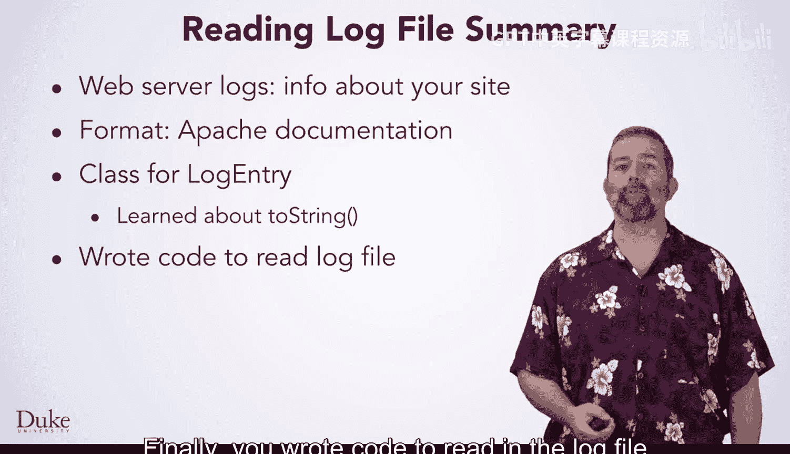
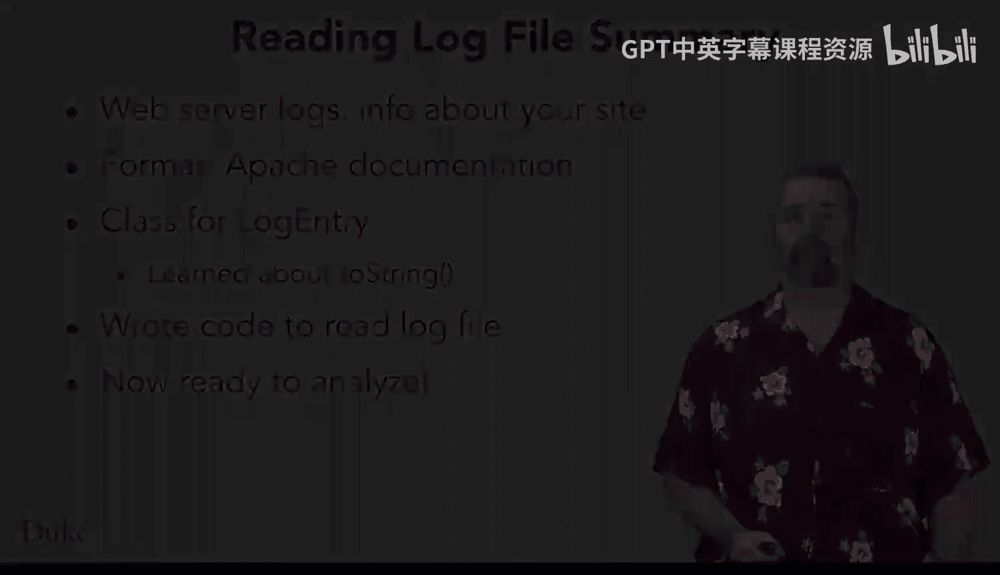

# Java编程和软件工程基础：2-5：Web服务器日志解析与总结

在本节课中，我们将学习Web服务器日志的基础知识。日志文件能提供关于网站访问情况的丰富信息。我们将了解日志的构成、其标准格式，并学习如何根据日志信息创建一个Java类。最后，我们将编写代码来读取并解析日志文件。

## 🧐 了解Web服务器日志

Web服务器日志是记录网站服务器活动的文件。它包含了每次访问请求的详细信息，是分析网站流量和排查问题的重要工具。

## 📄 日志记录的格式

上一节我们介绍了Web服务器日志的作用，本节中我们来看看它的具体格式。我们以Apache Web服务器的日志文档为参考，了解其标准记录格式。

每条日志记录通常包含以下核心字段：
*   **IP地址**：发起请求的客户端地址。
*   **时间戳**：请求发生的日期和时间。
*   **HTTP请求**：客户端请求的方法（如GET、POST）和资源路径。
*   **状态码**：服务器对请求的响应状态（如200表示成功，404表示未找到）。
*   **用户代理**：客户端使用的浏览器或设备信息。

## 🛠️ 创建日志条目类

基于日志文件中的信息，我们可以创建一个Java类来映射和表示单条日志记录。这个类将封装日志的各个字段。

以下是创建此类时涉及的核心步骤：
1.  定义与日志字段对应的私有属性（如`ipAddress`、`timestamp`）。
2.  提供构造方法来初始化这些属性。
3.  为每个属性提供公共的Getter方法。

## 🔄 重写toString方法

在创建类的过程中，我们学习并应用了`toString`方法的重写。这是一个重要的Java概念，在你创建的许多类中，都需要编写自定义的`toString`方法。

`toString`方法返回对象的字符串表示形式。重写它便于我们调试和输出对象信息。其标准格式如下：
```java
@Override
public String toString() {
    return "LogEntry{ip='" + ipAddress + "', time=" + timestamp + "}";
}
```

## 📖 编写代码读取日志文件

最后，我们利用提供的解析代码，编写程序来读取日志文件。此步骤将文件中的原始文本行转换为我们之前定义的`LogEntry`对象列表，为后续的数据分析做好准备。

核心读取与解析逻辑通常包含以下步骤：
*   使用`BufferedReader`逐行读取文件。
*   对每一行，调用解析方法或使用正则表达式提取各字段。
*   用提取的字段创建新的`LogEntry`对象，并添加到集合（如`ArrayList`）中。



## 🚀 下一步：数据分析

现在，你已经准备好编写一些代码，来分析刚才读入的数据了。你可以统计访问量、分析热门资源或追踪特定IP的活动等。



## 📝 课程总结

本节课中我们一起学习了Web服务器日志的组成与格式，创建了对应的Java数据模型类，实践了重写`toString`方法，并最终完成了日志文件的读取与解析。这些是处理和分析真实世界数据的基础技能。