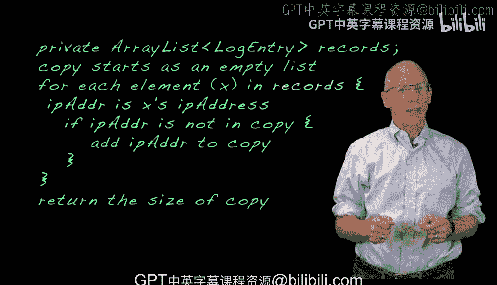

# Java编程和软件工程基础：2-5：算法开发_1


在本节课中，我们将学习如何开发一个算法，用于统计一个列表中唯一值的数量。我们将从一个简单的颜色列表例子开始，逐步过渡到处理Web服务器日志中的IP地址问题。

## 概述

我们已经编写了读取Web服务器日志全部内容的代码，现在需要找出其中包含多少个唯一的IP地址。我们将遵循解决问题的七个步骤，从第一步开始，并使用颜色名称代替IP地址来简化问题。本质上，这是一个统计字符串数组中唯一值数量的问题。


## 从颜色列表理解问题

上一节我们介绍了问题的背景。本节中，我们来看看如何通过一个简单的例子来理解核心算法。

假设我们有一个包含10个颜色名称的列表。通过观察，你可能能直接看出其中只有4个唯一值。但如果列表包含一百万个元素，我们就需要开发一个通用的方法。

有多种方法可以解决这个问题。其中一种我们不会采用的方法是：在遍历列表时，划掉之前见过的值。在Java编程中，修改参数列表的值会产生副作用，这是我们应尽可能避免的。

因此，我们将采用另一种思路：依次访问列表中的每个值（这是处理数组问题的典型方法）。如果我们之前没有见过某个值，就将其复制到一个新列表中。

以下是该过程的步骤说明：
1.  访问“pink”。它是第一个值，新列表为空，所以复制到新列表。
2.  访问“green”。新列表中不存在，所以复制到新列表。
3.  访问“pink”。新列表中已存在，所以不复制。
4.  访问“green”。新列表中已存在，所以不复制。
5.  访问“pink”。新列表中已存在，所以不复制。
6.  访问“pink”。新列表中已存在，所以不复制。
7.  访问“orange”。新列表中不存在，所以复制到新列表。
8.  访问“blue”。新列表中不存在，所以复制到新列表。
9.  访问“pink”。新列表中已存在，所以不复制。

最终，我们创建的新列表包含四个值。因此，我们编写的方法将返回参数数组中唯一值的数量：**4**。

## 算法模式与伪代码

开发这个算法遵循了许多你之前见过的模式。你会注意到，有时需要向副本列表添加元素，有时则不需要。你需要仔细思考添加元素的条件。

一旦理清了条件，你就可以用针对输入列表中每个元素的处理步骤来表达算法的主要部分。

我们希望你能完成步骤二和步骤三的思考。


以下是该算法可能的伪代码：
```
初始化一个空的“副本”列表。
对于“原始”列表中的每一个“元素”：
    如果“元素”不在“副本”列表中：
        将“元素”添加到“副本”列表中。
返回“副本”列表的大小作为唯一值的数量。
```

## 应用到日志分析问题

对于处理Web服务器日志这个具体问题，做法需要稍作调整。


请记住，你有一个`LogEntry`对象的`records`列表，你需要使用`getIpAddress`方法从每个`LogEntry`对象中获取IP地址字符串。

有几种方法可以处理这个差异。最简单的是使用相同的算法，但稍作调整以反映以下事实：你需要处理`records`列表中的对象，并从每个`records`元素中获取IP地址，检查该IP地址是否已在`copy`列表中，如果不在，则将该IP地址添加到`copy`中。

调整后的伪代码如下：
```
初始化一个空的“副本”列表。
对于“records”列表中的每一个“logEntry”对象：
    从logEntry中获取“ipAddress”字符串。
    如果“ipAddress”不在“副本”列表中：
        将“ipAddress”添加到“副本”列表中。
返回“副本”列表的大小作为唯一IP地址的数量。
```

此时，你应该测试你的伪代码逻辑，然后就可以准备将其转化为Java代码了。

## 总结



本节课中，我们一起学习了如何开发一个统计唯一值的算法。我们从简单的颜色列表入手，理解了通过创建副本列表来筛选唯一值的核心思路。随后，我们将这个通用算法适配到了具体的Web服务器日志分析场景中，即从`LogEntry`对象中提取IP地址并进行去重统计。这个过程体现了算法设计从抽象到具体的应用。