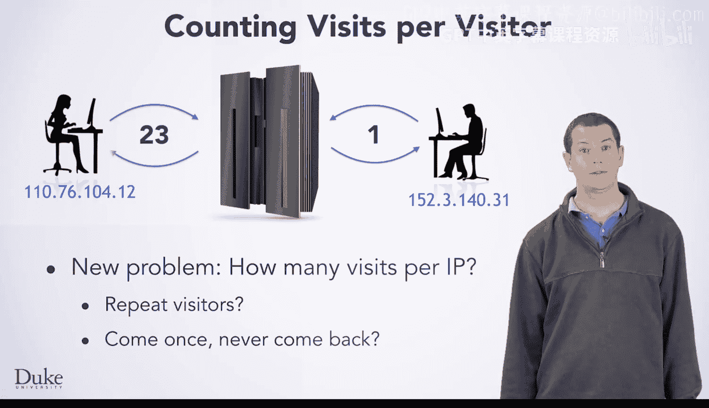

# Java编程和软件工程基础：2-5：Web服务器日志分析入门


在本节课中，我们将学习如何编写一个程序来分析Web服务器日志，以统计每位用户访问网站的次数。这项技能对于理解用户行为、评估网站吸引力以及发现潜在问题至关重要。

## 问题背景与目标

上一节我们介绍了处理数据文件的基本方法。本节中，我们来看看一个具体的应用场景：分析Web服务器日志。

网站服务器会记录每一次访问的详细信息，这些信息存储在日志文件中。我们的目标是编写一个程序，从这些日志中提取数据，并计算出每个用户访问网站的总次数。通过分析访问频率，我们可以推断用户对网站的粘性：频繁回访可能意味着网站内容有价值，而单次访问后不再回访则可能提示存在可用性问题。

以下是分析用户访问行为能带来的主要洞察：
*   识别忠实用户：反复访问网站的用户。
*   发现潜在问题：如果大多数用户只访问一次，可能意味着网站内容、导航或用户体验有待改进。
*   应用广泛：此处学习的计数技术同样适用于其他需要统计频率的场景，如分析文本中的词汇、统计交易记录等。

## 核心实现思路

现在，让我们深入探讨如何实现这个分析程序。其核心逻辑是使用一种称为“映射”的数据结构来关联用户与其访问次数。

程序的基本流程可以分为以下几个步骤：
1.  **读取日志文件**：逐行读取服务器日志文件。
2.  **提取用户标识**：从每一行日志中解析出代表用户的字段（例如IP地址或用户名）。
3.  **计数**：为每个用户维护一个计数器。当程序遇到一个用户时，就将其对应的计数器加1。
4.  **输出结果**：最后，输出每个用户及其对应的访问次数。

实现计数的关键技术是使用 `HashMap`（哈希映射）。在Java中，`HashMap` 允许我们将一个“键”（如用户名）与一个“值”（如访问次数）关联起来。

以下是使用 `HashMap` 进行计数的核心代码模式：
```java
HashMap<String, Integer> visitCounts = new HashMap<>();
// 假设 `user` 是从日志行中提取出的用户名
if (visitCounts.containsKey(user)) {
    // 如果用户已存在，获取当前次数并加1
    int currentCount = visitCounts.get(user);
    visitCounts.put(user, currentCount + 1);
} else {
    // 如果用户是第一次出现，将次数初始化为1
    visitCounts.put(user, 1);
}
```

## 总结



本节课中我们一起学习了Web服务器日志分析的基础。我们明确了通过统计用户访问次数来评估网站使用情况的目标，并介绍了实现这一功能的核心思路——利用 `HashMap` 数据结构来为每个用户进行计数。掌握这一方法后，你就能将同样的计数逻辑应用于众多需要频率统计的实际问题中。