# Java编程和软件工程基础：2-5：使用HashMap统计网站访问次数


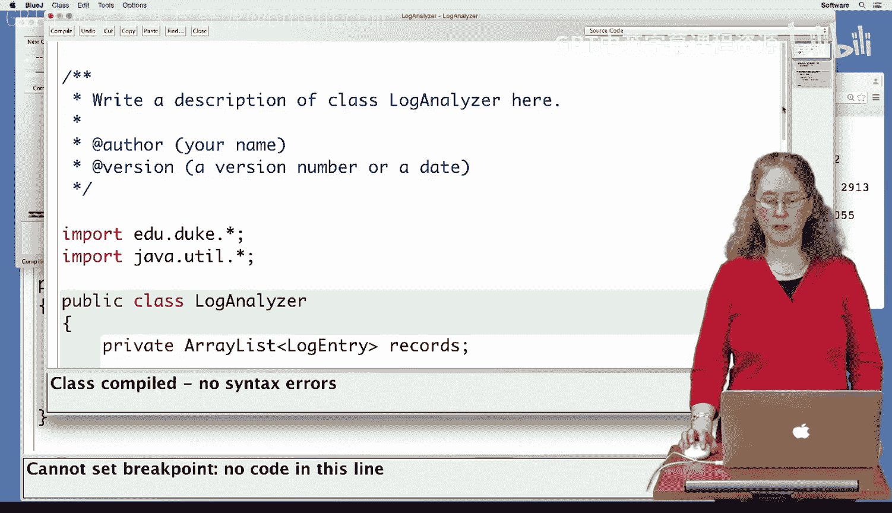

在本节课中，我们将学习如何编写一个Java程序来分析网站日志文件。具体目标是统计每个IP地址访问网站的次数。我们将使用`HashMap`这一数据结构来高效地存储和计算访问次数。

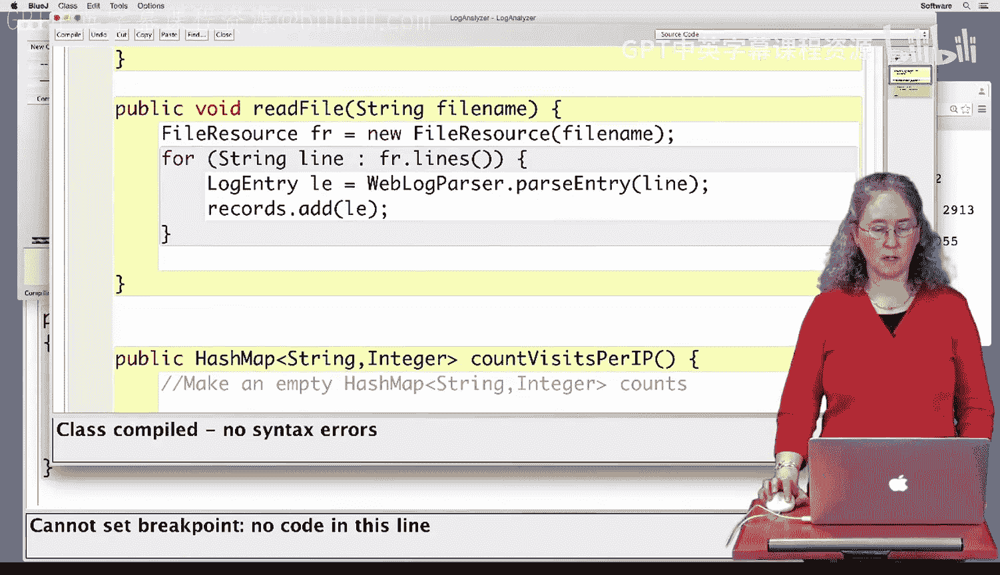

## 分析日志文件

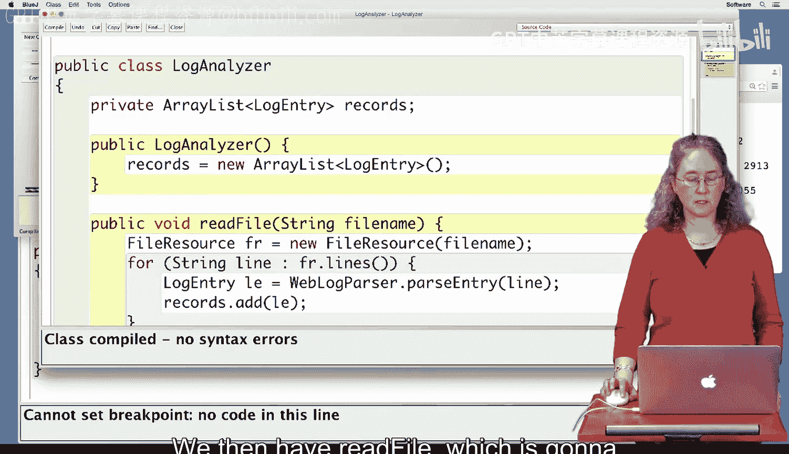

我们想要了解某人访问网站的次数。因此，我们将查看一个包含IP地址的日志文件。例如，对于一个IP地址，我们需要知道它在文件中出现了多少次。这个次数就代表了该用户访问网站的次数。

我们这里有一个程序，一个名为`LogAnalyzer`的类。我们将编写一个名为`countVisitsPerIP`的方法，用于统计每个IP地址访问页面的次数。

## 初始化数据结构

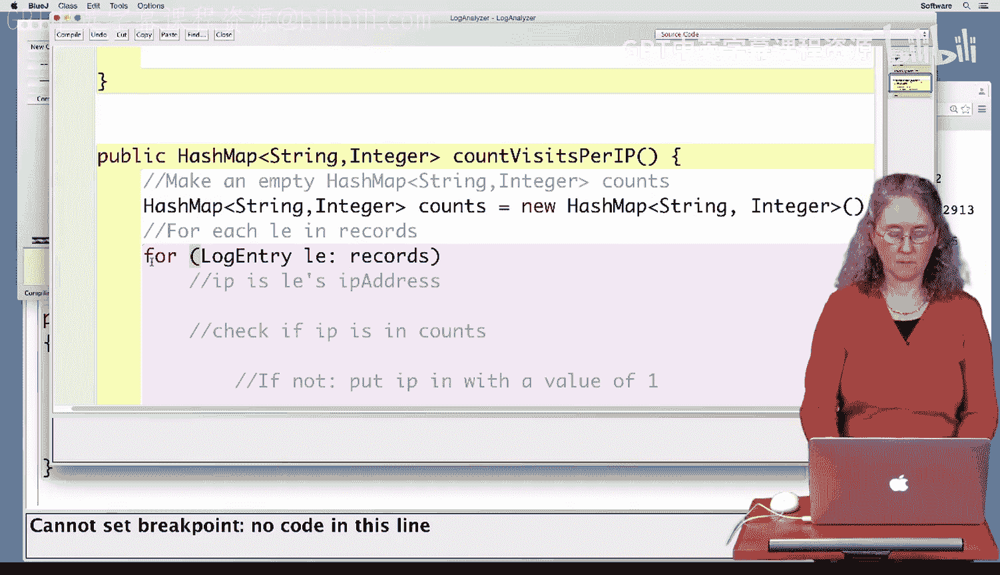

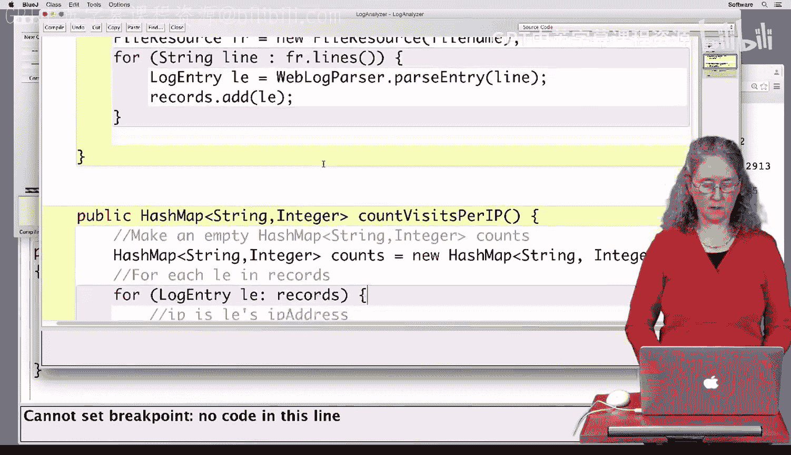

我们将日志条目存储在一个名为`records`的`ArrayList`中。我们有一个构造函数来初始化这个`ArrayList`，还有一个`readFile`方法。该方法接收日志条目的文件名作为参数，允许你选择一个日志文件，然后逐行读取所有内容并将其放入`records`中。

## 编写核心统计方法

我们将重点编写`countVisitsPerIP`方法，并使用`HashMap`来实现。

首先，我们需要创建一个空的`HashMap`。我们将把字符串映射到整数。对于每个IP地址（字符串类型），我们将其映射到一个计数（整数类型），即该IP地址在文件中出现的次数。

以下是创建`HashMap`的代码：
```java
HashMap<String, Integer> counts = new HashMap<String, Integer>();
```
现在我们已经有了`HashMap`，接下来需要遍历所有记录。我们将使用一个`for`循环来迭代`records`中存储的所有日志条目。

以下是遍历记录的代码：
```java
for (LogEntry le : records) {
    // 处理每个日志条目
}
```
在循环中，我们将逐个查看每个日志条目。

## 处理每个IP地址

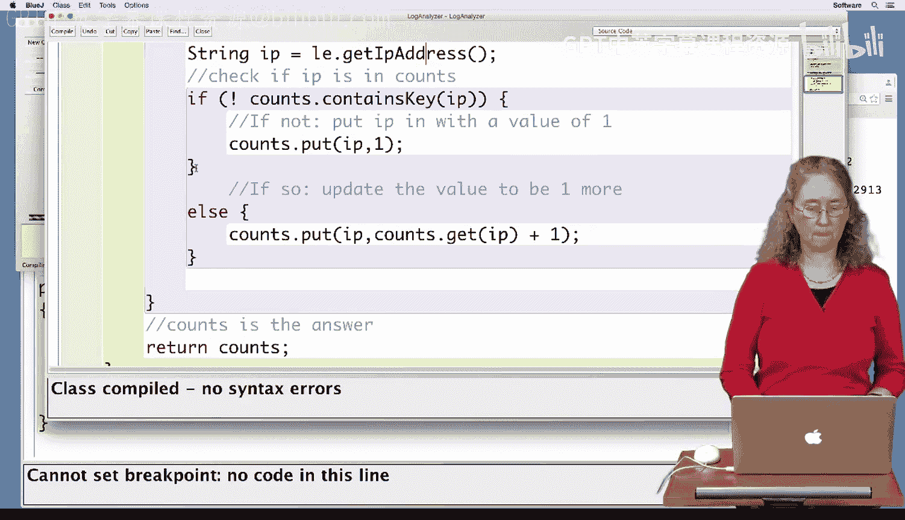

首先，我们需要从日志条目中获取IP地址。我们创建一个字符串类型的变量来存储它。

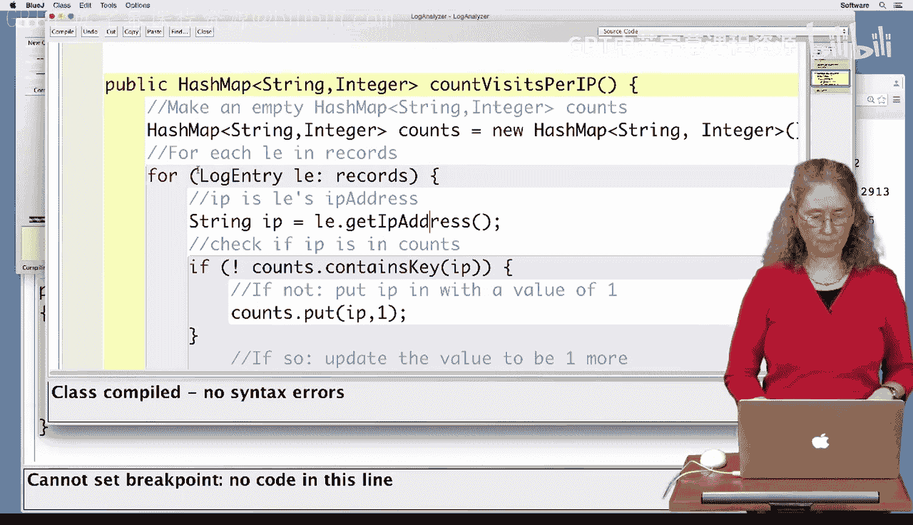

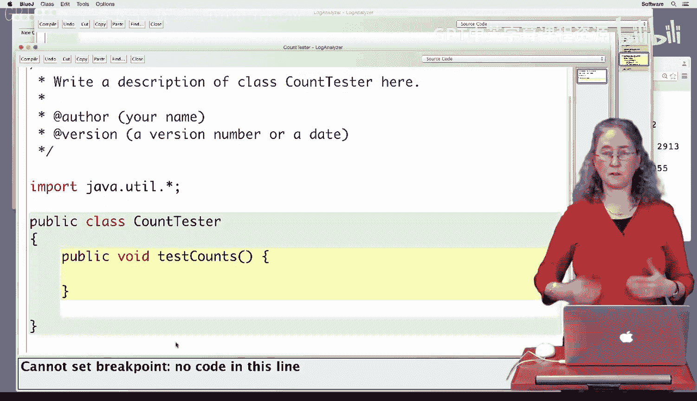

以下是获取IP地址的代码：
```java
String ip = le.getIpAddress();
```
获取到IP地址后，我们需要判断它是否已经存在于我们的`HashMap`中。我们将使用`containsKey`方法来询问。

以下是判断IP是否存在的逻辑：
```java
if (!counts.containsKey(ip)) {
    // 如果不存在，则首次添加，计数为1
    counts.put(ip, 1);
} else {
    // 如果已存在，则获取旧值，加1后更新
    int oldCount = counts.get(ip);
    counts.put(ip, oldCount + 1);
}
```
当我们处理完所有日志条目后，`HashMap`中将包含每个IP地址及其出现的次数。最后，我们返回这个`HashMap`作为结果。

## 测试程序

为了测试这个方法，我们创建另一个名为`CountTester`的类。

在这个类中，我们首先创建一个`LogAnalyzer`对象。

以下是创建对象的代码：
```java
LogAnalyzer la = new LogAnalyzer();
```
然后，我们需要选择一个文件来读取。这里我们使用一个非常小的测试文件来验证程序是否正确工作。

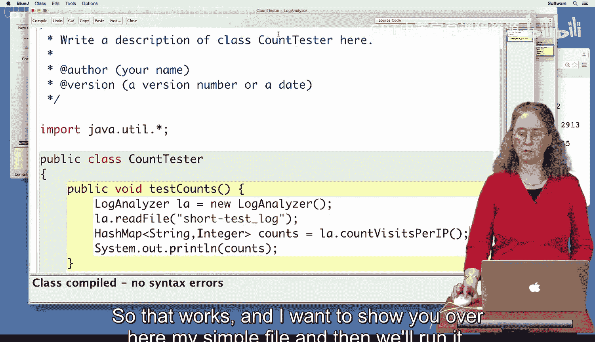

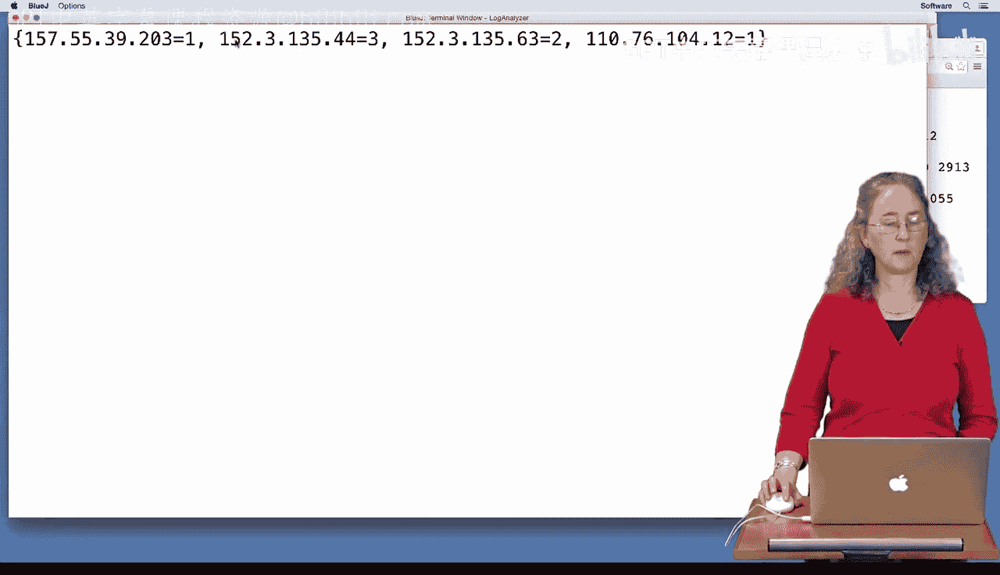

以下是读取文件并调用统计方法的代码：
```java
la.readFile("short-test_log");
HashMap<String, Integer> counts = la.countVisitsPerIP();
System.out.println(counts);
```
运行测试程序后，我们得到了一个`HashMap`的输出，其中列出了每个IP地址及其对应的访问次数。例如，IP地址“152.3.135.44”出现了三次，这与测试文件中的记录相符。

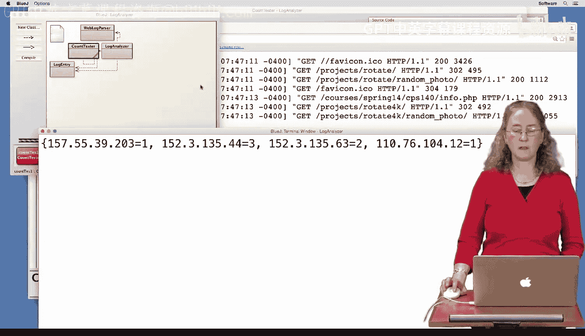

## 总结

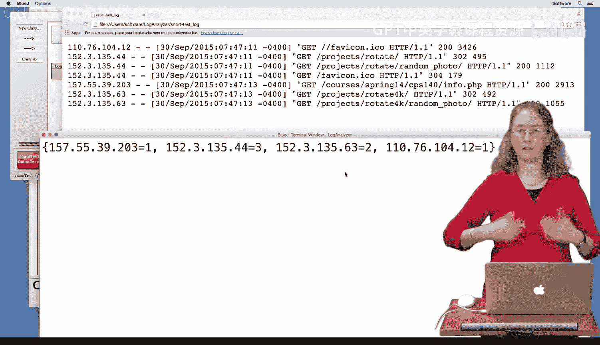

本节课中，我们一起学习了如何使用`HashMap`来统计网站日志中每个IP地址的访问次数。我们创建了一个`LogAnalyzer`类来读取日志文件，并编写了`countVisitsPerIP`方法来处理数据。通过遍历日志条目，我们检查每个IP地址是否已存在于`HashMap`中，并相应地更新其计数。最后，我们通过一个简单的测试验证了程序的正确性。