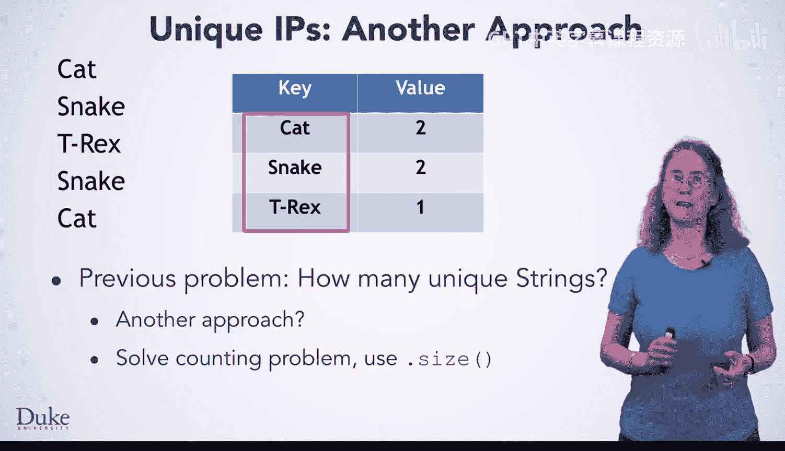
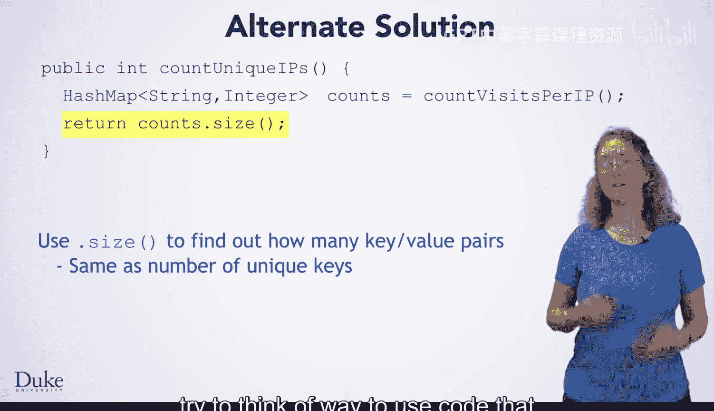

# 115：使用HashMap统计唯一IP地址

在本节课中，我们将学习如何利用HashMap数据结构来解决一个常见的编程问题：统计网络服务器日志中唯一IP地址的数量。我们将看到，通过解决一个更复杂的问题（统计每个IP地址的出现次数），可以轻松地推导出更简单问题（统计唯一IP地址的数量）的答案。

---

回想一下之前的问题：你需要找出网络服务器日志中有多少个唯一的IP地址。

那个问题的本质是找出有多少个不同的字符串。

观察你刚刚完成的任务——找出每个字符串出现了多少次——你可能会意识到你已经解决了一个更广泛的问题。

统计唯一字符串数量的问题，其解决方案已经蕴含在此过程中。

在这个HashMap中，每一个唯一的字符串都作为一个键存在。我们只需要一种方法，将其转化为我们想要的答案。你的计数算法已经完成了最困难的部分。你只需要能够从HashMap中提取出答案。

这种情况在编程中很常见。你可能编写代码来解决一个更复杂的问题，然后通过利用这个更复杂的算法来完成繁重的工作，从而轻松地解决一个更简单的问题。

识别这类情况对于成为一名高效的程序员非常有帮助。

---

在这个案例中，使用第二个问题中的HashMap来解决第一个问题非常简单。

HashMap有一个 **`.size()`** 方法。这个方法会告诉你HashMap中有多少个键值对。

由于每个键在HashMap中只出现一次， **`.size()`** 方法返回的结果正好告诉你输入数据中有多少个唯一的键。

---

如果你已经先编写了 `countVisitsPerIP` 函数，那么你只需要下面这两行代码就可以写出 `countUniqueIPs` 函数。

以下是实现步骤：

1.  首先，调用 `countVisitsPerIP` 函数来解决那个更复杂的问题（统计每个IP的访问次数）。
2.  接着，使用HashMap的 **`.size()`** 方法，将上一个问题的答案转化为当前问题的答案。

HashMap的大小正好等于唯一键的数量，这就是当前问题的答案。

---

在编程时，请始终尝试思考如何利用你已经编写并测试过的代码。这不仅能够提高效率，还能减少错误，并使你的代码库更加模块化和可重用。

---

本节课中，我们一起学习了如何巧妙地运用HashMap的 **`.size()`** 方法来统计唯一元素的数量。我们认识到，通过先解决“统计频率”这个更通用的问题，可以轻而易举地得到“统计唯一性”这个特定问题的答案。这是一种重要的编程思维：构建通用的解决方案，以简化特定任务的实现。