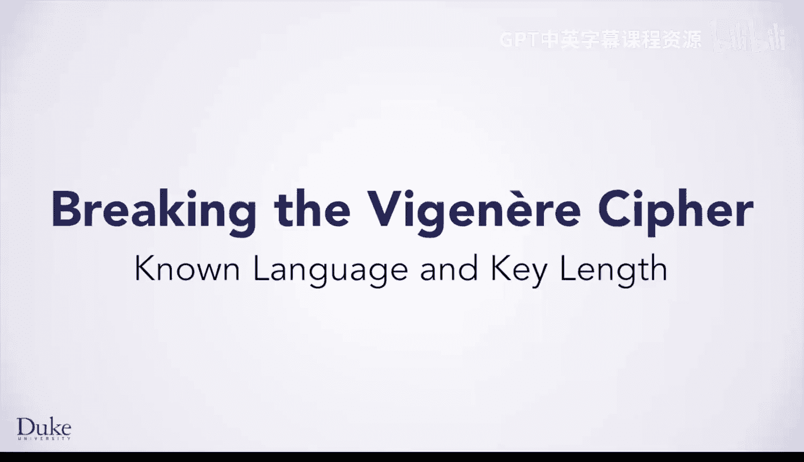
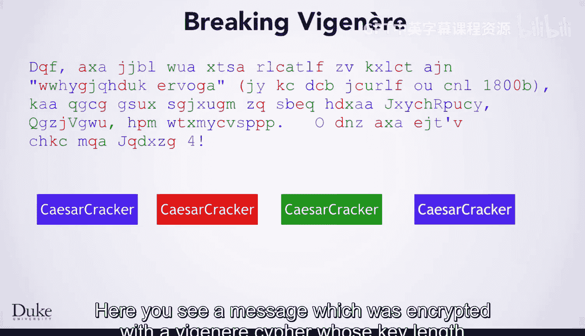
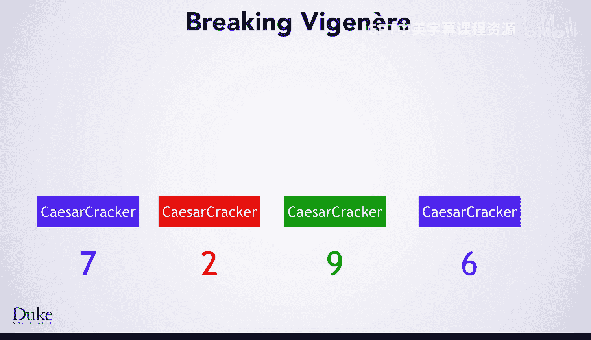
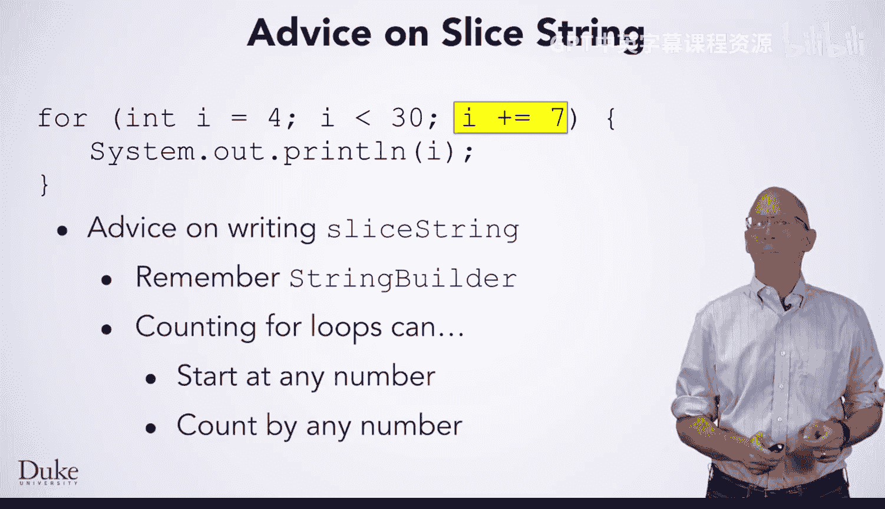
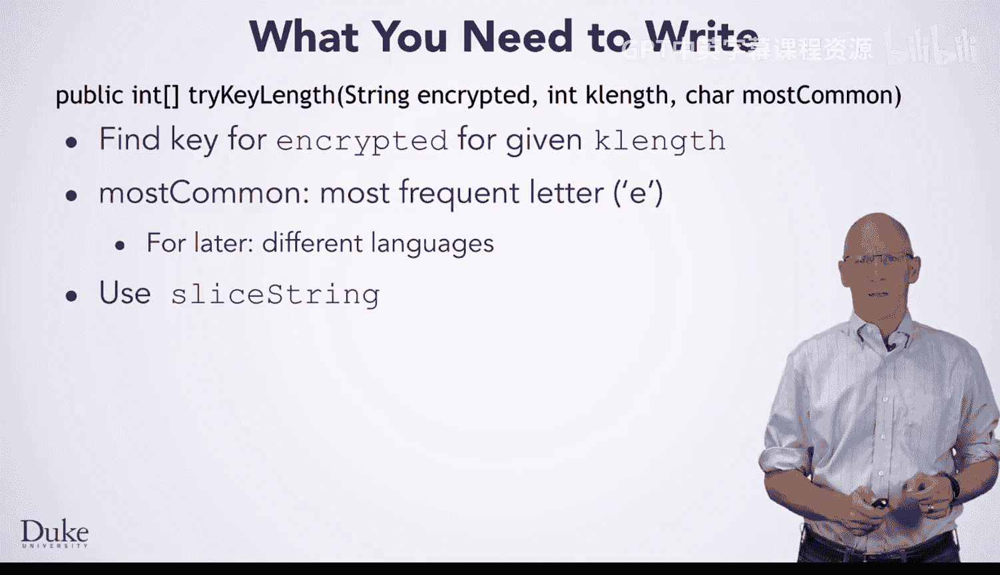
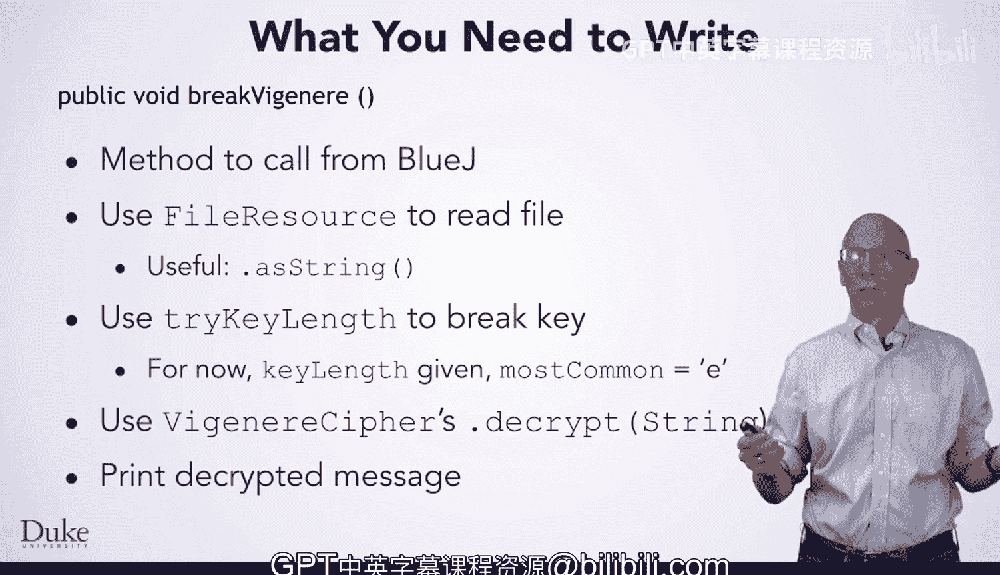

# 维吉尼亚密码破解：第1章：已知语言与密钥长度 🔑



在本节课中，我们将学习如何编写代码来破解维吉尼亚密码，但仅限于已知密钥长度和语言（例如英语）的情况。这是构建完整破解程序的第一步，遵循“先实现一个功能并彻底测试”的软件开发原则。

## 核心概念回顾



上一节我们介绍了维吉尼亚密码的基本原理。本节中我们来看看如何利用已知信息进行破解。

维吉尼亚密码的行为类似于多个凯撒密码的组合，每个密码作用于消息的不同切片。例如，下图展示了一个用长度为4的密钥加密的消息：




我们根据加密时使用的密钥部分为字母着色。如果只取蓝色字母，它们本质上就是一个用凯撒密码加密的消息，只是分散在整个消息中。因此，你可以使用之前编写的凯撒密码破解器来找到密钥的这一部分。对红色、绿色和紫色字母重复此过程，即可破解整个密钥。这就是在已知密钥长度时，破解维吉尼亚密码的概念性思路：**将字符串切片，然后使用凯撒密码破解每个切片**。

## 方法实现步骤

以下是实现此破解思路需要编写的三个核心方法。

### 1. 编写 `sliceString` 方法

首先，你需要编写 `sliceString` 方法，它接收三个参数：待切片的**消息**、你想要的**切片索引**以及**切片总数**。

例如，调用此方法时，若切片总数为4，切片索引为0，你将获得所有蓝色字母组成的字符串。切片索引为1则获得红色字母，以此类推。注意，换行符也被视为字符串的一部分。

我们提供一些编写建议：
*   使用 `StringBuilder` 类来构建最终返回的字符串，通过 `append` 方法添加字符。
*   巧妙使用 `for` 循环。循环可以从任意数字开始，而不仅仅是0，并且可以按任意步长递增。

以下是一个 `for` 循环示例，它从4开始，以7为步长计数：
```java
for (int i = 4; i < 30; i += 7) {
    System.out.println(i); // 将打印 4, 11, 18, 25
}
```
在编写 `sliceString` 时，使用变量或参数来控制循环的起始点和步长将非常有用。



### 2. 编写 `tryKeyLength` 方法

接下来，编写 `tryKeyLength` 方法。该方法用于在假设密钥长度为 `keyLength` 的前提下，寻找加密消息的维吉尼亚密钥。它还需要一个参数 `mostCommon`，代表目标语言中最常见的字母（目前我们传入 `'E'`）。

在编写此方法时，你需要：
*   利用刚刚讨论的 `sliceString` 方法。
*   使用我们提供的 `CaesarCracker` 类。这个类与你之前编写的类似，但有两处改动：1) 将寻找密钥的代码与解密的代码分离；2) 其构造函数接收你所处理语言的最常见字母作为参数。

该方法应返回一个长度为 `keyLength` 的整型数组，其中包含 `CaesarCracker` 为消息的每个切片找到的移位值。



### 3. 编写 `breakVigenere` 方法

最后，为这部分程序编写 `breakVigenere` 方法。这是你将从 BlueJ 环境调用的主方法。

以下是该方法的步骤：
1.  使用 `FileResource` 对象读取你想要解密的文件。`FileResource` 有一个有用的方法 `asString()`，可将整个文件内容读入一个字符串。
2.  调用 `tryKeyLength` 方法，传入刚读取的消息、给定的密钥长度以及字母 `'E'`。
3.  `tryKeyLength` 将返回一个代表密钥的整型数组。你只需将此数组传递给 `VigenereCipher` 的构造函数。
4.  利用 `VigenereCipher` 对象的 `.decrypt` 方法来解密加密的消息。
5.  最后，打印出解密结果。



至此，任务完成。

## 总结


本节课中我们一起学习了在已知密钥长度和语言（英语）的情况下破解维吉尼亚密码的方法。我们分三步实现了核心功能：首先编写 `sliceString` 来对密文进行切片；然后利用 `CaesarCracker` 和 `tryKeyLength` 方法破解每个切片对应的凯撒密码，从而得到完整密钥；最后在 `breakVigenere` 方法中整合文件读取、密钥破解和解密流程，输出明文结果。这是构建完整、通用破解器的重要基础步骤。