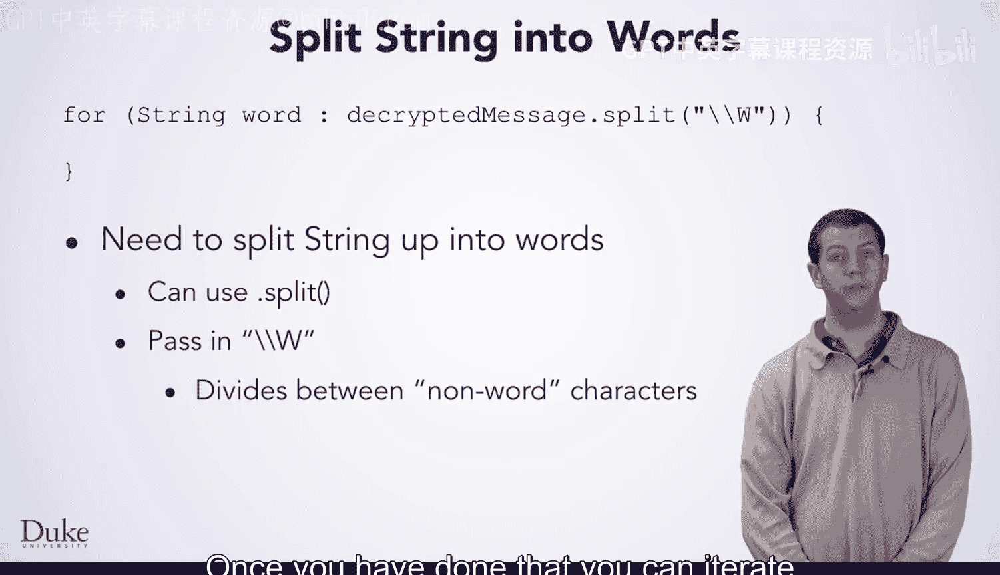
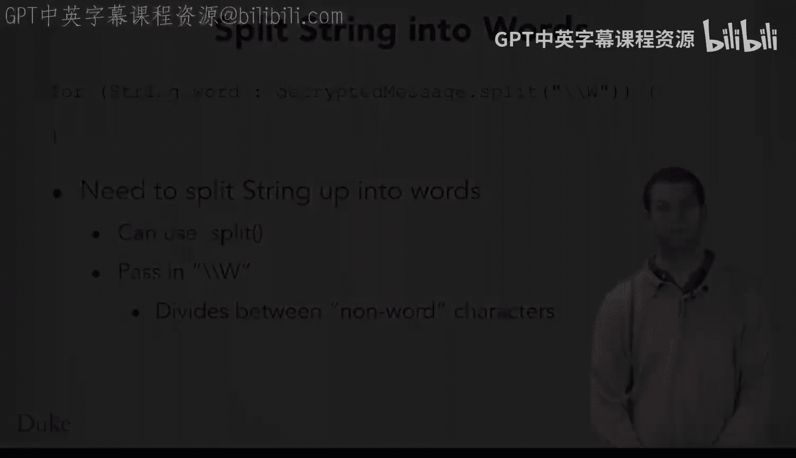

# Java编程和软件工程基础：2-5：未知密钥长度的破解方法 🔑

在本节课中，我们将学习当不知道加密密钥长度时，如何破解维吉尼亚密码。我们将探讨一种通过尝试不同密钥长度并自动判断解密结果是否正确的策略。

## 概述

上一节我们介绍了在已知密钥长度的情况下如何破解维吉尼亚密码。本节中我们来看看当密钥长度未知时，我们应该如何应对。

## 尝试不同密钥长度

如果你不知道密钥长度，可以尝试一些不同的密钥长度。你可以使用刚刚编写的代码，传入一个密钥长度，然后查看结果。例如，如果尝试密钥长度为1，输出结果将是不可理解的，因此1很可能不是正确的密钥长度。尝试密钥长度2，结果似乎也不正确。尝试密钥长度3时，输出看起来可能是英语，包含可读的单词，这表明该消息是用密钥长度3加密的。

## 自动化尝试过程

你可以编写一个循环来尝试许多不同的密钥长度，从1开始向上计数。计算机可以在几分之一秒内尝试一个特定的密钥长度。因此，即使一条数千行长的消息是用密钥长度92加密的，程序也能在短时间内完成尝试。

但如何判断密钥长度是否正确？你真的需要查看每次迭代的输出吗？我们刚才所做的就是查看输出以判断它是否为有意义的文本。然而，如果我们仔细思考刚才的做法，或许能找到一种自动化的方法。

## 判断解密正确性的方法

观察不正确的解密结果，思考你是如何知道它不正确的。例如，三个字母的组合可能形成一个单词，但“J.O.W”不是一个真正的单词。同样，“Y T”也不是一个真正的单词，“Y, O B”也不是。这条消息中的所有单词都不是实际的英语单词。

对比正确的解密结果：“H O W”是单词“how”，“D O”是“do”，“Y O U”是“you”。正确解密中的所有单词都是实际存在的单词。

这一观察引出了如何找出正确密钥长度的思路：**统计输出中真实单词的数量**。

以下是实现步骤：

1.  从文件中读取英语单词列表。
2.  将单词列表存储在数据结构中。
3.  尝试不同密钥长度的解密。
4.  对每个密钥长度，统计解密文本中有多少单词是文件中的真实单词。
5.  选择产生最多真实单词的密钥长度、密钥和解密文本。

## 选择数据结构：HashSet

正如我们刚才提到的，使用ArrayList完全可以。读取文件时，你可以使用`.add`方法将每个单词放入列表。当你想查看一个潜在单词是否真的是列表中的真实单词时，可以使用`.contains`方法。

一个更好的选择是使用**HashSet**类。与ArrayList和HashMap类似，你可以使用包含不同类型数据的HashSet，因此你需要在HashSet后面加上尖括号并放入String，表示你需要一个字符串的HashSet。

对于这个问题，你将使用HashSet的方式与使用ArrayList非常相似。你可以在它上面调用`.add`和`.contains`方法。你不能像对ArrayList那样通过索引访问HashSet，但如果你想遍历它，可以使用for-each循环。当你遍历HashMap的`.keySet`时，背后发生的就是这种情况。

主要优势在于，`.contains`方法会快得多。它不需要搜索HashSet中的每个单词，而只需查看少数几个单词就能判断是否包含所请求的信息。

## 分割字符串为单词

在开始编码之前，我们要提到的最后一件事是如何将字符串分割成单个单词。你已经看到String有一个`.split`方法。你可以使用它，传入`\\W`。这要求split方法在每个非单词字符（空格、标点符号或数字）处分割字符串。完成这一步后，你可以使用如下的for-each循环遍历这些单词：

```java
for (String word : decryptedText.split("\\W")) {
    // 处理每个单词
}
```

## 总结





本节课中我们一起学习了在未知密钥长度的情况下破解维吉尼亚密码的方法。我们探讨了通过循环尝试不同密钥长度、利用HashSet高效判断真实单词数量，从而自动确定正确密钥长度的完整策略。关键在于将解密输出与已知的英语单词列表进行比较，并选择产生最多有效单词的解密结果。