# 120：破解未知语言的维吉尼亚密码 🔐

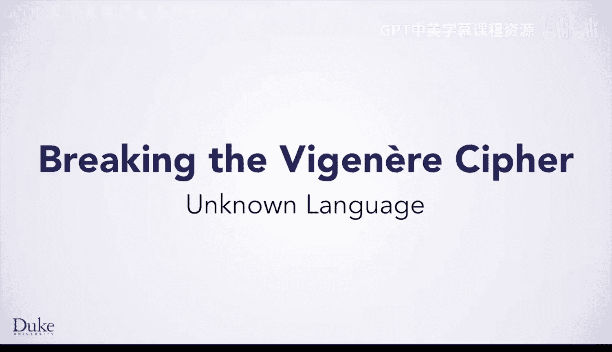

在本节课中，我们将要学习如何扩展我们的维吉尼亚密码破解程序，使其能够处理未知语言的密文。我们将修改现有方法，并编写新的方法来支持多语言字典分析。

---

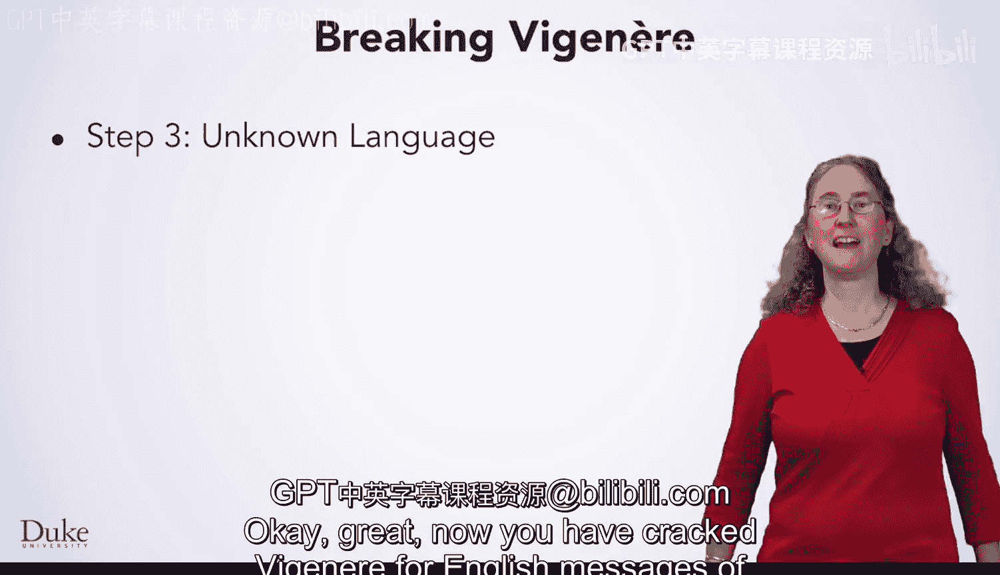

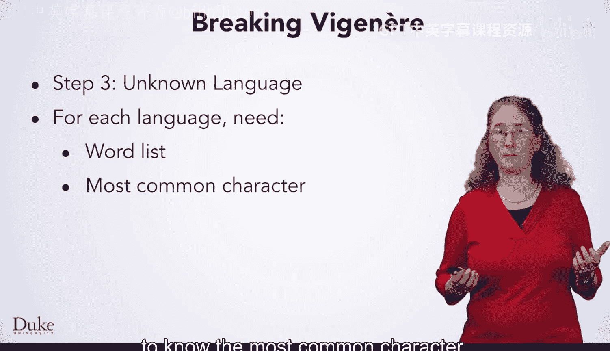

## 概述

上一节我们介绍了如何破解已知为英语的维吉尼亚密码。本节中我们来看看，当密文可能来自其他未知语言时，我们该如何应对。核心思路是：为每种潜在语言尝试破解，并选择解密后包含最多真实单词的结果。

## 多语言破解策略

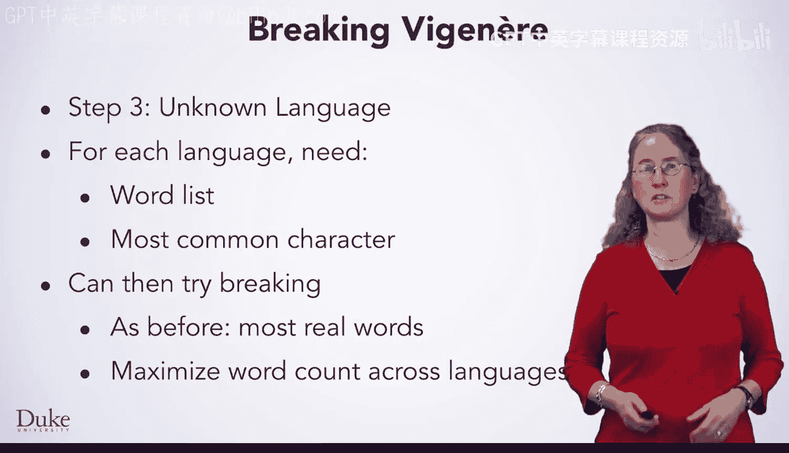

为了处理未知语言，我们需要一个包含多种语言单词列表的字典。对于每种语言，我们需要知道其最常见的字母（并非所有语言都是‘E’）。然后，我们可以对每种语言尝试使用相同的破解技术，找出能产生最多真实单词的密钥长度和明文。

以下是实现此策略的关键步骤：

1.  **读取多语言字典**：使用已有的 `readDictionary` 方法，为每种语言读取单词列表。
2.  **存储字典数据**：将每种语言的名称与其对应的单词集合（HashSet）关联起来，存储在一个HashMap中。
3.  **计算最常见字母**：为每种语言的单词集合，编写方法计算其出现频率最高的字母。
4.  **尝试所有语言**：遍历HashMap中的所有语言，对每种语言调用破解方法，并记录最佳结果。
5.  **修改现有方法**：调整主破解方法 `breakVigenere` 和单语言破解方法 `breakForLanguage`，以支持多语言逻辑。

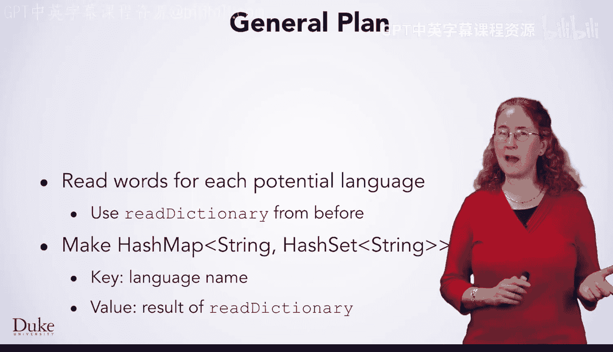

## 数据结构设计

我们需要一个复杂但强大的数据结构来组织多语言字典。其概念模型如下：

```
HashMap<String, HashSet<String>>
```

*   **键（Key）**：语言名称（例如 “English”, “French”）。
*   **值（Value）**：该语言对应的单词集合，由 `readDictionary` 方法读取。

这个嵌套了尖括号的类型看起来有些复杂，但它完美体现了**组合**这一重要的编程原则。通过将简单的数据结构（如HashMap和HashSet）组合在一起，我们可以构建出功能强大且易于理解的复杂结构。

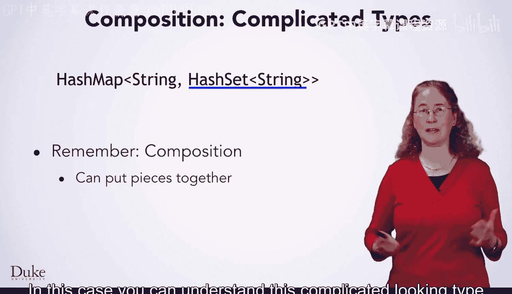

## 需要编写的新方法

为了实现上述策略，我们需要编写两个新方法。

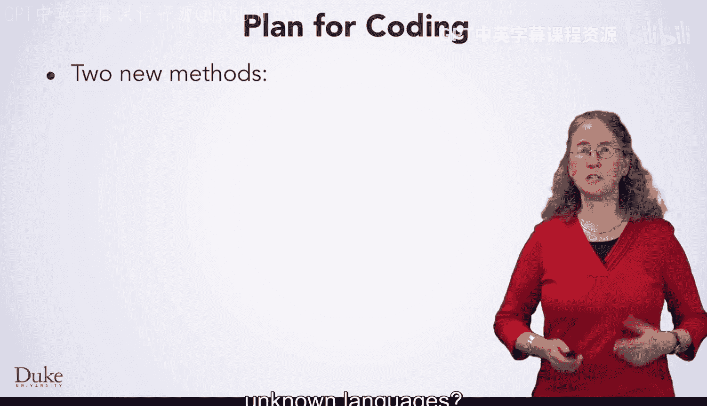

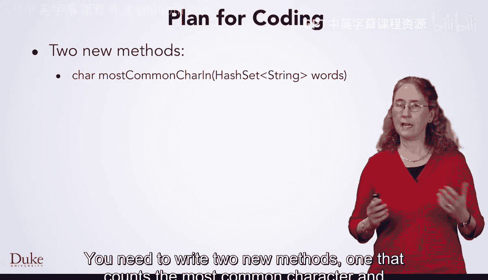

### 1. 计算单词集合中的最常见字母

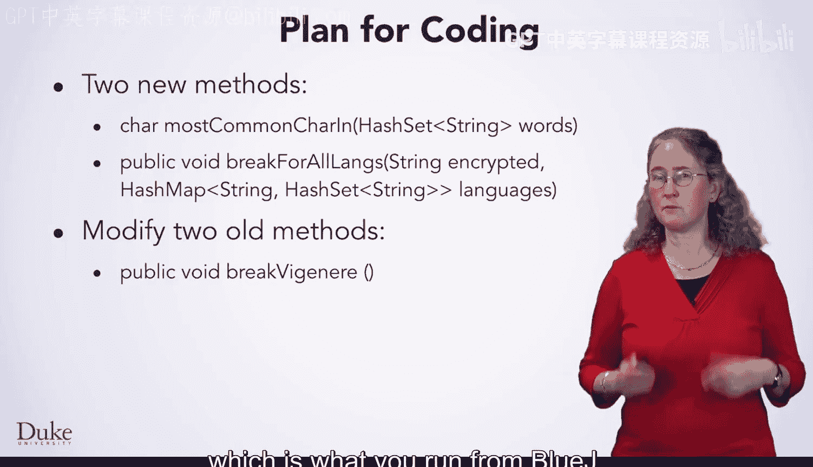

此方法接收一个 `HashSet<String>` 参数（即一种语言的单词列表），并返回该集合中出现频率最高的字符。

**核心任务**：
*   遍历单词集合中的所有单词。
*   统计每个字母出现的总次数。
*   找出出现次数最多的字母。

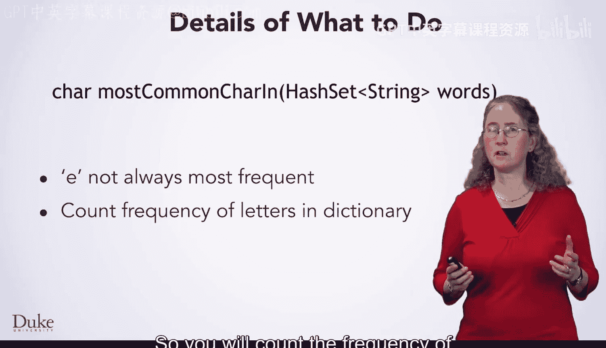

你已多次练习过计数和寻找最大值的算法，现在正是运用这些技能的时候。

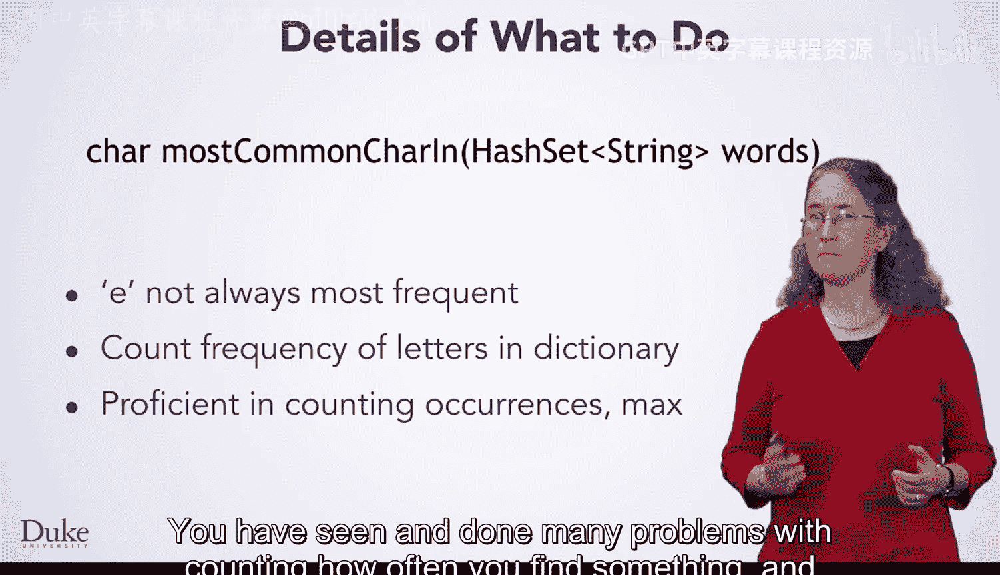

### 2. 尝试所有语言

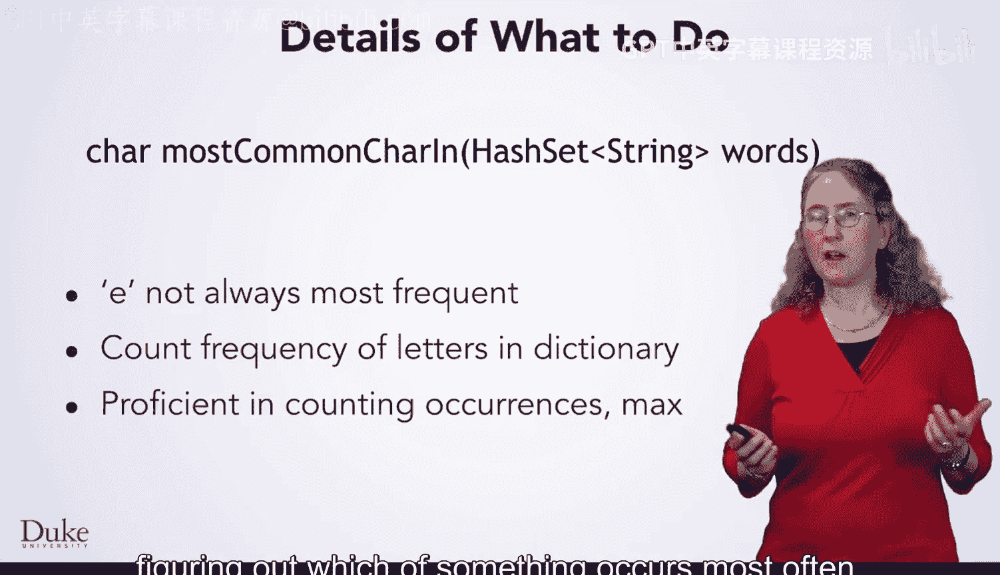

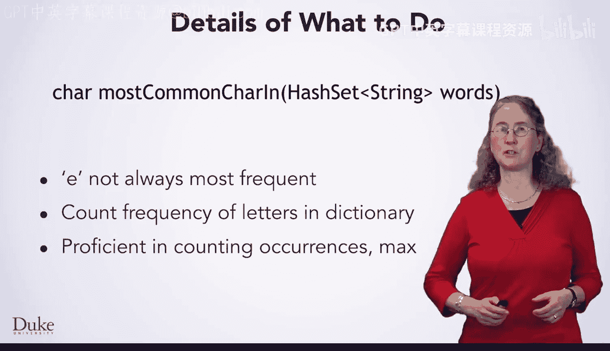

此方法接收密文和一个 `HashMap<String, HashSet<String>>` 参数（即多语言字典）。它会遍历字典中的每种语言，找出解密效果最好的那一种。

**算法流程**：
1.  初始化变量，用于记录最佳解密文本和对应的单词数量。
2.  遍历HashMap的键集（即所有语言名称）。
3.  对于每种语言：
    *   使用 `.get()` 方法从HashMap中获取该语言的单词集合。
    *   调用修改后的 `breakForLanguage` 方法尝试破解。
    *   使用已有的 `countWords` 方法计算解密文本中包含多少真实单词。
4.  比较所有语言的结果，保留单词数最多的解密文本及其语言。
5.  将最佳结果（语言和解密文本）打印输出。

## 需要修改的现有方法

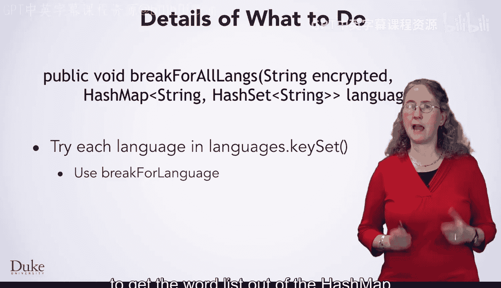

除了新方法，我们还需要对两个现有方法进行修改。

### 1. 修改 `breakVigenere` 方法

这是从BlueJ调用的主方法。修改点如下：
*   **读取字典**：不再只读取一种语言的字典，而是读取多种语言并存入我们设计的HashMap中。
*   **调用方法**：不再直接调用 `breakForLanguage`，而是改为调用新的 `breakForAllLanguages` 方法，让它尝试所有已读取的语言。

### 2. 修改 `breakForLanguage` 方法

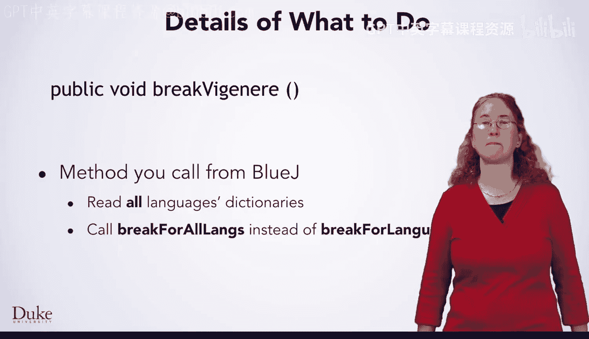

这是针对单一语言进行破解的核心方法。需要做一个小但关键的改动：
*   **动态最常见字母**：之前我们固定传入字母‘E’作为最常见字母。现在，我们需要在方法内部，使用新编写的 `mostCommonCharIn` 方法，根据传入的单词集合动态计算出该语言的最常见字母，然后将这个字母传递给 `tryKeyLength` 方法。

## 总结

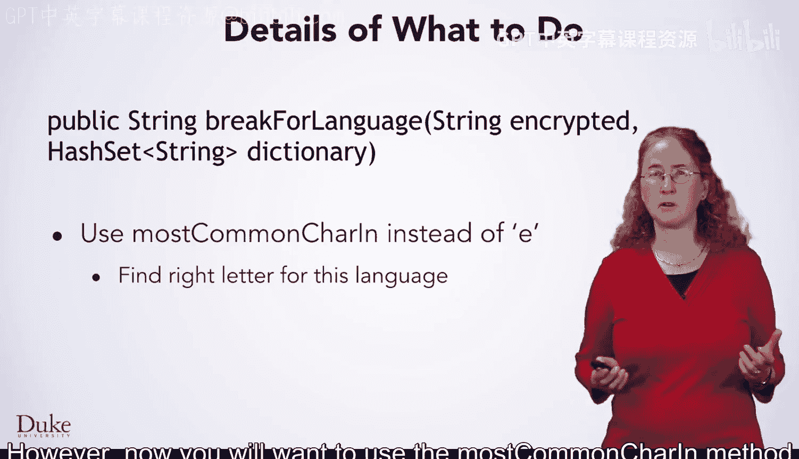

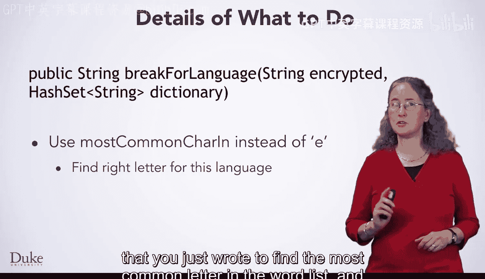

本节课中我们一起学习了如何将维吉尼亚密码破解程序升级为支持多语言版本。我们设计了使用 `HashMap<String, HashSet<String>>` 来组织多语言字典，并规划了编写 `mostCommonCharIn` 和 `breakForAllLanguages` 两个新方法的任务。同时，我们也明确了需要修改 `breakVigenere` 和 `breakForLanguage` 两个现有方法以适应新的逻辑。

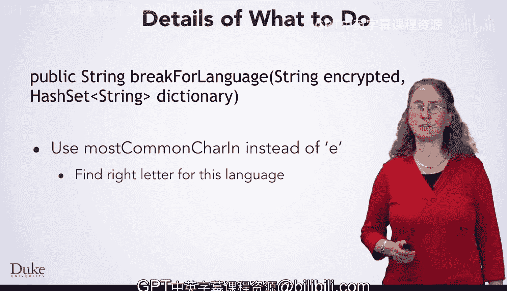

现在，你已经了解了完整的计划，是时候设计你的算法并开始编写代码了。