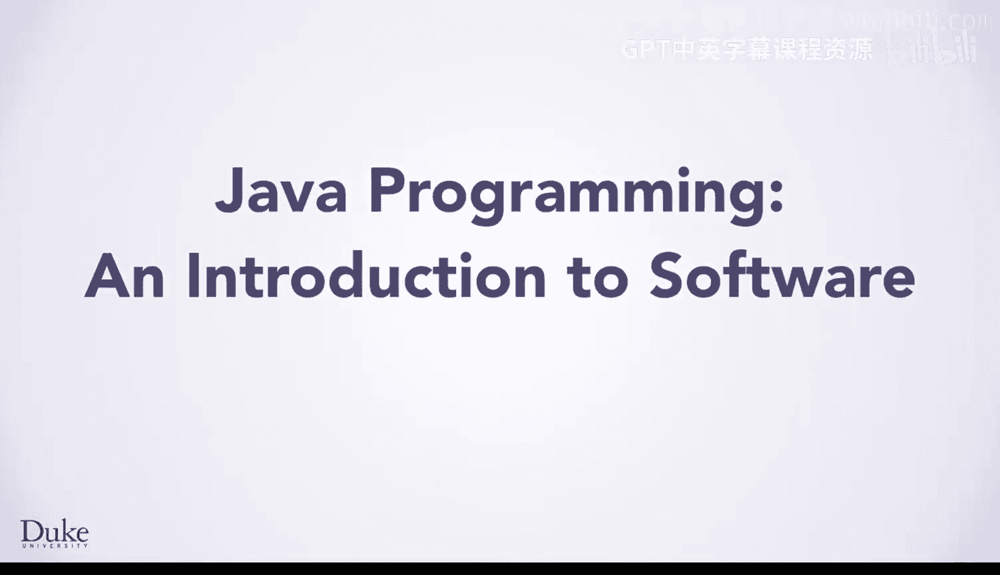
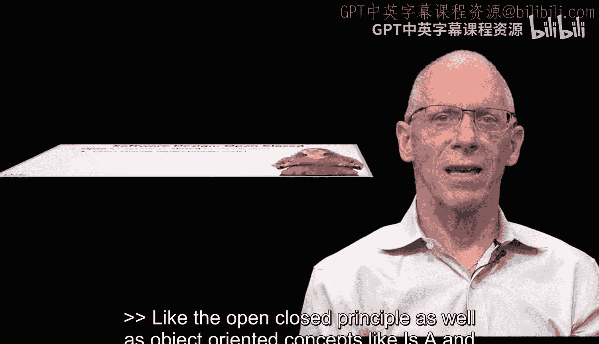
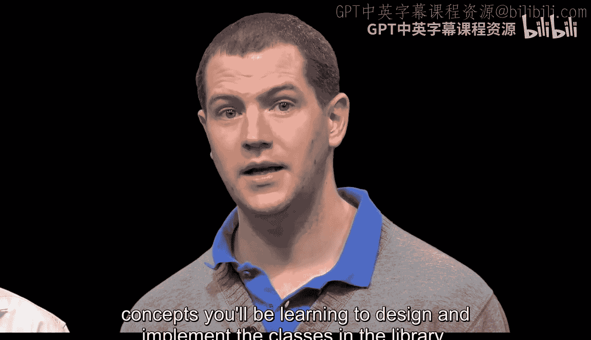

# 121：欢迎 🎉

在本节课中，我们将要学习本课程的核心主题与学习方法。课程将结合Java编程与软件设计原则，通过分析全球地震数据等实际案例，深入探讨排序、搜索以及面向对象编程的核心概念。

---

杜克大学在思考如何描述这门课程时，一句源自孔子的、令人深思的话语浮现在脑海中。

但随后意识到，孔子并非精确地写下了这句话，尽管句中每对相邻的词语确实都出现在他的言论里。

我们可以使用一种与预测文本相关的算法过程来生成这个句子，即马尔可夫文本生成过程。这很有趣。

当时我想到了莎士比亚的《罗密欧与朱丽叶》，其中有一句“地震了，现在，罗密欧必须死”。这是另一个相邻词语被发现在一起，但并非原句的例子。

如果我们有1000个有趣的短语，我们可能希望通过搜索和排序来更容易地找到有趣的短语。好主意。

巧合的是，孔子那句话里有“颤抖”这个词，而“地震”则来自《罗密欧与朱丽叶》。如果我们能对这些短语进行筛选。

这可能类似于我的邮件程序区分垃圾邮件和普通邮件的方式。

能够根据短语包含的单词数量、可读性或趣味性对其进行排序处理，将有助于理解随机文本、甚至罗密欧所提及的地震中的趋势和模式。

---

你一定已经参与了这门关于Java编程和软件设计原则的课程，因为你所讨论的主题和思想是课程的重要组成部分。

我们使用全球地震的实时和存档数据来理解排序和搜索，同时也学习诸如继承、接口和抽象类等面向对象的概念。

没错。我们是你一起创建这门课程的团队的一部分，我们非常高兴能为我们的学习者带来这门专业课程中的第四门课。

我们使用软件设计原则来阐释Java编程。

---

并且我们使用Java编程来阐释软件设计原则。

这种相互强化有助于使概念易于理解，并能迁移到其他问题甚至其他编程语言中。

尽管我们致力于培养你在Java方面的经验和专业知识，但我很高兴我们能阐释实践中广泛使用的软件设计原则，例如开闭原则，以及作为软件设计和工程基础的“是一个”和“有一个”等面向对象概念。

---

在Java和其他同样是面向对象的语言中，我们设计的问题引人入胜、可以完成，并且具有恰到好处的挑战性。

我们解释如何使用面向对象的概念设计你自己的类，但也解释如何使用标准Java库中的类和API。

例如，如果你想在不使用Edu Duke库的情况下读取文件或URL，你将看到解释如何做到这一点的课程，并且你将能够研究该库中的类，以了解我们如何使用你将学习的相同概念来设计和实现库中的类。

这将是一门很棒的课程。你将窥见我们希望你在此课程之后，使用BlueJ以外的其他编程环境继续学习Java的前景，尽管BlueJ是我最喜欢的、适合Java编程初学者的环境。

---

我们希望你会喜欢我们创建的课程。我们努力使它们准备就绪。

这让我们每个人都有些饿了。所以，我们要用饼干和气泡苹果酒来为你在课程中的未来，以及我们完成课程创建的工作而干杯。

嘿，罗伯特，你能选那个最大的饼干吗？谢谢，没错，你从剩下的饼干中选择了最大的那个。

然后我将从剩下的饼干中选择最大的那块。苏珊，你得到那块。嘿，看，它们按照大小被排序了。我想我们使用了选择排序。

现在，我们每人来点气泡苹果酒吧。我们得用...冒泡排序。干杯。

---

本节课中我们一起学习了本课程的引入，了解了它将如何通过实际案例（如地震数据分析）来结合教授Java编程与核心软件设计原则，并预览了即将学习的关键概念，如排序算法和面向对象设计。