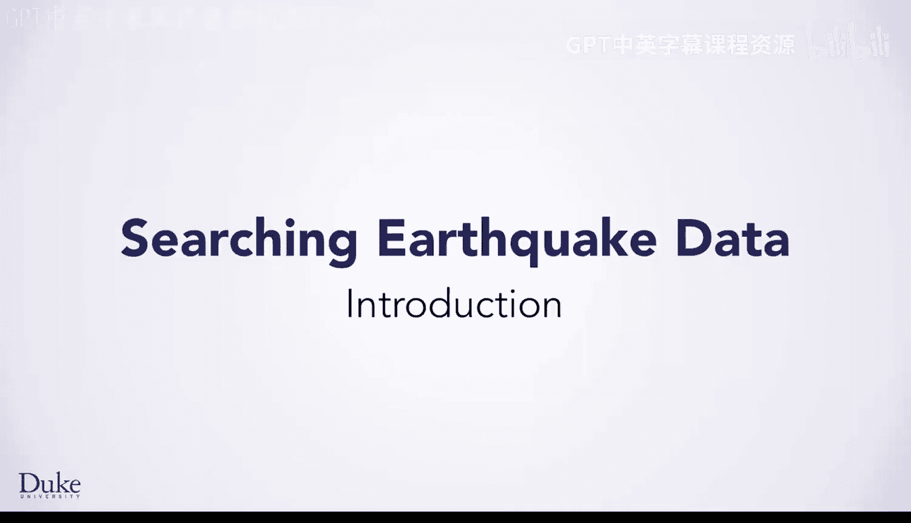
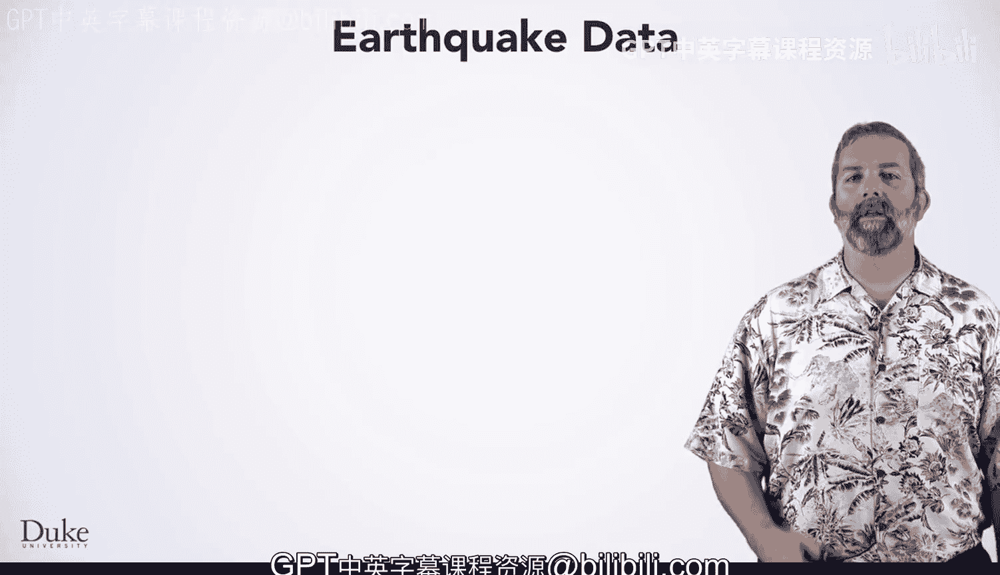
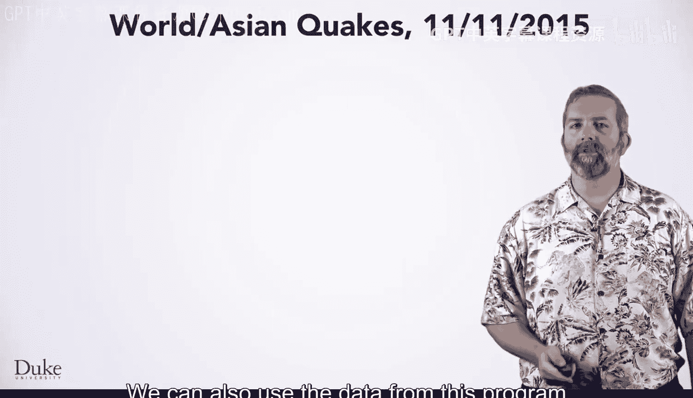
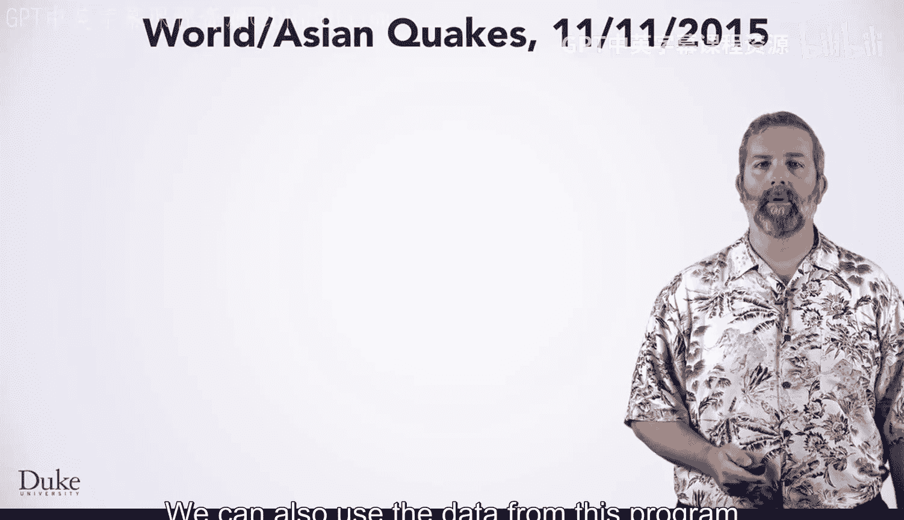
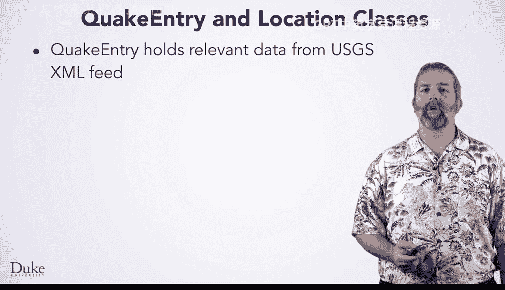
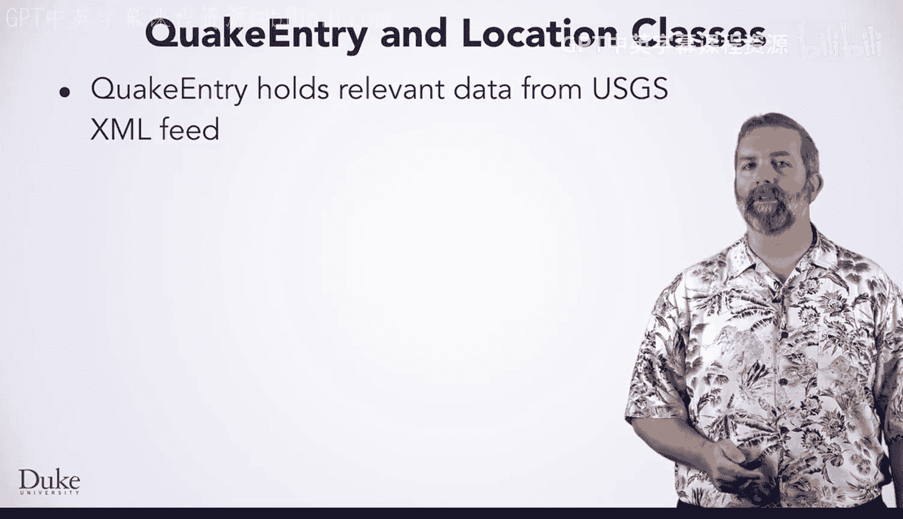

# 122：实时地震数据分析入门





在本节课中，我们将学习如何编写Java程序来分析和处理实时地震数据。我们将探讨如何访问实时数据、解析标准格式的数据、设计类与类之间的关系，并最终将这些数据可视化到地图上。这些核心编程概念是计算机科学中搜索、排序以及数据处理的基础。

## 实时数据与程序

实时数据意味着你的程序能够访问在程序运行前几秒或几分钟记录的数据。程序也能读取已记录的数据文件，这有助于在开发和测试代码时验证程序的正确性。

这些程序将展示如何设计使用其他类的类，并最终引入Java的新概念——接口。这些编程思想将用于研究计算机科学和编程中的基础概念：搜索和排序，它们有助于理解数据并快速访问所需数据。

## 数据格式与解析


数据来源于美国地质调查局（USGS）网站 `earthquake.usgs.gov` 的实时数据流。数据以XML格式下载，这是一种广泛使用的结构化数据标准格式。XML代表可扩展标记语言。JSON是另一种日益普及的数据传输和存储标准格式，代表JavaScript对象表示法。

解析这些格式的数据可能有些复杂。所有现代编程语言都提供了用于解析格式化数据的API。在本课程中，我们将提供一个API来隐藏部分细节，使数据解析更符合我们对集合和可迭代对象的使用习惯。





## 数据转换与应用

我们的程序能够解析数据并将其转换为其他格式。例如，创建Google地图需要CSV格式。转换数据是帮助解决问题和解释数据的常见应用。


以下是将XML转换为CSV的代码示例。我们创建了一个API，使你更容易编写处理地震数据的程序。

```java
// 示例：创建解析器对象处理XML数据
EarthquakeParser parser = new EarthquakeParser();
String source = "http://earthquake.usgs.gov/feed/v1.0/summary/2.5_day.atom";
ArrayList<QuakeEntry> list = parser.read(source);
```

该API可以从文件或URL获取数据。这便于使用文件中存储的相同数据测试程序，或使用每次运行时可能不同的实时数据。

## QuakeEntry与Location类

我们将使用两个核心类：`QuakeEntry` 和 `Location`。

`QuakeEntry` 类保存与地震相关的数据，这些数据来自USGS的XML数据流。它包含四个我们用于理解地震数据的实例字段：


*   **位置**：一个 `Location` 对象，用于编写代码查找彼此接近或靠近你的地震。
*   **震级**：衡量地震强度的指标。
*   **深度**：确定地震发生在地下或海下的距离。
*   **描述**：来自USGS数据流的、与地震位置相关的描述。

`Location` 是一个独立的类。我们本可以直接使用 `double` 值存储纬度和经度，但之后你会看到使用独立类的好处。一个类经常使用或包含另一个类，正如 `QuakeEntry` 类包含一个 `Location` 对象。

`Location` 对象改编自Android标准库。Android代码基于Java，是全球运行在最多智能手机上的软件。手机通常可以帮助你找到方向，因为它们基于GPS传感器知道你的位置。Android的 `Location` 类是一个健壮且经过充分测试的类，你可以在程序中使用它。

## 项目成果展示


我们使用本课中将学习的程序，记录了2015年11月11日的实时地震数据。





我们利用地震数据创建了Google地图。一张快照显示了美国加利福尼亚州的低震级地震。图例显示，黄色星标代表震级小于1.5的地震。震级小于2.0的地震通常被认为是微震。可以看到加州有很多这样的地震。

我们也可以使用该程序的数据来显示世界各地的地震。例如，一张地图显示了东南亚、日本和印度尼西亚附近地区的较高震级地震。地图使地震群更容易被观察到。

我们通过将实时数据转换为CSV文件来创建这些地图，CSV代表逗号分隔值。这种格式的数据可以直接加载到Google地图中。在本课开发Java程序时，你将看到如何转换数据以及如何使用它。

## 总结

本节课中，我们一起学习了处理实时地震数据的Java编程基础。我们了解了实时数据的概念，探讨了XML和JSON等标准数据格式及其解析方法。我们介绍了用于封装地震数据的 `QuakeEntry` 和 `Location` 类，并看到了如何将数据转换为CSV格式以进行可视化。这些核心概念和技能是进行更深入软件工程和计算机科学探索的基础，也将应用于后续的顶点项目中。