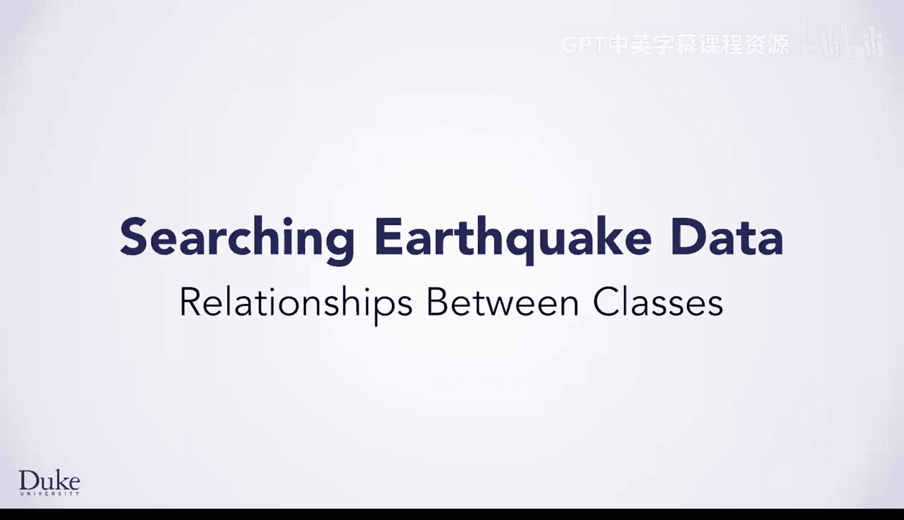
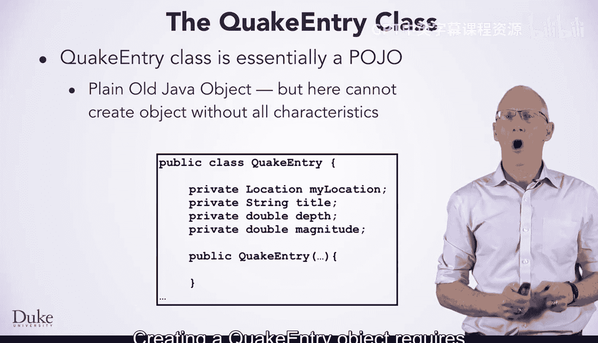
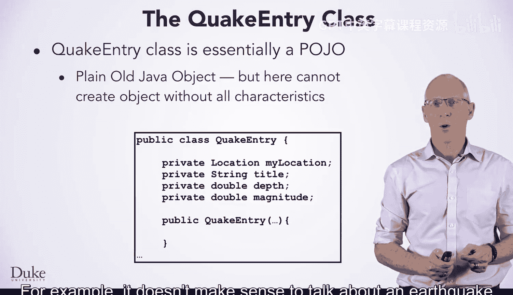
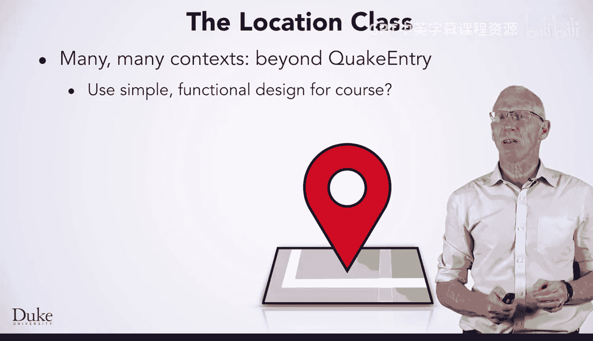
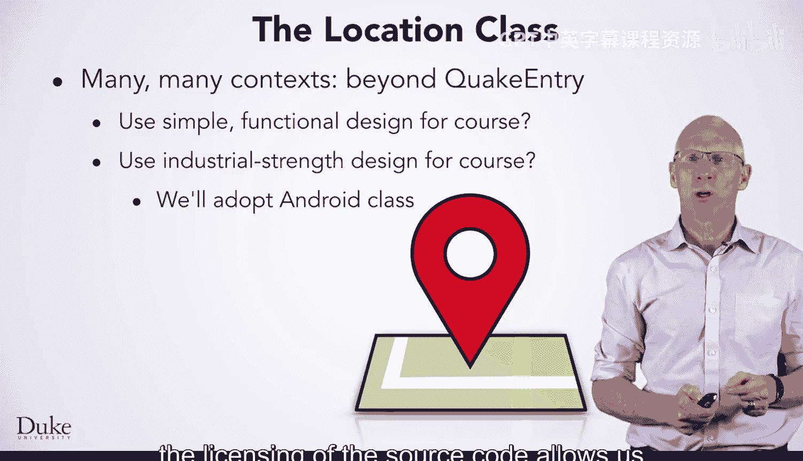
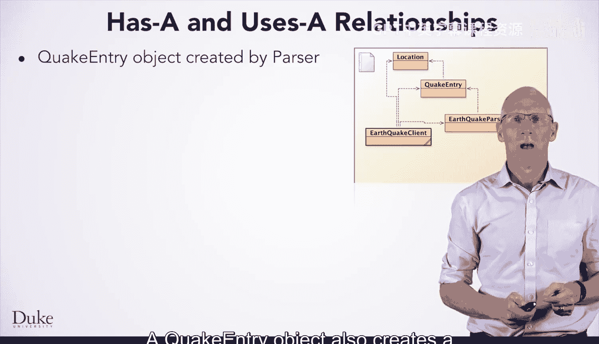
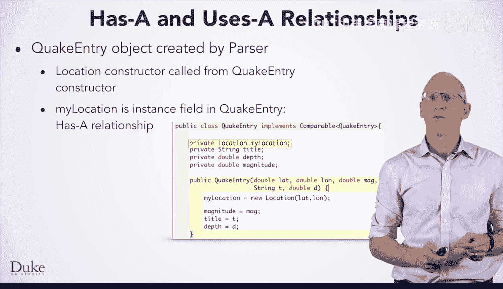
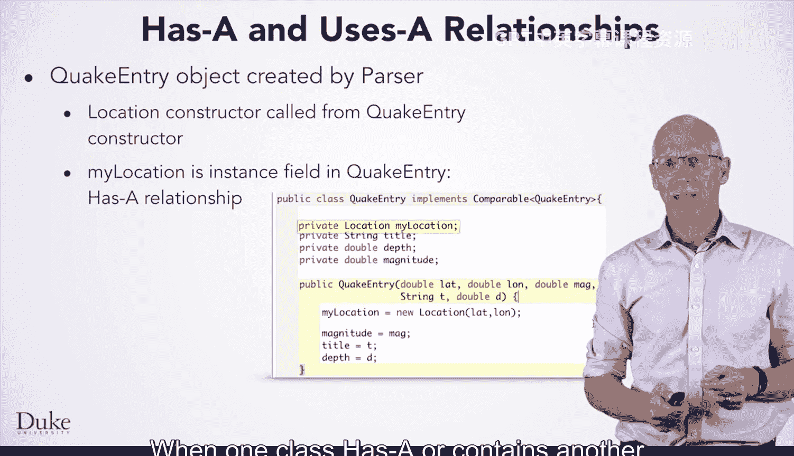
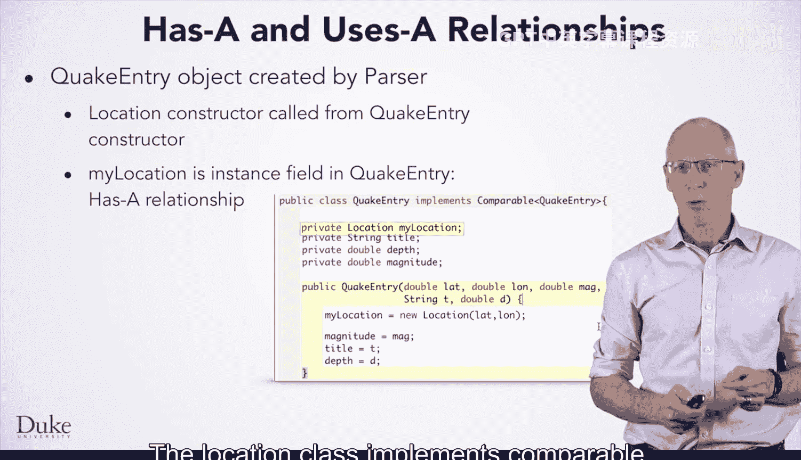
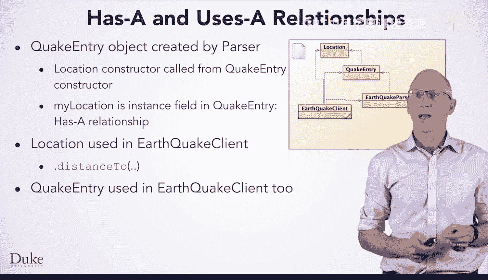

# 123：类之间的关系

在本节课中，我们将探讨面向对象编程中类如何协同工作的几个核心概念，特别是结合Java语言以及你将看到的与地震相关的程序和类。

## 概述

我们将学习两种主要的类关系：“拥有”关系和“使用”关系。理解这些关系对于构建模块化、可维护的Java程序至关重要。我们将通过分析地震数据处理程序中的几个关键类来具体说明这些概念。

## 什么是POJO（简单Java对象）？

上一节我们介绍了课程背景，本节中我们来看看什么是POJO。

`QuakeEntry`类（定义于`QuakeEntry.java`文件中）封装了一次地震的基本特征。这些特征包括地震发生的地点、震级、深度以及一个描述标题。这使得`QuakeEntry`成为一个所谓的POJO，即“简单Java对象”。

这意味着一个`QuakeEntry`对象本质上就是地震特征的集合。创建一个`QuakeEntry`对象需要提供所有这些特征。例如，如果不知道地震发生的地点或强度，讨论一次地震是没有意义的。

以下是创建`QuakeEntry`对象的关键点：

*   **必须提供所有参数**：如果不向构造函数提供所有参数，就无法创建`QuakeEntry`对象。这使得它与某些人认为的POJO略有不同。
*   **数据来源**：`QuakeEntry`对象是在读取和解析地震数据时创建的。
*   **数据完整性**：创建一个`QuakeEntry`对象需要提供一次地震的全部信息：纬度、经度、震级、标题和深度。
*   **不可变性**：`QuakeEntry`对象代表世界上某处发生的一次地震的数据，因此它是不可变的，一旦构造完成就不会改变。
*   **访问方式**：通过`getter`方法访问`QuakeEntry`对象的状态。例如：
    *   `getLocation()` 返回地震的位置。
    *   `getDepth()` 返回地震的深度。
*   **字符串表示**：`QuakeEntry`对象还有一个合理的`toString()`方法，有助于打印地震信息。

## Location类：不仅仅是POJO

既然我们已经了解了`QuakeEntry`这个简单的数据容器，本节中我们来看看一个功能更丰富的类——`Location`。

地震发生在特定地点，因此我们将使用一个`Location`类来表示位置。

`Location`类在`QuakeEntry`类之外也有许多用途。智能手机使用位置，网络浏览器使用位置，许多其他应用程序也是如此。

我们面临一个选择：是为本课程创建一个简单易用的`Location`类，还是使用一个经过工业级测试、在其他场景中也很有用的类。

我们采用了来自Android平台的`Location`类。这为我们带来了几个好处：我们可以确信这个类经过了充分测试，并且其源代码的许可允许我们根据需要来使用和修改代码。

以下是`Location`类的关键特性：

*   **创建方式**：`Location`对象由纬度和经度创建。这两个值指定了地球上的一个位置。这些值通常可能来自你的手机（从GPS卫星获取数据）或你的网络浏览器（根据你的IP地址确定位置）。
*   **核心行为**：Android的`Location`类有一个`distanceTo`方法，用于确定任意两个位置A和B之间的距离。这将允许你查找离你居住地最近的地震。
*   **超越POJO**：这使得`Location`类不仅仅是一个POJO。它拥有状态（纬度和经度），但也拥有行为（计算位置之间距离的方法）。

## 类之间的关系：“拥有”与“使用”

理解了单个类之后，现在我们来探讨它们如何相互关联。Java中的类可以同时具有“拥有”和“使用”关系。

`EarthquakeParser`类在读取和解析数据时会创建`QuakeEntry`对象。下面的类图展示了解析器如何通过创建`QuakeEntry`对象来“使用”它们。

（此处应有类图，显示`EarthquakeParser`指向`QuakeEntry`的“使用”关系箭头）

### “拥有”关系

从图中也可以看到，一个`QuakeEntry`对象也会创建一个`Location`对象。

`QuakeEntry`类通过将纬度和经度传递给`Location`对象来创建一个`Location`对象。这会使用这些数据创建一个新的`Location`对象。创建出的`Location`对象被存储在实例字段`myLocation`中。

**当一个类“拥有”或“包含”另一个类时，我们称之为“拥有”关系。**

`Location`类实现了`Comparable`接口，我们将在另一节课中讨论这一点。

### “使用”关系

正如你在类图中所见，`EarthquakeClient`类也“使用”一个`Location`对象。位置用于确定哪些地震离你（或我）居住的地方最近。我们将在编码演示中看到这一点。`Location.distanceTo`方法有助于编写这段代码。

`EarthquakeClient`类也“使用”`QuakeEntry`对象。例如，这允许客户端程序利用`QuakeEntry`类的`getMagnitude`方法来查找所有高震级的地震。

## 总结

在本节课中，我们一起学习了面向对象编程中类之间的两种核心关系。

*   **“拥有”关系**：指一个类将另一个类的对象作为其自身状态的一部分。例如，`QuakeEntry`类“拥有”一个`Location`对象。
*   **“使用”关系**：指一个类在其方法中创建、操作或以其他方式调用另一个类的对象。例如，`EarthquakeParser`和`EarthquakeClient`类都“使用”`QuakeEntry`和`Location`对象。

我们还区分了简单的数据容器（如`QuakeEntry`这样的POJO）和既包含数据又包含行为（方法）的类（如`Location`）。理解这些关系是设计清晰、高效Java程序的基础。

编程愉快！🚀