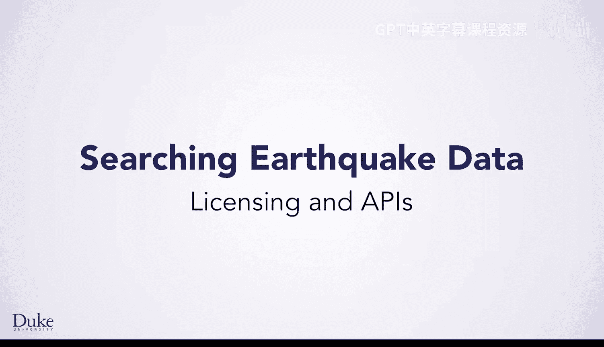
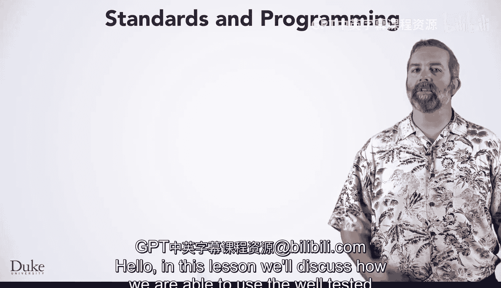
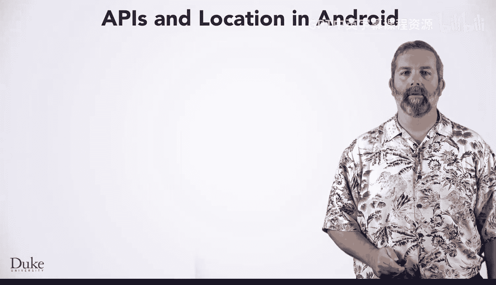
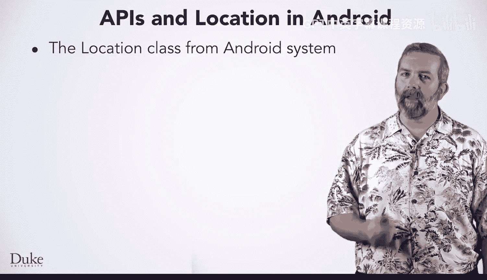

# 124：许可与API 📚

在本节课中，我们将讨论如何在我们的程序中使用经过充分测试的 Android `Location` 类。我们将了解其 API 文档、使用方法以及相关的开源许可协议。

---

## 理解 Location 类 API 🔍

上一节我们介绍了使用现有代码库的重要性，本节中我们来看看如何具体理解和使用 `Location` 类。

`Location` 类中的 `distanceTo` 方法附带注释，说明了该方法的功能。阅读文档是创建程序的重要组成部分。该方法返回两个位置之间以米为单位的距离。我们在后续编写代码时需要记住距离单位是米。

你还可以看到，该方法使用了 WGS84 椭球体标准。遵循标准是一个好做法，它有助于确保我们的代码健壮、被广泛社区接受，并且其正确性可被验证。这里使用的是 1984 年确立的世界大地测量系统。我们应该庆幸可以依赖这个标准，而不是试图自己去计算像地球这样的三维椭球体上两点间的距离。

---

## Android 系统与 Location 类 📱

我们正在使用的 `Location` 类来自 Android 系统。Android 是目前智能手机和设备上使用最广泛的操作系统。

与许多现代 API 一样，你可以在网上阅读文档并理解 `Location` API。这个 API 在开发众多运行于 Android 下的位置感知应用程序时非常有用。

要使用 `Location` 类，你需要做以下几件事：
*   阅读文档以了解如何使用该类以及 API 对使用该类有何说明。
*   根据你在 API 中读到的内容创建 `Location` 对象。
*   遵循 API 文档的说明调用像 `distanceTo` 这样的方法，并使用 API 中的概念来测试你的代码。

---

## 开源许可：Apache 2.0 ⚖️

Android 的 `Location` 类被授权允许复用。`Location` 类使用了 Apache 2.0 开源软件许可。你可以在线阅读此许可允许事项的详细信息。来自 Android 系统的 `Location.java` 附带的文档指明了所使用的许可。

Apache 2.0 许可明确允许复用 `Location` 类中的代码，并允许对代码进行修改。这非常棒，因为我们已获取该代码并做了一些修改。我们的改编移除了 `Location` 类对 Android 系统的依赖，使其能在 Android 系统之外使用。我们仍然受益于该类经过的健壮测试和开发，因此我们确信它能正常工作。

我们同样采用了相同的 Apache 许可，正如你在这里看到的。因为我们选择了 Apache 2.0 许可，所以你也可以改编代码并进行修改。它在我们的示例中按原样工作，因此如果你愿意，也可以直接使用而无需更改。这种社区共享编程是创建软件的强大工具。

---

本节课中，我们一起学习了如何查阅和使用 Android `Location` 类的 API 文档，了解了遵循标准的重要性，并认识了允许我们复用和修改代码的 Apache 2.0 开源许可。理解 API 和许可协议是有效利用现有代码库、进行协作开发的关键步骤。