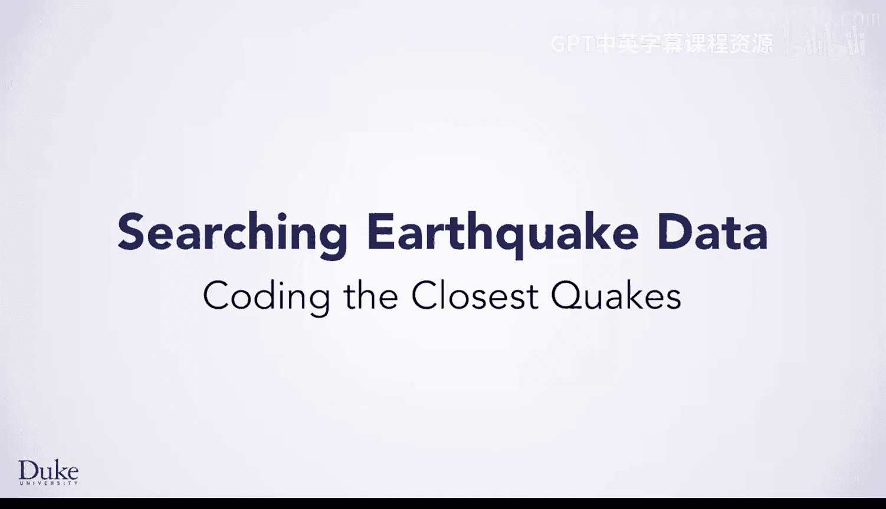
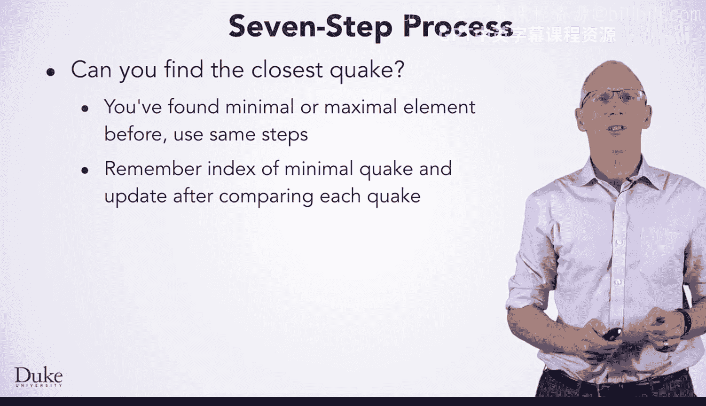
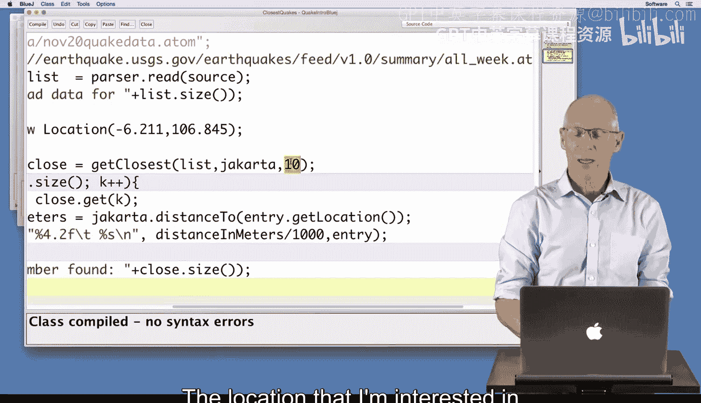
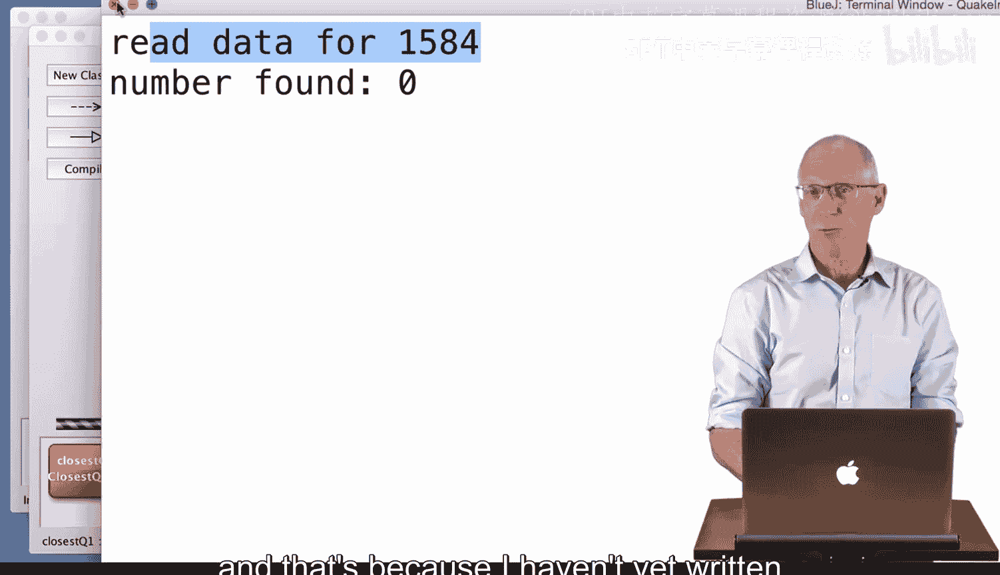
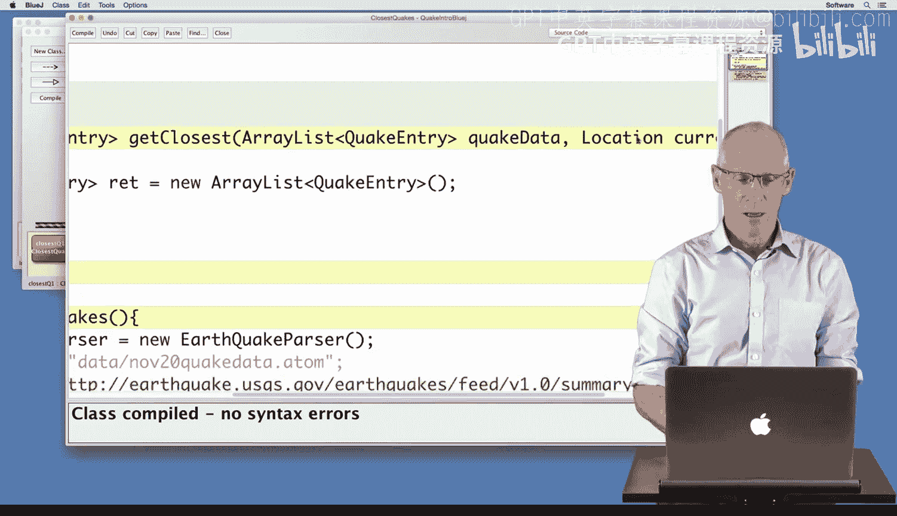
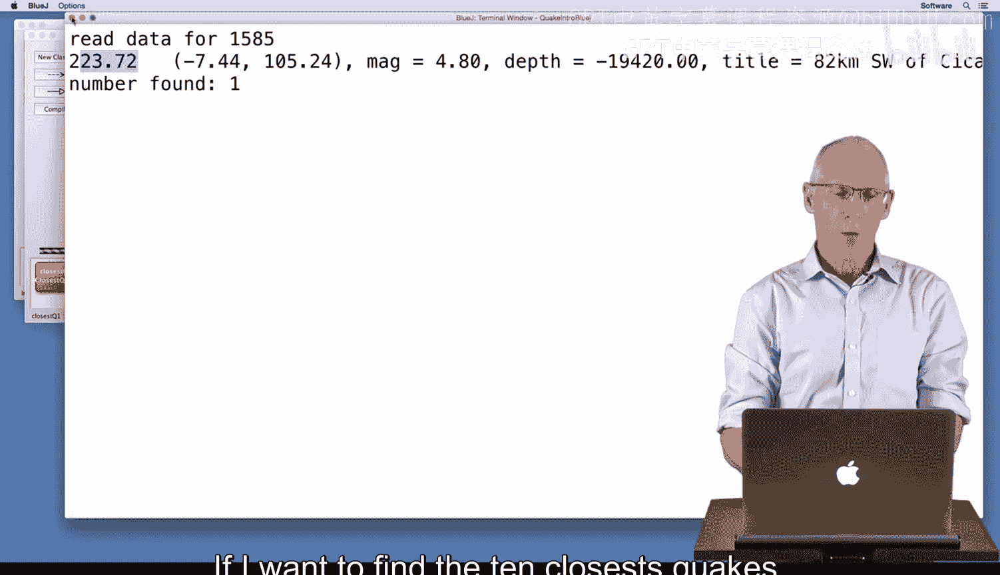
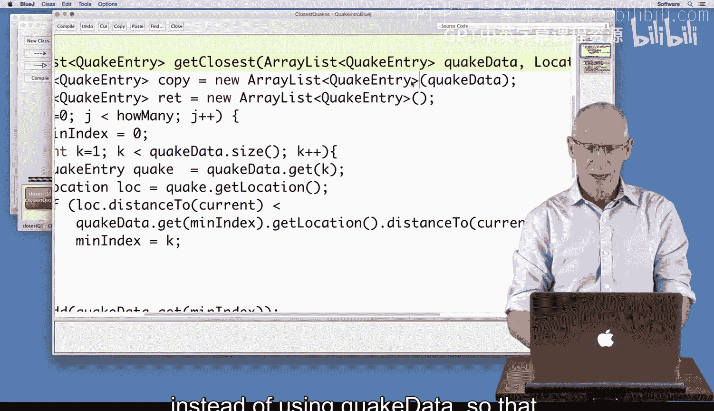
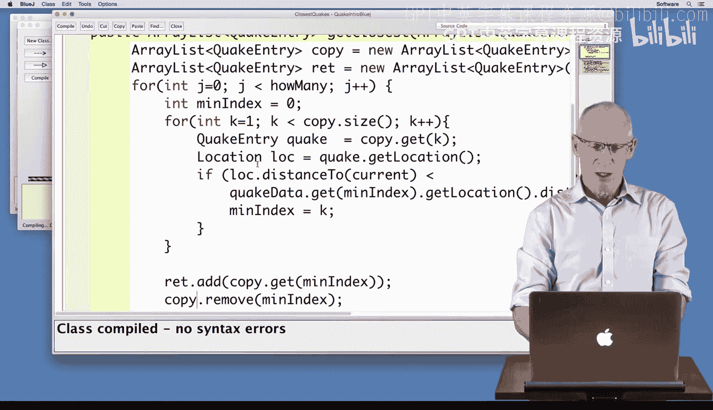
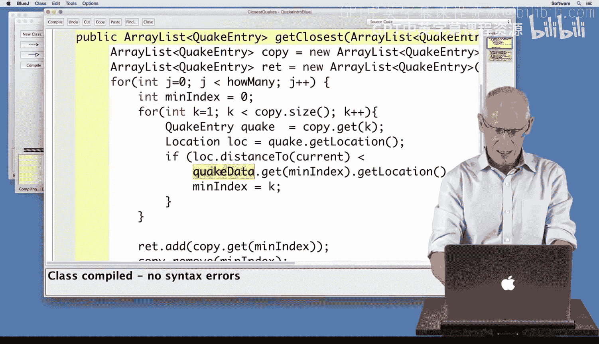

# Java编程和软件工程基础：2-5：编写最近地震查询 🌍



在本节课中，我们将学习如何编写一个Java程序，用于查找距离指定位置最近的若干次地震。我们将以印度尼西亚雅加达为例，但代码适用于任何城市。我们将通过一个七步流程，从查找单次最近地震开始，逐步扩展到查找前十次最近地震，并确保不修改原始数据。

---

## 概述 📋



你可能想知道某个特定地点是否处于地震危险区。在本编程演示中，我们将描述如何找到距离你居住地最近的10次地震，或者距离朋友所在城市最近的10次地震。我们将为特定地点（如纽约市或印度尼西亚雅加达）编写代码，但该代码适用于任何地点。我们的代码将找到最近的10次地震，但我们可以将10替换为任何数字。

你之前解决过一个类似的问题：在元素列表中查找最小或最大元素。这个问题类似，我们将找到距离特定位置最近的地震。然后，我们将重复这个过程，但首先，我们需要从数据集中移除最近的地震。我们需要移除最近的地震，但我们不希望改变地震列表。因此，我们需要制作一个副本，以避免删除地震数据。在演示中，我们将使用10和印度尼西亚雅加达，但你可以找到距离你选择的任何城市最近的57次地震。

---



## 查找单次最近地震 🔍



上一节我们介绍了问题的背景和目标，本节中我们来看看如何实现查找单次最近地震的核心算法。这个算法与你之前见过的在列表中查找最小或最大元素的算法类似。



我们将跟踪一个数组列表中最近地震的索引，即距离雅加达最近的那个。每次检查一个地震条目时，如果需要，我们会更新最近索引的值。

以下是实现查找单次最近地震的代码步骤：

```java
public ArrayList<QuakeEntry> getClosest(ArrayList<QuakeEntry> quakeData, Location current, int howMany) {
    ArrayList<QuakeEntry> copy = new ArrayList<QuakeEntry>(quakeData);
    ArrayList<QuakeEntry> ret = new ArrayList<QuakeEntry>();
    
    for(int j=0; j < howMany; j++) {
        int minIndex = 0;
        for(int k=1; k < copy.size(); k++) {
            QuakeEntry quake = copy.get(k);
            Location loc = quake.getLocation();
            if (loc.distanceTo(current) < copy.get(minIndex).getLocation().distanceTo(current)) {
                minIndex = k;
            }
        }
        ret.add(copy.get(minIndex));
        copy.remove(minIndex);
    }
    return ret;
}
```

---

## 扩展到查找多次最近地震 🔄

上一节我们成功实现了查找单次最近地震，本节中我们来看看如何扩展这个逻辑以查找多次最近地震。核心思想是将查找单次最近地震的代码放入一个循环中，重复执行指定次数。

但是，有一个关键问题：在找到最近的地震后，如果不将其从数据集中移除，下一次查找会再次找到同一个地震。因此，在每次找到最近地震后，我们需要将其从用于查找的副本列表中移除。

以下是实现查找多次最近地震的完整代码逻辑：

1.  **创建数据副本**：首先，创建传入的`quakeData`列表的副本，以避免修改原始数据。
2.  **初始化返回列表**：创建一个空的`ArrayList<QuakeEntry>`用于存储结果。
3.  **外层循环**：循环`howMany`次，以找到指定数量的最近地震。
4.  **内层循环（查找单次最近）**：在每次外层循环中，执行与查找单次最近地震相同的算法，但在副本数据`copy`上操作。
5.  **记录并移除**：找到最近地震后，将其添加到返回列表`ret`中，并从副本`copy`中移除，确保下次查找不会重复找到它。
6.  **返回结果**：循环结束后，返回包含指定数量最近地震的列表。



---

## 代码实现与测试 🧪

现在，让我们将上述逻辑整合到`getClosest`方法中，并进行测试。我们将使用从美国地质调查局（USGS）源读取的1，584次地震数据，并查找距离雅加达最近的10次地震。

运行程序后，我们将看到输出显示了从雅加达出发，距离从最近到第十近的地震信息，验证了我们的代码能够正确工作。

---

## 总结 🎯



本节课中我们一起学习了如何编写一个Java程序来查找距离指定位置最近的多次地震。我们回顾了查找最小元素的基本算法，并将其扩展为重复查找并移除已找到元素的过程。关键步骤包括：





*   **算法基础**：使用与查找列表中最小元素相同的逻辑来查找单次最近地震。
*   **循环扩展**：通过外层循环重复查找过程，以获取指定数量的最近地震。
*   **数据保护**：通过创建原始数据列表的副本来进行操作，确保不修改输入参数。
*   **避免重复**：在每次找到最近地震后，将其从当前搜索的副本中移除，以确保下次能找到“下一个”最近的地震。

通过这个方法，你可以轻松地修改位置（`current`）和数量（`howMany`）参数，来查询世界上任何城市附近的最近地震情况。