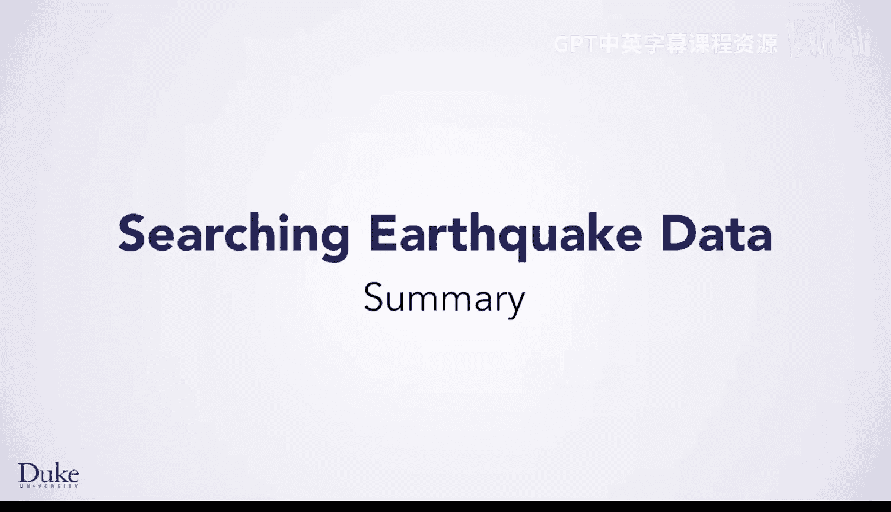
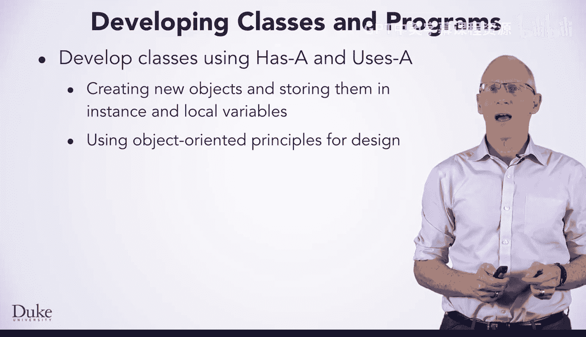
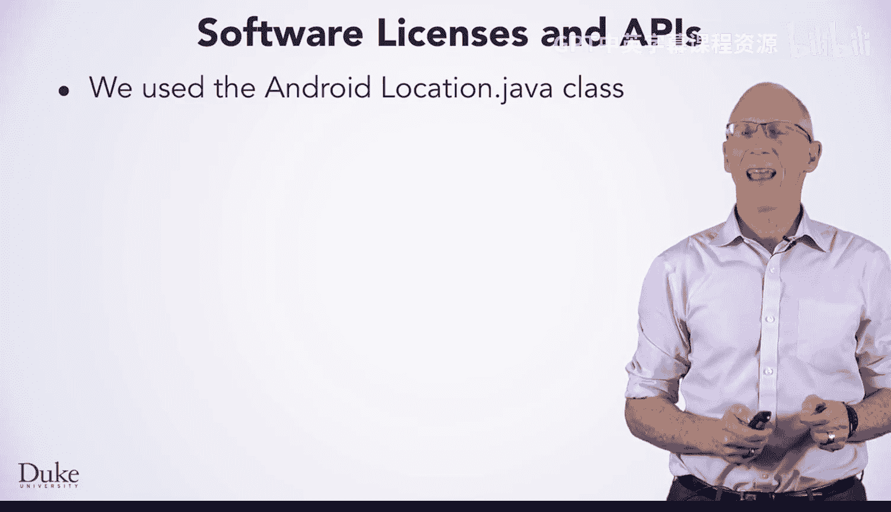
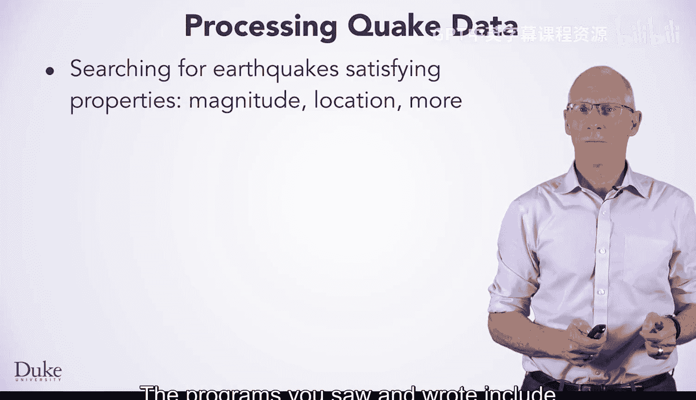
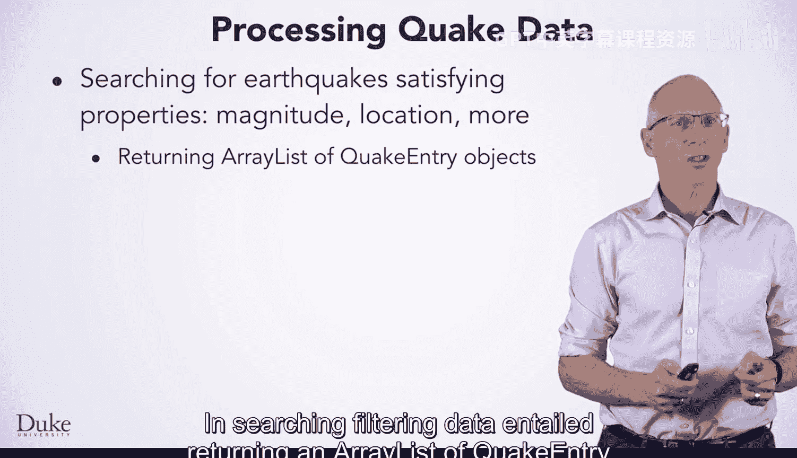
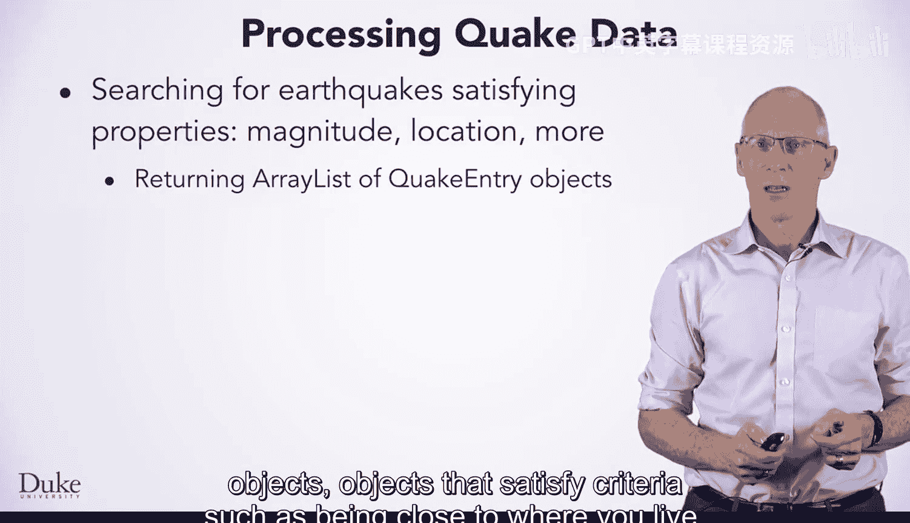
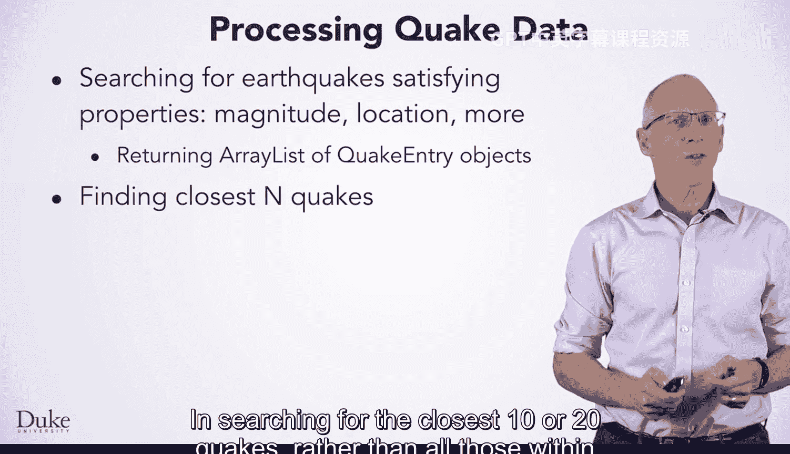
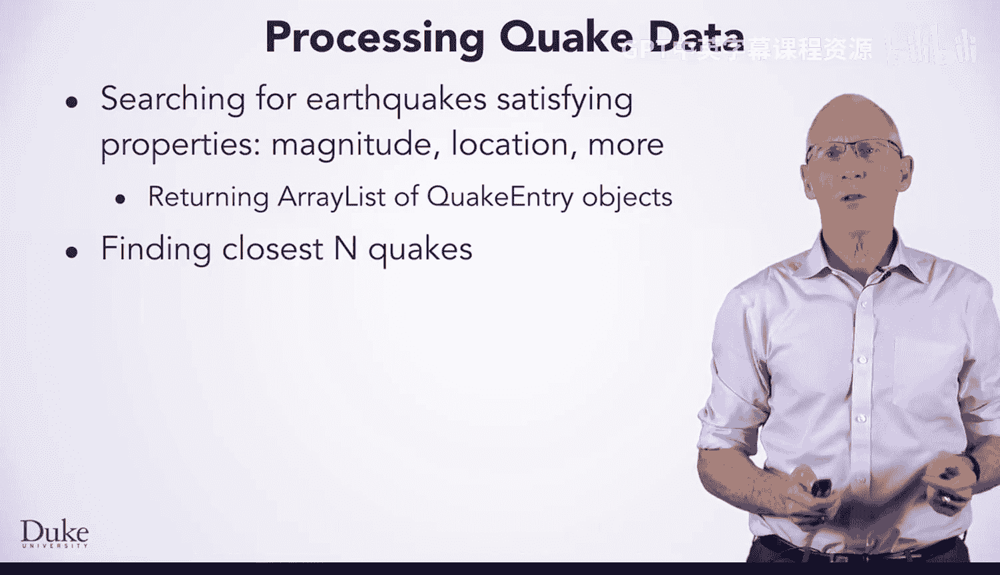

# 127：课程总结 🎓

在本节课中，我们将回顾和总结在开发、使用类来处理地震数据过程中所涉及的代码与核心概念。

## 类的关系与面向对象设计 🧩

上一节我们介绍了如何利用类来处理数据，本节中我们来看看类之间的交互关系。在面向对象设计中，类之间普遍存在“有一个”（HAS-A）和“使用”（USES）的关系。这通常通过以下方式实现：

*   将对象存储为类的**实例变量**。
*   在方法中将对象作为**局部变量**使用。

这些是标准的面向对象设计概念，其应用并不仅限于Java，而是适用于所有面向对象的编程语言。

## 数据处理与外部依赖 🔄

从处理流式数据的实践中，我们接触了几个关键点。我们处理的数据是流式的，这意味着程序每次运行时数据都可能发生变化。在解析数据时，我们将其视为一个“黑盒”，依赖Java库来解析XML格式的数据。

以下是我们在开发中依赖外部代码的方式：
*   我们开发的XML解析器依赖于标准的Java API。
*   你们编写的地震数据处理代码，既依赖于标准Java库的API，也依赖于我们提供的API。

为了便于调试，我们使用了存储在本地而非实时流式传输的数据。这种方法允许我们进行更小规模、可重复的调试运行。

## 软件开发与开源许可 📜

我们简要提及了软件开发中的一个重要部分：软件许可。在课程中，我们使用了来自Android平台的 `Location.java` 类。使用经过充分测试的成熟代码有助于确保我们程序的健壮性。

`Location` 类采用了 Apache 2.0 许可证，这是一个标准的开源软件许可证。该许可证允许我们在Android平台之外修改代码以满足自身需求。我们也可以选择其他许可证来授权修改后的代码，但在此我们同样选择了 Apache 2.0 许可证。

在其他课程中，我们还使用了 Apache Commons CSV 类来解析逗号分隔值文件。该代码库同样采用 Apache 2.0 许可证，尽管我们并未修改CSV库本身。

## 编程实践与数据搜索 🗺️

在处理地震数据的过程中，你们练习了编程和设计技能。所见所写的程序主要用于搜索地震数据，即寻找满足特定震级和位置属性的数据。

在搜索过程中，过滤数据意味着返回一个满足特定条件的 `QuakeEntry` 对象列表。例如，返回距离你居住地较近的地震数据。

当搜索最近的10次或20次地震，而非所有1000公里范围内的地震时，我们采用了不同但相似的技术。一个关键点是，我们复制了被搜索的数据，因为我们编写的代码在搜索过程中会修改原始数据。

## 课程总结 📚

本节课中我们一起学习了面向对象设计中类的关系、处理流式数据的方法、开源软件许可的重要性，以及实现数据搜索与过滤的具体编程技巧。这些概念和技能为未来进一步学习数据的搜索与排序奠定了坚实的基础。

祝你编程愉快！