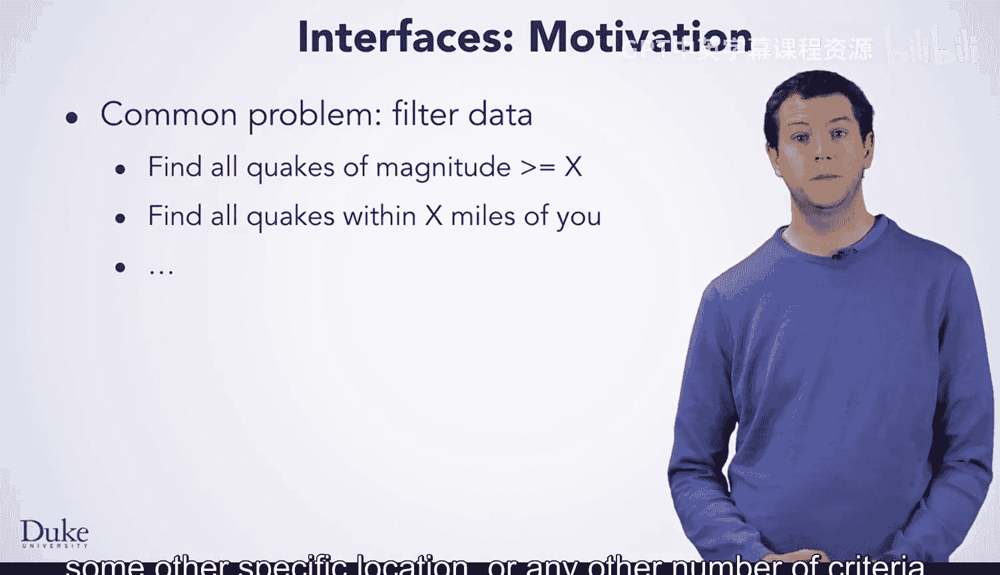

# 128：地震数据过滤问题介绍 🧭

在本节课中，我们将要学习如何利用地震数据解决一个常见问题：数据过滤。当数据包含大量信息时，我们常常需要根据特定条件筛选出符合要求的数据子集。

## 数据过滤问题概述 📊

上一节我们介绍了处理地震数据的基本方法。本节中我们来看看一个具体的应用场景：数据过滤。

使用地震数据时，你可能希望解决的另一类问题，即当数据包含大量信息时，一个非常常见的问题类型，是将数据进行过滤。具体来说，就是输入一个地震数据的数组列表，然后输出一个新的数组列表，其中只包含符合某些特定条件的地震记录。

以下是几个常见的过滤条件示例：
*   例如，你可能只对震级达到某一特定阈值的地震感兴趣。
*   或者，你可能只想检查发生在你或其他特定地点一定距离范围内的地震集合。
*   当然，也可以是任何其他数量的条件。

## 解决思路与代码重复问题 ⚙️

上一节我们定义了过滤问题，本节中我们来看看如何解决它，并思考更优的编程实践。

如果你要针对上述任何一个条件来解决这个问题，你会发现这并不需要新的算法概念。你应该能够应用“七步法”，并使用你已经学过的知识将算法转化为代码。

然而，如果你需要针对不止一个条件来解决这个问题，例如编写一个按震级过滤的方法和另一个按距离过滤的方法，你会发现针对这两种条件的算法和代码非常相似。

如果你有很多过滤条件，你会发现自己基本上是在反复解决同一个问题，并且编写看起来非常相似的代码。在编程时，你应该避免重复代码，即避免一遍又一遍地重写相似的代码。

这不仅浪费你的时间，还会引入更多出错的机会，并使你的代码在未来更难维护。

## 引入通用过滤方法 🚀

前面我们看到了为每个条件单独编写方法会导致代码重复。一个更好的方法是编写一个通用的方法来过滤地震数据。

更好的方法是编写一个通用的方法来过滤地震数据，该方法接受一个参数，用于指定过滤条件是什么。编写这种通用方法需要一个我们将要学习的新概念。

本节课中我们一起学习了地震数据过滤的需求、为每个条件单独编写方法的局限性，以及引入通用方法来解决代码重复问题的必要性。在接下来的课程中，我们将深入探讨实现这个通用方法所需的新概念。