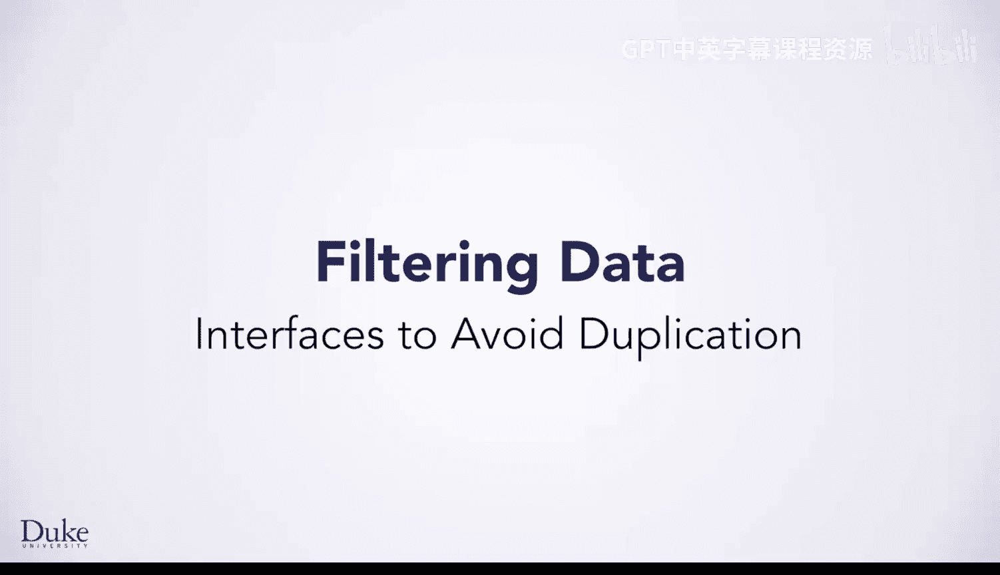
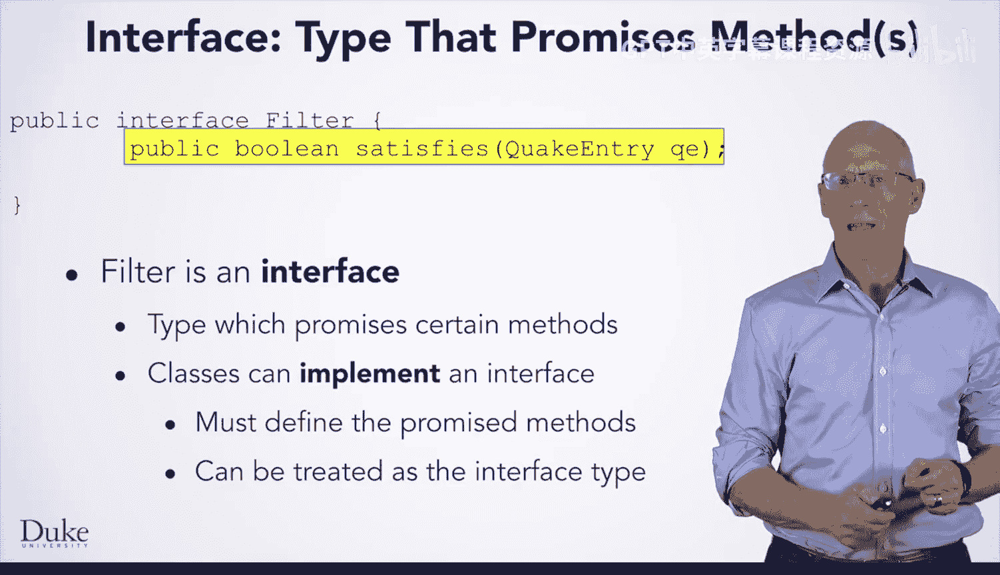
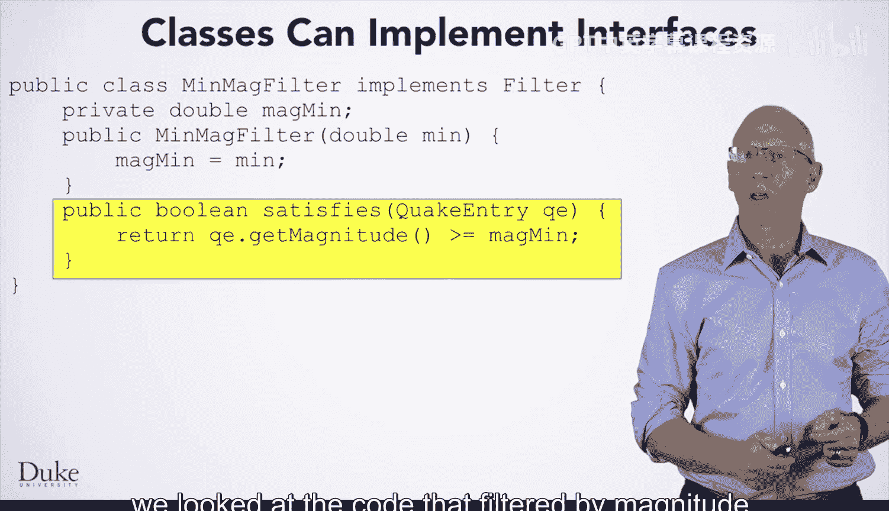
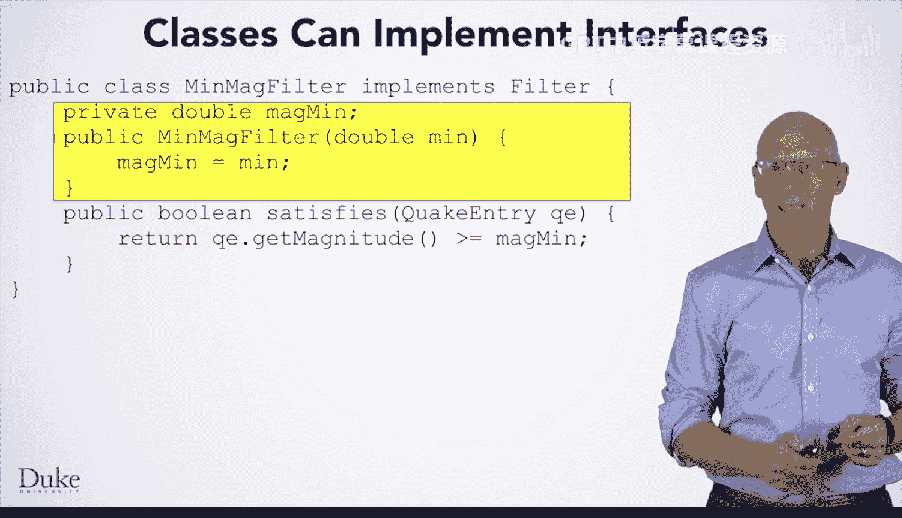
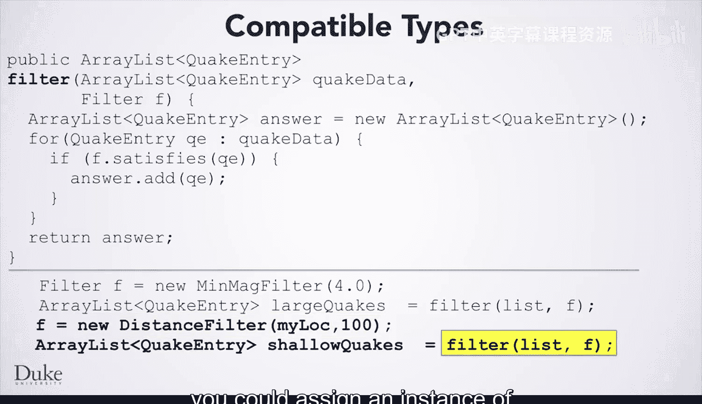

# Java编程和软件工程基础：2-5：避免重复的接口



## 概述
在本节课中，我们将要学习如何通过使用接口来避免代码重复。我们将通过比较两个功能相似但细节不同的方法开始，然后介绍如何创建一个通用的过滤方法，并最终理解接口如何作为类型来帮助我们实现这一目标。

## 从两个相似的方法开始
为了开始，我们先来看两个你可能会编写的过滤方法，并观察它们之间的相似之处。

以下是按震级过滤地震的方法，它只将震级达到特定最小值的地震放入结果中。

```java
public ArrayList<QuakeEntry> filterByMagnitude(ArrayList<QuakeEntry> quakeData, double magMin) {
    ArrayList<QuakeEntry> answer = new ArrayList<QuakeEntry>();
    for(QuakeEntry qe : quakeData) {
        if(qe.getMagnitude() >= magMin) {
            answer.add(qe);
        }
    }
    return answer;
}
```

方法名`public ArrayList<QuakeEntry>`写在单独一行只是为了在屏幕上显示更清晰，这对Java或大多数编程语言并不重要。

这个方法以直接的方式进行。它首先为结果创建一个空的`ArrayList`，然后使用`for`循环检查输入参数`ArrayList`中的每个地震。对于每个满足条件（震级至少为`magMin`）的地震，将其添加到结果`ArrayList`中。如果你用七步法解决这个问题，你可能会写出完全相同的代码。

以下是另一个按与特定位置的距离过滤地震的方法。

```java
public ArrayList<QuakeEntry> filterByDistanceFrom(ArrayList<QuakeEntry> quakeData, double distMax, Location from) {
    ArrayList<QuakeEntry> answer = new ArrayList<QuakeEntry>();
    for(QuakeEntry qe : quakeData) {
        if(qe.getLocation().distanceTo(from) < distMax) {
            answer.add(qe);
        }
    }
    return answer;
}
```

请注意它与之前代码的相似程度。实际上，只有三个不同之处：
1.  方法名已更改，以反映此方法执行的任务。
2.  参数不同。这个方法接受最大距离和一个位置，而震级过滤器只接受最小震级。
3.  决定是否将当前迭代的地震添加到结果`ArrayList`的条件不同。

## 寻找避免重复的方法
每当代码中有如此多的相似之处时，你可能希望找到一种方法来避免代码重复。特别是，当你发现自己想要复制粘贴代码然后进行修改时，通常应该考虑是否有不同的方法。

这里你可以看到一个不同且更好的方法。这是一个通用的过滤方法，它接受一个参数`filter f`，该参数指定如何确定特定地震是否应包含在输出列表中。

```java
public ArrayList<QuakeEntry> filter(ArrayList<QuakeEntry> quakeData, Filter f) {
    ArrayList<QuakeEntry> answer = new ArrayList<QuakeEntry>();
    for(QuakeEntry qe : quakeData) {
        if(f.satisfies(qe)) {
            answer.add(qe);
        }
    }
    return answer;
}
```

然后，代码在每个被迭代的地震上调用`f.satisfies()`，并使用`satisfies`方法的返回值来决定是否包含该地震。

这个方法看起来很棒，但你可能想知道如何制作具有不同`satisfies`方法的过滤器？

## 理解接口
答案是，`Filter`是一个接口，而不是一个类。你可以在这里看到它的声明。



```java
public interface Filter {
    public boolean satisfies(QuakeEntry qe);
}
```

请注意声明中写的是`interface`，而你通常写的是`class`。在这里写`interface`而不是`class`，是告诉Java`Filter`不是一个类，而是一个接口。接口不定义方法的行为，它只是一种类型。这种类型承诺所有实现该接口的类中都将存在某些方法。

在这里，`Filter`接口承诺了这样一个方法：`public boolean satisfies(QuakeEntry qe)`。

## 实现接口
一旦你声明了一个接口，你就可以编写实现它的类。当你编写一个实现接口的类时，你必须定义接口规范中承诺的所有方法。然后，该类的对象就可以被视为接口类型。

如果你编写了一个实现`Filter`的类，那么从该类创建的对象可以赋值给`Filter`类型的变量，或者作为参数传递给期望`Filter`类型的方法。

让我们看一个例子。以下是`MinMagFilter`，一个检查地震是否具有最小震级的类。



```java
public class MinMagFilter implements Filter {
    private double magMin;

    public MinMagFilter(double min) {
        magMin = min;
    }

    @Override
    public boolean satisfies(QuakeEntry qe) {
        return qe.getMagnitude() >= magMin;
    }
}
```

你可以看到这个类的声明写着`implements Filter`。当你这样写时，Java会检查并确保该类拥有`Filter`接口承诺的所有方法。如果缺少一个，该类将无法编译。这允许你在编写的代码中将`MinMagFilter`对象视为过滤器。



在这里，你可以看到这个类拥有承诺的`satisfies`方法。该方法简单地检查传入地震的震级是否大于等于存储在对象实例变量中的`magMin`（最小震级）。请注意，这个方法的主体与我们之前看到的按震级过滤的代码中的条件是多么相似。

## 类的其他成员
这个类除了指定的方法外，还可以有其他成员。这里有一个实例变量来保存最小震级，以及一个从其参数初始化该实例变量的构造函数。这些在`Filter`的规范中并未承诺。如果需要，你也可以在类中编写其他方法，但你必须编写`satisfies`方法。

## 使用通用过滤方法
在顶部，你可以看到我们之前为通用过滤方法编写的代码。在底部，你可以看到如何将`MinMagFilter`对象赋值给`Filter`变量并将其传递给此方法。

```java
Filter f = new MinMagFilter(4.0);
ArrayList<QuakeEntry> largeQuakes = filter(quakeData, f);
```

这个第一个赋值语句的右侧创建了一个新的`MinMagFilter`，传入了`4.0`。它创建了一个对象，其`satisfies`方法将测试地震的震级是否至少为`4.0`。该对象的类型是`MinMagFilter`。赋值语句的左侧是一个类型为`Filter`的变量。即使类型不同，这个赋值也是合法的，因为`MinMagFilter`实现了`Filter`接口。




下一行将`f`（这是一个按震级至少为4进行过滤的对象）传递给你之前看到的通用过滤方法。如果你有另一个实现了`Filter`的类，例如`DistanceFilter`，你也可以将`DistanceFilter`的实例赋值给变量`f`。


## 总结
本节课中，我们一起学习了如何利用接口来避免编写重复的代码。我们首先分析了两个功能相似的方法，然后引入了通用的过滤方法。接着，我们理解了接口作为一种类型，如何通过定义规范来允许不同的类实现相同的行为。最后，我们看到了如何创建实现接口的类，并将其实例传递给通用方法，从而实现代码的复用和灵活性。通过这种方式，你可以轻松扩展新的过滤条件，而无需修改核心的过滤逻辑。