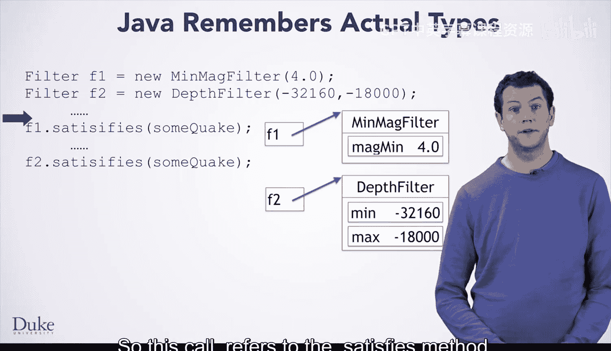
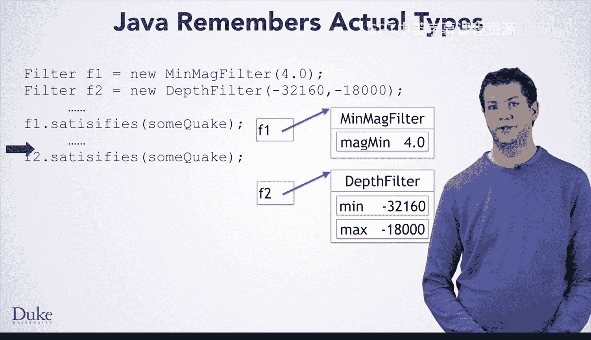
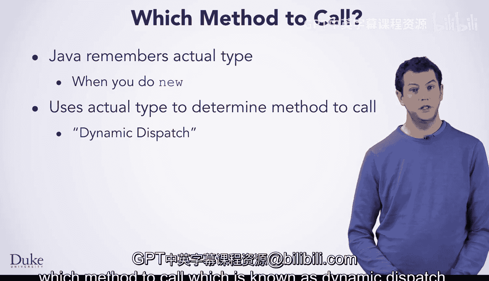

# Java编程和软件工程基础：2-5：深入理解接口


在本节课中，我们将要学习Java接口的一个核心机制——动态分派。我们将通过一个具体的例子，来理解Java如何在运行时确定调用哪个具体的方法实现。

## 概述

上一节我们介绍了接口的基本概念和用法。本节中，我们来看看Java如何实现接口的多态性，即当通过接口类型的变量调用方法时，Java如何知道应该执行哪个具体类中的方法。这个过程被称为**动态分派**。

## 动态分派的工作原理


当您使用 `new` 关键字创建一个对象时，Java会在对象内部记录下该对象的实际类型。之后，无论您使用什么类型的变量来引用这个对象，当您调用该对象的方法时，Java都会去查找它记录的实际类型，并根据这个类型来决定调用哪个方法。

让我们看一个例子。

## 代码示例分析

以下代码声明了两个 `Filter` 接口类型的变量 `f1` 和 `f2`。

```java
Filter f1 = new MinMagFilter(4.0);
Filter f2 = new DepthFilter(0.0, 10.0);
```

这两个变量分别被初始化为两个实现了 `Filter` 接口的不同类型的对象：`MinMagFilter` 和 `DepthFilter`。代码中的省略号表示我们不关心的其他部分。

我们关心的是对 `f1.satisfies()` 和 `f2.satisfies()` 的调用，以及Java如何知道在每个地方调用哪个方法。

以下是Java执行此代码的步骤：

1.  **创建 `f1` 对象**：
    当Java执行第一行代码时，它让 `f1` 引用一个新创建的 `MinMagFilter` 对象，该对象内部存储了值 `4.0`。这个对象还包含一些数据，表明无论用什么类型的变量引用它，它的**实际类型**都是 `MinMagFilter`。

2.  **创建 `f2` 对象**：
    同理，当Java执行第二行代码时，它让 `f2` 引用一个新创建的 `DepthFilter` 对象。这个对象不仅存储了指定的最小和最大深度值，也记住了它的实际类型是 `DepthFilter`。



## 方法调用过程

现在，我们到达了 `f1.satisfies()` 的调用处。


当Java准备执行这个调用时，它会查看 `f1` 所引用的实际对象。在这里，Java会发现 `f1` 实际上是一个 `MinMagFilter` 对象。因此，这个调用指向的是 `MinMagFilter` 类内部的 `satisfies` 方法。

Java随后会像往常一样调用这个方法。该方法会检查传入的 `QuakeEntry` 对象的震级是否大于或等于对象内部 `magMin` 字段的值，然后返回相应的布尔值（`true` 或 `false`）给调用者，程序继续执行。

接下来，当执行到 `f2.satisfies()` 调用时，会发生一个类似的过程。



这次，当Java查看 `f2` 对象的实际类型时，会发现它是一个 `DepthFilter` 对象。因此，它会调用 `DepthFilter` 类内部的 `satisfies` 方法。该方法会检查地震的深度是否在对象字段存储的最小和最大深度之间，并将 `true` 或 `false` 返回给其调用者，然后程序正常继续执行。

## 总结



本节课中我们一起学习了**动态分派**。您现在已经了解到，Java会在您使用 `new` 创建对象时，记住每个对象的实际类型。这个类型被用来确定在通过接口引用调用方法时，应该执行哪个具体实现类中的方法。这种机制是Java实现多态性的核心，它允许我们编写更灵活、可扩展的代码。