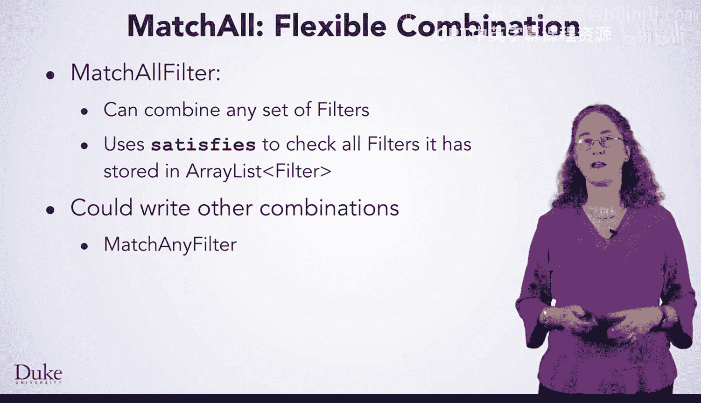
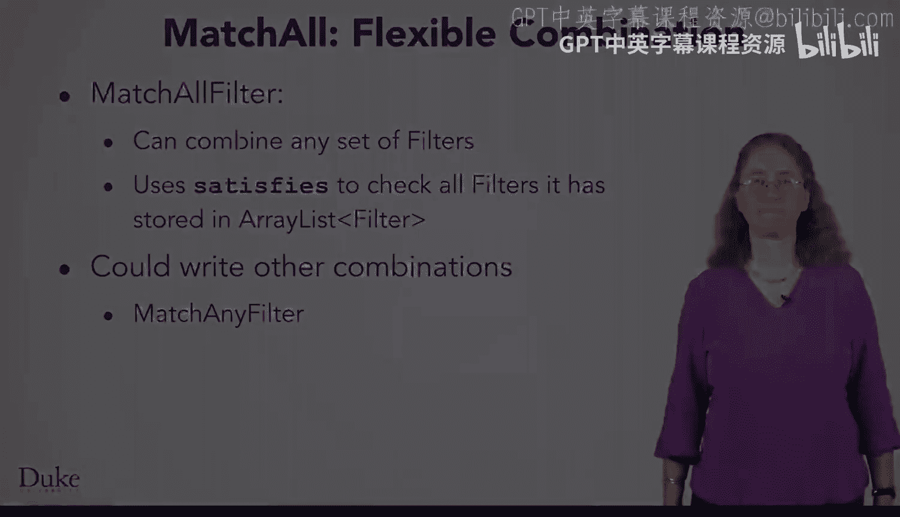

# Java编程和软件工程基础：2-5：MatchAll接口 🧩

在本节课中，我们将要学习如何创建一个名为 `MatchAllFilter` 的复合过滤器。这个过滤器可以将多个独立的过滤条件组合在一起，用于筛选地震数据。我们将探讨为何需要这种设计，以及如何通过代码实现它。

---

假设你想为地震数据创建一个过滤器，它需要结合多个其他筛选条件。

例如，你想找到那些位于特定深度范围内、靠近某个特定地点、并且震级至少达到某个最小值的地震。你当然可以直接编写一个庞大而复杂的过滤器。

这个过滤器会有一个巨大的条件语句，将所有标准加在一起。它还会有许多实例变量和一个包含许多参数的构造函数（这里未展示）。这种方法虽然可行，但并不是解决此问题的最佳方式。

为什么不好？因为它重复了代码。你已经为每个标准编写并测试了过滤器。更好的方法是复用这些已有的过滤器。所以，如果你已经有了检查每个标准的过滤器，能否编写另一个过滤器来将它们组合在一起，并复用它们现有的代码呢？

为了让结果更理想，能否使这个组合过滤器具有通用性，以便它能组合任意一组过滤器，并检查某个地震是否满足所有这些过滤器的条件？

如果你能做到这一点，你就可以编写出如下所示的代码。

你可以创建一个 `MatchAllFilter`（即我们想要编写的类），然后向其中添加一个最小震级过滤器，接着添加一个深度范围过滤器，最后再添加一个距离特定地点过滤器。

然后，你就可以使用这个 `MatchAllFilter` 来筛选你的地震数据。这种方法看起来非常棒。

你可以复用已经制作好的过滤器，并且如果你想组合其他过滤器，也可以使用 `MatchAllFilter` 来实现。但是，如何编写 `MatchAllFilter` 呢？

---

以下是 `MatchAllFilter` 的一半代码。我们马上会看到 `satisfies` 方法，只是代码无法一次性全部显示在屏幕上。

这里你可以看到，我们声明了 `MatchAllFilter` 类，并说明它实现了 `Filter` 接口。这与你为其他任何过滤器编写的代码一样。

这个类有一个字段，用于存储过滤器的 `ArrayList`。你能创建一个过滤器的 `ArrayList` 吗？答案是肯定的。这是组合性的又一个绝佳例子。`Filter` 是一种类型，你可以创建任何类型的 `ArrayList`。所以，这完全符合你的预期。

接下来是一个构造函数，它将 `ArrayList` 初始化为一个新的 `ArrayList`，以及一个方法，该方法接收一个过滤器并将其添加到此 `ArrayList` 中。

---

现在，让我们看看这个类中 `satisfies` 方法的代码。

与我们见过的所有过滤器一样，这个 `satisfies` 方法接收一个 `QuakeEntry` 并返回一个布尔值。

然而，这个过滤器做出决定的方式与你目前见过的不同。它并非直接检查地震数据本身，而是遍历其 `ArrayList` 中的每一个过滤器。

对于其中的每一个过滤器，它会检查这个 `QuakeEntry` 是否满足该过滤器的条件。请记住，这个调用将通过动态分派进行，具体取决于实际创建的过滤器类型中的 `.satisfies` 方法。

如果那个过滤器返回 `false`（记住，感叹号 `!` 表示逻辑非），那么这个过滤器就返回 `false`。

在遍历完所有过滤器之后，如果没有任何一个过滤器拒绝这个地震条目，那么这个过滤器就返回 `true`。

---

现在你已经了解了如何创建 `MatchAllFilter`，它可以组合任意一组过滤器，并检查地震是否满足它们的所有条件。

它的 `.satisfies` 方法是通过使用 `for-each` 循环来检查其存储在 `ArrayList` 中的所有过滤器来实现的。

你也可以编写其他组合方式。例如，如果你想编写一个 `MatchAnyFilter`，用于测试地震是否满足一组过滤器中任意一个的条件，你可以运用相同的原则来实现。

---

在本节课中，我们一起学习了如何设计和实现一个通用的复合过滤器 `MatchAllFilter`。我们理解了通过组合现有过滤器来避免代码重复的重要性，并掌握了使用 `ArrayList` 存储过滤器、通过遍历和动态分派来组合判断逻辑的方法。这种设计模式提高了代码的复用性和灵活性。

祝你愉快地筛选地震数据，寻找那个终极的地震！