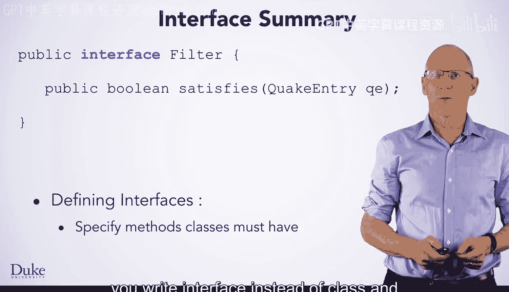

Java编程和软件工程基础：2-5：接口总结


在本节课中，我们将总结关于Java接口的核心知识。你将了解接口的定义、实现方式以及如何利用接口编写更通用、可复用的代码。

---

你已经学习了接口及其如何使代码更通用，从而避免代码重复。

### 接口的定义

上一节我们介绍了接口的概念，本节中我们来看看如何具体定义一个接口。接口的定义与类相似，但使用关键字 `interface` 而非 `class`，并且不提供方法的具体实现（即方法体）。

**代码示例：**
```java
public interface Filter {
    boolean satisfies(String id);
}
```

### 接口的实现

接下来，我们学习如何让一个类实现某个接口。这需要在类声明中使用 `implements` 关键字，并完整定义接口中声明的所有方法。

**代码示例：**
```java
public class MinmFilter implements Filter {
    @Override
    public boolean satisfies(String id) {
        // 方法的具体实现逻辑
        return id.contains("minm");
    }
}
```

### 接口的使用

在代码中使用接口时，你可以将接口类型用于变量声明和方法参数。你可以安全地调用接口中承诺的方法。

以下是使用接口的关键点：
*   可以将实现接口的类对象，赋值给该接口类型的变量。
*   可以将实现接口的类对象，传递给声明为该接口类型的方法参数。
*   可以调用接口中定义的方法。

### 动态绑定

你还需要理解实现接口的类与接口类型之间的兼容性关系。例如，可以将一个 `MinmFilter` 对象赋值给 `Filter` 类型的变量，因为 `MinmFilter` 实现了 `Filter` 接口。

在这个过程中，Java会记住对象的实际类型，并据此调用正确的方法实现。这一机制被称为**动态绑定**。




---

本节课中我们一起学习了Java接口。你掌握了如何定义接口、如何让类实现接口、如何在代码中使用接口类型，以及理解动态绑定的工作原理。运用这些知识，你可以设计出更灵活、更少重复的代码结构。