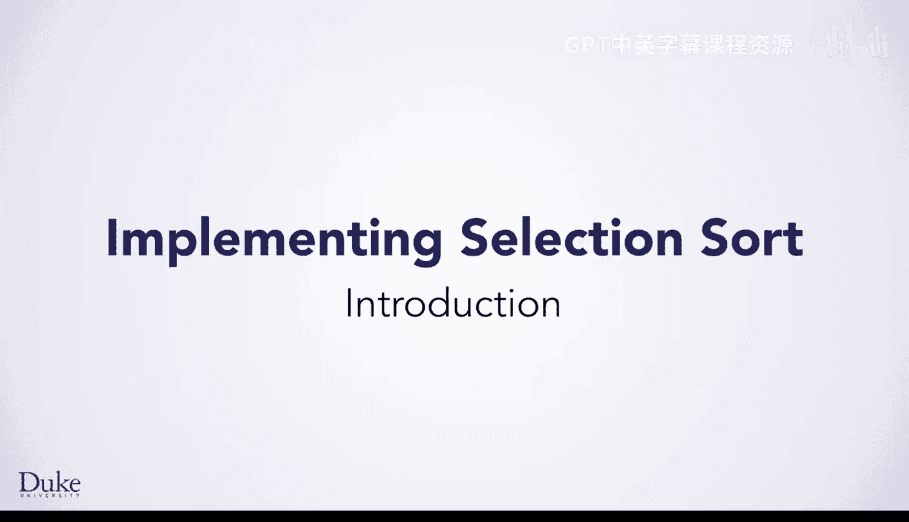
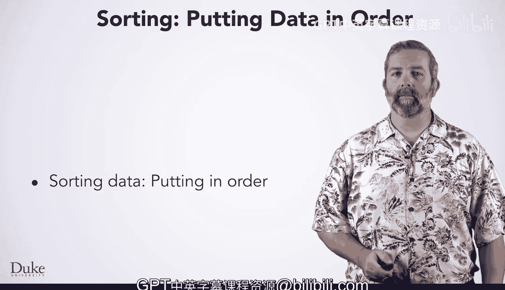

# 133：排序算法简介

在本节课中，我们将要学习排序的概念。排序是将一组数据按照特定顺序重新排列的过程，以便于后续的分析和处理。

上一节我们介绍了数据处理的基本概念，本节中我们来看看排序的具体应用和重要性。

## 排序的应用与重要性

排序在许多领域都有广泛的应用，尤其是在处理大规模数据集时。对于某些问题，将数据排序作为第一步，可以使问题更容易解决。

例如，假设你需要在一个数组或数组列表中找到中间的元素。如果数据已经排序，你可以直接查看中间位置的元素。如果数据未排序，你需要设计一个算法来解决这个问题。

排序还能提高某些问题的解决效率。在本课程中，我们主要关注编写能正常工作的代码，对效率的探讨不多。然而，当你处理数十亿条数据时，算法的效率差异可能导致运行时间从几秒变为几年。

以下是排序带来的两个主要好处：
*   **简化问题**：排序后的数据使查找、比较等操作更直观。
*   **提升效率**：高效的排序算法能显著减少处理海量数据所需的时间。

本节课中我们一起学习了排序的基本概念、其在实际问题中的应用以及它对算法效率的重要影响。理解排序是掌握更复杂数据处理和算法设计的基础。