# 算法开发：14_03_03：排序算法开发入门 🧠

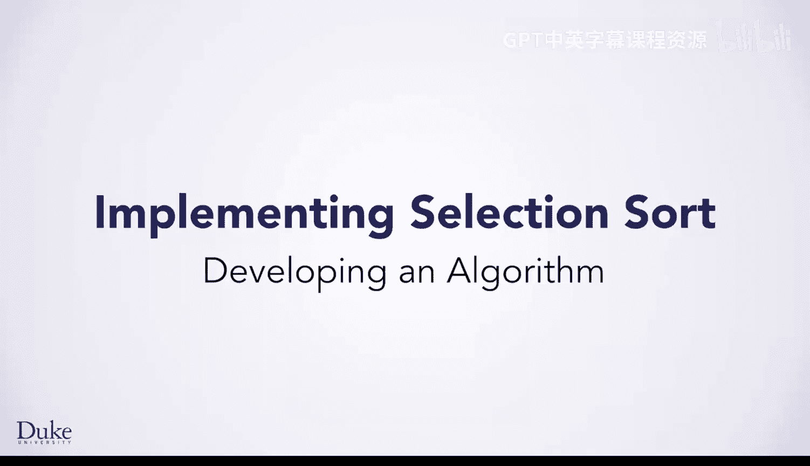

在本节课中，我们将学习如何开发一个排序算法。我们将从一个简单的数字排序例子开始，逐步推导出通用的算法步骤，并最终将其转化为代码。这个过程将展示如何运用系统性的七步法来解决编程问题。

---

## 从具体例子开始

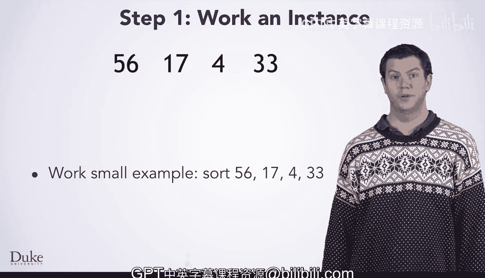

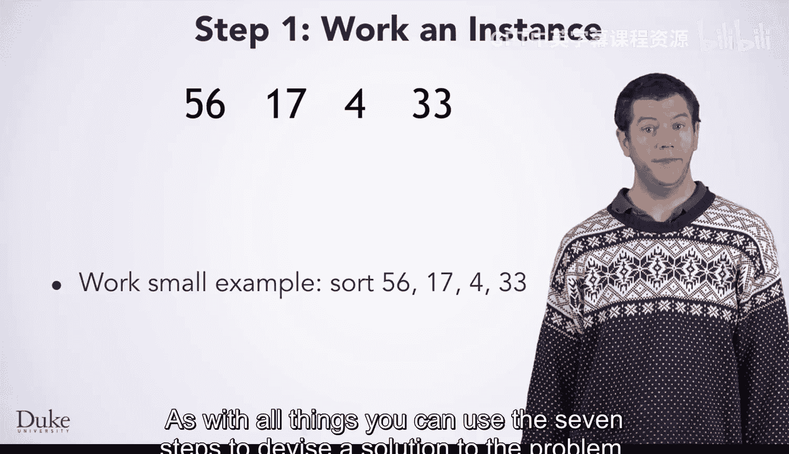

上一节我们介绍了算法开发的重要性，本节中我们来看看如何为一个具体问题设计算法。排序数据的方法有很多，效率各不相同。和解决所有问题一样，你可以使用七步法来设计解决方案。这里我们从一个使用数字的小例子开始。

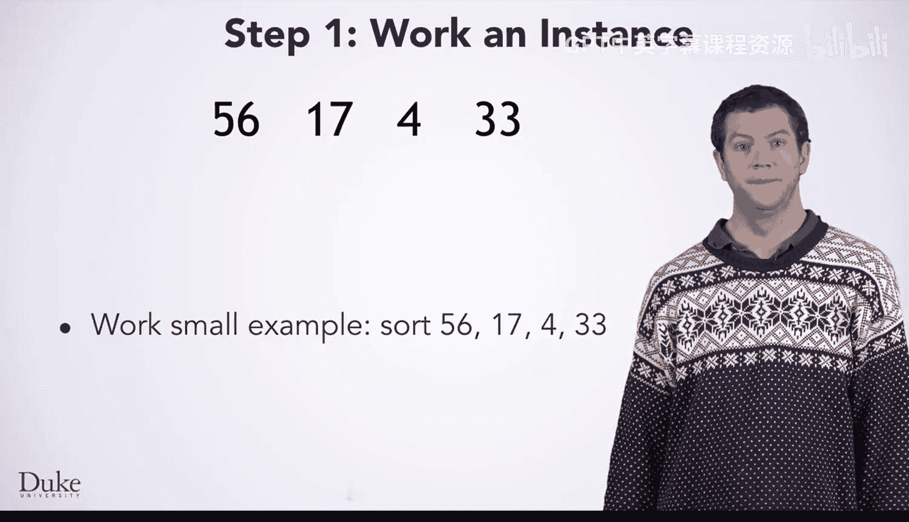

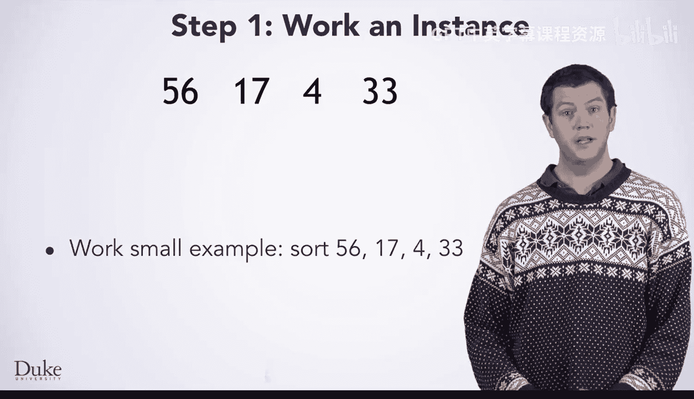

对数字 `56, 17, 4, 33` 进行排序。尽管你最终想排序的是地震数据，但你可以先用数字来设计算法，然后再调整它以提取特定的数据（如震级、距离、深度等）进行排序。

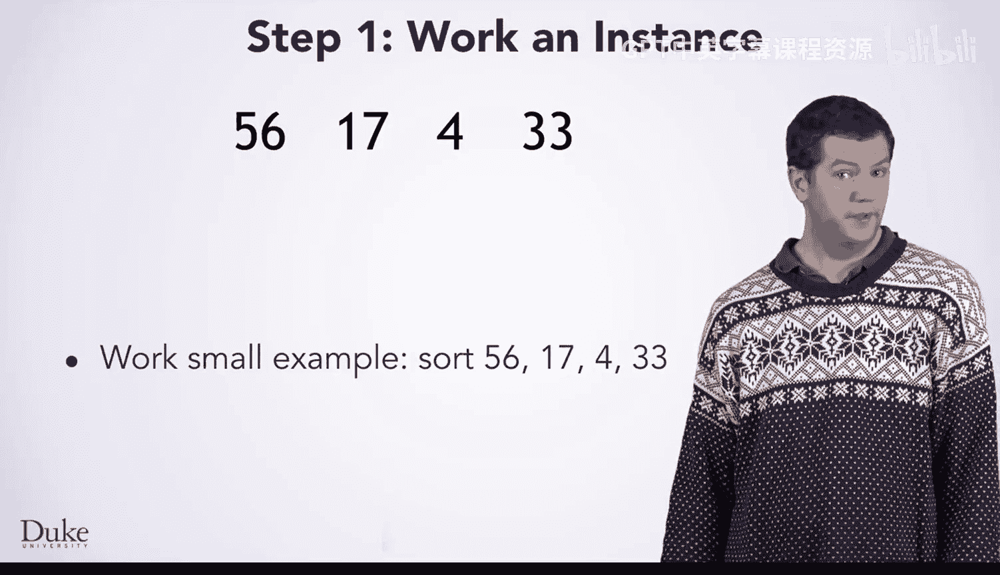

手动处理这个小例子相当简单，因为列表很小，很容易看出如何将元素按顺序排列。然而，你必须小心地以一步一步的方式进行，而不是直接写下答案。

## 记录并分析步骤

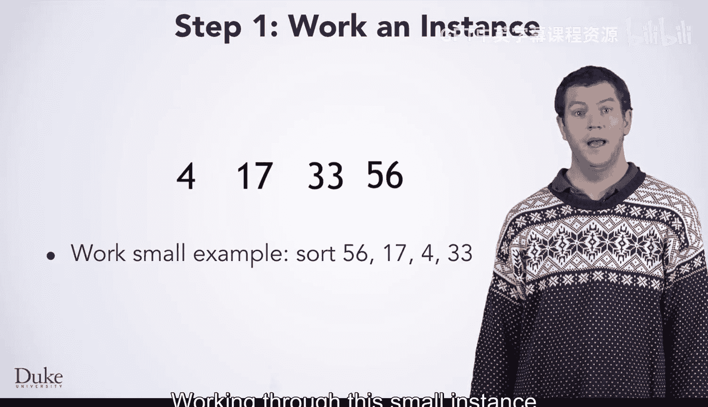

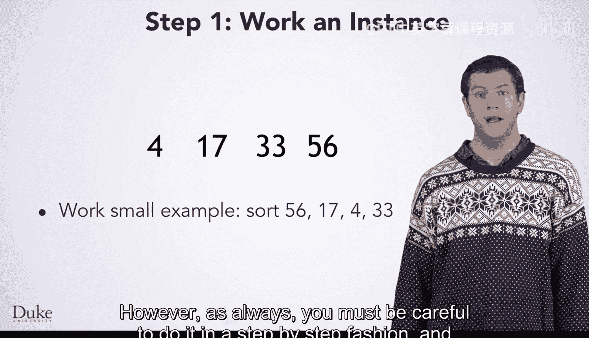

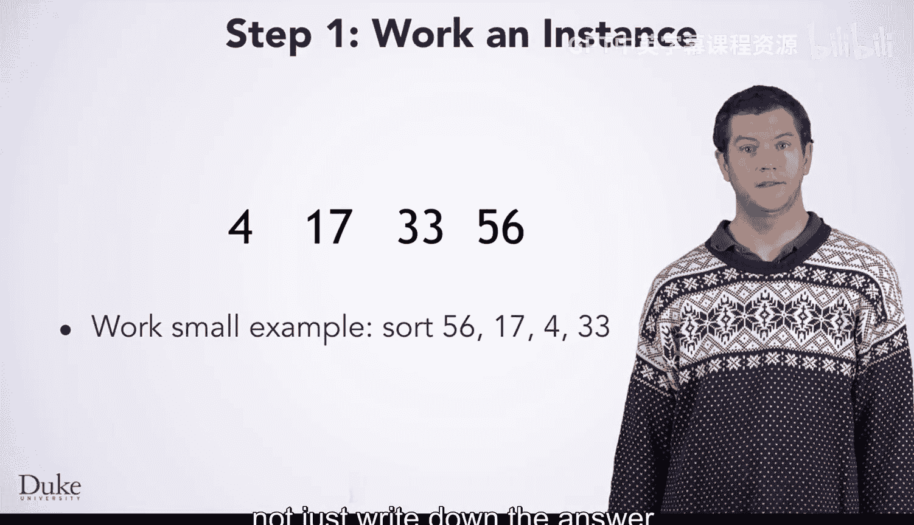

现在我们已经手动完成了排序，让我们回过头来仔细思考我们做了什么，并写下这些步骤。

首先，让我们为输入和输出命名，以便更容易清晰地引用它们。

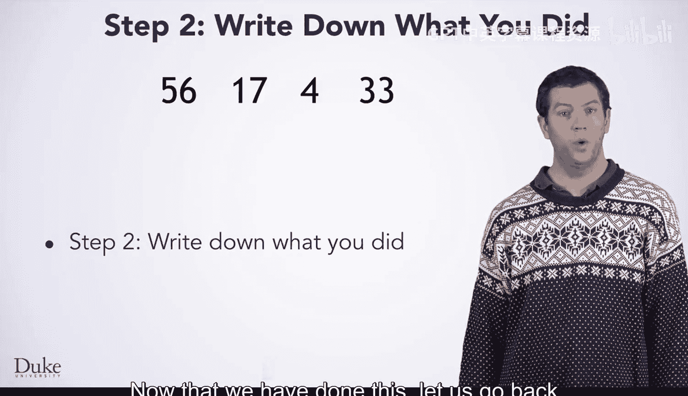

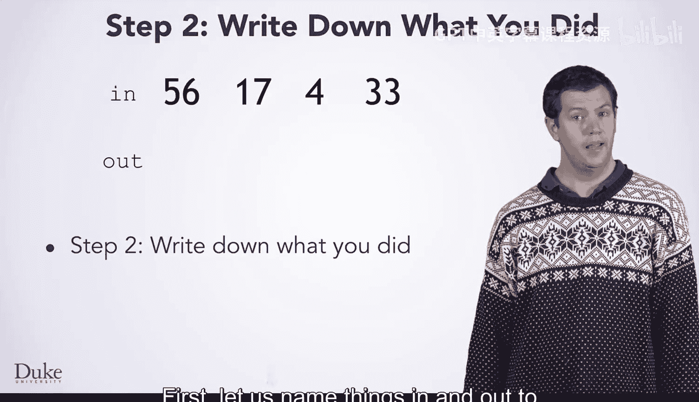

*   **输入列表**：`in`
*   **输出列表**：`out`

你还应该明确地注意到，`out` 最初是一个空的 `ArrayList`。这是一个在脑海中容易忽略的步骤，但在转化为代码时，包含它很重要。

以下是手动排序 `in = [56, 17, 4, 33]` 的步骤：

1.  `out` 初始化为空列表。
2.  在 `in` 中找到最小的元素 `4`。
3.  从 `in` 中移除 `4`。
4.  将 `4` 添加到 `out` 的右端。
5.  在 `in` 中找到新的最小元素 `17`。
6.  从 `in` 中移除 `17`。
7.  将 `17` 添加到 `out` 的右端。
8.  在 `in` 中找到新的最小元素 `33`。
9.  从 `in` 中移除 `33`。
10. 将 `33` 添加到 `out` 的右端。
11. 在 `in` 中找到新的最小元素 `56`。
12. 从 `in` 中移除 `56`。
13. 将 `56` 添加到 `out` 的右端。
14. 完成。`out` 中的数据已按你希望的方式排序。

## 将具体步骤泛化为通用算法

现在你有了排序这个特定数据集的14个步骤。当然，你希望能够排序任何数据集，所以你需要将这些步骤泛化为一个适用于任何大小数据集的算法。

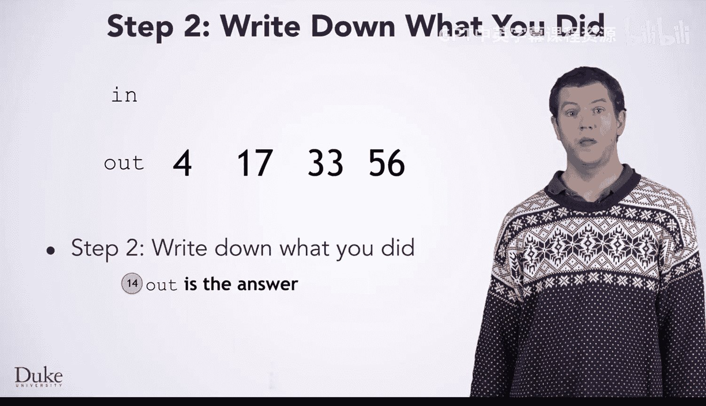

像往常一样，你可以看到你所做的事情中存在重复，但同样典型的是，相似步骤之间也存在一些差异。在继续之前，你需要找出其中的模式。

以下是重复的模式组：

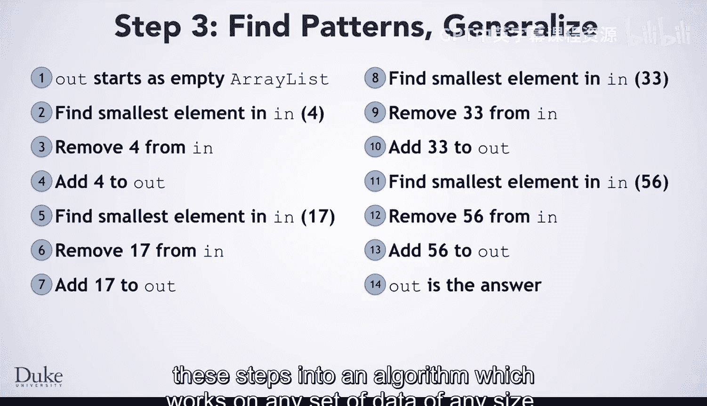

*   **第一组**：步骤 2, 3, 4
*   **第二组**：步骤 5, 6, 7
*   **第三组**：步骤 8, 9, 10
*   **第四组**：步骤 11, 12, 13

这些相似步骤之间的差异在于每组中的具体数字。在每组的第一步中找到的最小元素，就是在该组其他两步中从 `in` 移除并添加到 `out` 的数字。像往常一样，你应该给这个元素命名，并使用该名称使重复的步骤完全一致。

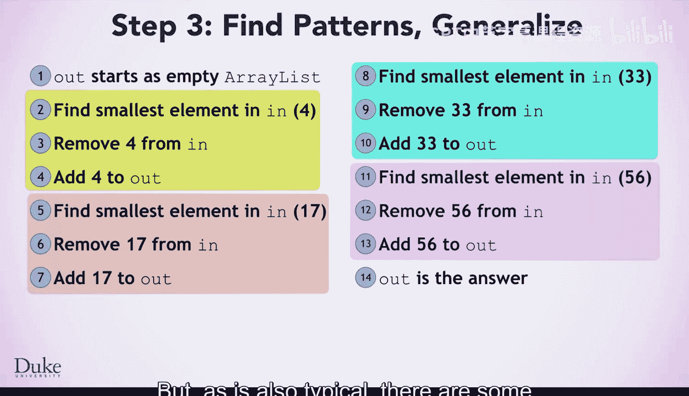

这里我们将这个元素（这个值）命名为 `minElement`，并使步骤统一。

我们几乎准备好将这些步骤表达为重复结构了，但还需要考虑最后一个细节：**我们如何知道何时停止重复这些步骤？**

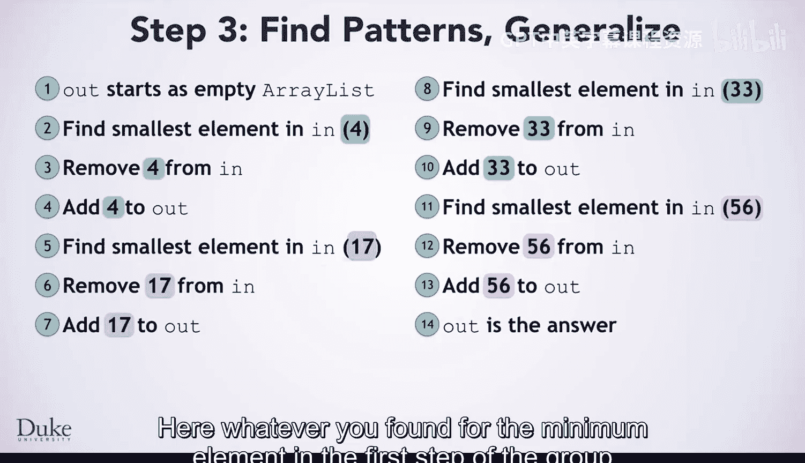

与我们之前见过的许多算法不同，我们不是对输入中的每个元素执行操作。我们不仅不按顺序遍历它们，而且在从 `ArrayList` 中移除元素的同时尝试对每个元素进行操作通常不是一个好主意。

让我们回到手动解决这个问题的地方来思考一下。回顾这个过程，你可以清楚地看到，我们并没有执行“对每个元素”的重复操作，因为我们没有按顺序处理每个元素。

## 确定循环终止条件

现在我们已经完成了，很明显我们完成了。但你怎么知道完成了呢？是因为 `in` 变空了。既然这是你能判断完成的方式，它也应该是你在算法中表达的内容。

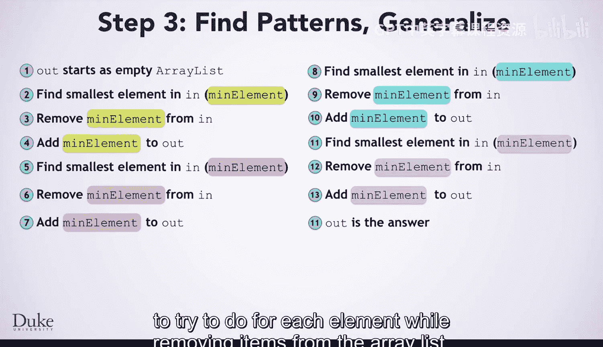

有了这个观察结果，你可以写出一个如下所示的算法。注意我们如何根据刚才的思考来表达重复：只要 `in` 不为空，就重复这些步骤。

以下是通用排序算法的步骤：

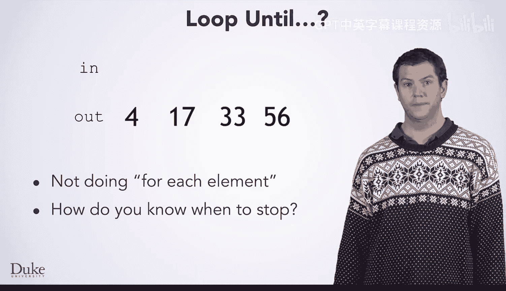

1.  初始化 `out` 为一个空的 `ArrayList`。
2.  只要 `in` 不为空，就重复以下步骤：
    a. 在 `in` 中找到最小的元素，称之为 `minElement`。
    b. 从 `in` 中移除 `minElement`。
    c. 将 `minElement` 添加到 `out` 的右端。
3.  返回 `out` 作为排序后的列表。

当你将其转化为代码时，这会是什么类型的循环？希望你记得之前学过的 `while` 循环，它们是表达这种重复的最佳方式。

## 测试算法并转化为代码

像往常一样，在转化为代码之前测试你的算法是一个好主意。尝试用这个输入 `[9, -3, 0]` 来测试这个算法。算法运行正确吗？

很好，是时候把它变成代码了。在后续课程中，我们将具体实现这个选择排序算法。

---

本节课中我们一起学习了如何从一个具体例子出发，通过记录步骤、寻找模式、泛化并确定循环条件，最终开发出一个通用的排序算法框架。这个过程是算法设计的基础，可以应用于解决各种编程问题。