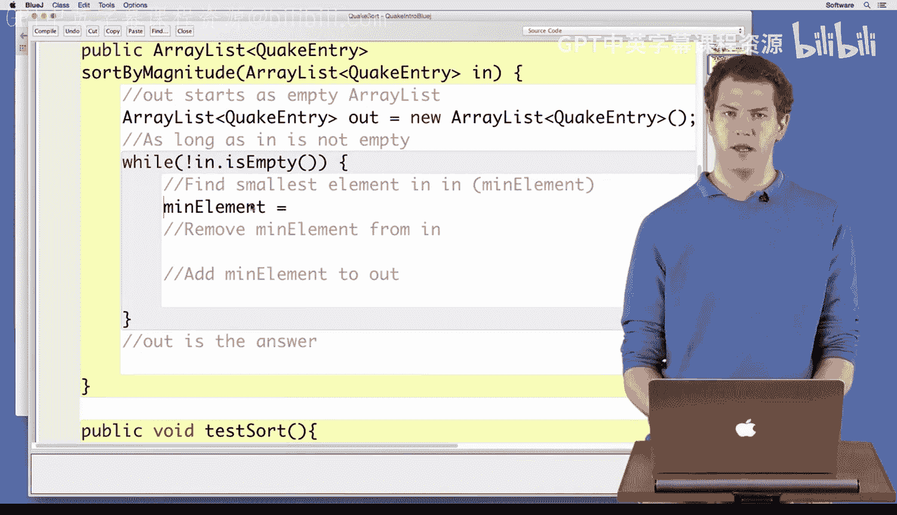

# Java编程和软件工程基础：2-5：实现地震数据按震级排序


在本节课程中，我们将学习如何将按震级排序地震数据的算法转化为实际的Java代码。我们将实现一个名为 `sortByMagnitude` 的方法，该方法接收一个地震条目列表，并返回一个按震级从小到大排序的新列表。

## 方法声明与初始化

首先，我们声明 `sortByMagnitude` 方法。该方法接收一个 `ArrayList<QuakeEntry>` 类型的输入参数 `in`，并返回一个同样类型的列表 `out`。

```java
public ArrayList<QuakeEntry> sortByMagnitude(ArrayList<QuakeEntry> in) {
    ArrayList<QuakeEntry> out = new ArrayList<QuakeEntry>();
    // 后续排序逻辑将写在这里
    return out;
}
```

方法的第一行代码创建了一个新的空列表 `out`，用于存放排序后的结果。

## 实现排序循环逻辑

上一节我们介绍了排序算法，本节中我们来看看如何在代码中实现它。算法的核心是循环地从输入列表中找到震级最小的条目，将其移除并添加到输出列表中，直到输入列表为空。

我们使用 `while` 循环来实现这个过程，因为循环次数在开始时并不确定，取决于输入列表的大小。

```java
while (!in.isEmpty()) {
    // 在循环体内执行查找最小值和转移条目的操作
}
```

循环的条件是 `!in.isEmpty()`，这表示只要输入列表 `in` 不为空，循环就会继续执行。

## 查找并转移最小条目



在循环的每一步，我们需要完成以下操作：

以下是每一步需要执行的具体任务：

1.  **查找最小条目**：调用一个辅助方法 `getSmallestMagnitude` 来从当前输入列表 `in` 中找到震级最小的 `QuakeEntry` 对象。
2.  **移除最小条目**：使用 `ArrayList` 的 `remove` 方法将找到的最小条目从输入列表 `in` 中删除。
3.  **添加至输出列表**：使用 `ArrayList` 的 `add` 方法将最小条目添加到输出列表 `out` 的末尾。

对应的代码如下：

```java
while (!in.isEmpty()) {
    QuakeEntry minElement = getSmallestMagnitude(in);
    in.remove(minElement);
    out.add(minElement);
}
```

这里，`getSmallestMagnitude` 是一个我们已经实现过的方法，它遍历列表并返回震级最小的地震条目。`in.remove(minElement)` 会找到并删除列表中第一个与 `minElement` 相等的条目。`out.add(minElement)` 则将这个条目追加到 `out` 列表的尾部。

## 完整方法与测试

将以上部分组合起来，就得到了完整的 `sortByMagnitude` 方法。

```java
public ArrayList<QuakeEntry> sortByMagnitude(ArrayList<QuakeEntry> in) {
    ArrayList<QuakeEntry> out = new ArrayList<QuakeEntry>();
    while (!in.isEmpty()) {
        QuakeEntry minElement = getSmallestMagnitude(in);
        in.remove(minElement);
        out.add(minElement);
    }
    return out;
}
```

编写完代码后，我们进行编译。如果没有错误，就可以运行测试。课程中提供了一个测试方法，它会读取一些地震数据，调用 `sortByMagnitude` 方法进行排序，然后打印结果。

运行测试后，观察输出。可以看到地震条目按照震级从小到大排列：列表顶部的条目震级非常小，随着向下浏览，震级逐渐增大，直到列表底部出现震级最大的地震。这证实了我们的排序方法是正确的。

## 总结

本节课中我们一起学习了如何实现选择排序算法来对地震数据按震级进行排序。我们完成了以下关键步骤：

1.  声明方法并初始化输出列表。
2.  使用 `while` 循环处理输入列表，直到其为空。
3.  在循环中，利用 `getSmallestMagnitude` 方法查找最小元素，并将其从输入列表移至输出列表。
4.  最终返回排序好的输出列表。

通过将算法步骤转化为具体的Java代码，并运行测试验证结果，我们成功实现了数据的排序功能。