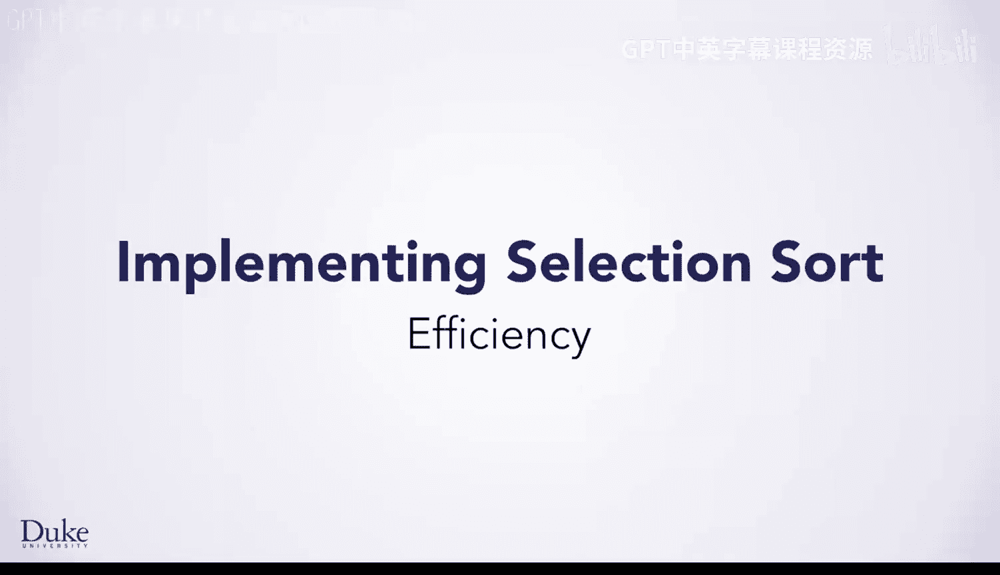
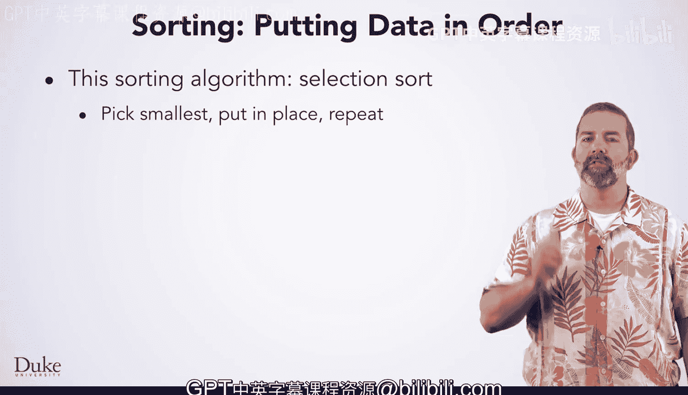
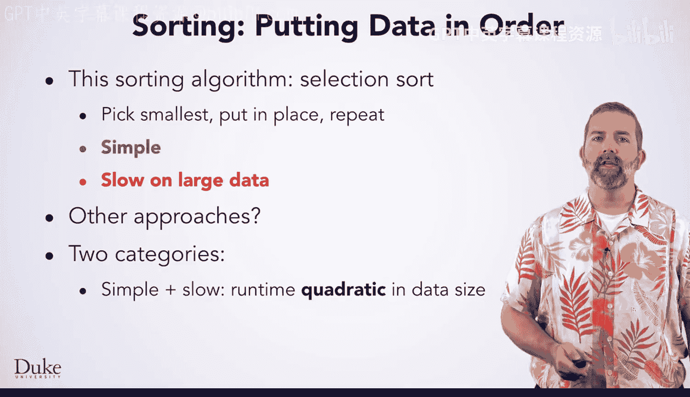
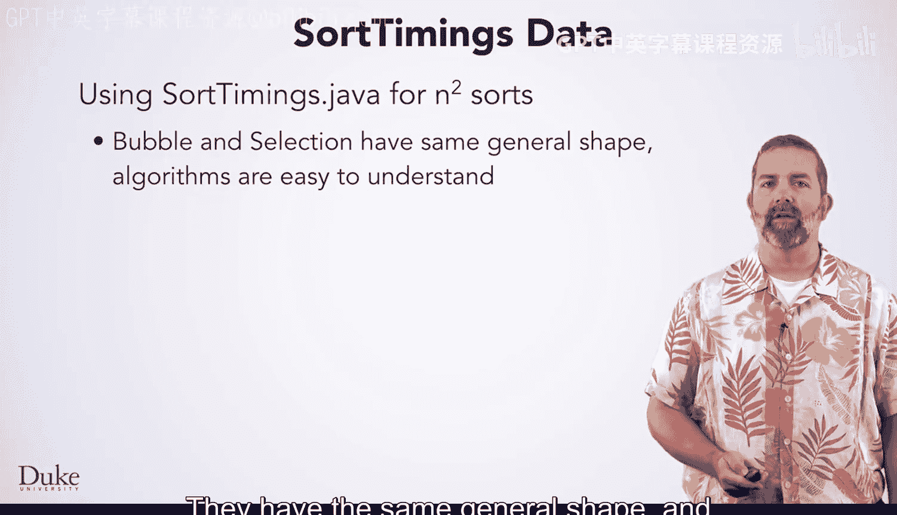
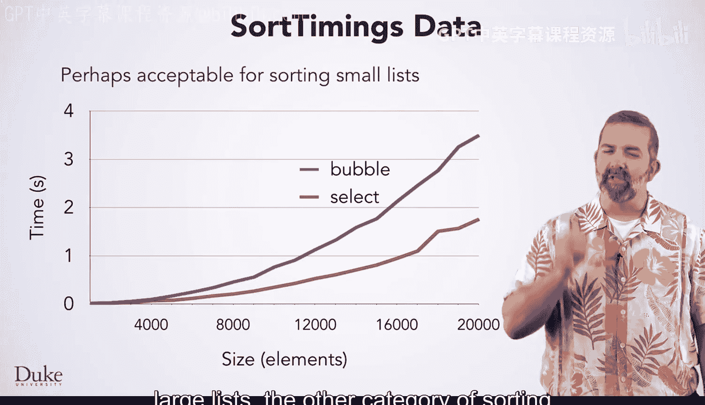
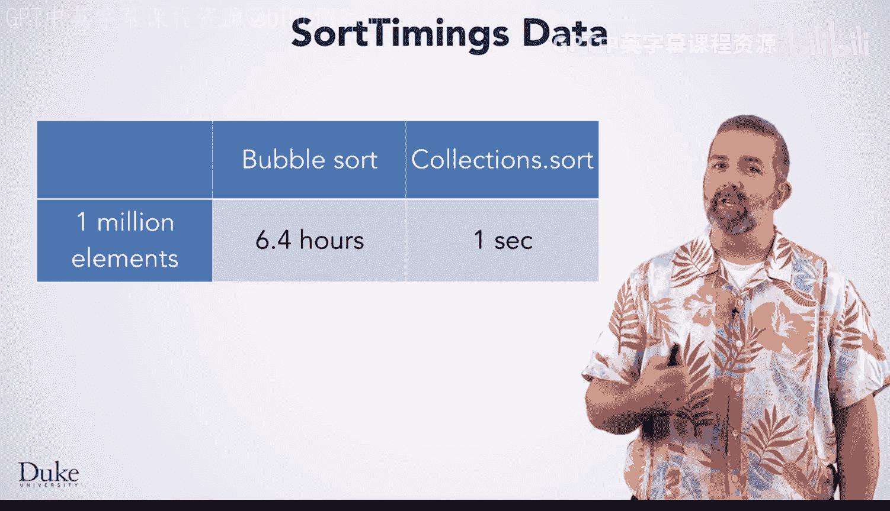
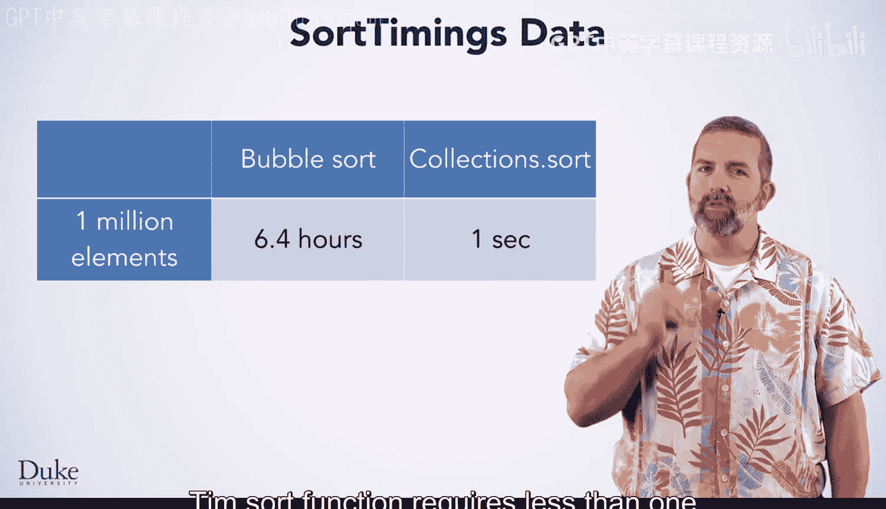
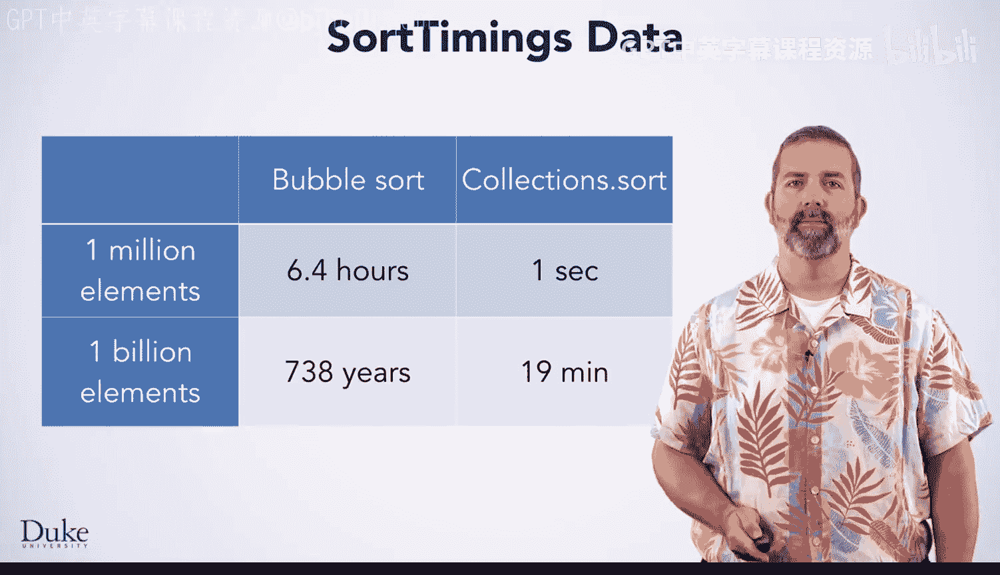
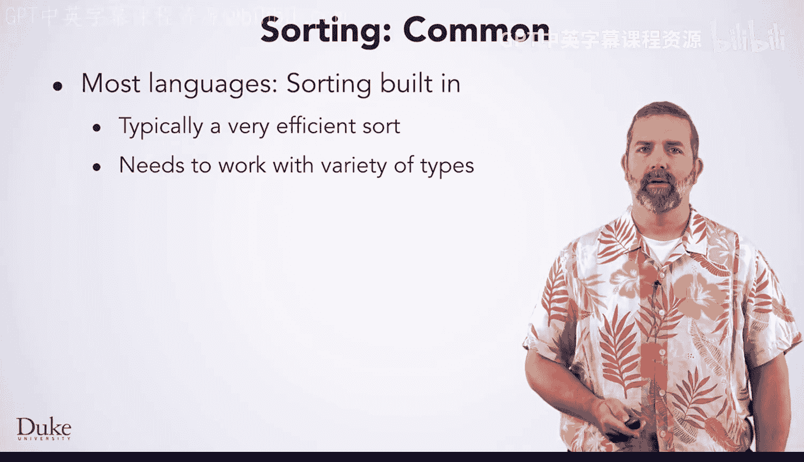

# 137：算法效率 🚀

在本节课中，我们将要学习不同排序算法的效率差异，理解为什么某些算法在处理大数据集时表现不佳，以及Java标准库如何通过高效的排序实现来解决这个问题。

## 选择排序算法

上一节我们介绍了排序的基本概念，本节中我们来看看一个具体的排序算法。

这个排序算法名为选择排序，因为它选择最小的元素，然后将其添加到输出序列的末尾。

## 算法的简单性与效率

选择排序算法的一大优点是概念简单。许多人通过七个步骤就能自己想到它，并且实现起来也相对简单。

然而，就排序算法而言，它的效率相当低。如果你在小型数据集上使用它，这不是大问题，因为计算机速度很快。但是，如果你有一个非常大的数据集，它会相当慢。

那么有其他方法吗？当然有。事实上，有几十种排序算法。它们通常分为两类。

以下是第一类算法的特点：

*   易于理解和用代码实现，但速度慢。

选择排序就是这样的算法，还有冒泡排序和插入排序。它们的运行时间与输入大小成**二次方**关系。如果你将输入大小加倍，算法运行时间将变为原来的四倍。

## 高效排序算法

另一类算法是那些理解起来更复杂，但速度要快得多的算法。这类算法的例子包括快速排序、归并排序等。Java库中`Collections.sort`使用的算法是归并排序的一个变体，称为Tim排序。

这些算法的运行时间接近**线性**。如果是线性的，输入大小加倍只会使运行时间加倍。这些高效算法的增长略高于线性，但非常接近线性。

对于简单但慢速的方法，运行时间呈二次方增长。因此这些被称为 **n² 排序**。选择排序和冒泡排序都是n²排序。它们具有大致相同的形状，并且算法易于理解。

## 运行时间对比

这里你看到的是两个n²排序算法的运行时间图，取自`SortTiming.java`。

如图所示，这些算法对于20,000个字符串是合理的，分别需要2秒和4秒。对于小列表，这或许可以接受，但对于大列表，另一类排序算法要好得多。

让我们看看排序更多元素所需的时间，以理解为什么n²排序被称为低效。

此图显示了从10,000到70,000个字符串的n²排序。Y轴标记的是时间（秒），X轴是被排序的元素数量。那么排序多得多、多得多元素需要多长时间呢？

我们可以使用冒泡排序的二次拟合（图中显示的第一个方程）来推断排序一百万个或十亿个元素所需的时间。

那么差异有多大呢？使用冒泡排序一百万个字符串需要**6.4小时**，而使用`Collections.sort`的Tim排序函数排序同样一百万个字符串需要**不到一秒**。

使用冒泡排序十亿个元素将需要**738年**。我们实际上可以计时`Collections.sort`，会发现排序十亿个字符串只需要**不到20分钟**。

## Java内置排序的通用性

幸运的是，许多语言在其标准库中都内置了高效的排序。

当然，这样的排序应该适用于多种类型，以便程序员能最大限度地利用它。事实上，它必须能够处理排序作者没有专门考虑的数据类型。例如，你想对地震进行排序。你认为Java排序库的作者在编写那个排序时考虑过地震吗？很可能没有。

而且可以肯定，他没有考虑过你写的特定地震类。

那么这是如何工作的呢？还记得接口吗？你已经见过它们作为编写通用代码的一种方式。接口是一种承诺了特定方法的类型。像排序库这样的代码，就可以使用接口类型并调用它承诺的方法。

其他代码可以创建实现该接口的类的实例，并将它们传递给排序库。

对于排序，有两个重要的接口：`Comparable`和`Comparator`，你很快就会学到。在Java中，这个内置排序称为`Collections.sort`，它非常高效。任何时候你需要对数据进行排序，都应该使用它。

## 总结 📝

本节课中我们一起学习了算法效率的核心概念。我们了解到，像选择排序和冒泡排序这样的简单算法虽然易于理解，但其**O(n²)**的时间复杂度使其在处理大规模数据时效率极低。相比之下，Java标准库提供的`Collections.sort`方法基于高效的Tim排序算法，其时间复杂度接近**O(n log n)**，能够以惊人的速度处理海量数据。关键在于，通过`Comparable`和`Comparator`接口，这种高效排序可以灵活应用于各种自定义数据类型。因此，在实际编程中，应优先使用这些经过高度优化的内置工具。