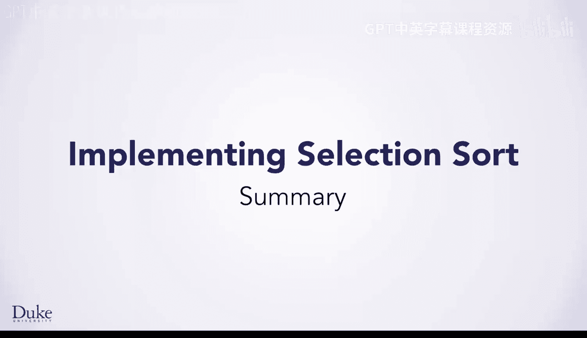
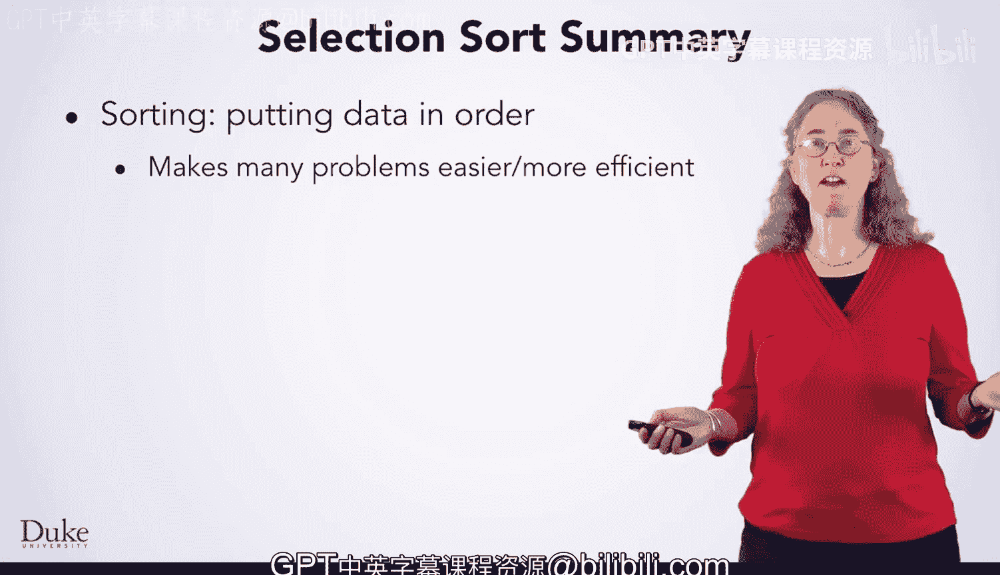
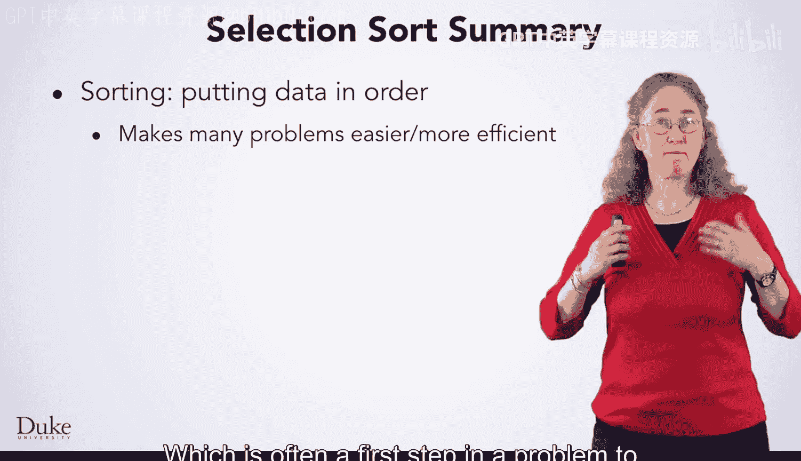

Java编程和软件工程基础：2-5：排序算法总结



在本节课中，我们将总结排序的基础知识，回顾选择排序算法的开发过程，并了解内置排序工具的重要性。

---

排序是将数据按特定顺序排列的过程，通常是解决问题的第一步，它能使后续操作更简单或更高效。



上一节我们介绍了排序的基本概念，本节中我们来看看如何系统地开发一个排序算法。



以下是使用七步法开发排序算法的过程：
1.  理解问题：明确排序的目标和规则。
2.  设计测试用例：包括典型、边界和特殊情况的输入。
3.  思考解决方案：构思算法逻辑。
4.  编写算法步骤：将思路分解为具体、可执行的步骤。
5.  编写代码：将算法步骤转化为编程语言。
6.  测试代码：使用设计的测试用例验证正确性。
7.  调试与优化：修复错误并改进性能。

通过以上步骤，我们开发出了选择排序算法。这是一个概念上简单但广为人知的算法，其核心思想是反复从未排序部分选择最小（或最大）元素，放到已排序部分的末尾。

其基本逻辑可以用以下伪代码描述：
```
for i from 0 to n-1:
    minIndex = i
    for j from i+1 to n:
        if array[j] < array[minIndex]:
            minIndex = j
    swap(array[i], array[minIndex])
```

我们首先实现了将数据排序到一个新数组列表中的版本，随后又实现了在原地（即原数组）进行排序的版本。

最后，我们了解到大多数编程语言都提供了内置的排序函数。这些内置排序通常经过高度优化，效率远高于选择排序这类基础算法，并且可以通用地应用于各种场景。

---

本节课中我们一起学习了排序的基础、通过七步法开发选择排序的过程，以及利用语言内置高效排序工具的重要性。接下来，你将学习如何在Java中使用这种内置排序。