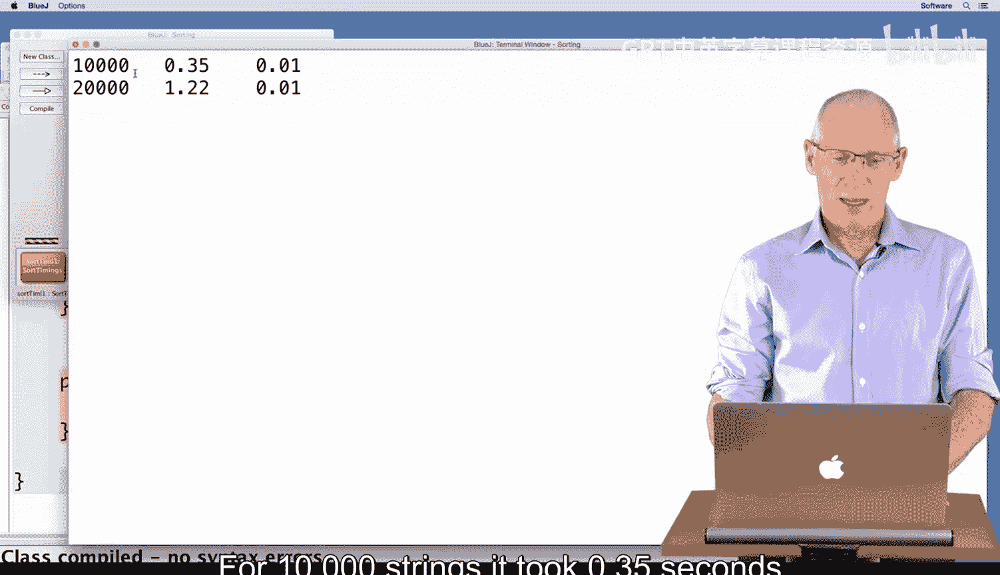
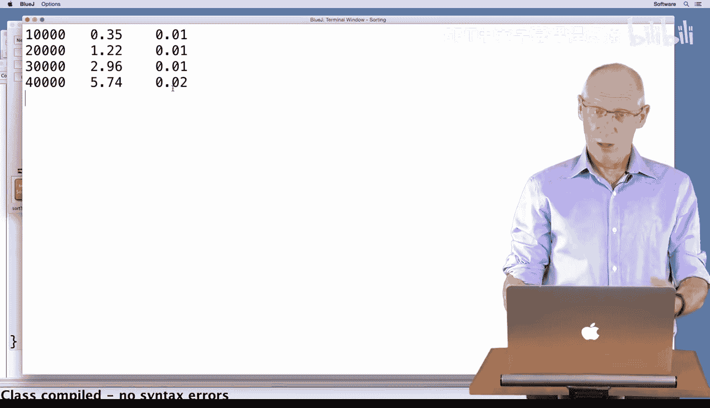
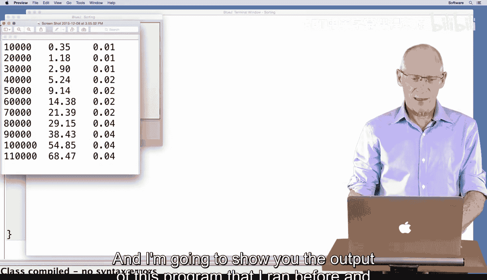
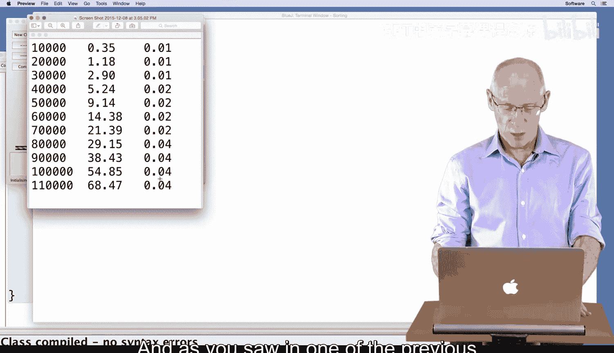
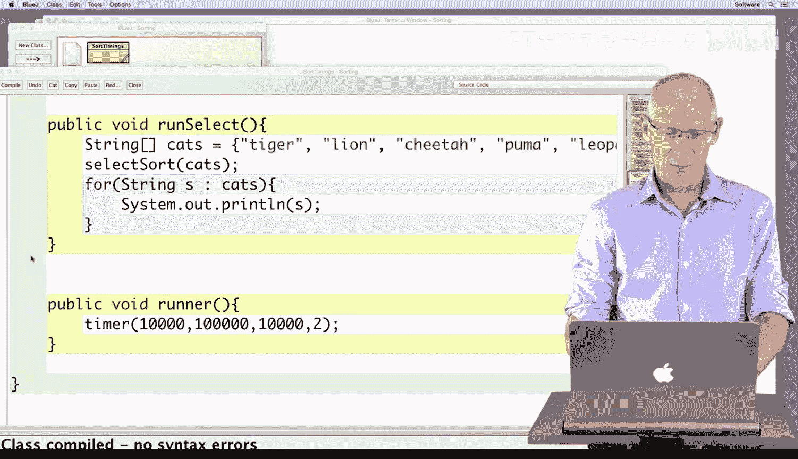

# 139：排序算法与效率分析 🚀


在本节课中，我们将学习如何使用选择排序算法对字符串等对象进行排序，并分析不同排序方法的效率。我们将看到，对于非基本数据类型（如字符串），需要使用 `compareTo` 方法进行比较，而不是简单的 `<` 运算符。同时，我们将对比选择排序与Java内置的 `Collections.sort` 方法在性能上的巨大差异。

## 使用选择排序对字符串排序 🔤

上一节我们介绍了选择排序算法对地震条目按震级排序。本节中，我们来看看如何用同样的算法对字符串进行排序。

以下是演示代码，我们创建了一个包含几个猫科动物名称的小型数组：

```java
String[] cats = {"lion", "cheetah", "puma", "leopard"};
```

我们尝试将之前用于地震条目的选择排序代码直接应用于这个字符串数组。然而，编译时遇到了错误。

### 遇到的问题：无法使用 `<` 运算符

错误信息是：`bad operand types for binary operator '<'`。这是因为在Java中，`<`、`>` 等比较运算符只能用于基本数据类型（如 `int`、`double`）。对于 `String`、`QuakeEntry` 等对象类型，不能直接使用这些运算符进行比较。

### 解决方案：使用 `compareTo` 方法

为了解决这个问题，我们需要使用 `compareTo` 方法。我们将代码中的比较部分从：
`if (list[j] < list[minIndex])`
修改为：
`if (list[j].compareTo(list[minIndex]) < 0)`

`compareTo` 方法返回一个整数：
*   如果返回值 **< 0**，表示第一个对象“小于”第二个对象（在字符串中，指字典序靠前）。
*   如果返回值 **== 0**，表示两个对象相等。
*   如果返回值 **> 0**，表示第一个对象“大于”第二个对象。

修改后，代码成功编译并运行，将字符串数组按字母顺序正确排序。

## 排序算法效率分析 ⏱️

现在我们已经知道如何使用 `compareTo` 方法对字符串进行排序，接下来我们分析一下排序算法的效率。


我们创建了一个 `SortTimings` 类，用于比较选择排序和Java内置的 `Collections.sort` 方法在不同数据量下的性能。以下是核心的计时逻辑：

```java
long startTime = System.nanoTime();
// 执行排序算法（例如 selectionSort 或 Collections.sort）
long endTime = System.nanoTime();
long duration = (endTime - startTime) / 1000000; // 转换为毫秒
System.out.println("Time taken: " + duration + " milliseconds");
```

我们分别对包含10,000、20,000直至100,000个随机字符串的列表进行排序测试。





### 性能对比结果

以下是测试结果的总结：
*   **10,000个元素**：选择排序耗时约350毫秒，而 `Collections.sort` 仅耗时约10毫秒。
*   **随着数据量增加**：选择排序的耗时呈平方级增长。例如，对100,000个元素排序，选择排序需要近一分钟。
*   **`Collections.sort` 的表现**：即使对100,000个元素排序，`Collections.sort` 也仅需约40毫秒，效率极高。

这个对比清晰地表明，`Collections.sort` 使用了一种比选择排序（时间复杂度为 **O(n²)**）高效得多的算法（如归并排序，时间复杂度为 **O(n log n)**）。



### `Collections.sort` 的工作原理





`Collections.sort` 能够对 `ArrayList<String>` 进行排序，正是因为它内部调用了字符串的 `compareTo` 方法来比较元素的大小。这验证了 `compareTo` 方法是实现对象间可比较性的关键。

## 总结 📝

本节课中我们一起学习了两个核心内容：
1.  **对象排序的比较方法**：对于非基本数据类型的对象（如 `String`），不能使用 `<`、`>` 等运算符进行比较，而必须实现或使用 `compareTo` 方法。该方法定义了对象之间的自然顺序。
2.  **排序算法的效率**：选择排序简单但效率较低，其时间复杂度为 **O(n²)**，不适合处理大规模数据。Java内置的 `Collections.sort` 方法采用了更高效的算法（如 **O(n log n)** 的归并排序），在实际应用中应优先考虑使用此类优化过的工具方法。

理解 `compareTo` 方法并认识到不同算法之间的效率差异，是编写高效、可扩展Java程序的重要基础。