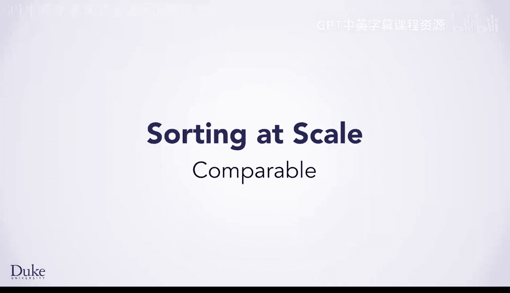
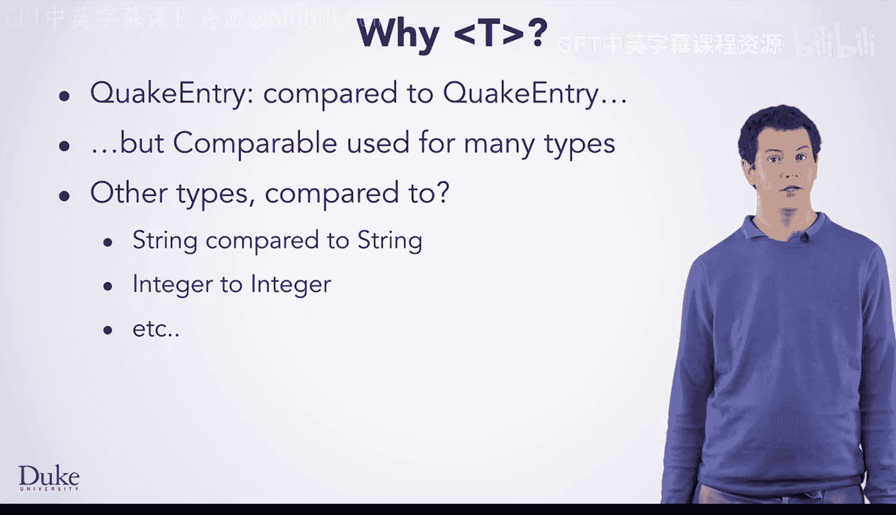
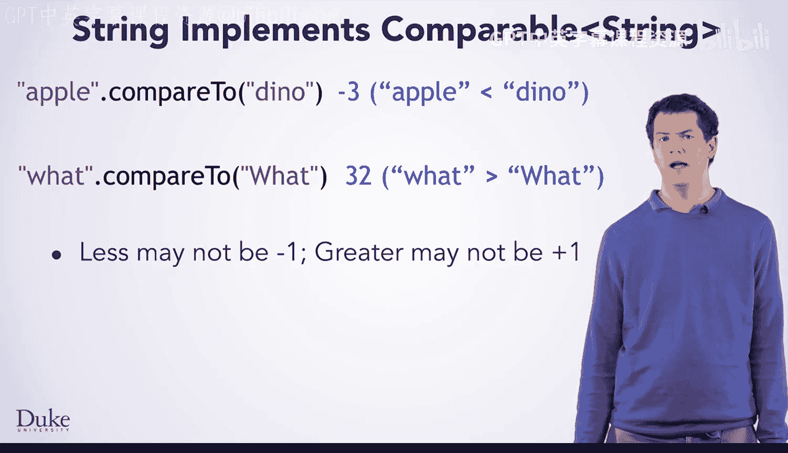

# Java编程和软件工程基础：2-5：Comparable接口



在本节课中，我们将要学习Java中的`Comparable`接口。这个接口定义了一种“自然排序”的约定，允许我们比较和排序实现了该接口的类的对象。我们将通过具体的例子来理解其工作原理和实际应用。

## 认识Comparable接口

上一节我们介绍了`compareTo`方法在`QuakeEntry`类中的使用。本节中，我们来看看定义这个方法的`Comparable`接口。

实现了`Comparable`接口的类具有一种“自然排序”方式。这意味着存在一种内在合理的方式将它们按顺序排列。`Comparable`接口所承诺的`compareTo`方法，正是用来定义这种排序规则的。

以下是`Comparable`接口的定义。它与你之前见过的接口略有不同，因为它使用了尖括号`<T>`。

```java
public interface Comparable<T> {
    int compareTo(T o);
}
```

接口顶部的`<T>`指定了该接口的类型参数。它指明了可以与什么类型进行比较。例如，`QuakeEntry implements Comparable<QuakeEntry>`意味着你可以将一个`QuakeEntry`对象与另一个`QuakeEntry`对象进行比较。

这个类型参数可以在接口定义的其余部分使用，并且会替换为传入的实际类型。对于`Comparable<QuakeEntry>`，`compareTo`方法就会接受一个`QuakeEntry`对象作为其参数。



## 泛型设计的目的

你可能会问，为什么`Comparable`接口要使用`<T>`，而不仅仅是针对`QuakeEntry`设计？实际上，`Comparable`是Java内置的一部分，而`QuakeEntry`不是。Java的创建者在设计时并没有考虑`QuakeEntry`，而是希望创建一个足够通用的接口，可以用于任何具有全序关系的类型。

Java中有许多类型都实现了`Comparable`接口，包括一些你已经见过的类型。例如，字符串可以与字符串比较，整数可以与整数比较，等等。

## 以String为例理解自然排序

为了更好地理解自然排序，让我们花点时间看看`String`类，因为它的排序规则非常直观。

`String`类实现了`Comparable<String>`。你可以比较任意两个字符串来对它们进行排序。那么，字符串的自然排序是什么呢？是字母顺序。如果你按字母顺序排列，“Apple”会排在“bear”之前。因此，“Apple”小于“bear”，“bear”小于“cards”，“cards”小于“dno”。

你可能还记得，字符串可以包含任何字符，而不仅仅是字母。那么如何对这样的字符串进行字母排序呢？如果它们包含相同的字母但大小写不同，又会发生什么？`String`类的`compareTo`方法会处理所有这些情况。它使用的排序在技术上称为**字典序**。

字典序是一种比较算法：从第一个字符开始逐个比较，只要字符相同，就继续比较下一个。当找到第一个不同的字符时，就根据这个字符来决定两个字符串的顺序。对于字母来说，这就是字母顺序。字典序只是这个更通用算法（适用于任何字符）的技术术语。

以下是几个比较示例：

*   **比较“What!”和“What?”**：首先比较‘W’，相同；然后比较‘h’，相同；接着比较‘a’，相同；再比较‘t’，相同；最后比较‘!’和‘?’。这两个字符串的顺序就取决于‘!’和‘?’哪个更大或更小。
*   **比较“What”和“what”**：Java会在第一个字符就发现差异。事实证明，大写字母的数值比小写字母小，所以“What”小于“what”。
*   **比较“what!”和“what?”**：比较过程与前两个例子类似，从第一个字符开始，直到遇到‘!’和‘?’的差异。

## compareTo方法的返回值规则

那么，`compareTo`方法如何表示“小于”、“等于”或“大于”呢？它返回一个整数。

以下是`compareTo`方法的返回值规则：

*   如果当前对象**小于**参数对象，则返回一个**负数**。例如：`"Apple".compareTo("bear")` 返回 `-1`。
*   如果当前对象**等于**参数对象，则返回 **0**。例如：`"bear".compareTo("bear")` 返回 `0`。
*   如果当前对象**大于**参数对象，则返回一个**正数**。例如：`"dno".compareTo("cards")` 返回 `1`。

**重要提示**：你不应该依赖特定的负数值或正数值（比如-1或+1）。该方法只承诺返回一个负数或正数。例如，`"Apple".compareTo("dno")` 可能返回 `-3`，而 `"what".compareTo("What")` 可能返回 `32`。



## 返回值背后的原理

这些返回值看起来可能有些奇怪，但实际上很有道理。`compareTo`方法通常通过减法来实现，`String`类就是如此。当它发现字符有差异时，它会将这两个字符的数值相减，并返回结果。这再次体现了“一切皆数字”的原则在起作用。

本节课中我们一起学习了`Comparable`接口。我们了解到，实现该接口的类具有自然排序，其核心是`compareTo`方法，该方法通过返回负整数、零或正整数来定义对象之间的顺序。我们还以`String`类为例，深入理解了字典序和`compareTo`方法的实现原理。掌握`Comparable`接口是理解Java集合排序和自定义对象比较的关键一步。