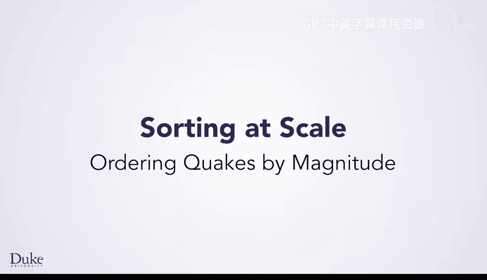

# Java编程和软件工程基础：2-5：按震级排序地震数据 📊



在本节课中，我们将学习如何对地震数据进行排序，以便更好地理解数据的含义，例如哪些地震震级高，哪些震级低，以及地震发生的位置。

## 概述

我们将通过一个简单的程序来演示如何排序地震数据。首先，我们会创建一个解析器来读取数据文件，并将数据填充到一个列表中。然后，使用Java内置的快速排序方法对列表进行排序，最后打印出排序后的结果。

## 初始排序尝试

首先，我们运行一个名为 `QuakeSorterDemo` 的简单程序。该程序创建了一个解析器，打开已保存的数据文件，读取数据并填充到地震条目列表中，接着调用 `Collections.sort` 方法进行排序，并打印条目。

```java
// 示例：初始排序代码结构
public class QuakeSorterDemo {
    public void testSort() {
        // 创建解析器，读取文件，填充列表
        // 调用 Collections.sort(list)
        // 打印排序后的列表
    }
}
```

运行程序后，我们得到了大量地震数据。然而，在浏览数据时，我们发现排序结果并不符合预期。例如，一个震级4.4的地震出现在震级5.3的地震之前。仔细观察后发现，数据实际上是按照**纬度**从低到高（即从南到北）排序的，而不是按照震级。

## 修改排序逻辑

上一节我们发现排序依据是纬度，但我们的目标是按震级排序。为了实现这一点，我们需要修改 `QuakeEntry` 类，因为被排序的对象需要实现 `Comparable` 接口。

### 分析现有代码

查看 `QuakeEntry` 类，可以看到它已经实现了 `Comparable` 接口。其 `compareTo` 方法当前是根据纬度和经度进行排序的。

```java
// 示例：原始的 compareTo 方法（按纬度/经度排序）
public int compareTo(QuakeEntry other) {
    // 比较纬度、经度的逻辑
    // 返回 -1, 0, 或 1
}
```

### 实现按震级排序

我们需要修改 `compareTo` 方法，使其根据震级进行比较。以下是修改步骤：

1.  注释掉原有的按纬度/经度排序的代码。
2.  编写新的逻辑：比较当前对象的震级（`this.getMagnitude()`）与另一个对象（`other.getMagnitude()`）的震级。
3.  根据 `Comparable` 接口的约定：
    *   如果当前震级更小，返回一个**负数**（例如 -1）。
    *   如果当前震级更大，返回一个**正数**（例如 1）。
    *   如果两者相等，返回 0。

以下是修改后的 `compareTo` 方法代码：

```java
public int compareTo(QuakeEntry other) {
    double myMag = this.getMagnitude();
    double otherMag = other.getMagnitude();

    if (myMag < otherMag) {
        return -1;
    } else if (myMag > otherMag) {
        return 1;
    } else {
        return 0;
    }
}
```

**注意**：在编写代码时，务必正确调用 `getMagnitude()` 方法（带括号），而不是直接写 `getMagnitude`。

## 测试与优化

编译并运行修改后的 `QuakeSorterDemo` 程序。现在，数据输出显示震级最小的地震（例如-0.0）在最前面，而震级最大的地震（例如7.0）在最后面。这表明我们的按震级排序功能已成功实现。

### 代码简化

实际上，对于 `double` 类型的比较，我们可以利用Java已有的方法进行简化，避免重复编写比较逻辑。我们可以使用 `Double.compare(double d1, double d2)` 方法，它会根据两个双精度数值的大小关系返回负数、0或正数。

因此，我们可以将 `compareTo` 方法简化为一行代码：

```java
public int compareTo(QuakeEntry other) {
    return Double.compare(this.getMagnitude(), other.getMagnitude());
}
```

这种方法更加简洁，并且利用了Java标准库中已经过充分测试的代码，是更好的编程实践。

## 总结

本节课中，我们一起学习了如何对地震数据按震级进行排序。我们首先发现了初始程序是按地理位置排序的，然后通过修改 `QuakeEntry` 类的 `compareTo` 方法，将其改为按震级排序。最后，我们还学习了如何利用 `Double.compare()` 方法来简化比较逻辑，使代码更简洁、更健壮。在后续课程中，我们将探索如何同时按多种方式对数据进行排序。