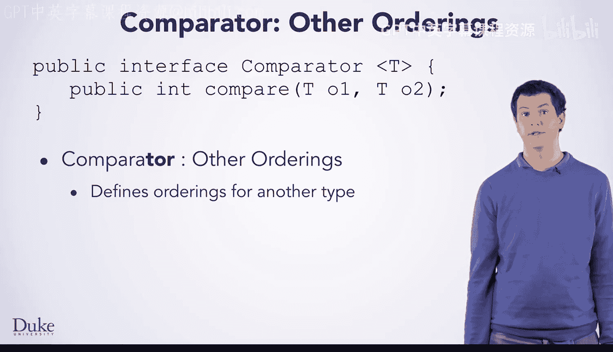
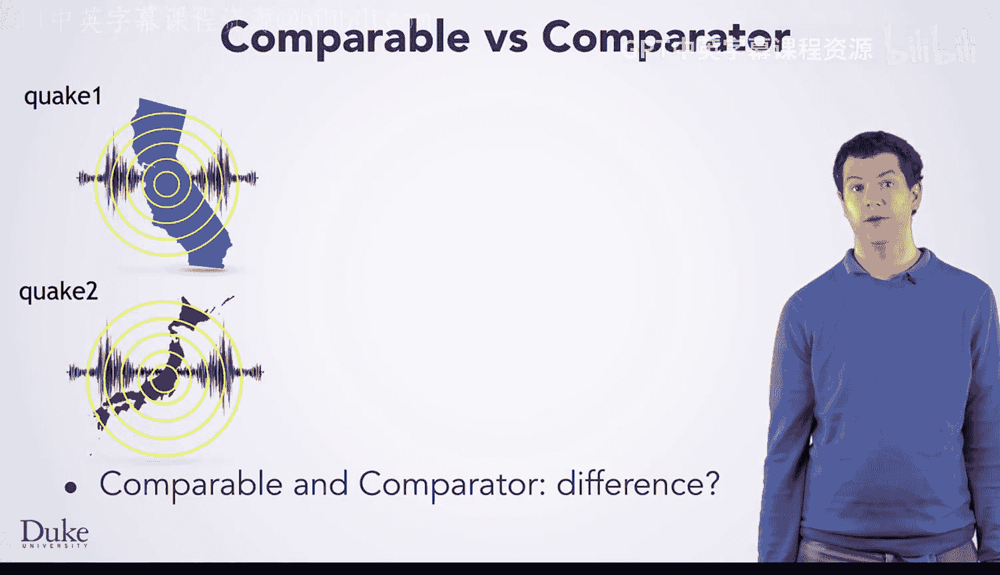
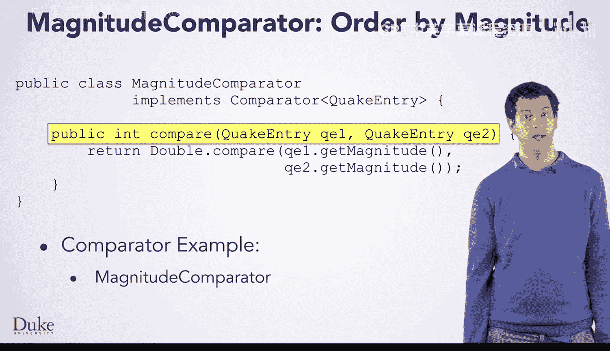
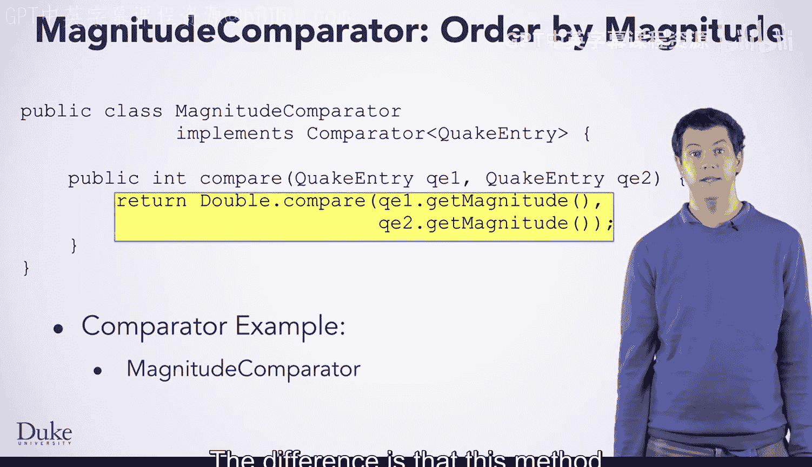
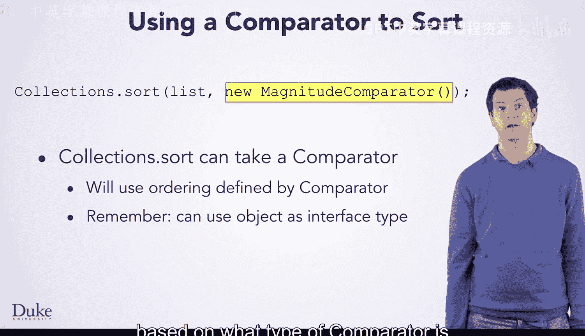

# Java编程和软件工程基础：2-5：Comparator接口


在本节课中，我们将要学习Java中的`Comparator`接口。我们将了解它与`Comparable`接口的区别，学习如何编写自己的比较器，以及如何使用它来对集合进行自定义排序。

---

## 概述

我们经常需要对对象列表进行排序。有时，一个对象可能有多种排序方式。例如，地震数据可以按震级、时间或距离排序。如果每次需要新的排序方式都去修改对象本身的`compareTo`方法，代码会变得混乱且难以维护。`Comparator`接口提供了一种解决方案，它允许我们定义独立于对象本身的外部排序规则。

上一节我们介绍了`Comparable`接口，它允许对象定义自己的“自然顺序”。本节中我们来看看`Comparator`接口，它如何提供更灵活的排序方式。

---

## Comparator 与 Comparable 的区别

在查看`Comparator`的例子之前，理解它与`Comparable`的区别很有帮助。它们看起来功能相似，但实现方式不同。

假设有两个地震对象：`quake1`和`quake2`。



*   **使用 Comparable**：当你调用 `quake1.compareTo(quake2)` 时，你是在要求`quake1`对象将自己与`quake2`进行比较。`compareTo`方法位于被比较的某个对象（这里是`quake1`）内部。该方法会从自身（`quake1`）和参数（`quake2`）中获取所需信息（例如震级）并进行比较。
*   **使用 Comparator**：现在，我们创建另一个专门用于比较的对象，例如`comparatorA`。当你调用 `comparatorA.compare(quake1, quake2)` 时，你是在要求这个`comparatorA`对象来比较这两个地震。`compare`方法的代码位于这个第三方对象内部，而不是被比较的任何一个对象中。`comparatorA`内部的代码会从两个地震对象中获取所需信息（例如位置），并根据它们到某个特定位置的距离进行比较。

`Comparator`的好处在于，你可以创建另一个不同的比较器，例如`comparatorB`，并要求它来比较地震。`comparatorB`可以是一个与`comparatorA`类型不同的类，其`compare`方法中的代码也不同。例如，它可以查看地震的日期，并根据发生时间的远近进行排序。

这就是我们解决“每个人都想用不同方式排序地震”问题的方法。每个人都可以创建一个实现`Comparator`接口的不同类并使用它。



---

## 如何编写一个 Comparator

那么，这样的类具体是什么样子呢？以下是一个按震级排序地震的`Comparator`示例。

请注意，这个类实现了`Comparator<QuakeEntry>`。这个类可以用来比较两个`QuakeEntry`对象。你可以看到接口所承诺的`compare`方法：正如接口所承诺的，它是`public`的并返回一个`int`。

由于这个类实现了`Comparator<QuakeEntry>`，接口保证了该方法的参数将是`QuakeEntry`类型。该方法的主体通过比较两个地震的震级来实现排序。

```java
public class MagnitudeComparator implements Comparator<QuakeEntry> {
    public int compare(QuakeEntry q1, QuakeEntry q2) {
        return Double.compare(q1.getMagnitude(), q2.getMagnitude());
    }
}
```

这段代码与我们之前修改的、按震级比较的`compareTo`方法非常相似。区别在于，这个`compare`方法从它的两个参数中获取震级，而`compareTo`方法是从它的一个参数以及它所在的对象自身中获取震级。

---

## 如何使用 Comparator 进行排序

现在你已经看到了如何编写一个`Comparator`，让我们来看看如何使用`Comparator`来对集合进行排序。

`Collections.sort`方法可以接受第二个参数，即一个`Comparator`。当你向`Collections.sort`传递这第二个参数时，它将使用该比较器来确定列表中对象的排序顺序。





```java
Collections.sort(quakeList, new MagnitudeComparator());
```

这里我们传入了一个新的`MagnitudeComparator`对象。请记住，当一个方法的参数类型是接口时，你可以传入任何实现了该接口的类的实例。在这里，`MagnitudeComparator`实现了`Comparator`，因此将其传入作为此参数是完全可以的。

正如你之前学到的，`Collections.sort`内部的代码会根据传入的`Comparator`类型，通过动态分派调用正确的`compare`方法。

---

## 总结



本节课中我们一起学习了`Comparator`接口。我们了解到，`Comparator`提供了一种定义对象外部排序规则的灵活方式，与定义对象自身自然排序的`Comparable`接口形成互补。通过创建实现`Comparator`接口的不同类，我们可以轻松地为同一类对象定义多种排序标准（如按震级、时间或距离），并通过将其传递给`Collections.sort`等方法来应用这些排序规则。这解决了因需求变化而频繁修改对象内部`compareTo`方法的问题，使代码更加模块化和可维护。