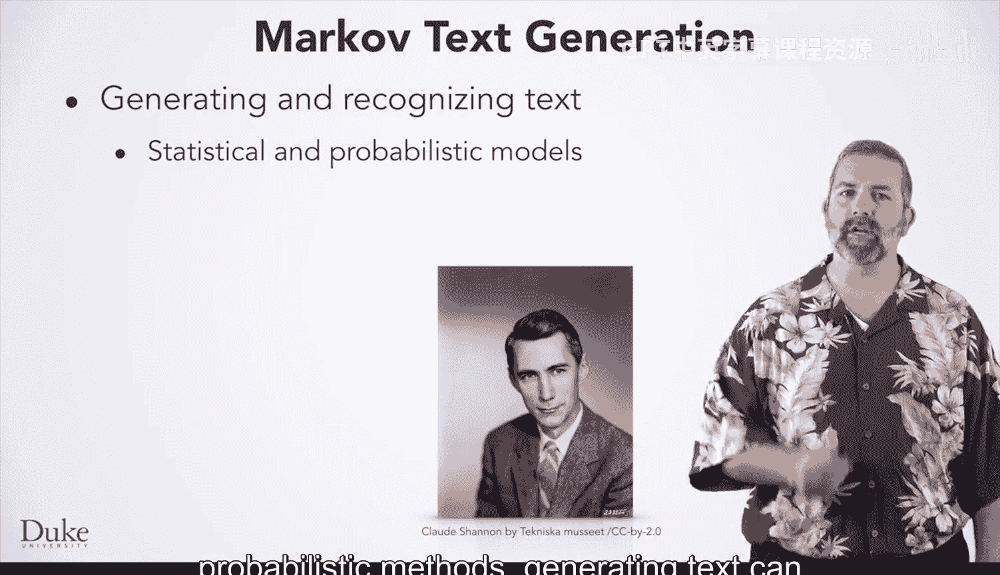
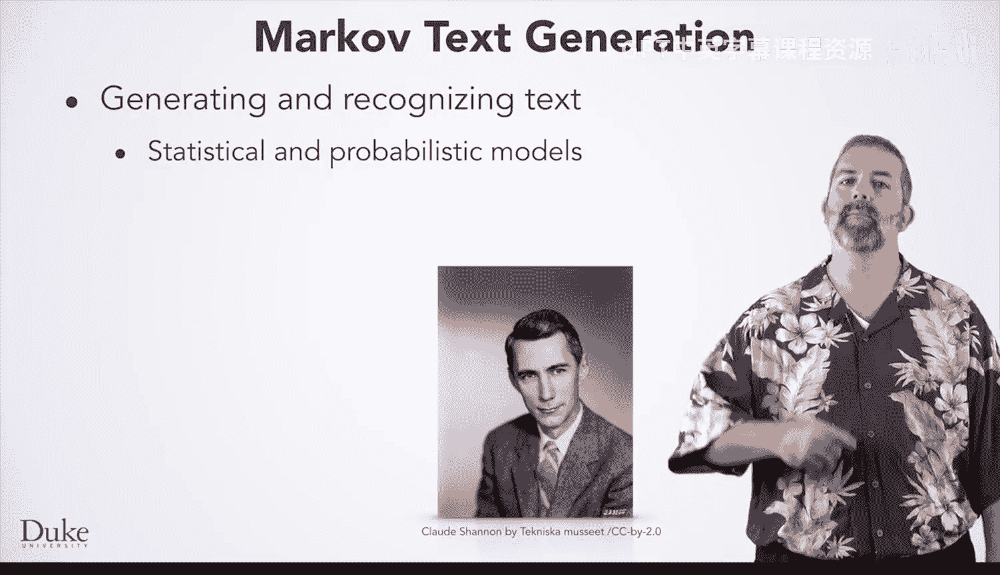
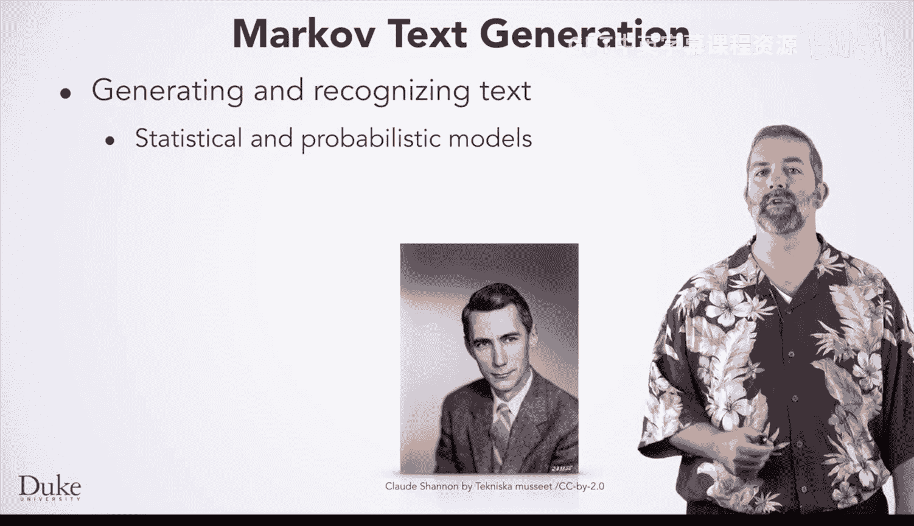
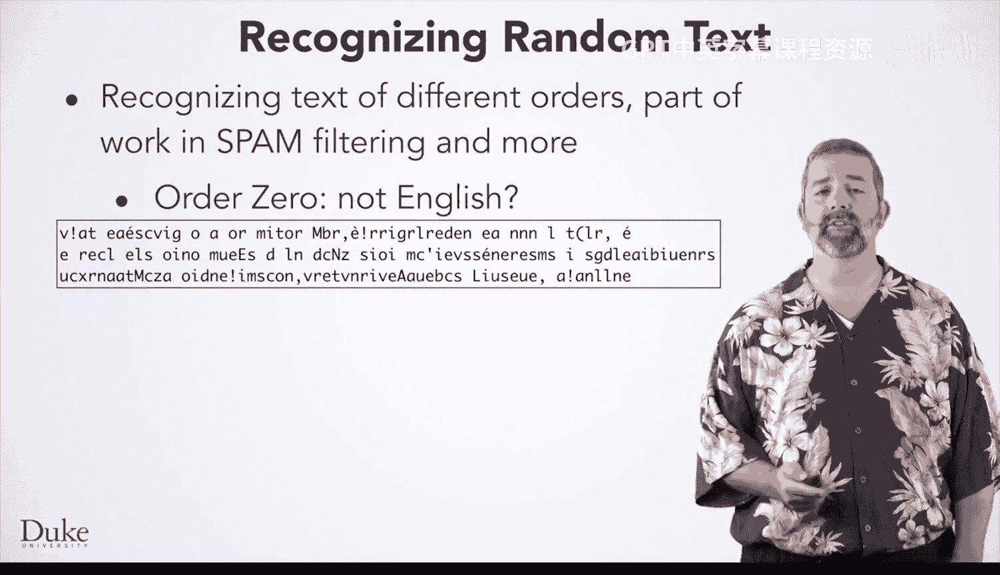

# Java编程和软件工程基础：2-5：马尔可夫文本生成介绍

在本节课中，我们将学习如何设计实用的Java程序，并在一个有趣且有用的程序背景下，锻炼软件设计和工程技能。

我们将开发和扩展一个使用马尔可夫文本生成技术的程序。该程序首先在训练文本上进行“学习”，然后根据学习到的数据生成随机文本。

虽然使用马尔可夫技术识别文本会涉及统计和概率方法，但生成文本的过程可以简单地实现，我们即将解释的设计方案就能做到。这些思想的清晰阐述，很大程度上归功于数学家兼计算机科学家克劳德·香农，他常被认为是信息论背后的主要思想家之一。

这将使您能够在一个具有实际应用价值的程序背景下，练习Java编程和设计概念。例如，谷歌的PageRank算法和许多人工智能机器学习算法，都依赖于我们将要探索的相同马尔可夫概念。

## 核心模型

我们将使用的模型非常简单。假设您或一只猴子在打字机或键盘上随机按键。会生成什么样的文本？那将是一堆乱码。

然而，如果这个键盘的按键是根据训练文本设计的呢？例如，如果训练文本是英文，那么键盘上“E”键的数量就会远多于“Z”键。这样生成的文本可能就不会那么随机了。

我们可以扩展这个模型：如果按下了“A”键，那么将使用一个新的键盘，这个键盘上“T”键比“B”键多，因为在训练文本中，以“AT”开头的单词远多于以“AB”开头的单词。第二个按键将基于训练文本中，在第一个字母为“A”的条件下，出现各个字母的概率。

我们还可以引入第三个键盘，它基于已按下的两个字母。例如，如果我们按下了“T”然后“H”，那么接下来按“E”的可能性就非常高，按“R”的可能性中等，而按“Z”的可能性则极低。

我们将在您即将学习的马尔可夫文本生成程序中使用这些思想。

## 程序输出示例

让我们看看您将开发的早期程序的输出示例。

**基于训练数据生成文本**

在本例中，训练数据是德国总理安格拉·默克尔于2015年10月7日在欧洲议会发表的一篇演讲。

*   **零阶文本** 仅基于原始文本中字符的分布生成。例如，文本中有很多“e”，因为这是一个非常常见的字符。空格字符也很常见，但生成的文本看起来并不像真实的文本。
*   **一阶文本** 使用一个字母来预测下一个字母。例如，字母“A”后面很可能跟着“N”，但“P”后面跟着“N”的可能性就较小。您看到的单词有时是可发音的，但它们并不是真正的单词，例如“pen”、“Wpplets”和“brunt”。
*   **二阶文本** 使用两个字符来预测第三个字符。这意味着“T H”后面很可能会出现“E”，出现“A”的可能性稍小，而出现“G”的可能性极低，因为序列“T H G”在文本中不常出现。您可以看到许多单词和类似单词的序列，例如“red”、“wordy”、“hand”和“muitions”。

虽然我们是在生成文本，但您或许也能通过生成的文本来识别其训练数据。这就是马尔可夫文本识别的工作原理。

例如，当前的垃圾邮件过滤算法通常依赖贝叶斯概率和马尔可夫过程，作为基于训练数据识别垃圾邮件的一部分。

以下是一个零阶文本示例。您能仅凭出现的字符就识别出它可能不是英文吗？某些字母上的重音符号暗示它可能是法文。

在一阶文本中（用一个字符预测下一个字符），文本看起来确实像是法文。

在二阶文本中（用两个字符预测第三个字符），文本看起来非常像法文。

在三阶文本中，您甚至可能认出法国国歌《马赛曲》。

在您编写的程序中，您将看到生成三阶乃至一般n阶文本是完全可以实现的。

## 本模块学习内容概述

以下是您将在本模块中学到的内容概览。

1.  **算法泛化**：您将学习如何泛化一个概念和算法，以使用马尔可夫过程生成随机文本。
2.  **代码实现**：您将看到零阶和一阶文本生成的代码，并将其泛化到任意n阶。
3.  **接口设计**：您将开发一个Java接口，以在代码中实际地捕捉不同的概念和抽象。
4.  **程序设计与测试**：这将帮助您设计和测试程序，这是积累程序员和软件工程师经验的重要部分。
5.  **效率提升**：您还将看到，接口允许您在不一次性改动太多内容的情况下提高程序效率，通过分离设计和实现来促进效率优化。
6.  **技能实践**：在开发这些程序的过程中，您将同时练习软件设计和工程技能。这将为您提供实用且可迁移到其他编程领域的经验。

## 总结

本节课中，我们一起学习了马尔可夫文本生成的基本概念。我们了解了如何通过分析训练文本中字符或字符序列的概率分布来生成新的、看似合理的文本。从简单的零阶模型（仅考虑字符频率）到更复杂的高阶模型（考虑字符上下文），我们看到了模型阶数如何影响生成文本的连贯性。此外，我们还预览了本模块将涵盖的核心内容：算法泛化、Java接口的设计与应用，以及通过此项目实践软件工程的重要技能，为后续的实际编程工作打下坚实基础。