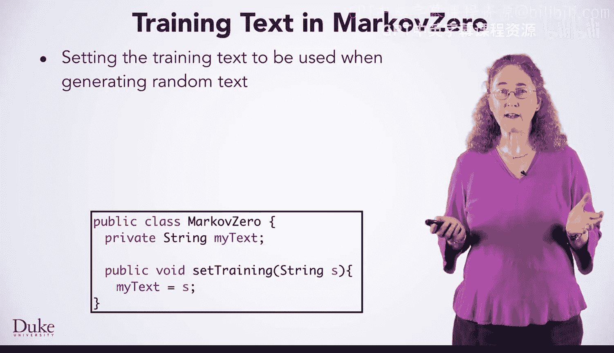

# 146：零阶与一阶马尔可夫模型


在本节课中，我们将学习如何创建一个使用零阶马尔可夫算法随机生成文本的类。我们还将描述，为了创建一阶或更高阶的马尔可夫类，你需要做出哪些修改。零阶模型编程起来很直接，并且将成为其他马尔可夫类的模型。

所有马尔可夫模型都将使用一个训练文本作为随机生成文本的基础。


## 理解零阶与一阶模型


上一节我们介绍了马尔可夫模型的基本概念，本节中我们来看看零阶和一阶模型的具体区别。

在零阶模型中，我们不使用任何字符来预测下一个字符。我们直接从整个训练文本中随机选择每一个字符。你可以在这里看到一个零阶模型生成的文本。单词通常很长，字母组合常常没有意义。例如，像“tima”或“Dmo”这样的词很难发音。

在一阶马尔可夫模型中，我们根据前一个字符来选择下一个字符。这使得字母组合比零阶模型更常见，正如你在这里看到的，像“best”这样的词被随机生成出来，并且单词更容易发音，即使它们可能是像“Stard”或“Anco”这样的词。

## 设计 MarkovZero 类

我们将快速概述开发 MarkovZero 类的过程，你将能够用它来随机生成文本。

我们首先考虑方法。有时这被称为类的行为。思考方法将有助于我们思考需要哪些状态或实例变量。

我们需要能够为 MarkovZero 类设置训练文本，并且需要能够随机生成文本。这是两个不同的方法。我们可以将它们合并为一个方法，但通常来说，让方法保持单一职责是一个好主意。在这种情况下，我们可能希望从同一个训练文本中生成多个随机文本。因此，将方法分开非常有意义。


### 设置训练文本

首先，我们来看看如何在 MarkovZero 中设置训练文本。

训练文本在生成随机文本时使用。正如我们之前提到的，我们可能希望从同一个训练文本中创建多个随机文本。这意味着我们需要将训练文本存储在一个实例变量中。


以下是设置训练文本的方法：

```java
public void setTraining(String text) {
    myText = text;
}
```



实例变量在调用 `setTraining` 方法时被赋值，然后在生成随机文本时被访问。


### 生成随机文本

我们将设计和实现的另一个方法是随机生成文本。

`getRandomText` 方法将从训练文本中随机选择一个字符。我们将使用 `java.util.Random` 类中的 `nextInt` 方法来创建一个随机索引。然后，我们将使用这个索引从训练文本中访问一个随机字符。

我们将创建一个 `StringBuilder` 对象来存储随机文本，因为向 `StringBuilder` 添加或连接字符串是高效的。我们将字符追加到 `StringBuilder` 对象，并在完成后使用 `toString` 方法返回一个字符串。


以下是生成随机文本的方法：

```java
public String getRandomText(int numChars) {
    if (myText == null) {
        return "";
    }
    StringBuilder sb = new StringBuilder();
    for (int k = 0; k < numChars; k++) {
        int index = myRandom.nextInt(myText.length());
        sb.append(myText.charAt(index));
    }
    return sb.toString();
}
```

### 构造函数与其他方法

MarkovZero 类还需要一个构造函数，可能还有其他方法。

构造函数通常用于初始化字段或实例变量。在 MarkovZero 类中，我们有一个实例字段，用于存储来自 `java.util` 包的 Random 对象。我们在构造函数中创建一个新的 Random 对象。

为了帮助调试，生成可重现的随机数序列通常很有用。我们可以通过设置随机数生成器的种子来实现这一点，就像我们在这里创建新的 Random 对象时所做的那样。这在你调试马尔可夫类时可能会有所帮助。

还有一个实例字段 `myText`，它没有在构造函数中初始化，而是由我们之前讨论过的 `setTrainingText` 方法进行初始化。

## 向 MarkovOne 模型过渡

以上背景知识足以编写和测试 MarkovZero 类，但我们也会为 MarkovOne 提供一些指导。

我们有一个名为 `MarkovRunner` 的测试程序来测试 MarkovZero 类。用户选择一个文件作为训练文本。`MarkovRunner` 中的代码将每个换行符替换为空格。这保留了可能由空格分隔的单词，但不将换行符视为特殊字符。`MarkovRunner` 类从同一个训练文本中创建多个随机文本的示例。

当你开发和使用 MarkovOne 时，什么会改变？你将使用相同的方法名和相同的状态。通过使用相同的方法名，`MarkovRunner` 测试类也可以用来测试 MarkovOne 以及 MarkovZero。你需要更改 `getRandomText` 方法，因为在一阶马尔可夫文本生成中，使用一个字符来预测下一个字符。

我们将快速概述 MarkovOne 中的概念，你将在后续课程中看到更多算法开发的细节。

### 一阶模型的核心概念

在一阶马尔可夫模型中，使用一个字符来随机预测下一个字符。在这个图表中，我们看到字母 A 在字母 T 之后出现的概率是 12%，但字母 Y 出现的概率是 7%。这意味着如果我们生成了一个 T，那么我们接下来选择 E 的可能性比选择 R 大。根据图表中显示的概率，选择这两者的可能性都比选择 A 大。


训练数据用于创建这些概率。但我们实际上并不创建概率表，虽然这是可能的，但与你将使用的方法相比，这更困难且不必要。

你将编写代码来遍历训练文本中的每一个 T。每次找到一个 T 时，下一个字符会被添加到一个列表中，该列表代表了跟在 T 后面的字符。例如，在训练文本的前七个 T 之后，我们可能会找到字母 A, E, A, R, A, E, 和 Y。从这个列表中选择将与使用概率相同，因为列表中 E 的数量会比 Y 多。

我们将使用我们的七步流程来开发这个算法。

## 总结

本节课中我们一起学习了如何实现零阶马尔可夫模型来随机生成文本。我们了解了零阶与一阶模型在预测逻辑上的根本区别：零阶完全随机，而一阶则基于前一个字符进行预测。我们设计了 MarkovZero 类，包括设置训练文本和生成随机文本的方法，并讨论了构造函数和实例变量的作用。最后，我们预览了如何将零阶模型扩展为一阶模型，其核心在于根据前驱字符动态构建后续字符的列表，并从中进行随机选择，这为后续的算法实现奠定了基础。